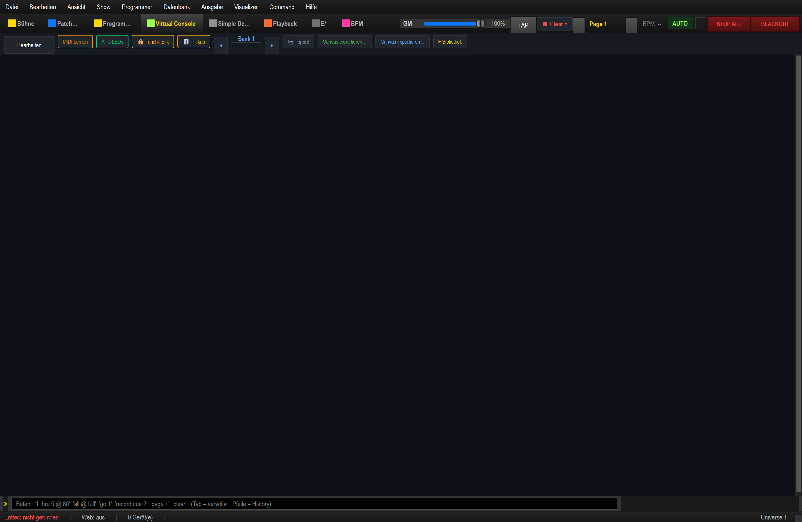

# LightOS

**Lichtsteuerungs-Software fuer Windows x64 und ARM64.**

Vollstaendige DMX-Steuerung mit 3D-Visualizer, Audio-reaktivem Beat-Detect,
Multi-Page-Playback, modularem Effect-System, Virtual Console, Command-Line
und Web-Remote.



> **Neu hier?** Bebilderte Schritt-für-Schritt-Anleitungen mit Screenshots:
> **[docs/ANLEITUNGEN.md](docs/ANLEITUNGEN.md)**
>
> **3D-Modelle:** Alle Fixture-3D-Modelle des Visualizers auf einen Blick:
> **[docs/FIXTURE_3D_GALLERY.md](docs/FIXTURE_3D_GALLERY.md)**

---

## Plattform

| | x64 (AMD64) | ARM64 (Snapdragon) |
|---|---|---|
| Windows 10/11 | OK | OK (Win 11) |
| Python | 3.11+ | 3.11+ |

Hinweis fuer Snapdragon: `install.py` erkennt, wenn ein emuliertes x64-Python
auf ARM64 laeuft, und warnt dann mit konkreter Umstiegs-Empfehlung auf ARM64-Python.

---

## Feature-Ueberblick

### Output
- Enttec DMX USB Pro
- Art-Net 4 (Output + Input mit HTP/LTP/REPLACE-Merge)
- sACN / E1.31 (Output + Input)
- Bis zu 32 Universen

### Engine
- **11 Function-Typen**: Scene, Chaser, Collection, Show (Timeline), EFX,
  RGB-Matrix, Sequence, Audio, Script, LayeredEffect, Carousel
- **Multi-Page-Playback**: 10 Pages x 20 Executors = 200 Slots
- **Grand Master Fader** + Blackout
- **Channel-Modifier** mit Curves (Linear / Inverse / S-Curve / Gamma 2.2 / Custom LUT)
- **Undo/Redo** (Ctrl+Z / Ctrl+Y)
- **State-Sync** + Auto-Validate beim Show-Load

### Programmierung
- **Programmer** mit Attribut-Tabs (Intensity / Color / Position / Gobo / Weitere /
  Helper / EFX / Matrix / Paletten) — EFX, RGB-Matrix und Funktionen sind in den Programmer integriert
- **Moving-Head-Schnellwahl**: Strobe (Status + Speed) im Intensity-Tab,
  Farbrad-Kacheln inkl. Split-Farben + Auto-Farbwechsel (Hardware/Software),
  Gobo-Tab mit grafischer Gobo-Vorschau, Shake-Speed und sicherem Reset-Button
  — generisch aus den Fixture-Wertebereichen ([docs/MOVING_HEADS.md](docs/MOVING_HEADS.md))
- **Color Picker** (RGB / HSB / CMY / 27 Lee-Rosco Filter)
- **Position Tool** (2D-Pad, Pan/Tilt-Fine, 13 Presets)
- **Fan Tool** (Symmetric / Asymmetric / Start / End, 5 Kurven)
- **Snapshots** (12x4 Quick-Recall)
- **Paletten** (Color / Position / Beam)
- **Highlight / Lowlight / Clear** Hotkeys

### Audio / BPM
- WASAPI Loopback Audio-Capture (PC-Audio mitschneiden)
- Beat-Detection (Bass-Energy adaptive Threshold)
- Tap-Tempo BPM-Manager
- OS2L Server (VirtualDJ Integration)
- MIDI Time Code Reader

### Virtual Console
- Button, Slider, XY-Pad, Cue-List, Speed-Dial, Frame (Multi-Page),
  Label, Solo-Frame
- Save/Load Layouts pro Show
- Properties-Dialog pro Widget

### 3D Visualizer
- Three.js basiert (in QtWebEngine)
- 2D Top-Down + 3D Perspektive
- 4 Buehnen-Presets + Custom Stage Builder
- Echte 3D-Modelle für jede Geräteklasse — **[Modell-Galerie ansehen](docs/FIXTURE_3D_GALLERY.md)** (Moving Head, PAR, Spider, Laser, Bars, Strobe, Nebel, ...)
- Volumetrische Beam-Cones
- Helligkeits-Slider mit Auto-Mode

### Eingaben
- MIDI Input mit Profil-Editor (Akai APC mini Default vorhanden)
- OSC Server (Port 7770)
- Keyboard-Hotkeys (Page-Wechsel, Highlight, Command-Line, ...)
- Web-Remote (Browser auf Tablet / Phone)

### Command-Line
MA-/Avolites-Style Syntax:
```
1 thru 5 @ 80      # Fixtures 1-5 auf 80%
all @ full         # alle Lampen voll
go 1               # Executor 1 GO
record cue 2.5     # Programmer als Cue 2.5 aufnehmen
page 3             # Wechsel zu Page 3
blackout           # Blackout toggle
```

---

## Quick Start

Fuer neue Nutzer — von null zum ersten Lichteffekt in 5 Minuten.

### 1. Voraussetzungen
- Windows 10/11 (x64 oder ARM64)
- Python 3.11+ — Download: https://www.python.org/downloads/windows/
  (ARM64-Geraete: "ARM64"-Installer auswaehlen)

### 2. Installieren
```cmd
git clone https://github.com/ixamgames-droid/lightos.git
cd lightos
python install.py
```
Das Script erstellt ein `venv/`, installiert alle Abhaengigkeiten und legt eine Desktop-Verknuepfung an.

Detaillierte Optionen und Troubleshooting: **[INSTALL.md](INSTALL.md)**

### 3. Starten
```cmd
venv\Scripts\python main.py
```
Oder die Desktop-Verknuepfung doppelklicken (nach `install.py`).

**PowerShell / start.ps1:**
```powershell
.\start.ps1
```

### 4. Erstes Fixture patchen
1. Sektion **Patchen** → Tab **Patch** oeffnen
2. **"+ Fixture"** klicken → Hersteller/Modell suchen (z.B. "Generic RGB")
3. Universe `1`, Adresse `1`, Anzahl `1` → **Patchen**
4. Fixture taucht in der Liste auf (FID 1)

### 5. Wert setzen (Programmer)
- **Programmer**-Tab oeffnen → FID 1 anklicken
- Dimmer-Slider auf 100 % ziehen
- Oder Command-Line (`>`) eingeben: `1 @ full`

### 6. Cue aufnehmen
```
record cue 1
```
in der Command-Line — der aktuelle Programmer-Zustand wird als Cue 1 gespeichert.

### 7. Cue abspielen
```
go 1
```
Startet den ersten Executor. Mehr Playback-Optionen im **Playback**-Tab.

---

## Tests ausfuehren

```cmd
venv\Scripts\python -m pytest tests/ -v
```

Alle Tests laufen ohne Hardware oder GUI (offscreen).

---

## Installation

Siehe **[INSTALL.md](INSTALL.md)** fuer Schritt-fuer-Schritt-Anleitung.

Kurzfassung:
```cmd
python install.py
```

---

## Starten

```cmd
venv\Scripts\python main.py
```

Oder Desktop-Verknuepfung (vom Installer erstellt).

Vorkonfigurierte Beispiel-Setups in `examples/`.

---

## Projektstruktur

```
LightOS/
├── main.py                 Entry-Point
├── install.py              Installer
├── uninstall.py            Uninstaller
├── requirements.txt
├── src/
│   ├── core/               Engine, Datenmodell, Sync, Undo
│   │   ├── dmx/            DMX-IO (Enttec, Art-Net, sACN)
│   │   ├── engine/         Functions, Cues, Palettes, BPM, Curves
│   │   ├── audio/          WASAPI-Capture, Beat-Detect, OS2L
│   │   ├── timecode/       MTC Reader
│   │   ├── midi/           MIDI-Manager + Mapper
│   │   ├── osc/            OSC-Server
│   │   ├── stage/          Buehnen-Definition
│   │   ├── show/           Show-File I/O
│   │   ├── cmdline/        Command-Line Parser
│   │   ├── database/       Fixture-DB (SQLAlchemy)
│   │   └── input/          Input-Profile
│   ├── ui/
│   │   ├── main_window.py
│   │   ├── views/          20+ Views (Patch, Programmer, Playback, ...)
│   │   ├── widgets/        Tools (Color, Position, Fan, ...)
│   │   ├── virtualconsole/ VC-Widgets
│   │   └── visualizer/     3D-Visualizer (Three.js)
│   └── web/                Flask Remote-UI
├── assets/
│   ├── themes/             dark.qss
│   └── icons/
├── docs/                   Protokoll-Doku
├── examples/               Beispiel-Setup-Skripte
├── tests/
├── data/                   Show-DB, Mappings (in .gitignore)
├── shows/                  Show-Dateien (in .gitignore)
└── fixtures/               Custom Fixture-Profile (in .gitignore)
```

---

## Dokumentation

### Bebilderte Anleitungen (Schritt für Schritt, mit Screenshots/GIFs)

Übersicht: **[docs/ANLEITUNGEN.md](docs/ANLEITUNGEN.md)**

- [Patchen & Gruppen](docs/anleitung_patch_gruppen/ANLEITUNG_PATCH_GRUPPEN.md)
- [Virtuelle Konsole (VC) bauen & designen](docs/anleitung_vc/ANLEITUNG_VC.md)
- [APC mini auf die VC mappen](docs/anleitung_apc_mapping/ANLEITUNG_APC.md)
- [EFX — Moving-Head-Bewegung (Kreise/Achten)](docs/anleitung_efx/ANLEITUNG_EFX.md)
- [Farb-Matrix (RGB/RGBW)](docs/anleitung_farbmatrix/ANLEITUNG_FARBMATRIX.md)
- [Farbchase frei zusammenstellen (z. B. Blau-Weiß)](docs/anleitung_farbchase/ANLEITUNG_FARBCHASE.md)
- [Dimmer-Matrix & relative Geschwindigkeit](docs/anleitung_dimmermatrix/ANLEITUNG_DIMMERMATRIX.md)
- [Musik-Sync & automatische Live-Show](docs/anleitung_musik_sync/ANLEITUNG_MUSIK_SYNC.md)
- [Komplettes Lichtshow-Tutorial (Matrix · Chase · MH-EFX · VC)](docs/tutorial_matrix/TUTORIAL_LICHTSHOW.md)

### Referenz & Hintergrund

| Thema | Datei |
|---|---|
| **Bebilderte Anleitungen (Übersicht)** | **[docs/ANLEITUNGEN.md](docs/ANLEITUNGEN.md)** |
| **Schritt‑für‑Schritt (APC mini + 4 RGBW‑PAR)** | **[docs/APC_SCHRITT_FUER_SCHRITT.md](docs/APC_SCHRITT_FUER_SCHRITT.md)** |
| **Seiten‑Übersicht mit Bildern (welche Taste tut was)** | **[docs/APC_SEITEN_UEBERSICHT.md](docs/APC_SEITEN_UEBERSICHT.md)** |
| Test‑Show‑Referenz / Hintergrund | [docs/APC_TEST_SHOW.md](docs/APC_TEST_SHOW.md) |
| **Feature‑Showcase (alle Features, selbst‑verifizierend)** | **[docs/FEATURE_SHOWCASE.md](docs/FEATURE_SHOWCASE.md)** |
| Komplette Oberflächen‑Anleitung | [docs/ANLEITUNG.md](docs/ANLEITUNG.md) |
| Praxis‑Workflows (Schritt für Schritt) | [docs/WORKFLOWS.md](docs/WORKFLOWS.md) |
| Effekte & Geschwindigkeit | [docs/EFFEKTE.md](docs/EFFEKTE.md) |
| **Moving Heads (ZQ02001, Gobo/Farbrad/Strobe/Reset)** | **[docs/MOVING_HEADS.md](docs/MOVING_HEADS.md)** |
| Fixture Library (Profile, Modi, Wertebereiche) | [docs/FIXTURE_LIBRARY.md](docs/FIXTURE_LIBRARY.md) |
| Offene Punkte / Backlog (repo-weit) | [docs/OPEN_POINTS_OVERVIEW.md](docs/OPEN_POINTS_OVERVIEW.md) |
| Zukunftsidee Fixture Generator | [docs/FUTURE_FIXTURE_GENERATOR.md](docs/FUTURE_FIXTURE_GENERATOR.md) |
| RGB‑Matrix live programmieren | [docs/MATRIX_LIVE.md](docs/MATRIX_LIVE.md) |
| Show‑Dateiformat | [docs/SHOW_FILE_FORMAT.md](docs/SHOW_FILE_FORMAT.md) |
| Art‑Net / DMX‑Protokoll | [docs/ARTNET.md](docs/ARTNET.md) · [docs/DMX_PROTOCOL.md](docs/DMX_PROTOCOL.md) |

Schneller Einstieg in die mitgelieferte Demo für die echte Hardware:
```cmd
venv\Scripts\python tools\build_apc_test_show.py       :: shows\APC_Test_Komplett.lshow neu bauen
venv\Scripts\python tools\build_feature_showcase.py    :: shows\Feature_Showcase.lshow (alle Features)
```

---

## Status

Diese Software ist in aktiver Entwicklung und wird kontinuierlich erweitert.
Privates Projekt - keine Garantie, keine Lizenz, kein Support.

Stand: 2026
