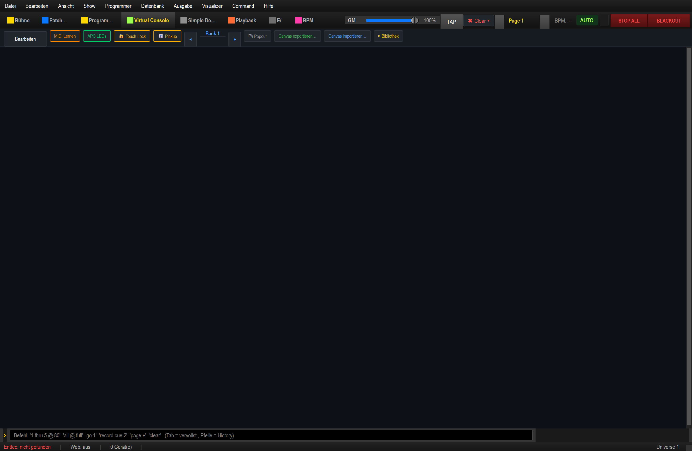

# LightOS

**Lichtsteuerungs-Software fuer Linux und Windows (x64 und ARM64).**

Vollstaendige DMX-Steuerung mit 3D-Visualizer, Audio-reaktivem Beat-Detect,
Multi-Page-Playback, modularem Effect-System, Virtual Console, Laser-Steuerung,
Command-Line und Web-Remote.



| | |
|---|---|
| Fixture-Bibliothek | **1.786 Geraete** in **5.116 Modi** von **162 Herstellern** (QLC+-Import + eigene Profile) |
| Ausgabe | ENTTEC DMX USB Pro · Art-Net 4 · sACN/E1.31 · bis zu **32 Universen** |
| Funktionstypen | **11** (Scene, Chaser, Collection, Show/Timeline, EFX, RGB-Matrix, Sequence, Audio, Script, LayeredEffect, Carousel) |
| Anleitungen | **36 bebilderte Schritt-fuer-Schritt-Anleitungen** mit Screenshots und GIFs |
| Umfang | ~102.000 Zeilen Python · **4.430 Testfunktionen** in 501 Dateien, komplett headless lauffaehig |

> **Neu hier?** Bebilderte Schritt-für-Schritt-Anleitungen mit Screenshots:
> **[docs/ANLEITUNGEN.md](docs/ANLEITUNGEN.md)**
>
> **3D-Modelle:** Alle Fixture-3D-Modelle des Visualizers auf einen Blick:
> **[docs/FIXTURE_3D_GALLERY.md](docs/FIXTURE_3D_GALLERY.md)**

---

## Plattform

**Linux und Windows sind beide unterstuetzt** — derselbe Quellcode, keine
Plattform-Verzweigung im Kern. Plattform-Spezifisches liegt hinter
`sys.platform` mit Fallback.

| | x64 (AMD64) | ARM64 (Snapdragon) |
|---|---|---|
| **Linux** (X11, getestet auf Mint 22.3) | OK | nicht getestet |
| **Windows 10/11** | OK | OK (Win 11) |
| Python | 3.11+ | 3.11+ |

Wie belastbar ist das? Ehrlich aufgeschluesselt, damit die Tabelle nicht mehr
verspricht als geprueft ist — die CI-Zeile ist bewusst genau: der Windows-Job ist
ein **Smoke aus fuenf Dateien**, der Linux-Job faehrt die **komplette** Suite
(segmentiert, ein Prozess je Testdatei — das geht nur dort).

| | Linux | Windows |
|---|---|---|
| Volle Testsuite (501 Dateien) | laeuft taeglich, gruen | laeuft, gruen |
| GitHub-CI | **volle Suite**, segmentiert (`ubuntu-latest`, Py 3.12) | Smoke aus 5 Dateien (`windows-latest`, Py 3.11 + 3.12) |
| Entwicklungs-/Alltagsrechner | ja | ja (ARM64) |
| DMX-Ausgang am echten Rig | ENTTEC ueber `/dev/ttyUSB*` | ENTTEC ueber COM-Port |
| MIDI-Backend | `python-rtmidi` / ALSA | WinMM (ctypes) |

**Linux-Besonderheiten in Kurzform** (Details und Systempakete:
[INSTALL.md](INSTALL.md#linux-x86_64)):

- **MIDI braucht `python-rtmidi`** (C-Extension) — dafuer `build-essential` und
  `libasound2-dev` installieren. Der WinMM-Fallback existiert nur auf Windows,
  ohne rtmidi gibt es auf Linux **gar kein** MIDI.
- **3D-Visualizer**: LightOS haengt auf Linux automatisch `--no-sandbox` an, weil
  der Chromium-Renderprozess aus einem pip-PySide6 sonst nicht startet. Sauber
  aufgesetzte Distros koennen die Sandbox behalten (`LIGHTOS_WEBENGINE_NO_SANDBOX=0`).
- **Loopback-BPM** braucht eine PulseAudio/PipeWire-**Monitor-Quelle**; fehlt sie,
  bleibt nur die BPM aus Audio stumm (kein Absturz). Mikrofon-/Line-In-Beat
  funktioniert unabhaengig davon.
- **Datenordner** ist XDG-konform: `~/.local/share/LightOS`.

Hinweis fuer Snapdragon: `install.py` erkennt, wenn ein emuliertes x64-Python
auf ARM64 laeuft, und warnt dann mit konkreter Umstiegs-Empfehlung auf ARM64-Python.
Unter Linux ist der manuelle venv-Weg aus INSTALL.md der verlaessliche —
`install.py` legt Windows-spezifische Verknuepfungen an.

---

## Feature-Ueberblick

### Output
- Enttec DMX USB Pro (mit Fehler-Watchdog und automatischem Reconnect nach Replug)
- Art-Net 4 (Output + Input mit HTP/LTP/REPLACE-Merge)
- sACN / E1.31 (Output + Input)
- Bis zu 32 Universen, mehrere Adapter gleichzeitig

### Fixtures
- **1.786 Geraete in 5.116 Modi von 162 Herstellern** — QLC+-Definitionen
  importiert, dazu handgepflegte Profile fuer das eigene Rig
- Eigene Profile im Editor anlegen, QLC+-`.qxf` importieren
- Mehrkopf-Geraete (Moving-Bars, Spider, Hydrabeam) als **echte Kopf-Ziele**,
  nicht nur als Kanalblock
- Dual-Tilt-Spider, Pan/Tilt-Invert und -Swap, Dimmer-Kurven pro Geraet

### Engine
- **11 Function-Typen**: Scene, Chaser, Collection, Show (Timeline), EFX,
  RGB-Matrix, Sequence, Audio, Script, LayeredEffect, Carousel
- **Multi-Page-Playback**: 10 Pages x 20 Executors = 200 Slots
- **Grand Master Fader** + Blackout
- **Channel-Modifier** mit Curves (Linear / Inverse / S-Curve / Gamma 2.2 / Custom LUT)
- **Undo/Redo** (Ctrl+Z / Ctrl+Y)
- **State-Sync** + Auto-Validate beim Show-Load

### Programmierung
- **Programmer** mit Attribut-Tabs (Intensity / Color / Position / Gobo / Weitere /
  Helper / EFX / Matrix / Paletten) — EFX, RGB-Matrix und Funktionen sind in den Programmer integriert
- **Jeder Kopf ein eigenes Ziel**: bei Mehrkopf-Geraeten (Moving-Bars, Spider,
  Hydrabeam) laesst sich ein einzelner Kopf waehlen — Regler, Faecher, Snap-Aufnahme,
  EFX, Submaster und XY-Pad wirken dann nur auf ihn
- **Moving-Head-Schnellwahl**: Strobe (Status + Speed) im Intensity-Tab,
  Farbrad-Kacheln inkl. Split-Farben + Auto-Farbwechsel (Hardware/Software),
  Gobo-Tab mit grafischer Gobo-Vorschau, Shake-Speed und sicherem Reset-Button
  — generisch aus den Fixture-Wertebereichen ([docs/MOVING_HEADS.md](docs/MOVING_HEADS.md))
- **Color Picker** (RGB / HSB / CMY / 27 Lee-Rosco Filter)
- **Position Tool** (2D-Pad, Pan/Tilt-Fine, 13 Presets)
- **Fan Tool** (Symmetric / Asymmetric / Start / End, 5 Kurven)
- **Snapshots** (12x4 Quick-Recall)
- **Paletten** (Color / Position / Beam)
- **Highlight / Lowlight / Clear** Hotkeys

### Audio / BPM
- Loopback Audio-Capture (PC-Audio mitschneiden) — WASAPI auf Windows,
  PulseAudio/PipeWire-Monitor-Quelle auf Linux
- Beat-Detection (Bass-Energy adaptive Threshold)
- Tap-Tempo BPM-Manager
- OS2L Server (VirtualDJ Integration)
- MIDI Time Code Reader

### Virtual Console
- **19 Widget-Typen**: Button, Slider, Encoder, Stepper, XY-Pad, Color-Picker,
  Cue-List, Speed-Dial, Tempo-Bus-Selector, BPM-Display, Song-Info,
  Effekt-Display, Effekt-Editor (Box), Effekt-Farben, Live-Editor, Label,
  Frame (Multi-Page), Solo-Frame, Widget-Galerie
- Drag & Drop von Effekten auf Widgets, mit gruen/rot-Vorschau ob es passt
- Button-Hintergrund aus Bild **oder GIF**, plastische 3D-Optik
- Submaster pro Geraet **oder pro Kopf**, Banks, MIDI-Learn je Widget
- Save/Load Layouts pro Show, Properties-Dialog pro Widget

### Laser
- DMX-Laser als vollwertige Geraeteklasse (Muster, Gruppen A/B als Mehrkopf,
  13 `laser_*`-Attribute, Shutter-Safety-Default)
- Eigener Laser-Tab mit **Not-Aus**
- Figuren zeichnen, Bild-Trace, Muster-Slots
- Punkt-Streaming ueber **Ether Dream** und **IDN** (gegen Fakes getestet —
  echte Hardware-Abnahme steht noch aus)

### 3D Visualizer
- Three.js basiert (in QtWebEngine)
- 2D Top-Down + 3D Perspektive, zwei Modi (Ansehen / Bauen) mit Viewport-Rahmen
- Auswahl haengt beidseitig am Programmer, Identify-Blitz, Geraete-Labels
- 4 Buehnen-Presets + Custom Stage Builder (Truss, Podeste, Moebel)
- Echte 3D-Modelle für jede Geräteklasse — **[Modell-Galerie ansehen](docs/FIXTURE_3D_GALLERY.md)** (Moving Head, PAR, Spider, Laser, Bars, Strobe, Nebel, ...)
- Volumetrische Beam-Cones, Gobo-Projektion, Schatten mit Budget
- Helligkeits-Slider mit Auto-Mode

### Eingaben
- MIDI Input mit Profil-Editor (Akai APC mini + APC mini mk2 Default vorhanden),
  MIDI-Feedback auf die Pad-LEDs
- OSC Server (Port 7770)
- Keyboard-Hotkeys (Page-Wechsel, Highlight, Command-Line, ...)
- **Web-Remote** (Browser auf Tablet / Phone) — standardmaessig nur auf
  `127.0.0.1`, LAN ist ein sichtbares Opt-in mit **Token-Gate** und
  Origin-Allowlist

### Command-Line
MA-/Avolites-Style Syntax:
```
1 thru 5 @ 80      # Fixtures 1-5 auf 80%
all @ full         # alle Lampen voll
go 1               # Executor 1 GO
record cue 2.5     # Programmer als Cue 2.5 aufnehmen
page 3             # Wechsel zu Page 3
blackout           # Blackout toggle
```

---

## Quick Start

Fuer neue Nutzer — von null zum ersten Lichteffekt in 5 Minuten.

### 1. Voraussetzungen
- **Windows** 10/11 (x64 oder ARM64) **oder Linux** (X11; getestet auf Mint 22.3)
- Python 3.11+
  - Windows: https://www.python.org/downloads/windows/ (ARM64-Geraete: "ARM64"-Installer)
  - Linux: aus der Distribution, plus die Systempakete unten

### 2. Installieren

**Windows:**
```cmd
git clone https://github.com/ixamgames-droid/lightos.git
cd lightos
python install.py
```
Das Script erstellt ein `venv/`, installiert alle Abhaengigkeiten und legt eine Desktop-Verknuepfung an.

**Linux** (Debian/Ubuntu/Mint — `install.py` legt Windows-Verknuepfungen an, darum hier
der manuelle venv-Weg):
```bash
sudo apt-get install -y python3 python3-venv python3-pip \
    build-essential libasound2-dev libpulse0 fonts-noto fonts-dejavu

git clone https://github.com/ixamgames-droid/lightos.git
cd lightos
python3 -m venv venv
venv/bin/python -m pip install --upgrade pip
venv/bin/python -m pip install -r requirements.txt
```
`build-essential` + `libasound2-dev` sind fuer MIDI **Pflicht** (`python-rtmidi` ist eine
C-Extension); `libpulse0` fuer die BPM aus dem Loopback-Audio.

Detaillierte Optionen und Troubleshooting: **[INSTALL.md](INSTALL.md)**

### 3. Starten

**Windows:**
```cmd
venv\Scripts\python main.py
```
Oder die Desktop-Verknuepfung doppelklicken (nach `install.py`), oder PowerShell:
```powershell
.\start.ps1
```

**Linux:**
```bash
venv/bin/python main.py
```

### 4. Erstes Fixture patchen
1. Sektion **Patchen** → Tab **Patch** oeffnen
2. **"+ Fixture"** klicken → Hersteller/Modell suchen (z.B. "Generic RGB")
3. Universe `1`, Adresse `1`, Anzahl `1` → **Patchen**
4. Fixture taucht in der Liste auf (FID 1)

### 5. Wert setzen (Programmer)
- **Programmer**-Tab oeffnen → FID 1 anklicken
- Dimmer-Slider auf 100 % ziehen
- Oder Command-Line (`>`) eingeben: `1 @ full`

### 6. Cue aufnehmen
```
record cue 1
```
in der Command-Line — der aktuelle Programmer-Zustand wird als Cue 1 gespeichert.

### 7. Cue abspielen
```
go 1
```
Startet den ersten Executor. Mehr Playback-Optionen im **Playback**-Tab.

---

## Tests ausfuehren

**Windows:**
```cmd
venv\Scripts\python -m pytest tests/ -v
```

**Linux:**
```bash
./tools/verify_loop.sh
```

Alle Tests laufen ohne Hardware oder GUI (offscreen). Auf Linux faehrt
`verify_loop.sh` die Suite **segmentiert** — ein Prozess je Testdatei —, weil ein
einzelner Sammelprozess an akkumuliertem nativem Qt-Zustand stirbt. Das ist die
Entsprechung zu `run_tests.ps1 -Isolate` auf Windows. Dauer rund 6,5 Minuten mit
`LIGHTOS_VERIFY_JOBS=3`; einzelne Datei: `./tools/verify_loop.sh tests/test_x.py`.

---

## Installation

Siehe **[INSTALL.md](INSTALL.md)** fuer Schritt-fuer-Schritt-Anleitung.

Kurzfassung — Windows `python install.py`, Linux der manuelle venv-Weg
(s. Quick Start oben).

---

## Starten

**Windows:** `venv\Scripts\python main.py` — oder Desktop-Verknuepfung (vom
Installer erstellt).

**Linux:** `venv/bin/python main.py`

Vorkonfigurierte Beispiel-Setups in `examples/`.

---

## Projektstruktur

```
LightOS/
├── main.py                 Entry-Point
├── install.py              Installer
├── uninstall.py            Uninstaller
├── requirements.txt
├── src/
│   ├── core/               Engine, Datenmodell, Sync, Undo
│   │   ├── dmx/            DMX-IO (Enttec, Art-Net, sACN)
│   │   ├── engine/         Functions, Cues, Palettes, BPM, Curves
│   │   ├── laser/          Laser (Figuren, Muster, Ether Dream, IDN)
│   │   ├── audio/          Loopback-Capture, Beat-Detect, OS2L
│   │   ├── timecode/       MTC Reader
│   │   ├── midi/           MIDI-Manager + Mapper
│   │   ├── osc/            OSC-Server
│   │   ├── controllers/    Controller-Library (QLC+-`.qxi`-Import)
│   │   ├── stage/          Buehnen-Definition
│   │   ├── show/           Show-File I/O
│   │   ├── cmdline/        Command-Line Parser
│   │   ├── database/       Fixture-DB (SQLAlchemy)
│   │   ├── paths.py        Plattform-Datenordner (EINE Quelle)
│   │   └── input/          Input-Profile
│   ├── ui/
│   │   ├── main_window.py
│   │   ├── views/          36 Views (Patch, Programmer, Playback, Laser, ...)
│   │   ├── widgets/        Tools (Color, Position, Fan, ...)
│   │   ├── virtualconsole/ VC-Widgets
│   │   └── visualizer/     3D-Visualizer (Three.js)
│   └── web/                Flask Remote-UI (Token-Gate, LAN als Opt-in)
├── assets/
│   ├── themes/             dark.qss
│   └── icons/
├── docs/                   36 bebilderte Anleitungen + Protokoll-/Design-Doku
├── examples/               Beispiel-Setup-Skripte
├── tools/                  Show-Generatoren, Test-Gate, Audit-/Doku-Werkzeuge
├── tests/                  501 Testdateien, 4.430 Testfunktionen (headless)
├── data/                   Show-DB, Mappings (in .gitignore)
├── shows/                  Show-Dateien (in .gitignore)
└── fixtures/               Custom Fixture-Profile (in .gitignore)
```

---

## Dokumentation

### Bebilderte Anleitungen (Schritt für Schritt, mit Screenshots/GIFs)

**36 Anleitungen** — vollstaendige Übersicht: **[docs/ANLEITUNGEN.md](docs/ANLEITUNGEN.md)**.
Die meistgenutzten:

- [Patchen & Gruppen](docs/anleitung_patch_gruppen/ANLEITUNG_PATCH_GRUPPEN.md)
- [Virtuelle Konsole (VC) bauen & designen](docs/anleitung_vc/ANLEITUNG_VC.md)
- [APC mini auf die VC mappen](docs/anleitung_apc_mapping/ANLEITUNG_APC.md)
- [EFX — Moving-Head-Bewegung (Kreise/Achten)](docs/anleitung_efx/ANLEITUNG_EFX.md)
- [Farb-Matrix (RGB/RGBW)](docs/anleitung_farbmatrix/ANLEITUNG_FARBMATRIX.md)
- [Farbchase frei zusammenstellen (z. B. Blau-Weiß)](docs/anleitung_farbchase/ANLEITUNG_FARBCHASE.md)
- [Dimmer-Matrix & relative Geschwindigkeit](docs/anleitung_dimmermatrix/ANLEITUNG_DIMMERMATRIX.md)
- [Musik-Sync & automatische Live-Show](docs/anleitung_musik_sync/ANLEITUNG_MUSIK_SYNC.md)
- [Web-Remote (Handy als Konsole) einrichten & bedienen](docs/anleitung_web_remote/ANLEITUNG.md)
- [Komplettes Lichtshow-Tutorial (Matrix · Chase · MH-EFX · VC)](docs/tutorial_matrix/TUTORIAL_LICHTSHOW.md)

### Referenz & Hintergrund

| Thema | Datei |
|---|---|
| **Bebilderte Anleitungen (Übersicht)** | **[docs/ANLEITUNGEN.md](docs/ANLEITUNGEN.md)** |
| **Schritt‑für‑Schritt (APC mini + 4 RGBW‑PAR)** | **[docs/APC_SCHRITT_FUER_SCHRITT.md](docs/APC_SCHRITT_FUER_SCHRITT.md)** |
| **Seiten‑Übersicht mit Bildern (welche Taste tut was)** | **[docs/APC_SEITEN_UEBERSICHT.md](docs/APC_SEITEN_UEBERSICHT.md)** |
| Test‑Show‑Referenz / Hintergrund | [docs/APC_TEST_SHOW.md](docs/APC_TEST_SHOW.md) |
| **Feature‑Showcase (alle Features, selbst‑verifizierend)** | **[docs/FEATURE_SHOWCASE.md](docs/FEATURE_SHOWCASE.md)** |
| Komplette Oberflächen‑Anleitung | [docs/ANLEITUNG.md](docs/ANLEITUNG.md) |
| Praxis‑Workflows (Schritt für Schritt) | [docs/WORKFLOWS.md](docs/WORKFLOWS.md) |
| Effekte & Geschwindigkeit | [docs/EFFEKTE.md](docs/EFFEKTE.md) |
| **Moving Heads (ZQ02001, Gobo/Farbrad/Strobe/Reset)** | **[docs/MOVING_HEADS.md](docs/MOVING_HEADS.md)** |
| **Laser (Muster, Figuren, Not-Aus, Ether Dream/IDN)** | **[docs/LASER_PLAN.md](docs/LASER_PLAN.md)** |
| Web-Remote: Sicherheitsmodell (Token, LAN-Opt-in) | [docs/DESIGN_DECISION_REMOTE_SECURITY_2026-07-14.md](docs/DESIGN_DECISION_REMOTE_SECURITY_2026-07-14.md) |
| 3D-Visualizer: Architektur + Umbauplan | [docs/VIZ3D_OVERHAUL_PLAN.md](docs/VIZ3D_OVERHAUL_PLAN.md) · [docs/VIZ11_SCENEGRAPH_DESIGN.md](docs/VIZ11_SCENEGRAPH_DESIGN.md) |
| Tastatur-Belegung | [docs/KEYBOARD_MAPPING.md](docs/KEYBOARD_MAPPING.md) |
| Fixture Library (Profile, Modi, Wertebereiche) | [docs/FIXTURE_LIBRARY.md](docs/FIXTURE_LIBRARY.md) |
| Offene Punkte / Backlog (repo-weit) | [docs/OPEN_POINTS_OVERVIEW.md](docs/OPEN_POINTS_OVERVIEW.md) |
| Zukunftsidee Fixture Generator | [docs/FUTURE_FIXTURE_GENERATOR.md](docs/FUTURE_FIXTURE_GENERATOR.md) |
| RGB‑Matrix live programmieren | [docs/MATRIX_LIVE.md](docs/MATRIX_LIVE.md) |
| Show‑Dateiformat | [docs/SHOW_FILE_FORMAT.md](docs/SHOW_FILE_FORMAT.md) |
| Art‑Net / DMX‑Protokoll | [docs/ARTNET.md](docs/ARTNET.md) · [docs/DMX_PROTOCOL.md](docs/DMX_PROTOCOL.md) |
| **Env‑Flags & Config‑Dateien (`LIGHTOS_*`, `data/`)** | **[docs/CONFIG_REFERENCE.md](docs/CONFIG_REFERENCE.md)** |
| Komponenten‑Doku (Widgets/Views/Engine, Entwicklersicht) | [docs/components/README.md](docs/components/README.md) |

Schneller Einstieg in die mitgelieferte Demo für die echte Hardware:

```cmd
:: Windows
venv\Scripts\python tools\build_apc_test_show.py       :: shows\APC_Test_Komplett.lshow neu bauen
venv\Scripts\python tools\build_feature_showcase.py    :: shows\Feature_Showcase.lshow (alle Features)
```
```bash
# Linux
venv/bin/python tools/build_apc_test_show.py           # shows/APC_Test_Komplett.lshow neu bauen
venv/bin/python tools/build_feature_showcase.py        # shows/Feature_Showcase.lshow (alle Features)
```

---

## Status

Diese Software ist in aktiver Entwicklung und wird kontinuierlich erweitert.
Privates Projekt — keine Garantie, keine Lizenz, kein Support.

**Was laeuft, und was ehrlicherweise noch offen ist:**

| | Stand |
|---|---|
| Engine, Programmer, Playback, VC, Visualizer | im Alltagsbetrieb, volle Testsuite gruen |
| Linux **und** Windows | beide unterstuetzt; GitHub-CI faehrt bisher nur Windows |
| ENTTEC, Art-Net, sACN | im Betrieb; ein ENTTEC-Langzeittest (>8 h) laeuft gerade |
| Laser ueber DMX | fertig und im Einsatz |
| Laser ueber Ether Dream / IDN | implementiert, aber **nur gegen Fakes getestet** — kein echtes Geraet vorhanden |
| Mehrkopf-Geraete | Kopf-Auswahl wirkt in Programmer, Faecher, Snaps, EFX, Submaster, XY-Pad. **Offen:** Kommandozeile und MIDI-Mapping schreiben noch geraeteweit |
| macOS | nicht unterstuetzt (Pfade sind vorbereitet, aber nie getestet) |

Offene Punkte werden in **[BACKLOG.md](BACKLOG.md)** gefuehrt, die Aenderungs-Historie
in **[CHANGELOG.md](CHANGELOG.md)**.

Stand: Juli 2026
