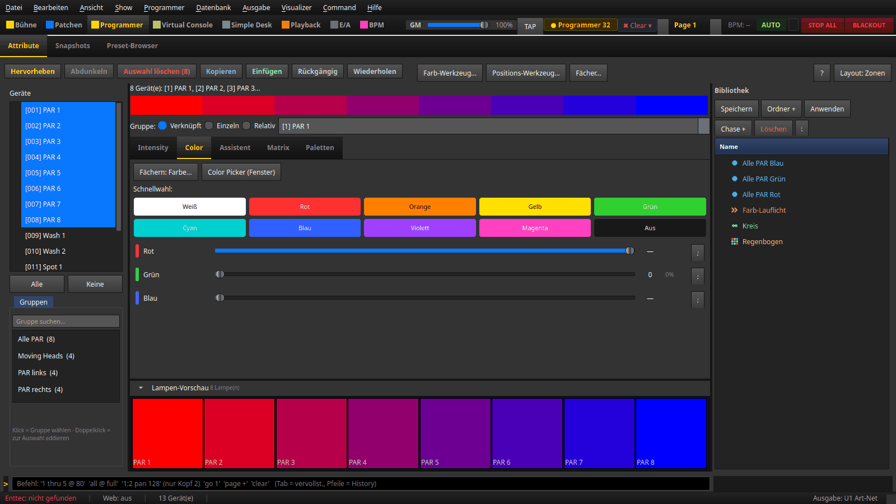
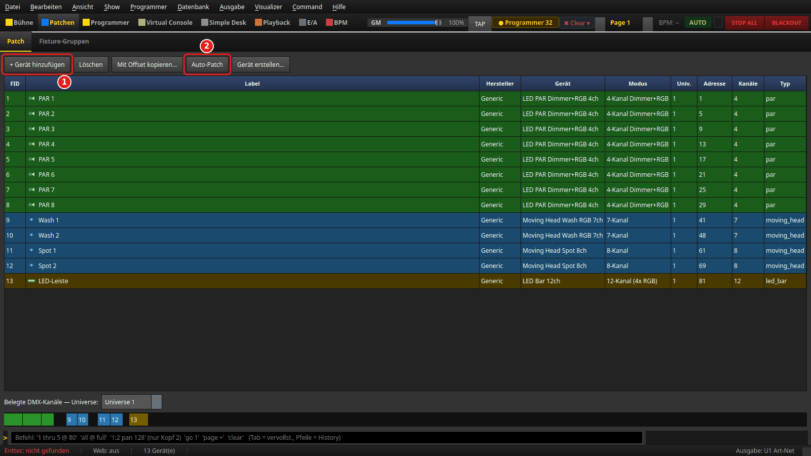
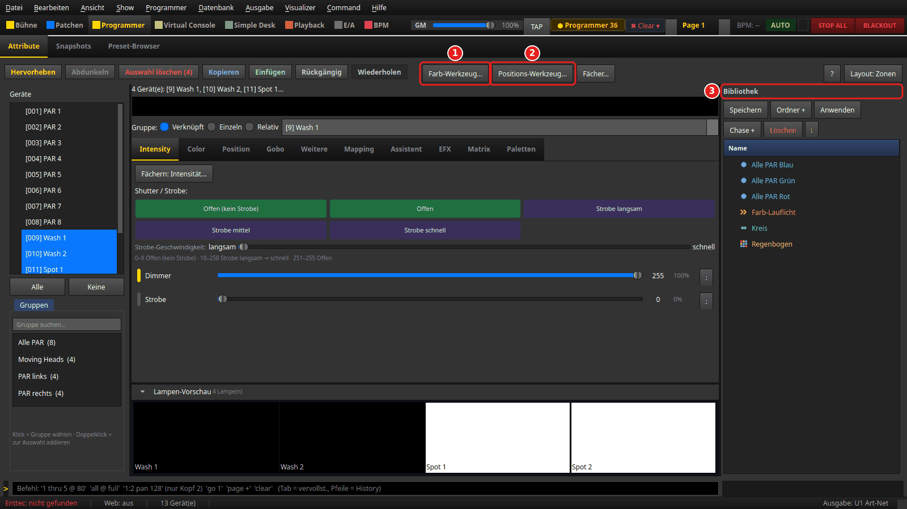
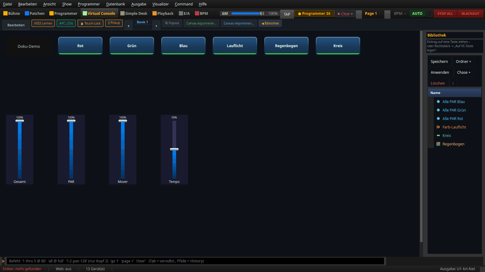
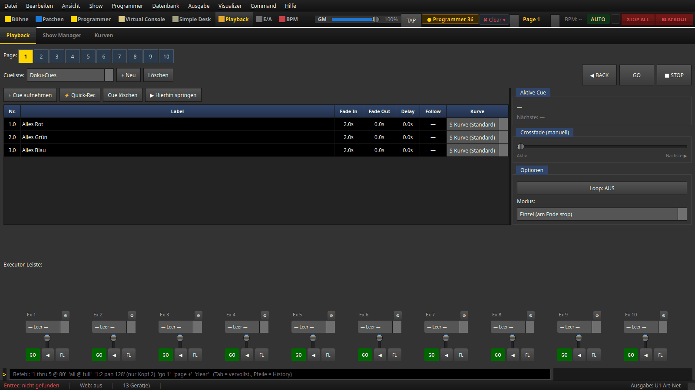
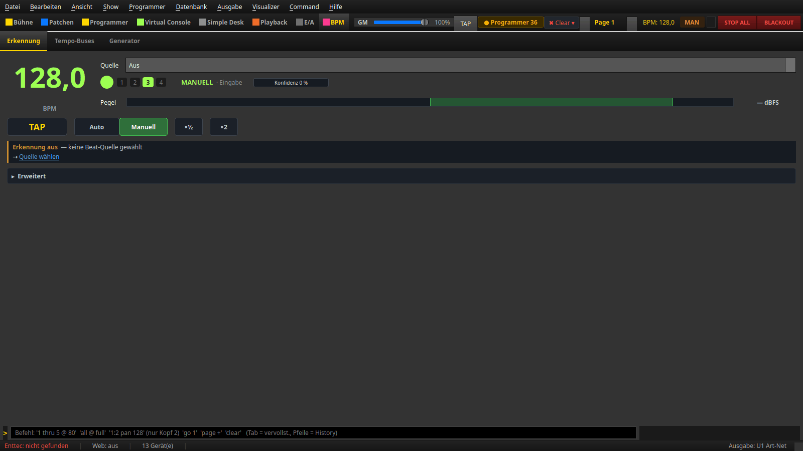
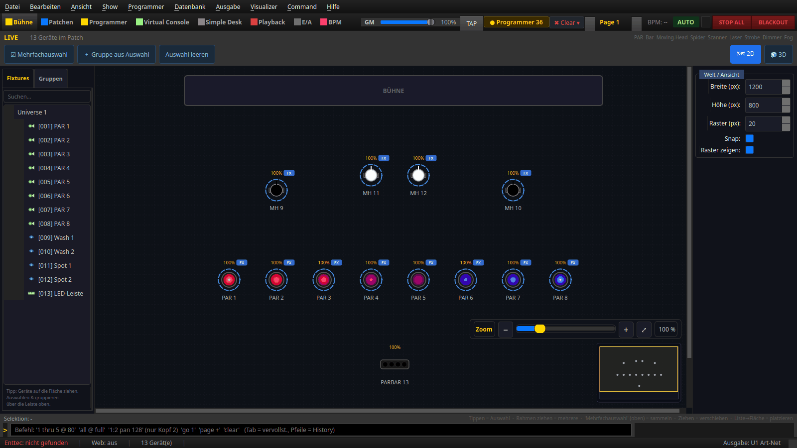
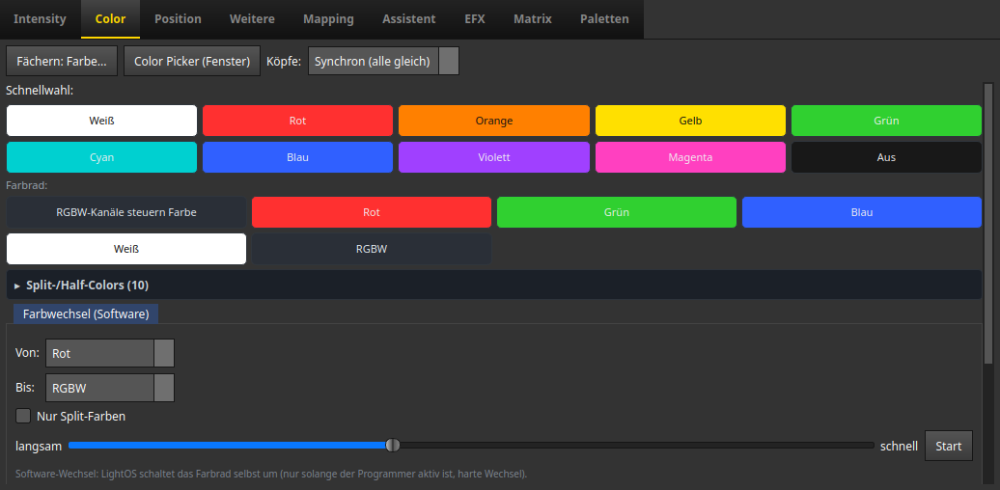

# LightOS

**DMX-Lichtsteuerung für Linux und Windows — mit Programmer, Virtual Console, Cue-Listen, BPM-Erkennung und 3D-Visualizer.**

[](https://github.com/ixamgames-droid/lightos/actions/workflows/ci.yml)



> **Neu hier?** Fang mit **[Erste Schritte](docs/anleitung_erste_schritte/ANLEITUNG.md)** an —
> alle bebilderten Anleitungen stehen in der **[Anleitungs-Übersicht](docs/ANLEITUNGEN.md)**.

---

## Was kann LightOS?

Jedes Bild führt zur passenden Schritt-für-Schritt-Anleitung.

<table>
  <tr>
    <td width="50%" valign="top">
      <a href="docs/anleitung_erste_schritte/ANLEITUNG.md"></a><br>
      <b><a href="docs/anleitung_erste_schritte/ANLEITUNG.md">Geräte patchen</a></b><br>
      Geräte aus der Bibliothek auf DMX-Adressen legen, mit „+ Gerät hinzufügen“ oder „Auto-Patch“.
    </td>
    <td width="50%" valign="top">
      <a href="docs/anleitung_programmer_grundlagen/ANLEITUNG.md"></a><br>
      <b><a href="docs/anleitung_programmer_grundlagen/ANLEITUNG.md">Programmer</a></b><br>
      Geräte und Gruppen wählen, Dimmer, Farbe und Position einstellen; Farb-, Positions- und Fächer-Werkzeug.
    </td>
  </tr>
  <tr>
    <td width="50%" valign="top">
      <a href="docs/anleitung_vc/ANLEITUNG_VC.md"></a><br>
      <b><a href="docs/anleitung_vc/ANLEITUNG_VC.md">Virtual Console</a></b><br>
      Eigene Bedienoberfläche aus Tasten, Fadern, XY-Pad, Tempo-Reglern und mehr — auch per MIDI.
    </td>
    <td width="50%" valign="top">
      <a href="docs/anleitung_szenen_cues/ANLEITUNG.md"></a><br>
      <b><a href="docs/anleitung_szenen_cues/ANLEITUNG.md">Szenen und Cue-Listen</a></b><br>
      Looks als Snap, Snapshot oder Szene speichern, Cue-Listen aufnehmen und mit GO abfahren.
    </td>
  </tr>
  <tr>
    <td width="50%" valign="top">
      <a href="docs/anleitung_bpm_manager/ANLEITUNG_BPM_MANAGER.md"></a><br>
      <b><a href="docs/anleitung_bpm_manager/ANLEITUNG_BPM_MANAGER.md">Musik und BPM</a></b><br>
      Tempo aus PC-Audio, Eingang, Lied-Analyse, OS2L oder TAP; Effekte laufen im Takt.
    </td>
    <td width="50%" valign="top">
      <a href="docs/anleitung_3d_visualizer_2026/ANLEITUNG_3D_BUEHNE.md"></a><br>
      <b><a href="docs/anleitung_3d_visualizer_2026/ANLEITUNG_3D_BUEHNE.md">Bühne in 2D und 3D</a></b><br>
      Rig von oben oder im 3D-Visualizer ansehen, Bühne bauen, Moving Heads einmessen.
    </td>
  </tr>
  <tr>
    <td width="50%" valign="top">
      <a href="docs/anleitung_ausgabe_einrichten/ANLEITUNG.md"></a><br>
      <b><a href="docs/anleitung_ausgabe_einrichten/ANLEITUNG.md">Ausgabe einrichten</a></b><br>
      ENTTEC DMX USB Pro, Art-Net und sACN; bis zu 32 Universen, mit Output- und DMX-Monitor.
    </td>
    <td width="50%" valign="top">
      <a href="docs/anleitung_geraete_bedienen/ANLEITUNG_GERAETE_BEDIENEN.md"></a><br>
      <b><a href="docs/anleitung_geraete_bedienen/ANLEITUNG_GERAETE_BEDIENEN.md">Jedes Gerät richtig bedienen</a></b><br>
      Shutter- und Strobe-Knöpfe, Programm-Kacheln, Mehrkopf-Geräte, Weiß-Segmente, Nebel und Laser.
    </td>
  </tr>
</table>

---

## Erste Schritte

Dieser Pfad führt der Reihe nach durch die wichtigsten Anleitungen. Die Bilder der ersten vier entstehen aus dem Code
([so geht das](docs/ANLEITUNGSBILDER.md)), deshalb zeigen sie die aktuelle Oberfläche.

1. **[Erste Schritte](docs/anleitung_erste_schritte/ANLEITUNG.md)** — Hauptfenster und die acht
   Sektionen, neue Show, ein Gerät patchen, erster Wert im Programmer, speichern.
2. **[Ausgabe einrichten](docs/anleitung_ausgabe_einrichten/ANLEITUNG.md)** — ENTTEC USB Pro,
   Art-Net oder sACN, Universen, Kontrolle im Output- und DMX-Monitor.
3. **[Programmer-Grundlagen](docs/anleitung_programmer_grundlagen/ANLEITUNG.md)** — Geräte und
   Gruppen wählen, Intensity, Color, Position, Paletten, Werkzeuge, Löschen.
4. **[Szenen, Snaps & Cue-Listen](docs/anleitung_szenen_cues/ANLEITUNG.md)** — Looks speichern,
   Cue-Liste aufnehmen, auf einen Executor legen, mit GO abfahren.
5. **[Virtual Console bauen](docs/anleitung_vc/ANLEITUNG_VC.md)** — eigene Bedienoberfläche;
   jedes Element einzeln erklärt in der [Widget-Referenz](docs/anleitung_vc_widgets/README.md).
6. **[BPM-Manager](docs/anleitung_bpm_manager/ANLEITUNG_BPM_MANAGER.md)** — Tempo aus der Musik.

Danach nach Thema weiter: **[alle Anleitungen](docs/ANLEITUNGEN.md)**.

---

## Installation und Start

Voraussetzung: **Python 3.11 oder neuer**. Ausführlich, mit Optionen und Fehlerhilfe:
**[INSTALL.md](INSTALL.md)**.

**Windows 10/11** (x64 oder ARM64):

```cmd
git clone https://github.com/ixamgames-droid/lightos.git
cd lightos
python install.py
venv\Scripts\python main.py
```

`install.py` legt ein `venv/` an, installiert die Abhängigkeiten und eine Desktop-Verknüpfung.
Auf ARM64-Geräten den ARM64-Installer von python.org nehmen.

**Linux** (Debian/Ubuntu/Mint, X11):

```bash
sudo apt-get install -y python3 python3-venv python3-pip \
    build-essential libasound2-dev libpulse0 fonts-noto fonts-dejavu

git clone https://github.com/ixamgames-droid/lightos.git
cd lightos
python3 -m venv venv
venv/bin/python -m pip install --upgrade pip
venv/bin/python -m pip install -r requirements.txt
venv/bin/python main.py
```

`build-essential` und `libasound2-dev` braucht MIDI (`python-rtmidi` wird gebaut), `libpulse0`
die BPM-Erkennung aus PC-Audio. Linux-Besonderheiten stehen in
[INSTALL.md](INSTALL.md#linux-x86_64).

---

## Funktionen im Detail

<details>
<summary><b>Geräte, Patch und Bibliothek</b></summary>

- Eingebaute Profile (Generic und handgepflegte Geräte) plus Import ganzer
  QLC+-Bibliotheken: Menü **Datenbank → Fixtures importieren (XML)...** liest einen Ordner mit
  `.qxf`-Dateien ein. Eigene Profile über **Datenbank → Neues Fixture-Profil...**.
- Mitgelieferte Profile werden nach einem Update angeglichen; importierte Geräte bekommen die
  passenden Regler (Farbkanal statt „Dimmer“, Gobo-Rotation statt Geschwindigkeit).
- Mehrkopf-Geräte (Moving-Bars, Spider, Hydrabeam) als echte Kopf-Ziele; Pan/Tilt invertieren
  und tauschen, Dimmer-Kurven je Gerät.
- **Weiß-Segmente:** Geräte mit eigener Weiß-Leiste haben zwei ansprechbare Sätze — Farb-Zonen
  und Weiß-Segmente. Beide lassen sich im Programmer einzeln wählen, getrennt ins Gruppen-Raster
  legen und per VC-Submaster dimmen.
- **Pixel-Geräte:** LED-Ring-Köpfe mit jedem Pixel bedienbar, Pixel-Panels mit Pixel-Reihenfolge
  und gedrehter Montage, Köpfe im Gruppen-Raster frei anordnen
  ([Anleitung](docs/anleitung_gruppen_matrizen/ANLEITUNG_GRUPPEN_MATRIZEN.md)).
- Die Patch- und Show-Prüfung findet jede Adress-Überschneidung; Konflikte lassen sich im
  Dialog auflösen. Ein neues Gerät ragt nicht über Kanal 512 hinaus.

</details>

<details>
<summary><b>Programmer</b></summary>

- Reiter je nach Auswahl: **Intensity, Color, Position, Gobo, Weitere**, dazu **Assistent,
  EFX, Matrix, Laser, Paletten**. Reiter ohne passende Kanäle werden ausgeblendet.
- **Bedienelemente je Gerät:** Shutter- und Strobe-Knöpfe, Programm-Kacheln, zweite gleiche
  Kanäle (z. B. zweites Goborad), Farbrad-Kacheln mit Split-Farben, grafische Gobo-Vorschau —
  abgeleitet aus den Wertebereichen des Profils
  ([Anleitung](docs/anleitung_geraete_bedienen/ANLEITUNG_GERAETE_BEDIENEN.md)).
- Bei Mehrkopf-Geräten lässt sich ein einzelner Kopf wählen; Regler, Fächer, Snaps, EFX,
  Submaster und XY-Pad wirken dann nur auf ihn.
- Werkzeuge: **Farb-Werkzeug...** (RGB/HSB/CMY, Lee-/Rosco-Filter), **Positions-Werkzeug...**
  (2D-Pad, Pan/Tilt fein, Presets), **Fächer...** (Verläufe über die Auswahl).
- **Hervorheben / Abdunkeln**, Kopieren/Einfügen, **Snapshots** und **Preset-Browser**,
  Paletten für Farbe, Position und Beam.

</details>

<details>
<summary><b>Effekte, Playback und Virtual Console</b></summary>

- Funktionstypen: Scene, Chaser, Collection, Show (Timeline), EFX, RGB-Matrix, Sequence, Audio,
  Script, LayeredEffect, Carousel.
- **Playback:** 10 Pages mit je 20 Executoren, Cue-Listen mit Fades, Grand Master, Blackout.
- **Virtual Console:** Taste, Fader, Encoder, Stepper, XY-Pad, Farbe, Farbliste, Cue-Liste,
  Speed-Dial, Tempo-Bus-Auswahl, Tempo-Controller, BPM-Anzeige, Musik-Info, Effekt-Anzeige,
  Effekt-Editor, Effekt-Farben, Live-Editor, Label und Frame (mehrseitig oder Solo).
  Effekte per Drag & Drop auf Elemente legen, Banks, Submaster je Gerät oder Kopf,
  MIDI-Lernen je Element, Tasten mit Bild oder GIF
  ([Widget-Referenz](docs/anleitung_vc_widgets/README.md)).
- **Kommandozeile** im MA-/Avolites-Stil, zum Beispiel:

  ```
  1 thru 5 @ 80      # Geräte 1-5 auf 80 %
  all @ full         # alle Lampen voll
  1:2 pan 128        # nur Kopf 2 von Gerät 1
  go 1               # Executor 1 GO
  record cue 2.5     # Programmer als Cue 2.5 aufnehmen
  page 3             # zu Page 3 wechseln
  blackout           # Blackout umschalten
  ```

  Köpfe zählen ab 1 wie im Programmer (`1:1` ist der erste Kopf). Wo die Kanalzahl nicht zur
  Kopfzahl passt, verweigert die Kommandozeile das Kopf-Ziel mit Begründung, statt zu raten.

</details>

<details>
<summary><b>Musik, BPM und Tempo</b></summary>

- **Sektion BPM** mit den Unter-Reitern **Erkennung**, **Tempo-Buses** und **Generator**.
- **Quellen:** PC-Audio (Systemstandard oder je Ausgabegerät), Eingang (Mikrofon/Line-In),
  OS2L (DJ-Software), Lied-Analyse (Player), Aus; dazu TAP und **Manuell**. Die gewählte Quelle
  entscheidet, wer das Tempo führt.
- **Live-Erkennung** über Spectral Flux und Autokorrelation, mit Pegelmeter und einer
  Statuszeile, die Problem, Ursache und Abhilfe nennt (kein Signal, zu leise, übersteuert,
  Netzbrumm …). Unter „Erweitert“: **Eingang 30 s aufnehmen** für die Fehlersuche.
- **Generator:** ein ganzes Lied analysieren (BPM-Verlauf und Beatgrid) und im Player als
  BPM-Quelle nutzen ([Anleitung](docs/anleitung_bpm_generator/ANLEITUNG_BPM_GENERATOR.md)).
- **Tempo-Buses** mit Multiplikatoren; Effekte folgen dem Bus, auch taktgleich gestartet
  ([Tempo & Synchronisierung](docs/ANLEITUNG_TEMPO_SYNC.md)).
- Loopback-Mitschnitt: WASAPI auf Windows, PulseAudio/PipeWire-Monitor-Quelle auf Linux.
  Außerdem MIDI Time Code und Musik-Player mit Auto-Show.

</details>

<details>
<summary><b>3D-Visualizer und Bühne</b></summary>

- Three.js in QtWebEngine; 2D von oben und 3D, zwei Modi **Ansehen** und **Bauen**.
- Gobos, Prisma, Zoom/Iris, Fokus/Frost im Lichtkegel; Kegel enden am Boden und an Podesten,
  lassen sich in der Länge begrenzen oder je Gerät ausblenden.
- Geräte aus der Liste ins 3D ziehen, als Reihe, Raster oder Kreis anordnen; Bühnen-Presets,
  eigener Bühnenbau (Traversen, Podeste), optionale Raum-Hülle; Mover-Bars zeigen ihre Köpfe
  wie am echten Gerät. Auch große Rigs laufen.
- **Zielen und Einmessen:** mit ⌖ auf einen Punkt zielen (mit Feinkanal genau), Moving Heads
  am echten Aufbau einmessen — ab vier Punkten rechnet LightOS die echte Position aus
  ([Anleitung](docs/anleitung_einmessen/ANLEITUNG_EINMESSEN.md)).
- Echte 3D-Modelle je Geräteklasse: [Modell-Galerie](docs/FIXTURE_3D_GALLERY.md).

</details>

<details>
<summary><b>Ausgabe und Eingaben</b></summary>

- **ENTTEC DMX USB Pro** mit Watchdog und Wiederverbinden nach dem Einstecken; Warnung, wenn
  ein anderes Programm den Port belegt.
- **Art-Net 4** und **sACN/E1.31** (Ausgang und Eingang, Merge HTP/LTP), Netzwerkkarte wählbar,
  Art-Net-Startuniversum einstellbar; bis zu **32 Universen**, mehrere Adapter gleichzeitig.
- Die Statusleiste meldet ein Universum ohne Ausgang; der DMX-Monitor zeigt, ob das Bild
  wirklich rausgeht.
- **MIDI** mit Profil-Editor (APC mini und APC mini mk2 dabei), LED-Feedback, mehrere Ausgänge
  gleichzeitig; **OSC** (Port 7770); Tastatur-Belegung.
- **Web-Remote** im Browser von Handy oder Tablet — standardmäßig nur auf `127.0.0.1`, LAN als
  sichtbares Opt-in mit Token ([Anleitung](docs/anleitung_web_remote/ANLEITUNG.md)).

</details>

<details>
<summary><b>Laser</b></summary>

- DMX-Laser als eigene Geräteklasse: Muster, Gruppen, Werksmuster-Kacheln, Shutter sicher aus.
- Laser-Reiter mit **Not-Aus**, Figuren zeichnen, Bild-Trace, Muster-Slots.
- Punkt-Streaming über **Ether Dream** und **IDN** (bisher nur gegen Nachbildungen getestet).
- [Anleitung: Laser bedienen](docs/anleitung_laser/ANLEITUNG_LASER.md)

</details>

<details>
<summary><b>Sicherheit, Rückgängig und Show-Datei</b></summary>

- **„Alles Weiß“** fasst nur Lichtgeräte an — Laser, Nebel-, Funken- und ähnliche Geräte bleiben,
  wie sie sind.
- **STOP ALL** stoppt auch die Musik sofort; der **BLACKOUT**-Knopf zeigt den echten Zustand,
  auch wenn Blackout über VC, Web-Remote, OSC oder die Kommandozeile geschaltet wurde.
- **Rückgängig/Wiederherstellen** (Menü Bearbeiten) für Patch-Änderungen, 3D-Gesten und
  Einmess-Korrekturen; ein gelöschtes Gerät kommt samt gepflegter Kopf-Gruppe zurück. Jede
  geöffnete oder neue Show beginnt mit leerem Verlauf.
- Ein kaputter Eintrag in der Show-Datei kostet nur sich selbst und wird gemeldet; doppelte
  Gerätenummern werden sicher umnummeriert. **Datei → Show prüfen & reparieren...** prüft eine
  Show, Auto-Save und Wiederherstellung nach einem Absturz sind eingebaut.

</details>

---

## Hardware und Plattform

Linux und Windows laufen aus demselben Quellcode; Plattform-Spezifisches liegt hinter
`sys.platform` mit Rückfall.

| | Linux | Windows |
|---|---|---|
| Getestet auf | Mint 22.3, x64, X11 | Windows 10/11, x64 und ARM64 |
| Python | 3.11+ | 3.11+ |
| GitHub-CI | volle Testsuite, segmentiert (Python 3.12) | Smoke-Test aus fünf Dateien (Python 3.11 und 3.12) |
| DMX am echten Rig | ENTTEC über `/dev/ttyUSB*` | ENTTEC über COM-Port |
| MIDI | `python-rtmidi` / ALSA | WinMM |
| Datenordner | `~/.local/share/LightOS` | `%APPDATA%\LightOS` |

**ENTTEC-Langzeittest bestanden:** 10,21 h und 1.456.939 Frames ohne einen Schreibfehler; ein
zweiter Lauf mit einem Gerät an der Leitung und sichtbarem Herzschlag lief 5,87 h und
837.989 Frames mit 0 Fehlern.

Auf Linux braucht die BPM-Erkennung aus PC-Audio eine PulseAudio/PipeWire-Monitor-Quelle,
der 3D-Visualizer startet mit `--no-sandbox` (abschaltbar über
`LIGHTOS_WEBENGINE_NO_SANDBOX=0`). Details: [INSTALL.md](INSTALL.md#linux-x86_64).

---

## Status und Grenzen

LightOS ist ein privates Projekt in aktiver Entwicklung — ohne Garantie, ohne Lizenz, ohne Support.
Mitgelieferte fremde Komponenten (3D-Modelle aus QLC+, three.js) stehen unter ihren eigenen
Lizenzen — siehe [THIRD_PARTY_NOTICES.md](THIRD_PARTY_NOTICES.md).

| | Stand |
|---|---|
| Engine, Programmer, Playback, VC, Visualizer | im Alltagsbetrieb, Testsuite grün |
| ENTTEC, Art-Net, sACN | im Betrieb, ENTTEC im Langzeittest geprüft |
| Laser über DMX | im Einsatz |
| Laser über Ether Dream / IDN | umgesetzt, aber nur gegen Nachbildungen getestet |
| Windows | Alltagsrechner; in der CI nur ein Smoke-Test |
| macOS | nicht unterstützt (Pfade vorbereitet, nie getestet) |

Die meisten Beispiel-Shows der älteren Anleitungen liegen nicht im Repo; wo es einen Generator
gibt, steht er in der [Anleitungs-Übersicht](docs/ANLEITUNGEN.md). Offene Punkte stehen in
[BACKLOG.md](BACKLOG.md), Änderungen in [CHANGELOG.md](CHANGELOG.md).

---

<details>
<summary><b>Für Entwickler</b></summary>

### Tests

Alle Tests laufen ohne Hardware und ohne Fenster (offscreen).

```bash
# Linux: volle Suite, ein Prozess je Testdatei
./tools/verify_loop.sh
./tools/verify_loop.sh tests/test_x.py      # einzelne Datei
```

```powershell
# Windows: Segment-Runner
.\tools\verify_segmented.ps1
.\tools\verify_segmented.ps1 tests\test_x.py
```

Die Suite nicht als einen einzigen `pytest tests/`-Lauf starten — ein Sammelprozess stirbt an
aufgestautem nativem Qt-Zustand. Hintergrund und Parallelität: [WORKFLOW.md](WORKFLOW.md).

### CI

[`.github/workflows/ci.yml`](.github/workflows/ci.yml): Linux fährt die volle Suite
segmentiert, Windows einen Smoke-Test aus fünf Dateien.

### Projektstruktur

```
main.py, install.py       Start und Installer
src/core/                 Engine, Datenmodell, Undo, Show-Datei, DMX, Audio/BPM, MIDI, OSC,
                          Laser, Bühne, Kommandozeile, Fixture-Datenbank, Capability-Prüfung
src/ui/                   Hauptfenster, Views, Werkzeuge, Virtual Console, Visualizer (Three.js)
src/web/                  Web-Remote (Flask)
assets/                   Theme, Icons, Bilder der VC-Galerie, three.js
docs/                     Anleitungen, Referenz, Design- und Audit-Dokumente
tools/                    Show-Generatoren, Test-Gate, Doku- und Prüfwerkzeuge
tests/                    Testsuite (headless)
examples/                 Beispiel-Skripte (teils auf ein bestimmtes Rig zugeschnitten)
data/, shows/             Laufzeitdaten (bis auf Controller-Bibliothek und einige Demo-Shows nicht im Repo)
```

### Weiterführend

- [ARCHITECTURE.md](ARCHITECTURE.md) · [WORKFLOW.md](WORKFLOW.md) ·
  [CONTRIBUTING.md](CONTRIBUTING.md) · [AGENTS.md](AGENTS.md) · [ROADMAP.md](ROADMAP.md)
- [BACKLOG.md](BACKLOG.md) · [CHANGELOG.md](CHANGELOG.md)
- Anleitungsbilder aus dem Code erzeugen: [docs/ANLEITUNGSBILDER.md](docs/ANLEITUNGSBILDER.md)
- Formate und Protokolle: [Show-Datei](docs/SHOW_FILE_FORMAT.md) ·
  [Art-Net](docs/ARTNET.md) · [DMX](docs/DMX_PROTOCOL.md) ·
  [Env-Flags und Config-Dateien](docs/CONFIG_REFERENCE.md) ·
  [Fixture-Bibliothek](docs/FIXTURE_LIBRARY.md)
- Design: [3D-Visualizer-Umbau](docs/VIZ3D_OVERHAUL_PLAN.md) ·
  [Web-Remote-Sicherheit](docs/DESIGN_DECISION_REMOTE_SECURITY_2026-07-14.md) ·
  [Komponenten-Doku](docs/components/README.md)

</details>
