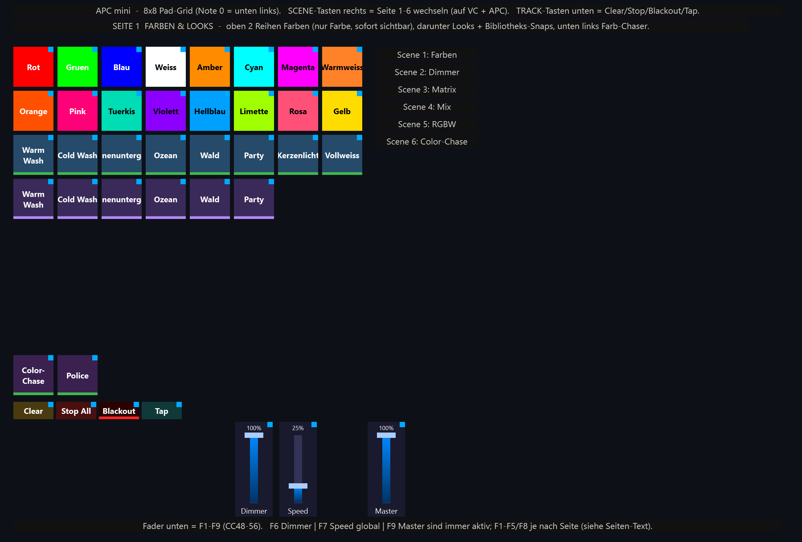
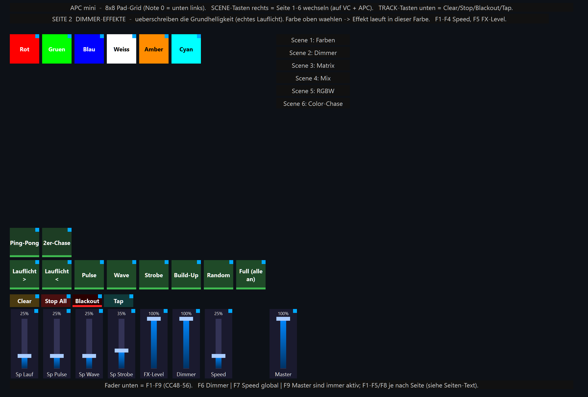
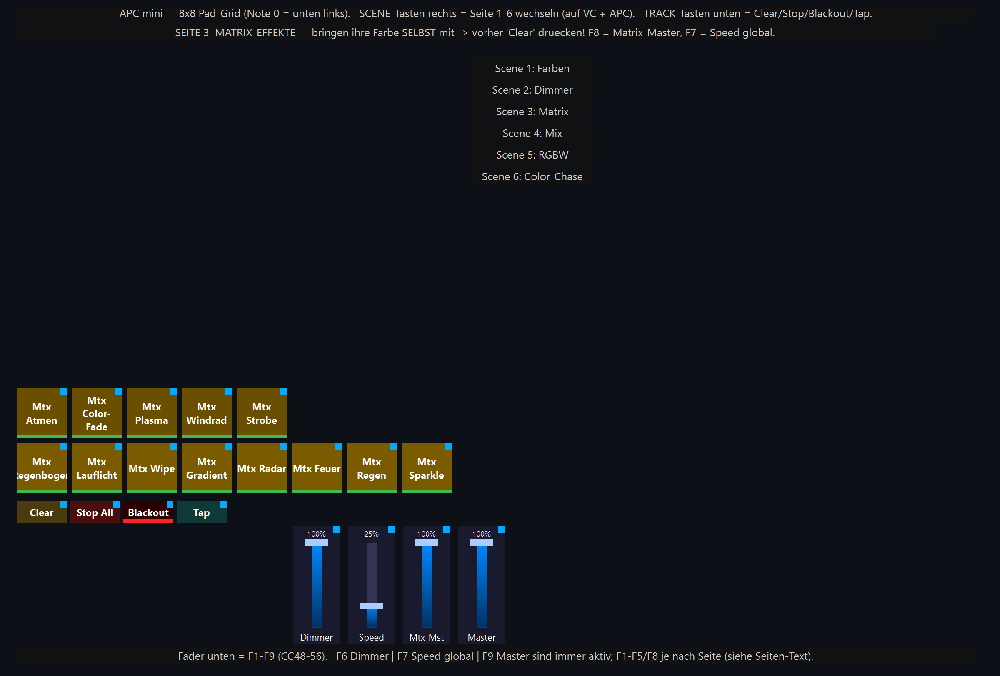
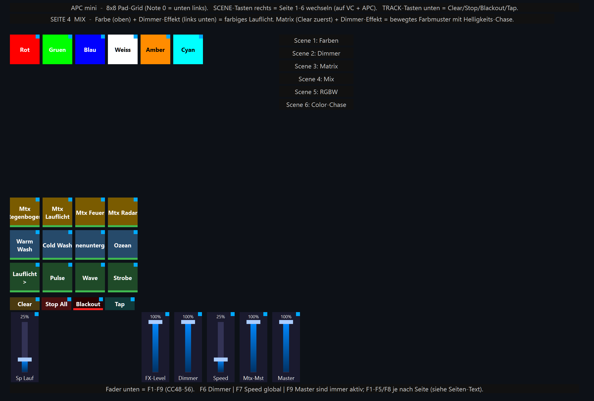
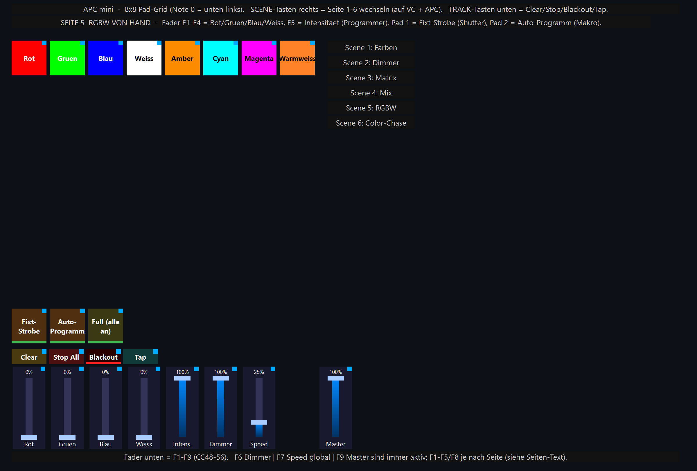
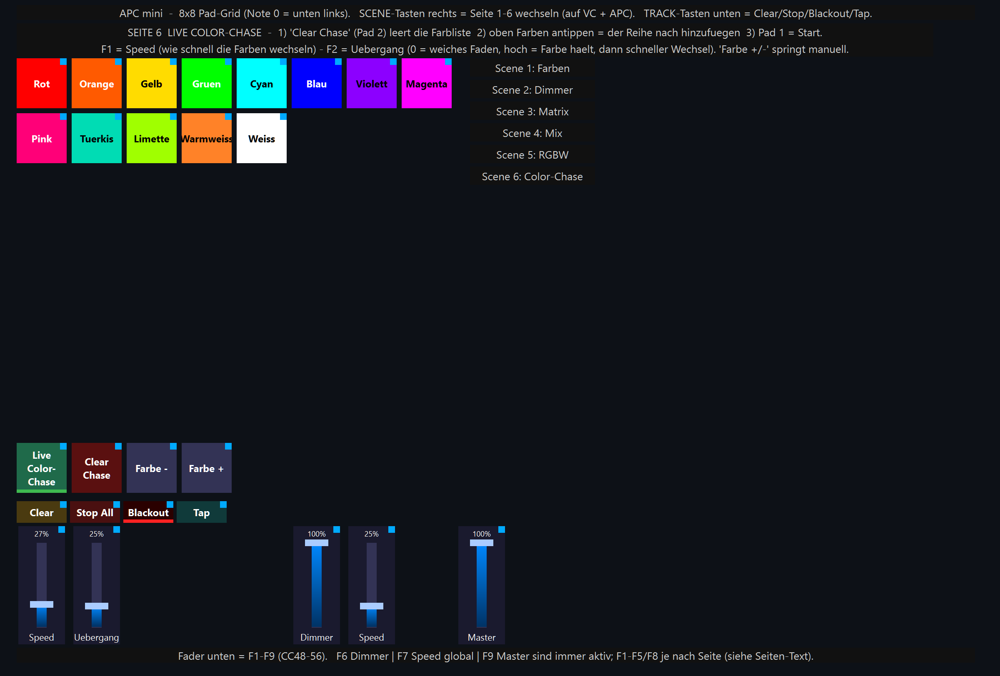

# APC‑mini Test‑Show — Seiten‑Übersicht (was macht welche Taste?)

Diese Datei zeigt **jede der 6 Seiten** der Show `APC_Test_Komplett.lshow` als Bild
und erklärt, **was jede Taste / jeder Fader tut** und **wie die Elemente
zusammenarbeiten**. Die Bilder sind echte Screenshots der virtuellen Konsole
(erzeugt mit `tools/render_apc_pages.py`).

> Hardware: 4× „Stage Light ZQ01424" (8‑Kanal‑RGBW, Adressen 1/9/17/25) + Akai APC mini.
> Bedienung & Hintergrund: **[APC_TEST_SHOW.md](APC_TEST_SHOW.md)** · Schritt‑für‑Schritt:
> **[APC_SCHRITT_FUER_SCHRITT.md](APC_SCHRITT_FUER_SCHRITT.md)**.

## So liest du die Bilder

- Das **8×8‑Raster** oben = die Clip‑Pads des APC mini (Note 0 = unten links).
- Die **Reihe darunter** = die Track‑Tasten (Clear · Stop All · Blackout · Tap),
  auf **jeder** Seite gleich.
- Die **Fader unten** = F1…F9 (CC 48…56). F6 Dimmer, F7 Speed, F9 Master sind
  **immer** aktiv; F1–F5/F8 wechseln je Seite die Bedeutung.
- Rechts die **Scene‑Legende**: welche Scene‑Taste (rechte Spalte am APC) welche
  Seite öffnet.
- Das kleine **blaue Eck** oben rechts an einem Element = „hat eine MIDI‑Bindung".

---

## Seite 1 — Farben & Looks  (Scene‑Taste 1)



| Bereich | Tut |
|---|---|
| Obere 2 Reihen (16 Farb‑Kacheln) | Setzen **nur die Farbe** auf alle 4 PARs (Helligkeit kommt aus der Grundhelligkeit → sofort sichtbar). |
| Reihe „Looks" (Warm Wash … Vollweiß) | Komplette **Szenen** (Farbe **+** Helligkeit) als ein Tastendruck. |
| Reihe darunter (gleiche Namen) | Dieselben Looks als **Bibliotheks‑Snaps** (Toggle). |
| Color‑Chase · Police (unten links) | Fertige **Farb‑Chaser**. |

**Zusammenspiel:** Farbe hier wählen → auf Seite 2 einen Dimmer‑Effekt starten →
der Effekt läuft in dieser Farbe.

---

## Seite 2 — Dimmer‑Effekte  (Scene‑Taste 2)



| Bereich | Tut |
|---|---|
| Untere Reihe | Lauflicht ▶/◀ · Pulse · Wave · Strobe · Build‑Up · Random · Full. **Überschreiben die Grundhelligkeit** (echtes Lauflicht). |
| Reihe darüber | Ping‑Pong · 2er‑Chase. |
| Farb‑Kacheln oben | Effekt direkt einfärben. |
| **F1–F4** | Speed je Effekt (Lauflicht/Pulse/Wave/Strobe). |
| **F5** | FX‑Level (Helligkeit **aller** Dimmer‑Effekte). |

**Zusammenspiel:** Farbe (oben) + Dimmer‑Effekt = farbiges Lauflicht; F1–F4 regeln
das Tempo getrennt, F7 das Gesamttempo.

---

## Seite 3 — Matrix‑Effekte  (Scene‑Taste 3)



| Bereich | Tut |
|---|---|
| 13 Matrix‑Pads | Regenbogen, Lauflicht, Wipe, Gradient, Radar, Feuer, Regen, Sparkle, Atmen, Color‑Fade, Plasma, Windrad, Strobe. **Bringen ihre Farbe selbst mit.** |
| **F8** | Matrix‑Master (Helligkeit aller Matrix‑Effekte). |

**Zusammenspiel:** Vorher **Clear** (Track 1) drücken, damit keine Farb‑Ebene das
Muster überschreibt. Tempo mit F7.

---

## Seite 4 — Mix & Kombinationen  (Scene‑Taste 4)



| Bereich | Tut |
|---|---|
| Farb‑Kacheln oben | Farbe setzen. |
| Dimmer‑Effekte (unten links) | Lauflicht/Pulse/Wave/Strobe. |
| Matrix (Reihe darüber) | Regenbogen/Lauflicht/Feuer/Radar. |
| Looks (Mitte) | Warm/Cold/Sunset/Ozean. |
| **F1 / F5 / F8** | Speed · FX‑Level · Matrix‑Master. |

**Zusammenspiel:** Alles auf **einer** Seite mischbar — Farbe + Dimmer‑Effekt =
farbiges Lauflicht; Matrix (Clear) + Dimmer‑Effekt = bewegtes Farbmuster mit
Helligkeits‑Chase. (Du musst aber **nicht** auf diese Seite wechseln — laufende
Effekte bleiben beim Seitenwechsel aktiv.)

---

## Seite 5 — RGBW von Hand + Fixture‑Programme  (Scene‑Taste 5)



| Bereich | Tut |
|---|---|
| Farb‑Kacheln oben | Schnellwahl Farbe. |
| Pad „Fixt‑Strobe" | Fixture‑eigenes Strobe (Shutter‑Kanal). |
| Pad „Auto‑Programm" | Eingebautes Auto‑Programm (Makro‑Kanal). |
| **F1–F4** | **Rot · Grün · Blau · Weiß** von Hand mischen (Programmer). |
| **F5** | Intensität (Programmer). |

**Zusammenspiel:** Hier mischst du Farben stufenlos selbst — gut zum Ausprobieren
von Farbtönen, die es als Kachel nicht gibt.

---

## Seite 6 — Live Color‑Chase  (Scene‑Taste 6)



| Bereich | Tut |
|---|---|
| Farb‑Pads oben | **Hängen ihre Farbe live an die Chase‑Liste an** (Modus „Farbe hinzufügen"). |
| Pad „Live Color‑Chase" | **Start/Stop** des Chase. |
| Pad „Clear Chase" | Farbliste **leeren** (vor dem Neu‑Aufbau). |
| Pad „Farbe −/+" | Manuell eine Farbe zurück/weiter springen. |
| **F1 Speed** | Wie schnell die Farben wechseln. |
| **F2 Übergang** | 0 = weiches Faden · hoch = Farbe hält, dann schneller Wechsel. |

**Zusammenspiel (Live programmieren):** `Clear Chase` → gewünschte Farben **der
Reihe nach** antippen (z. B. Rot, Blau, Weiß) → `Start`. Der Chase läuft durch
genau diese Farben; mit F1/F2 formst du Tempo und Übergang live.

---

## Immer aktiv (alle Seiten)

| Element | Funktion |
|---|---|
| Track 1–4 | **Clear** · **Stop All** · **Blackout** · **Tap** |
| **F6** | Dimmer (Grundhelligkeit aller PARs, bis 0) |
| **F7** | Speed global (Tempo aller laufenden Effekte) |
| **F9** | Grand Master |
| Scene‑Tasten rechts | Seite 1–6 wechseln (gleichzeitig auf VC **und** APC) |

## Bilder neu erzeugen

Nach Änderungen an der Show:
```cmd
venv\Scripts\python tools\build_apc_test_show.py     :: Show neu bauen
venv\Scripts\python tools\render_apc_pages.py        :: Seiten-Bilder neu rendern
```

*Stand: 2026‑06‑08*
