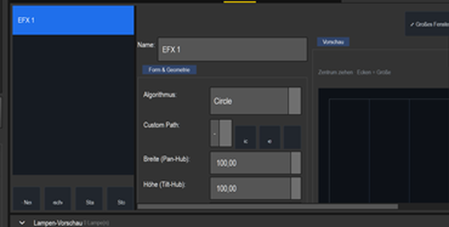
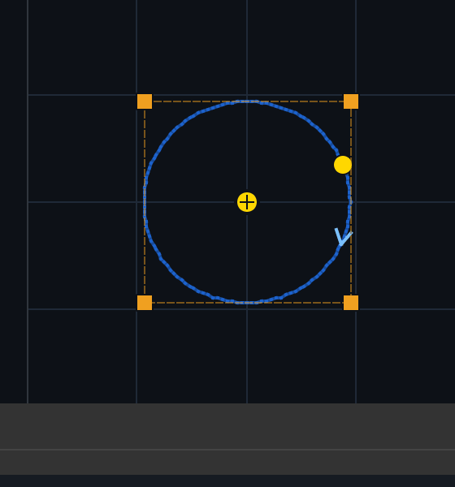
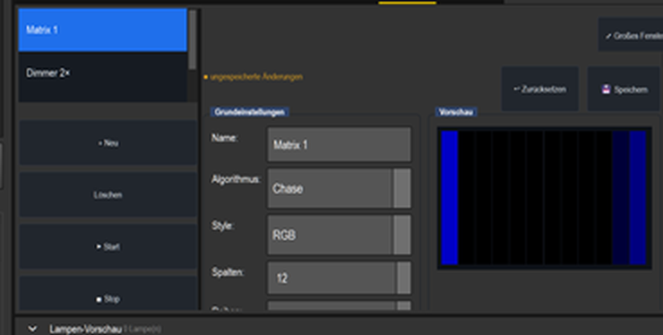
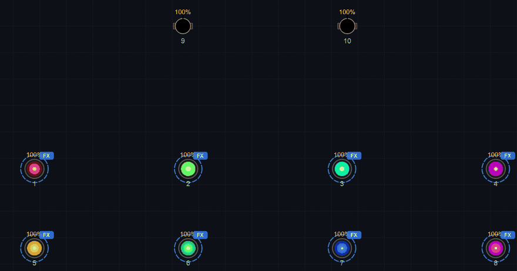
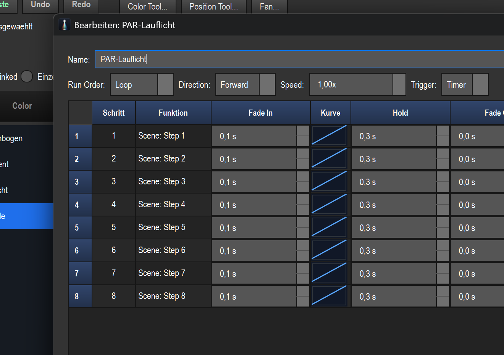

# LightOS – Effekte bauen & mit Geschwindigkeit steuern

So baust du Effekte und koppelst sie mit Geschwindigkeit/Tempo. Grundlagen
(Patchen, Gruppen, Programmer, Oberfläche) stehen in [ANLEITUNG.md](ANLEITUNG.md).

> Beschrieben ist die aktuelle Oberfläche (Stand 2026‑07). Geometrie- und
> Pixel-Effekte liegen im **Programmer** in den Tabs **EFX** und **Matrix**;
> Szenen, Chaser und der Effekt-Assistent im Programmer-Tab **Hilfe**, fertige
> Bausteine in der rechten **Bibliothek**. (Der Effekt-Tab hieß früher „Helper";
> der sichtbare Reiter heißt jetzt **Hilfe** — die Buttons darauf sind unverändert.)
>
> **Snap vs. Szene — häufige Verwechslung:** Ein **Snap** (rechte Bibliothek,
> „💾 Muster/Speichern") ist ein gespeicherter Programmer-Stand zum direkten
> Abrufen. Ein **Chaser** braucht dagegen **Szenen/Funktionen** als Schritte,
> **keine Snaps**. Willst du aus dem aktuellen Look einen Chaser-Baustein machen,
> nimm auf dem **Hilfe**-Tab **„Programmer → Szene"** (Abschnitt 5) — dann steht
> die Szene im „+ Hinzufügen"-Dialog des Chasers zur Wahl.

---

## 0. Der schnellste Weg: der Effekt-Assistent

Im **Programmer → Tab Hilfe** gibt es den Button
**„Effekt-Assistent…"**. Er führt dich Schritt für Schritt durch
**Typ → Lampen → Farben → Tempo** und legt am Ende fertige Funktionen
(Szenen + Chaser) an. **Wenn du schnell ein Ergebnis willst, fang hier an.**
Die folgenden Abschnitte erklären, wie du dasselbe von Hand und mit mehr
Kontrolle baust.

---

## 1. Die drei „Geschwindigkeiten" in LightOS

Wichtig, diese auseinanderzuhalten:

1. **Effekt-eigene Geschwindigkeit** – jeder Effekt hat ein eigenes Tempo-Feld:
   - **EFX:** `Geschwindigkeit (Hz)` (Umläufe pro Sekunde).
   - **RGB Matrix:** `Geschwindigkeit` (Tempo der Animation).
   - **Chaser:** `Speed` als **Multiplikator** (`x`) auf die Schrittzeiten.
2. **Globales Tempo = BPM** – oben in der Leiste. Gesetzt über **TAP**, **Klick
   auf die BPM-Anzeige** oder die **Audio-Beat-Erkennung**. Chaser im
   **Beat-Modus** folgen automatisch dieser BPM.
3. **Grand Master (GM)** – globaler Dimmer (Helligkeit, nicht Tempo), gehört
   aber zum Live-„Regeln" dazu.
4. **Speed-Dial mit Master/Sub (neu, QLC+-Stil)** – direkt aus der Virtuellen
   Konsole: ein **Speed-Knoten** ist entweder **Master** (eigenes Tempo per
   Tap/Rad) oder **Sub** (folgt einem Master, läuft synchron, aber mit einem
   **Faktor** ¼ · ½ · ×2 · ×4). Ein **Grand-Master** kann alle übertrumpfen.
   → ausführlich in Abschnitt 9 unten.

**BPM vs. Hz vs. Multiplikator:** BPM = Beats/Minute (höher = schneller);
Hz = Umläufe/Sekunde (höher = schneller); x = Faktor auf Schrittzeiten
(höher = schneller).

---

## 2. EFX – Bewegungseffekte für Moving Heads (Programmer → Tab EFX)

Geometrische **Pan/Tilt-Figuren**. Links Liste, Mitte Editor, rechts Live-
Vorschau der Bahn. Der EFX **folgt der Programmer-Auswahl** — erst die Gruppe
(z. B. Moving Heads) wählen, dann den EFX.

1. **+ Neu** → EFX anlegen, **Name** vergeben.
2. **Algorithmus** wählen (Dropdown).
3. Form: **Breite (Pan-Hub) / Höhe (Tilt-Hub)** (Größe der Figur),
   **Zentrum Pan / Zentrum Tilt** (Mitte, 128/128 = Bühnenmitte),
   **Rotation (°)**, **X-Frequenz / Y-Frequenz (Lissajous)**
   (formt die Figur, z. B. 1:2).
4. **Geschwindigkeit (Hz)** – Tempo der Bewegung.
5. **Richtung** – `forward` / `backward` / `bounce`.
6. Unten in **Fixtures**: **+ Fixture hinzufügen** – welche Moving Heads den EFX
   ausführen. Jedes Fixture bekommt einen `offset` (Phasenversatz) → bei mehreren
   Geräten entsteht eine Welle.
7. **▶ Start** / **■ Stop** zum Testen (Vorschau zeigt die Bahn live).

> Niedrige Hz + Offset = sanfte Welle; hohe Hz + Offset 0 = synchrones,
> hektisches Suchen.

Ausführlich (inkl. `open_beam`): [EFX-Anleitung](anleitung_efx/ANLEITUNG_EFX.md).

---

## 3. RGB Matrix – Pixel-Effekte auf einem LED-Raster (Programmer → Tab Matrix)

Spielt animierte Muster auf einem Raster aus Fixtures ab. Links Liste, Mitte
Editor, rechts Live-Vorschau des Pixelbilds. Das Raster **folgt der
Programmer-Auswahl** — erst die Gruppe wählen, dann die Matrix.

1. **+ Neu** → Matrix anlegen, **Name** vergeben.
2. **Algorithmus** wählen (Dropdown – die verfügbaren Muster).
3. **Spalten** und **Reihen** des Pixelrasters einstellen.
4. **Geschwindigkeit** – Tempo der Animation.
5. **Farben C1 / C2 / C3** anklicken → Farbwähler (Grundfarben des Musters).
6. Unten **„Auto-Zuweisung aus Patch"** → füllt das Raster automatisch mit den
   gepatchten Fixtures (Zeile × Spalte). So weiß die Matrix, welches Gerät
   welcher Pixel ist.
7. **▶ Start** / **■ Stop** (Vorschau zeigt das Muster live).

> Die Reihenfolge der Zuweisung ist Zeile für Zeile, links → rechts. Für eine
> LED-Bar also Spalten = Anzahl Geräte, Reihen = 1.

**Seit dem Engine-Umbau (2026-06):** 18 konsolidierte Algorithmen mit
**Parametern** (z. B. Chase: Achse, Bewegung, Schweif), eine **ColorSequence**
beliebiger Länge statt fixem C1/C2/C3, sichtbar gehaltene **Lücken** im Raster
und **Live-Steuerung** einzelner Parameter über die virtuelle Konsole / MIDI.
Die Algorithmen sind: **Plain, Chase, Wipe, Wave, Gradient, Rainbow, Fill,
Random, Color Fade, Strobe, Schachbrett, Radar, Spirale, Sine Plasma, Windrad,
Atmen (Puls), Feuer, Regen**.
Vollständige Referenz: **[MATRIX_LIVE.md](MATRIX_LIVE.md)**.

Mit **Style = Dimmer** treibt dieselbe Matrix statt der Farbe die **Helligkeit**
(eigene Lauflicht-/Puls-Ebene über einer Farb-Matrix):

Bebilderte Schritt-für-Schritt-Anleitungen:
[Farb-Matrix](anleitung_farbmatrix/ANLEITUNG_FARBMATRIX.md) ·
[Farbchase Blau-Weiß](anleitung_farbchase/ANLEITUNG_FARBCHASE.md) ·
[Dimmer-Matrix & relative Geschwindigkeit](anleitung_dimmermatrix/ANLEITUNG_DIMMERMATRIX.md).

---

## 4. Chaser – Lauflicht aus Funktionen (Programmer → Tab Hilfe → „+ Chaser")

Ein Chaser spielt mehrere **Funktionen** (meist Szenen) der Reihe nach ab.

1. Vorher die Bausteine anlegen (z. B. **+ Szene** im Programmer-Tab **Hilfe**
   und im Szenen-Editor speichern).
2. **+ Chaser** klicken → der Chaser-Editor öffnet sich in einem eigenen Fenster
   (Titel „Bearbeiten: …"). **Name** vergeben.
3. **+ Hinzufügen** → Funktion(en) als Schritte wählen.
   **Nach oben / Nach unten** ordnet, **Entfernen** löscht.
4. Pro Schritt in der Tabelle: **Fade In · Hold · Fade Out** (Sekunden).
5. **Run Order** und **Direction** legen den Durchlauf fest.
6. **Geschwindigkeit – zwei Modi über „Trigger":**
   - **Trigger = Timer:** läuft nach den Schrittzeiten; **Speed (x)** regelt das
     Gesamttempo (`0.5x` = halb, `2.0x` = doppelt so schnell).
   - **Trigger = Beat:** läuft **synchron zur globalen BPM**; **Beats/Step** =
     wie viele Beats ein Schritt dauert (1 = jeder Beat, 4 = alle 4 Beats).
7. Starten/Stoppen über **Start** / **Stop** im Hilfe-Tab (Liste mit den
   Buttons **Start** und **Stop** darunter).

**Kern-Rezept „Tempo-Regler + Effekt":** Chaser auf **Beat** stellen → er folgt
dem globalen Tempo. Dieses Tempo regelst du zentral über **TAP**, **Klick auf
die BPM-Anzeige** oder automatisch über **Eingabe / Ausgabe → Audio Input**
(Beat-Erkennung). Ein einziger Regler (BPM) ändert alle Beat-Effekte gleichzeitig.

---

## 5. Was der Hilfe-Tab kann

Im **Programmer → Tab Hilfe** gibt es genau diese Buttons:

- **Effekt-Assistent…** – der geführte Assistent (siehe Abschnitt 0).
- **+ Szene** – neue Szene anlegen und direkt im Editor bearbeiten.
- **+ Chaser** – neuen Chaser anlegen (siehe Abschnitt 4).
- **Programmer → Szene** – den aktuellen Programmer als Szene speichern, mit
  Auswahl, **welche** Attribut-Gruppen (nur Farbe / nur Dimmer / …) gesichert
  werden. So entstehen kombinierbare Bausteine (z. B. eine reine Farb-Szene).

Darunter eine **Liste aller Funktionen** mit den Buttons **Start** und **Stop**.
**Laufende Funktionen** stehen mit einem **Pfeil-Präfix („▶ ")** vor dem Namen.
Ein **Doppelklick** auf einen Eintrag schaltet ihn an/aus.

> **Weitere Funktionstypen** (Sequence, Collection, Layered Effekt, Carousel,
> Script, Audio, Show) gibt es zwar in der Engine, der zugehörige
> Funktions-Manager ist aber **derzeit nicht im Hauptfenster eingehängt** — diese
> Typen lassen sich aktuell nicht über einen sichtbaren „+"-Button anlegen.
> Im Hauptfenster baust du Effekte über den **Effekt-Assistenten**, **+ Szene**,
> **+ Chaser** sowie die Tabs **EFX** und **Matrix**.

---

## 6. Effekte live auslösen & per Hardware steuern

- **Start / Stop** im Hilfe-Tab startet/stoppt die in der Liste ausgewählte
  Funktion (Doppelklick schaltet sie um).
- **MIDI lernen über die Virtuelle Konsole:** in der VC zuerst **„MIDI Lernen"**
  aktivieren, dann das gewünschte Pad/Fader im Bearbeiten-Modus anklicken und
  schließlich das Pad/den Fader am Controller (z. B. APC mini) betätigen → das
  Bedienelement liegt danach auf dieser Hardware.
- **Eingabe / Ausgabe → MIDI:** vollständige Mapping-Tabelle. Verfügbare
  Aktionen: **Executor GO / BACK / FLASH / FADER**, **Programmer Attribut**,
  **Grand Master** sowie (neu) **Effekt-Parameter** (`effect_param:<key>`) und
  **Effekt-Aktion** (`effect_action:<key>`). Schnell-Vorlagen: „CC1-10 →
  Executor-Fader 1-10", „Note 0-9 → Executor GO 1-10".
- **GM-Fader** (oben) regelt die Gesamthelligkeit.

> **Live-Programming (neu, 2026-06):** Einzelne Effekt-Parameter und -Aktionen
> lassen sich direkt auf VC-Fader/-Buttons/-Farbkacheln und MIDI legen — Fader
> im Modus **EffectParam** (z. B. `level`, `speed`, `count`), Buttons als
> **EffectAction** (`next_color`, `toggle_freeze`, …), Farb-Kacheln mit Ziel
> **Effekt**. Damit gibt es jetzt auch eine direkte **Speed-Steuerung per
> MIDI/Fader** (`effect_param:speed`). Details und eine fertige Demo-Show:
> **[MATRIX_LIVE.md](MATRIX_LIVE.md)**.

---

## 7. Geschwindigkeit regeln – Zusammenfassung

| Ziel | Vorgehen |
|------|----------|
| Ein EFX schneller/langsamer | `Geschwindigkeit (Hz)` im EFX-Editor |
| Eine RGB Matrix schneller/langsamer | `Geschwindigkeit` im Matrix-Editor |
| Ein Chaser frei schneller/langsamer | Trigger = Timer, **Speed (x)** ziehen |
| Effekt **im Takt der Musik** | Chaser Trigger = Beat + **Beats/Step**, dann BPM regeln |
| Globales Tempo setzen | **TAP** / Klick auf **BPM** / **Audio Input** |
| Globale Helligkeit | **GM**-Fader oben |
| Funktion/Widget auf Pad/Fader legen | **„MIDI Lernen"** aktivieren → VC-Element anklicken → Pad/Fader betätigen |
| Effekte synchron mit Tempo-**Verhältnis** | VC-**Speed-Dial (Sub)** auf einen Master, Faktor ¼…×4 (Abschnitt 9) |
| **Ein** Speed steuert **mehrere** Effekte | Effekte auf den Speed-Dial ziehen (werden angehängt); je Effekt Parameter im ⚙-Dialog (Abschnitt 9) |
| Alles auf einen Schlag aufs gleiche Tempo | **Grand-Master** im BPM-Tab scharf schalten (Abschnitt 9) |

---

## 8. Typische Rezepte

| Look | Bauanleitung |
|------|--------------|
| **Schnellstart** | Programmer → Hilfe → **Effekt-Assistent…** → Typ/Lampen/Farben/Tempo |
| **Suchscheinwerfer** | Programmer → Tab EFX → Algorithmus wählen, mittlere Hz, je Fixture Offset |
| **Beat-Color-Chase** | Farb-Szenen → **+ Chaser**, Trigger = Beat, Beats/Step = 1, BPM per TAP |
| **Langsamer Build-up** | **+ Chaser**, Trigger = Timer, Speed langsam → im Drop Speed hochziehen |
| **LED-Bar-Lauf** | Programmer → Tab Matrix → Spalten = Geräte, Reihen = 1, „Auto-Zuweisung aus Patch" |
| **Drop (alles auf einmal)** | **+ Collection** aus EFX + Matrix + Strobe-Szene |
| **Auto-Sync zur Musik** | Audio Input starten → BPM kommt automatisch → Beat-Chaser laufen mit |

---

## 9. Geschwindigkeit aus der Virtuellen Konsole: Speed-Dial, Master/Sub & Grand-Master

Neu (QLC+-Stil): Tempo lässt sich wie an einem großen Pult direkt aus der
**Virtuellen Konsole** steuern — mit **Speed-Dials** als Tempo-Knoten und einer
**Master/Sub-Hierarchie**. Die gewohnte **digitale BPM-Anzeige** bleibt erhalten.

### 9.1 Der Speed-Dial
In der VC einen **Speed-Dial** platzieren (Bearbeiten-Modus → ⚙ Einstellungen →
Ziel **„Speed-Knoten (Master/Sub)"**). Je nach Rolle sieht er anders aus:
- **Master:** ein **Rad** + **Tap** setzen die eigene BPM; unten die BPM-Anzeige.
- **Sub:** ein **Faktor-Gitter** `¼ ½ 1 2 4` (aktiver Faktor hervorgehoben),
  `−` / `+` (schrittweise), `X` (zurück auf `1×`) und **Sync** (Downbeat neu
  setzen). Die BPM-Anzeige zeigt die **abgeleitete** BPM („folgt … · ½").

Im ⚙-Dialog wählbar: **Rolle** (Master/Sub), der **Master, dem gefolgt wird**,
das **Faktor-Set** und welche Teile sichtbar sind (Rad / Tap / Faktoren / Sync /
BPM — entspricht QLC+ „Erscheinungsbild").

### 9.2 Master vs. Sub — das „Synchronisieren"
- Ein **Master** hat ein eigenes Tempo (Tap, Zahlenfeld oder Audio).
- Ein **Sub** läuft **phasen-gekoppelt** mit seinem Master, aber mit einem
  Faktor: `½` = halb so schnell, `×2` = doppelt so schnell. Beispiel: Farb-Matrix
  als Master (1 Wechsel/Beat), Dimmer-Matrix als Sub `×2` → exakt doppelt so
  schnell, und **jeder Farbwechsel** beginnt sauber mit „voll an".
- Den **Faktor wechseln springt nicht** — die Phase bleibt stetig erhalten.

### 9.3 Mehrere Tempo-Master + Grand-Master (BPM-Tab, Strg+8)
Im **BPM**-Tab gibt es das Panel **„Tempo-Speeds & Grand-Master"**:
- **Master anlegen/benennen** (z. B. „Bass", „Drums") — beliebig viele, jeweils
  per Tap/Zahl gesetzt; dazu der Audio-**Sound-BPM** (Default-Bus).
- Pro Bus **Rolle / Folgt / Faktor** in der Tabelle einstellen.
- **Grand-Master**: scharf schalten + BPM/Tap → übertrumpft **alle** Master
  (Subs bleiben relativ über ihren Master). Wieder aus → jeder Master läuft mit
  seinem eigenen Tempo weiter. Der Zustand wird in der Show gespeichert (eine neu
  geladene Show kommt nie „scharf" hoch).

### 9.4 Mehrere Effekte auf einen Speed koppeln
Effekte einfach **auf den Speed-Dial ziehen** — sie werden **angehängt** (nicht
ersetzt), sodass ein Regler mehrere Effekte gemeinsam steuert. Im ⚙-Dialog unter
**„Gekoppelte Effekte"** lässt sich je Effekt wählen, **welcher Parameter**
gesteuert wird (wie die „Funktionen"-Tabelle in QLC+).

→ Bebildert: [Speed-Dial & Master/Sub](anleitung_speed/ANLEITUNG_SPEED.md)

---

### Siehe auch
- [ANLEITUNG.md](ANLEITUNG.md) – Oberfläche, Patchen, Gruppen, Programmer, MIDI
- [Übersicht bebilderte Anleitungen](ANLEITUNGEN.md)
- Bebildert: [EFX](anleitung_efx/ANLEITUNG_EFX.md) ·
  [Farb-Matrix](anleitung_farbmatrix/ANLEITUNG_FARBMATRIX.md) ·
  [Farbchase](anleitung_farbchase/ANLEITUNG_FARBCHASE.md) ·
  [Dimmer-Matrix](anleitung_dimmermatrix/ANLEITUNG_DIMMERMATRIX.md) ·
  [Musik-Sync](anleitung_musik_sync/ANLEITUNG_MUSIK_SYNC.md)
- Kompletter Durchlauf: [Lichtshow-Tutorial](tutorial_matrix/TUTORIAL_LICHTSHOW.md)
