# LightOS — Fixture-3D-Modell-Galerie

Der 3D-Visualizer stellt jedes gepatchte Gerät als **prozedurales 3D-Modell** dar —
gebaut in `src/ui/visualizer/scene_src/fixtures/builders.js` (Three.js). Diese Galerie
zeigt **alle 13 `viz_model`-Klassen**, gerendert direkt aus den echten Produktions-Buildern
(gleiche Szene, Lichter, Kamera wie im Programm) über das Werkzeug
[`src/ui/visualizer/gallery_render.html`](../src/ui/visualizer/gallery_render.html) +
[`tools/gallery_server.py`](../tools/gallery_server.py) — die Bilder sind also jederzeit
reproduzierbar.

Die Maße jeder Klasse sind gegen ein recherchiertes Referenzgerät dimensioniert
(Realismus-Pass **FM-11**, Quellen als Kommentare in `builders.js`). Welches Modell ein
Fixture bekommt, entscheidet die **automatische Zuordnung** (siehe unten) — in Gruppen
behält jedes Fixture sein Modell.

> Hinweis: Für PAR/Strobe/Nebel/Hazer legt das Programm zur Laufzeit zusätzlich ein
> detailliertes `.dae`-Overlay über die prozedurale Basis; hier ist die reproduzierbare
> Basis-Geometrie gezeigt.

---

## 🔦 Moving Lights & Beam

<table>
<tr>
<td align="center" width="50%">
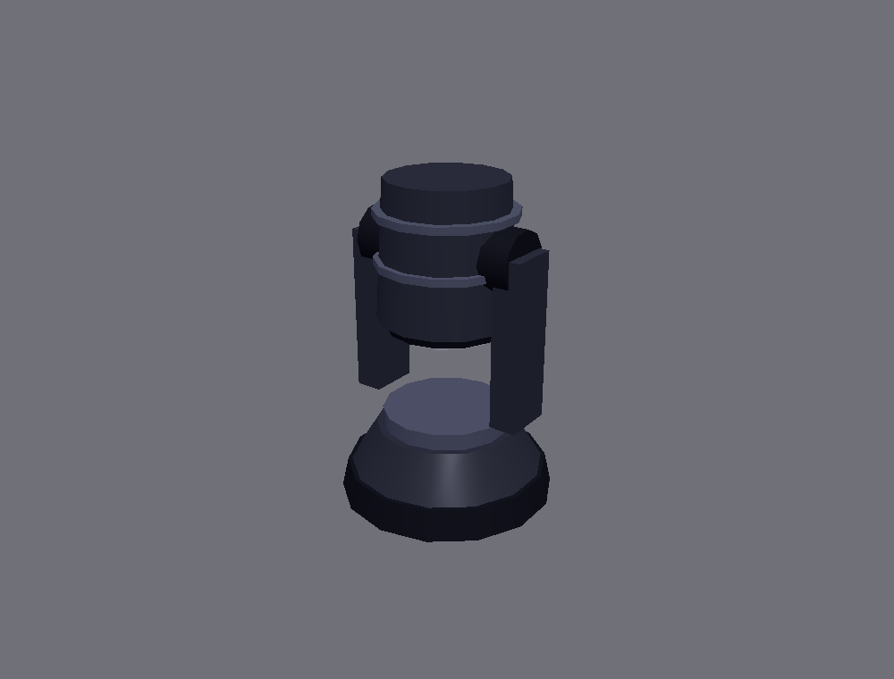<br>
<b>Moving Head</b> · <code>moving_head</code><br>
Intimidator-260-Klasse · Höhe ≈ 0,48 m<br>
Basis + Yoke + Pan/Tilt-Kopf mit Linse
</td>
<td align="center" width="50%">
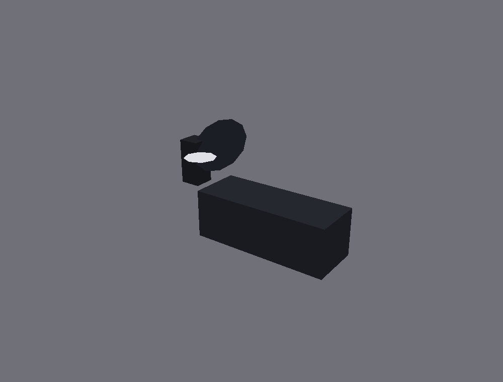<br>
<b>Scanner</b> · <code>scanner</code><br>
Dynamo-Klasse · ≈ 0,40 m · Spiegel am Gehäuse-Ende<br>
Spiegel folgt Pan/Tilt
</td>
</tr>
<tr>
<td align="center">
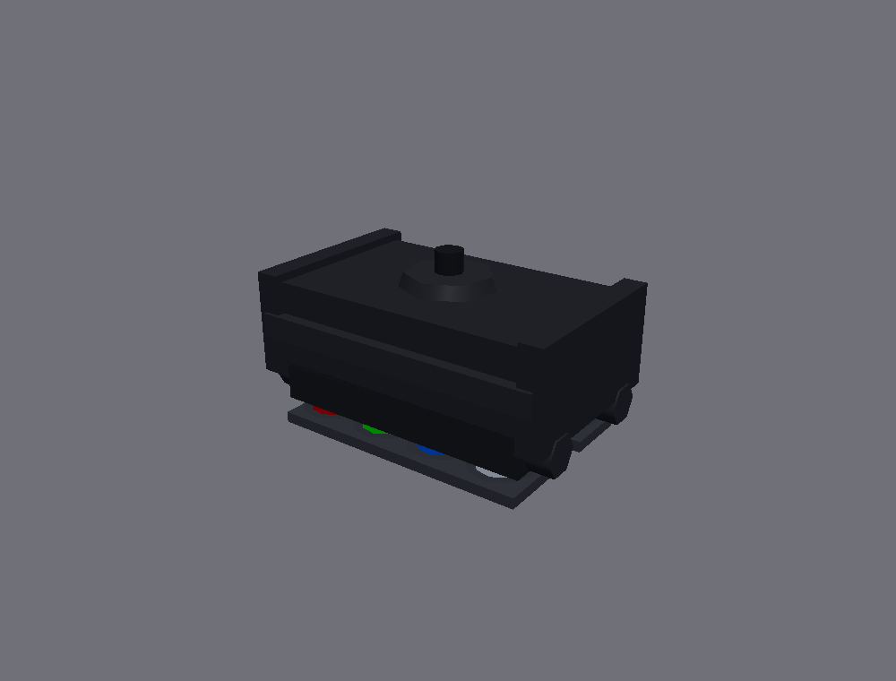<br>
<b>Spider / Derby</b> · <code>spider</code><br>
8×10 W-Klasse · 0,40 × 0,25 × 0,20 m<br>
Mehrkopf-RGB-Linsen
</td>
<td align="center">
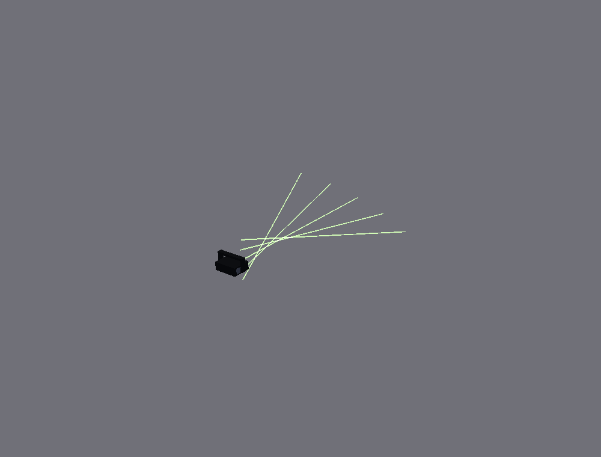<br>
<b>Laser</b> · <code>laser</code><br>
Ehaho L2600 · 0,201 × 0,066 × 0,160 m (flach)<br>
Projektor-Body + Fächerstrahlen
</td>
</tr>
</table>

## 💡 PARs & Bars

<table>
<tr>
<td align="center" width="50%">
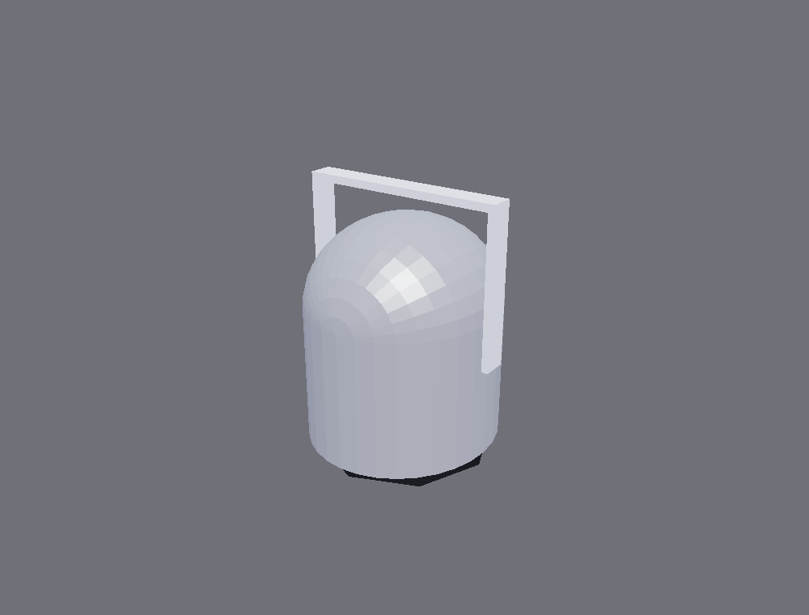<br>
<b>PAR-Kanne</b> · <code>par</code><br>
PAR-64 · Ø 0,23 m · Doppelbügel<br>
(Live-`.dae`-Overlay im Programm)
</td>
<td align="center" width="50%">
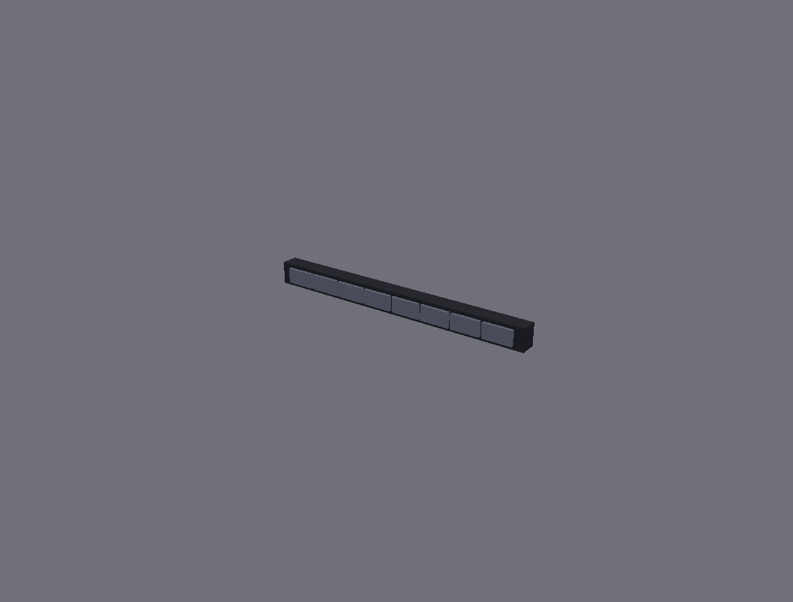<br>
<b>LED-/Pixel-Bar</b> · <code>led_bar</code><br>
Stairville-1m-Klasse · 1,07 × 0,088 × 0,065 m<br>
Pixel-Reihe
</td>
</tr>
<tr>
<td align="center">
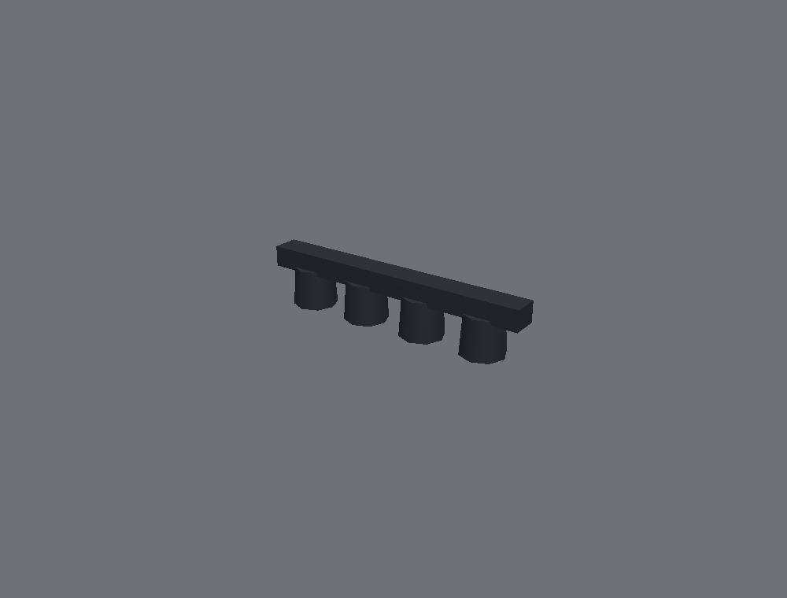<br>
<b>PAR-Bar (4 Köpfe)</b> · <code>par_bar</code><br>
ADJ Dotz-TPar-Klasse · ≈ 1,05 m<br>
Balken mit 4 PAR-Kannen
</td>
<td align="center">
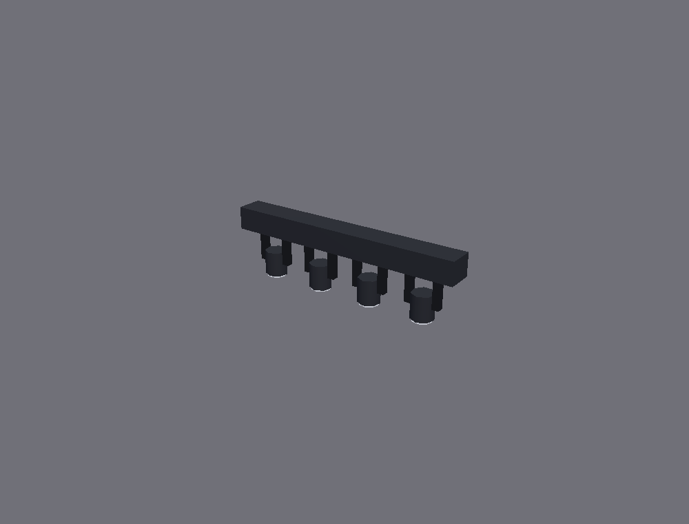<br>
<b>Mover-Bar</b> · <code>mover_bar</code><br>
AXIS-Klasse · ≈ 1,05 m · Köpfe Ø 0,10 m<br>
Balken mit beweglichen Köpfen
</td>
</tr>
</table>

## ⚡ Effekt & Steuerung

<table>
<tr>
<td align="center" width="50%">
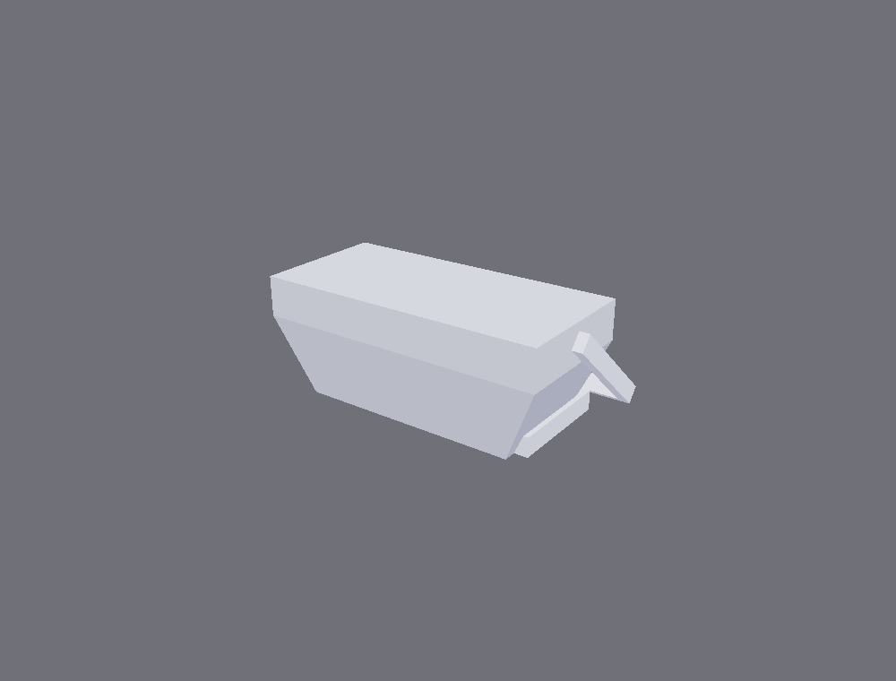<br>
<b>Strobe</b> · <code>strobe</code><br>
Superstrobe-Klasse · 0,46 × 0,14 × 0,24 m<br>
(Live-`.dae`-Overlay im Programm)
</td>
<td align="center" width="50%">
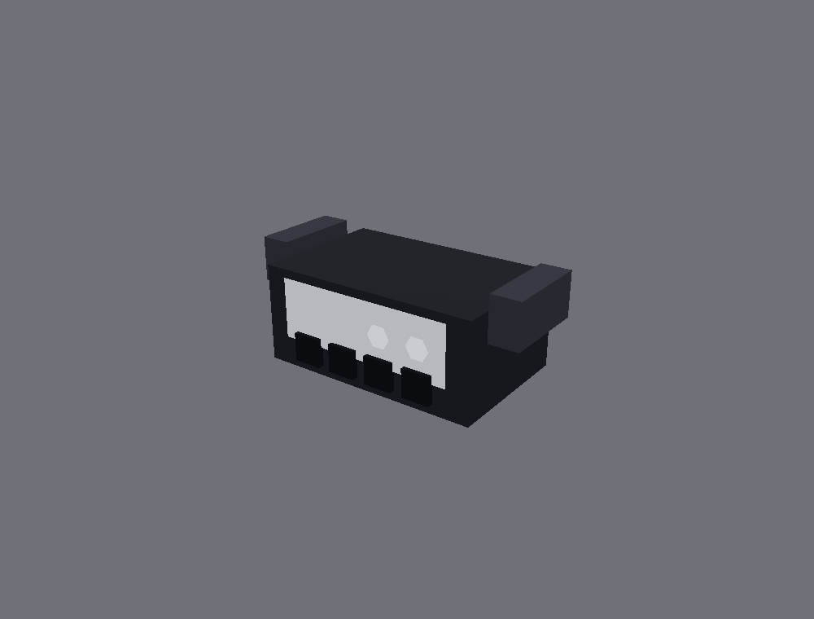<br>
<b>Dimmer-Pack</b> · <code>dimmer</code><br>
4-Kanal-Truss-Pack · 0,30 × 0,13 × 0,19 m<br>
Ausgangs-Dosen
</td>
</tr>
<tr>
<td align="center">
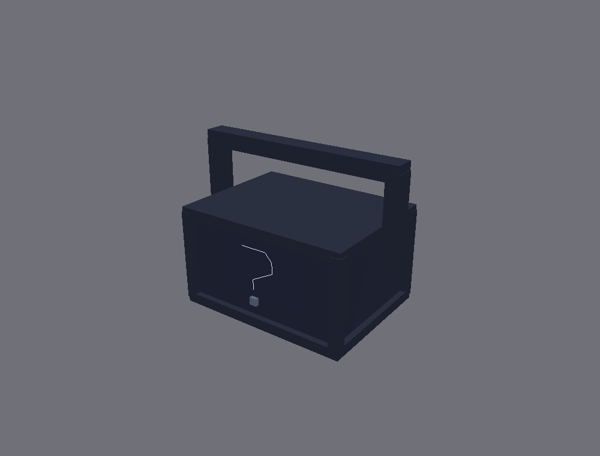<br>
<b>Generisch / Sonstige</b> · <code>other</code><br>
Eigenes Modell (FLA-4)<br>
Fallback für unklassifizierte Geräte
</td>
<td align="center">
<!-- Symmetrie-Platzhalter -->
</td>
</tr>
</table>

## 🌫️ Atmosphäre

<table>
<tr>
<td align="center" width="50%">
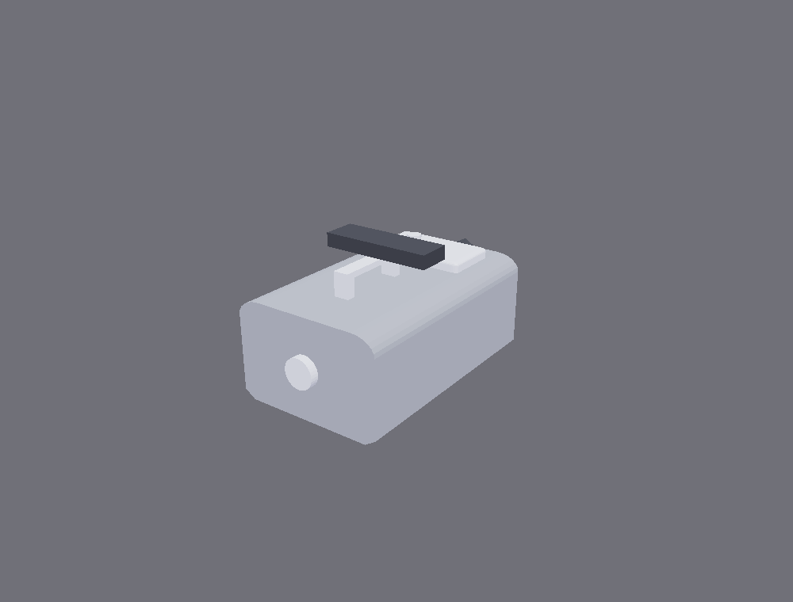<br>
<b>Nebelmaschine</b> · <code>smoke</code><br>
N-10-Klasse · Düse + Bügel<br>
(Live-`.dae`-Overlay im Programm)
</td>
<td align="center" width="50%">
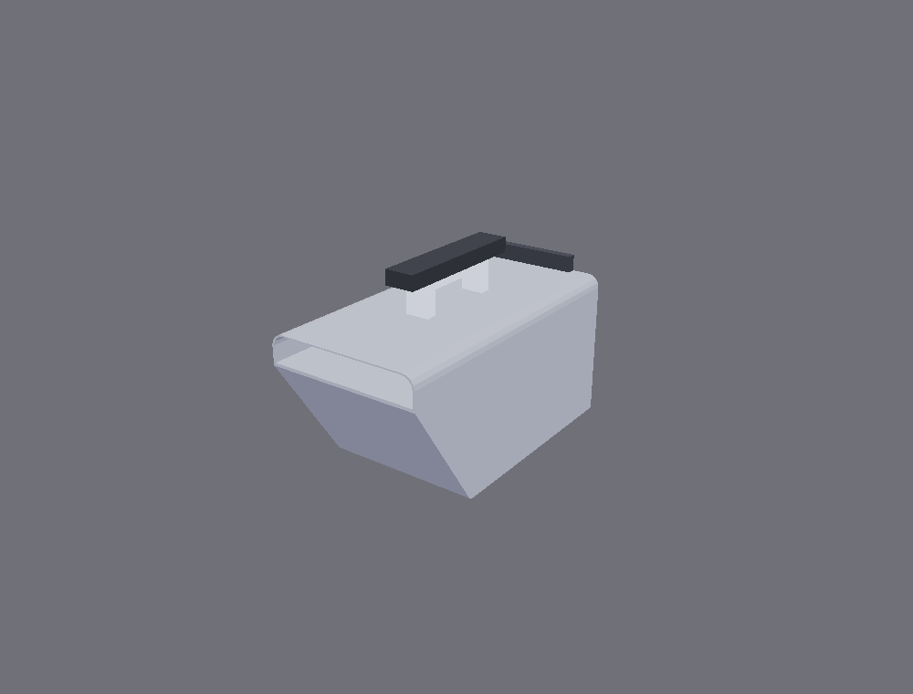<br>
<b>Hazer</b> · <code>hazer</code><br>
HZ-100-Klasse · hochkant + Griff + Ausblasgitter<br>
(Live-`.dae`-Overlay im Programm)
</td>
</tr>
</table>

---

## 🔗 Automatische Zuordnung — welches Modell ein Fixture bekommt

Jedes Fixture bekommt sein 3D-Modell automatisch, ganz ohne manuelle Auswahl:

1. **Profil-Override (falls gesetzt).** `FixtureProfile.viz_model` kann ein Modell fest
   vorgeben (Generator-Feld „3D-Modell", **FM-12**). `viz_model_for(f)` liefert diesen
   Override **vor** der Heuristik — eine Wahl schaltet damit 3D-Modell, 2D-Live-View-Symbol,
   Listen-Icon und Patch-Spiegel-Option gemeinsam um.
2. **Kanal-Heuristik (Automatik).** Ohne Override leitet `suggest_viz_model()` das Modell aus
   den DMX-Kanälen/dem Gerätetyp ab (Pan+Tilt → Moving Head/Scanner, mehrere Farbköpfe →
   Spider, Balken-Layout → PAR-/Mover-Bar, Nebel-/Hazer-Kennung → Atmosphäre, …). Unbekannt →
   PAR-Fallback.
3. **In Gruppen bleibt das Modell erhalten.** Fixtures werden in Gruppen (z. B. „alle Moving
   Heads links") organisiert; die Modell-Zuordnung hängt am Fixture selbst, nicht an der
   Gruppe — jedes Gerät behält also in jeder Gruppe sein korrektes 3D-Modell.

Deklarative Typ→Builder-Map: [`scene_src/fixtures/registry.js`](../src/ui/visualizer/scene_src/fixtures/registry.js).
Fixture-Bibliothek & Geräteklassen: [`FIXTURE_LIBRARY.md`](FIXTURE_LIBRARY.md).

---

## 🛠️ Bilder neu erzeugen

```bash
# 1) Render-Server starten (liefert den Visualizer aus + speichert die PNGs)
python tools/gallery_server.py 8778
# 2) Im Browser-Preview / einem echten Browser (WebGL/GPU nötig) öffnen:
#    http://127.0.0.1:8778/gallery_render.html
#    -> rendert alle 13 Modelle und schreibt docs/img/fixture_gallery/<typ>.png
```

Reine Doku/Werkzeuge, kein Produktiv-Pfad. Offscreen (headless) rendert three.js WebGL nicht —
daher der Browser-/GPU-Weg.
