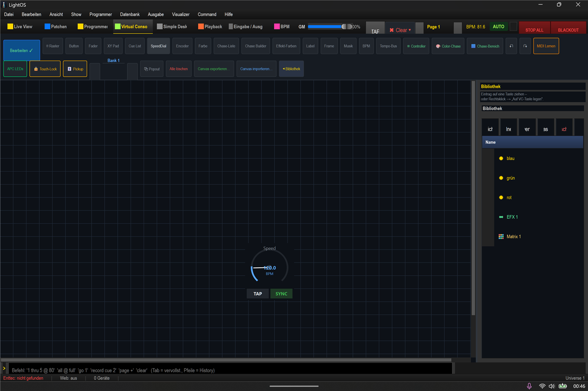
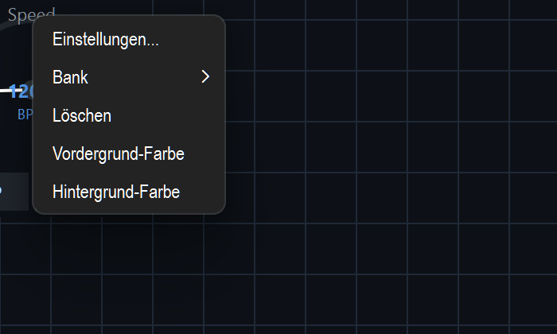
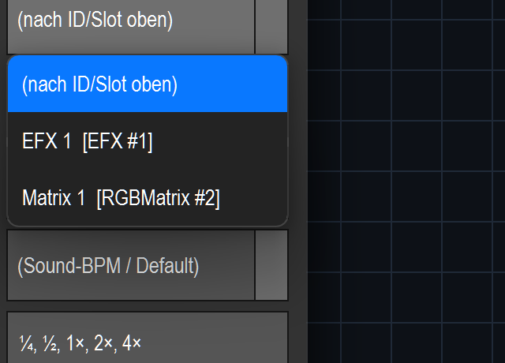
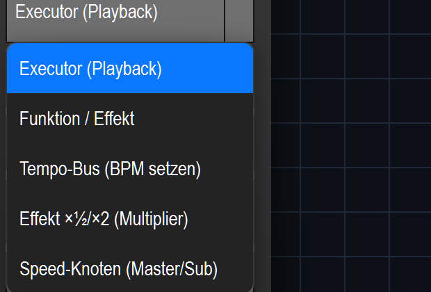
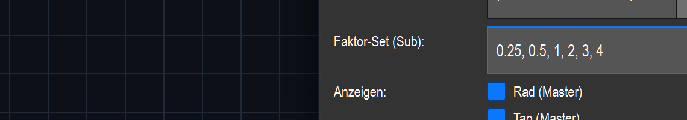
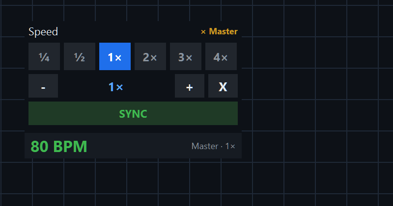
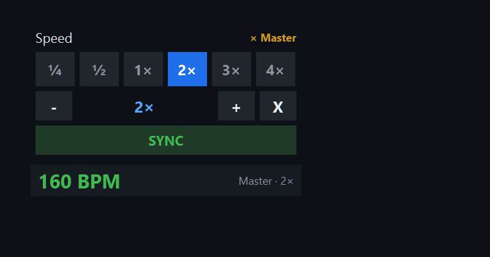

# Multiplikator-Fenster in der Virtuellen Konsole bauen

Ein **Multiplikator-Dial** koppelt einen Effekt an die **Master-BPM** und lässt dich
seine Geschwindigkeit per Faktor-Gitter **¼ ½ 1× 2× 3× 4×** umschalten (plus −/+ Feintune
und **X** = zurück auf 1×). Die Anzeige zeigt live **Master-BPM × Faktor**.

> Live gebaut + gefilmt am 2026-06-18. Screenshots: `docs/_walkthrough/multiplier/`.

## Schritt für Schritt

1. **Virtual-Console-Tab** öffnen und oben **„Bearbeiten"** einschalten.
   Es erscheint die Bausteinleiste mit u. a. **SpeedDial** (und rechts die neuen Undo/Redo-Pfeile ↶ ↷).
   

2. Auf **„SpeedDial"** klicken → ein Dial erscheint auf der Fläche (zunächst als Rad mit BPM + TAP/SYNC).
   

3. **Rechtsklick** auf den Dial → **„Einstellungen…"** (zuverlässiger als Doppelklick).
   

4. **Ziel-Effekt zuerst wählen:** im Dropdown **„Funktion/Chase (Name)"** den Effekt aussuchen
   (hier *Matrix 1*). Das füllt automatisch die Function-ID.
   

5. **„Ziel:"** auf **„Effekt ×½/×2 (Multiplier)"** stellen — *das* macht aus dem Rad das Faktor-Gitter.
   

6. Das Häkchen **„Multiplikator-Modus (0.5/1/2/4×)"** setzen — erst dann erscheint die Zeile
   **„Faktor-Set (Sub):"** (sie ist sonst nur beim Ziel „Speed-Knoten (Master/Sub)" sichtbar).
   Dort `0.25, 0.5, 1, 2, 3, 4` eintragen (der Default `¼ ½ 1 2 4` hat **kein** 3× —
   einfach die 3 ergänzen; `¼`/`½`/`2×` oder `0.25`/`0.5`/`2` werden beide verstanden).
   

7. **OK**. Falls das Widget zu schmal ist und `4×` abgeschnitten wird: im Bearbeiten-Modus den
   Griff unten rechts nach rechts ziehen.
   

8. **„Bearbeiten" ausschalten.** Jetzt setzt ein Klick auf **¼ ½ 1× 2× 3× 4×** den Multiplikator;
   die Anzeige springt auf **Master-BPM × Faktor**. Beispiel: Master 80 → **2×** = **160 BPM**.
   

## Wichtig (zwei häufige Stolpersteine)

- **App neu starten nach Code-Updates.** Der laufende Prozess lädt geänderten Python-Code nicht
  nach — solange die alte Instanz läuft, erscheint statt des Faktor-Gitters noch das alte Rad.
- **Effekt muss an der Master-BPM hängen.** Der Effekt sollte `tempo_bus_id = „Global"` haben,
  damit der Faktor eine taktgeführte Geschwindigkeit skaliert. Sonst dreht der Dial zwar, aber
  der Effekt folgt nicht der Musik.

## Reihenfolge-Hinweis (behoben)

Früher kippte das Wählen des Ziel-Effekts (Schritt 4) das „Ziel" zurück auf „Funktion/Effekt".
Das ist gefixt: ein gewählter **Multiplier**-Modus bleibt jetzt erhalten, egal in welcher
Reihenfolge du Effekt und Modus einstellst.

## Live-Anzeige

Die BPM-Anzeige des Dials (**Master · 2×**) folgt der Master-/Audio-BPM jetzt in **Echtzeit**
(~10×/Sekunde) — kein Antippen mehr nötig, damit sich der Wert aktualisiert.
