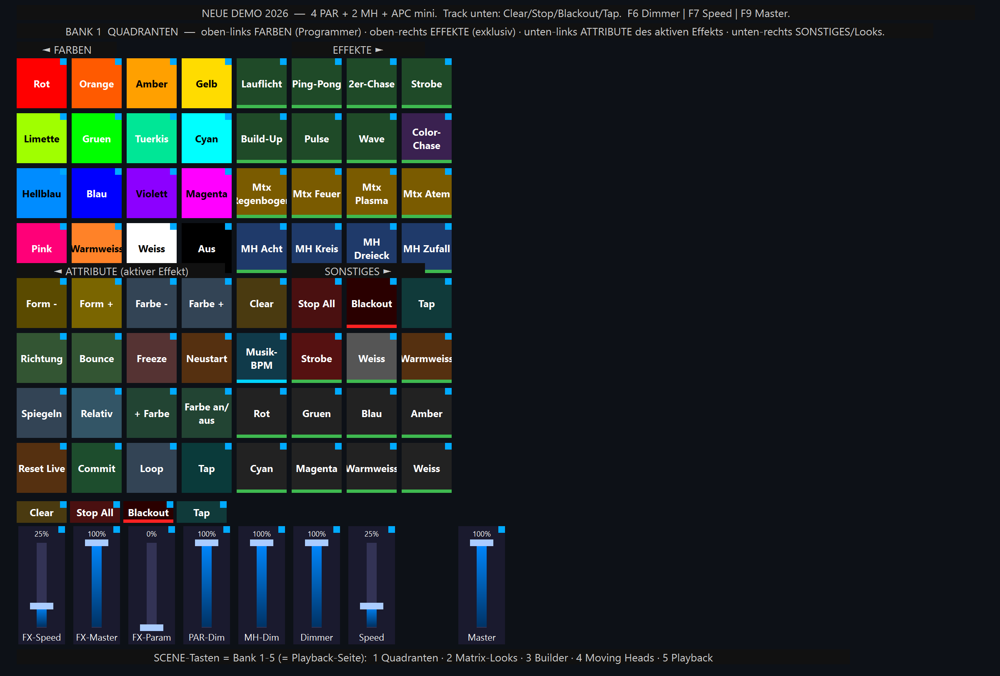
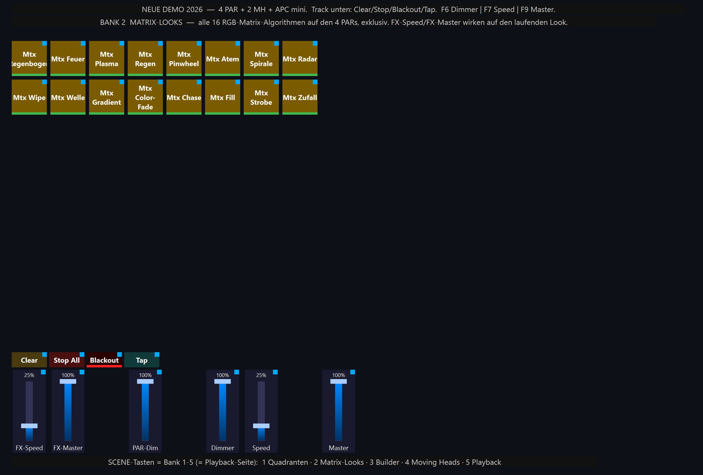
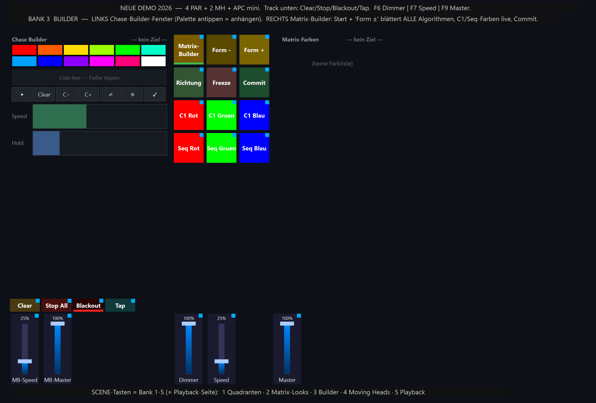
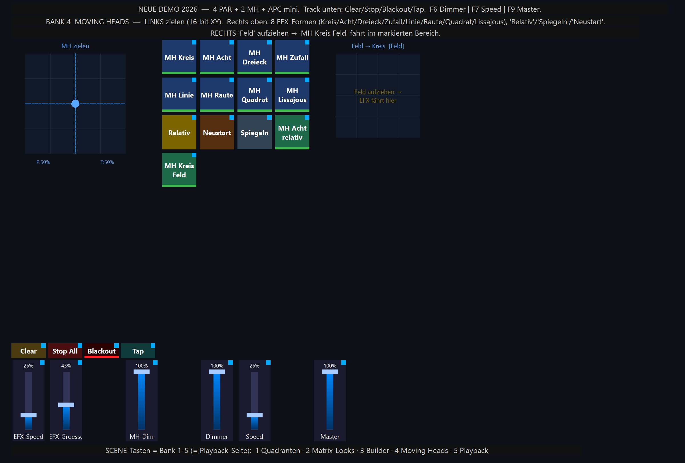
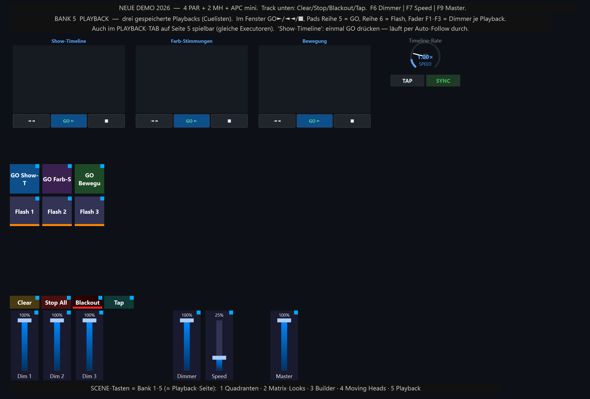

# Neue Demo 2026 — Quadranten + Playback

`shows/Neue_Demo_2026.lshow` · Generator `tools/build_neue_demo_show.py`

Eine Show, die **alle neuen Features** auf 5 Banks der virtuellen Konsole
zusammenfasst — mit echtem **Playback** (Cuelisten zum Speichern und Abspielen,
sowohl im Playback-Tab als auch über die virtuelle Konsole / APC mini).

## Setup & Patch

| Gerät | Profil | Modus | Universe | Adresse |
|-------|--------|-------|----------|---------|
| PAR 1 | ZQ01424 | 8-Kanal RGBW | 1 | 1 |
| PAR 2 | ZQ01424 | 8-Kanal RGBW | 1 | 9 |
| PAR 3 | ZQ01424 | 8-Kanal RGBW | 1 | 17 |
| PAR 4 | ZQ01424 | 8-Kanal RGBW | 1 | 25 |
| MH Links | ZQ02001 | 11-Kanal | 1 | 33 |
| MH Rechts | ZQ02001 | 11-Kanal | 1 | 44 |

Gruppen: **PAR-Reihe** (4 PARs), **Moving Heads** (2 MHs), **Alle** (6).
Steuerung: **Akai APC mini (mk2)** — die 8 SCENE-Tasten schalten Bank 1–5
(= zugleich die Playback-Seite!), die 9 Fader sind CC 48–56.

## Die 5 Banks (APC SCENE 1–5)

> Die Bilder unter jeder Bank sind echte Vorschau-Renderings der virtuellen
> Konsole (erzeugt mit `tools/render_neue_demo_pages.py` → `docs/images/`).

### Bank 1 — QUADRANTEN  („das Vier-Quadranten-Ding")



Die 8×8-Matrix ist in vier 4×4-Quadranten geteilt:

```
┌ FARBEN 4×4 (Programmer) ┬ EFFEKTE 4×4 (exklusiv, nur einer läuft) ┐
└ ATTRIBUTE 4×4 (aktiver  ┴ SONSTIGES 4×4 (Clear/Stop/Blackout/Tap/ ┘
  Effekt: Form/Farbe/…)      Musik-BPM + Schnell-Looks)
```
- **Laien:** oben-links Farbe tippen + oben-rechts Effekt tippen → läuft.
- **Profis:** unten-links die Attribute des *zuletzt gestarteten* Effekts live
  formen (Form ±, Farbe ±, Richtung, Bounce, Freeze, Spiegeln, Relativ, +Farbe,
  Loop, Commit …). Die Fader **FX-Speed / FX-Master / FX-Param** unten wirken
  automatisch auf den aktiven Effekt; **PAR-Dim / MH-Dim** sind Gruppen-Dimmer.

### Bank 2 — MATRIX-LOOKS



Alle **16 RGB-Matrix-Algorithmen** als Einzel-Pads auf den 4 PARs (exklusiv):
Regenbogen, Feuer, Plasma, Regen, Pinwheel, Atem, Spirale, Radar, Wipe, Welle,
Gradient, Color-Fade, Chase, Fill, Strobe, Zufall. FX-Speed/FX-Master/PAR-Dim.

### Bank 3 — BUILDER (Live-Programming)



- **Links:** Chase-Builder-Fenster — Farb-Palette antippen = an die Chase-Liste
  anhängen, mit Start/Clear/C−/C+/Richtung/Freeze/Commit + Speed/Hold.
- **Rechts:** Matrix-Builder — Start + **Form ±** blättert durch *alle*
  Algorithmen, C1-Farben (Rot/Grün/Blau) und Sequenz-Farben live setzen, Commit
  übernimmt. Rechts die Farb-Sequenz-Liste (VCColorList).

### Bank 4 — MOVING HEADS



- **Links:** 16-bit-XY-Pad zum Zielen der beiden Köpfe.
- **Mitte:** alle **8 EFX-Formen** (Kreis, Acht, Dreieck, Zufall, Linie, Raute,
  Quadrat, Lissajous) + **Relativ / Spiegeln / Neustart** + relative Acht.
- **Rechts:** „Feld → Kreis" — Rechteck aufziehen, `MH Kreis Feld` fährt darin.
- Fader: EFX-Speed, EFX-Größe, MH-Dim.

### Bank 5 — PLAYBACK  ⭐ (das gespeicherte/abspielbare Playback)



Drei fertige **Playbacks** (Cuelisten), gebunden an die Executoren 1–3 der
Playback-Seite 5:

| Slot | Playback | Modus | Inhalt |
|------|----------|-------|--------|
| 1 | **Show-Timeline** | single + Auto-Follow | 5 Cues (Intro → Aufbau → Farbe → Höhepunkt → Ausklang) — **einmal GO drücken, läuft von selbst durch** |
| 2 | **Farb-Stimmungen** | loop | 5 Farb-Cues, mit GO durchschalten (wickelt 5→1) |
| 3 | **Bewegung** | bounce + Auto-Follow | MH-Sweep, fährt hin und zurück |

Pro Playback ein **Cue-Listen-Fenster** mit `◄◄ / GO► / ■`. Zusätzlich auf den
Pads: Reihe 5 = **GO**, Reihe 6 = **Flash**, Fader F1–F3 = **Dimmer je
Playback**, plus ein **Speed-Dial** (Rate der Timeline).

## Playback-Workflow — speichern & abspielen

**Abspielen (virtuelle Konsole):** Auf Bank 5 wechseln → `GO►` im Fenster oder
das GO-Pad antippen. „Show-Timeline" einmal GO = komplette Timeline läuft per
Auto-Follow.

**Abspielen (Playback-Tab):** Tab *Playback* öffnen → oben **Seite 5** wählen
(die VC-Bank und die Playback-Seite sind gekoppelt) → die drei Executoren mit
den Cuelisten erscheinen; GO/BACK/STOP, Dimmer- und Crossfade-Fader.

**Eigene Cues speichern:** Im Playback-Tab eine Cueliste wähl(oder „Neu"),
gewünschten Look im Programmer bauen (Farben/Effekte), dann **„Cue aufnehmen"**
— der aktuelle Programmer-Inhalt wird als neue Cue gespeichert. Fade-In/-Out,
Delay, Follow und der Ablauf-Modus (single/loop/bounce/pingpong) sind pro
Cueliste editierbar. **Manueller Crossfade:** der Crossfade-Fader im Tab scrubbt
den Übergang zur nächsten Cue von Hand.

> **Wichtig:** VC-Bank N und Playback-Seite N sind gekoppelt (`pe.set_page`).
> Die Playbacks dieser Show liegen daher auf **Seite/Bank 5**. Die Cuelisten
> selbst sind show-weit und im Playback-Tab auf jeder Seite editierbar — nur die
> Executor-/Transport-Bindung ist seitenspezifisch.

## Universell (alle Banks)
Track-Tasten **Clear / Stop All / Blackout / Tap**; Fader **Dimmer (F6, CC53),
Speed (F7, CC54), Master (F9, CC56)**.

## Neu erzeugen / Vorschau
```
venv/Scripts/python.exe tools/build_neue_demo_show.py      # Show bauen + verifizieren
venv/Scripts/python.exe tools/render_neue_demo_pages.py    # 5 Bank-PNGs → docs/images/
```
Der Generator verifiziert sich selbst (Patch, 5 Banks, 3 Playbacks + Cue-Anzahl/
Modus, Executor-Bindung nach Load, alle Fenster-Widgets, **keine Widget-
Überlappung**, Max-Y < 820) per Save→Load-Round-Trip.
