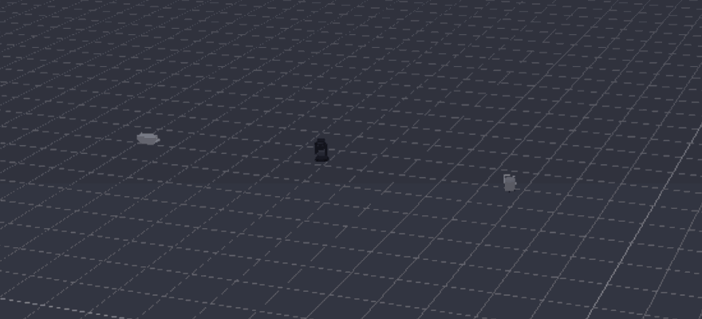
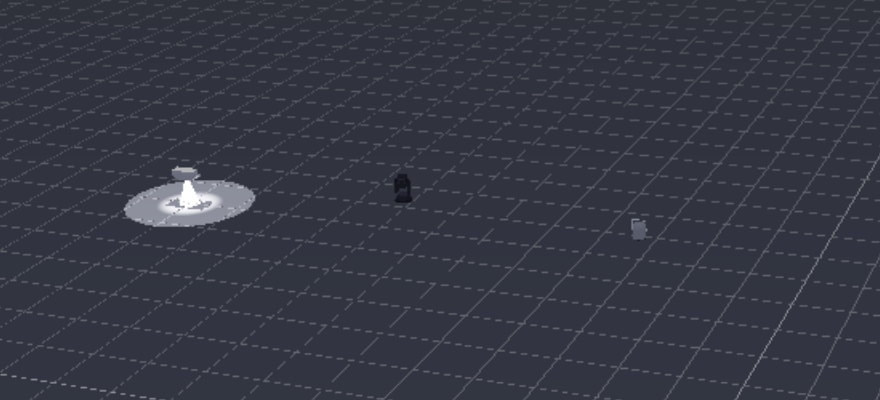
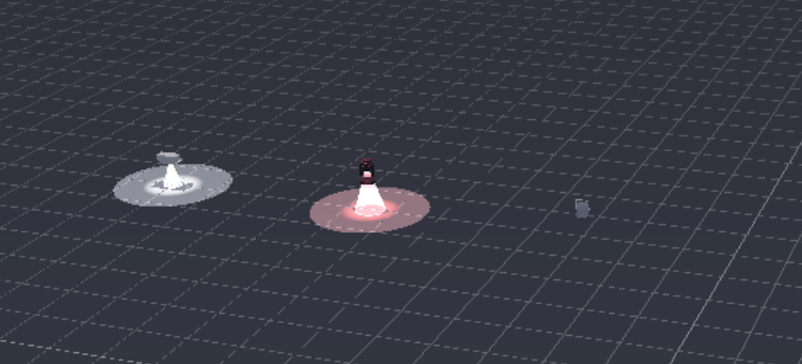
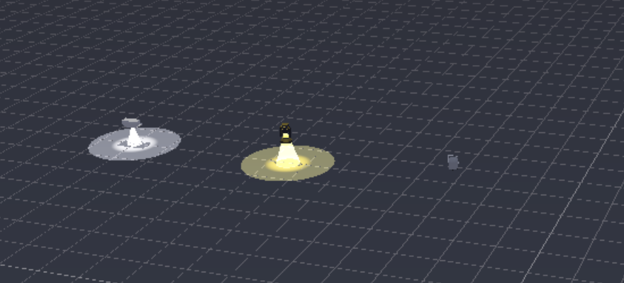

# Woher der 3D-Visualizer seine Farbe nimmt

Nicht jedes Gerät hat Rot/Grün/Blau. Ein Xenon-Blinder hat **gar keinen** Farbkanal,
ein klassischer Moving Head hat statt RGB ein **Farbrad**, und ein reiner Dimmer-PAR
kennt nur Helligkeit. Diese Anleitung zeigt, was der 3D-Visualizer bei solchen
Geräten anzeigt — und woran du erkennst, dass er die Farbe richtig ableitet.

> **Was sich am 28.07.2026 geändert hat:** Vorher las der Visualizer die Farbe
> ausschliesslich aus den Kanälen `Rot/Grün/Blau` und nahm 0 an, wenn es sie nicht
> gibt. Geräte ohne RGB wurden dadurch **schwarz** gerendert — im 3D also gar nicht
> sichtbar. Auf dem Rig blitzte der Blinder, im Visualizer passierte nichts.

## Die Reihenfolge, in der die Farbe bestimmt wird

Der Visualizer geht der Reihe nach durch und nimmt den ersten Treffer:

| # | Wenn das Gerät … | … dann zeigt der Visualizer |
|---|---|---|
| 1 | **RGB(W)**-Kanäle hat | genau diese Farbe. Weiss, Amber und UV kommen additiv dazu. |
| 2 | **CMY**-Kanäle hat | die subtraktive Mischung (voll Cyan filtert Rot heraus). |
| 3 | ein **Farbrad** hat | die Farbe des Slots, auf dem das Rad gerade steht — abgeleitet aus dessen **Namen** im Geräteprofil („Rot", „Light Blue", „Amber"). |
| 4 | **nichts davon** hat | **Weiss** — die Lampenfarbe. |

Zwei Dinge, die dabei absichtlich so sind:

- **RGB auf 0 bleibt schwarz.** Ein Gerät *mit* Farbkanälen, deren Werte du bewusst
  auf 0 stellst, ist aus — es bekommt keine Ersatzfarbe. Nur das *Fehlen* der
  Kanäle löst Weiss aus.
- **Ein unbekannter Farbrad-Slot wird Weiss, nicht Schwarz.** Steht das Rad auf
  einem Slot, dessen Name keine erkennbare Farbe nennt („Slot 7"), gilt das Rad
  als offen. Ein Gerät unsichtbar zu machen, nur weil ein Name unbekannt ist,
  wäre die schlechtere Annahme.

## Die Helligkeit

Genauso wichtig wie die Farbe: **hat das Gerät überhaupt einen Dimmer?**

| Wenn das Gerät … | … dann gilt als Helligkeit |
|---|---|
| einen Dimmer hat (`Dimmer`, `Intensität`, `Master`) | dessen Wert |
| **keinen** Dimmer hat, aber einen Shutter | der Shutter — „zu" heisst dunkel, alles andere hell |
| weder noch | dauerhaft hell (das Gerät hat keine Helligkeitssteuerung) |

Der Shutter wird über die im Profil hinterlegte Kanal-Bedeutung ausgewertet, nicht
über den rohen Zahlenwert. Das ist wichtig, weil „Shutter 0" **geräteabhängig** ist:
beim Martin Atomic 3000 heisst es *Blackout*, bei vielen LED-PARs dagegen *offen*.
Fehlen diese Angaben im Profil, wird **nicht geraten** — das Gerät bleibt sichtbar.

## Zum Nachstellen: die Probe-Show

```
venv/Scripts/python.exe tools/build_farbprobe_3d.py
```

Das erzeugt `shows/Farbprobe_3D.lshow` mit drei Geräten nebeneinander:

| Gerät | Besonderheit |
|---|---|
| **Martin Atomic 3000** (3 Kanäle) | Xenon-Blinder — Dimmer, **keine** Farbkanäle |
| **iMove 5W** (7 Kanäle) | Moving Head mit **Farbrad** statt RGB (12 benannte Slots) |
| **ZQ01424 RGBW-PAR** (8 Kanäle) | Kontrollgerät **mit** Farbkanälen |

Show öffnen, dann **Visualizer → 3D Visualizer öffnen**.

## Was du siehst



Der Ablauf im Bild, Schritt für Schritt:

1. **Alles aus** — drei Gehäuse, kein Licht.
2. **Blinder an** — der Atomic 3000 leuchtet **weiss**, obwohl er keinen einzigen
   Farbkanal besitzt. Genau dieser Fall war vorher unsichtbar.
3. **Mover an, Rad auf Weiss** — der iMove erscheint.
4. **Rad auf Grün / Rot / Blau / Amber** — die Farbe des Strahls folgt dem
   **Namen des Farbrad-Slots**. Kein einziger RGB-Kanal ist im Spiel.
5. **Kontroll-PAR voll aufgedreht** — und es bleibt **dunkel**, weil seine
   Farbkanäle auf 0 stehen. Das ist der Beweis, dass RGB-Geräte unverändert
   arbeiten.

### Einzelbilder

| Blinder ohne Farbkanäle | Farbrad auf Rot | Kontroll-PAR bleibt schwarz |
|---|---|---|
|  |  |  |

## Wenn ein Gerät trotzdem schwarz bleibt

- **Hat es Farbkanäle, die auf 0 stehen?** Dann ist das richtig so — dreh die
  Farbe auf, nicht nur den Dimmer.
- **Steht der Dimmer auf 0?** Bei Geräten ohne Dimmer: steht der Shutter auf „zu"?
- **Fehlt dem Farbrad-Slot ein Farbname im Profil?** Dann erscheint das Gerät weiss,
  nicht schwarz. Bleibt es schwarz, hat es doch RGB-Kanäle auf 0.
- **Ist es überhaupt im Raum platziert?** Nur Geräte mit Position erscheinen im 3D.

## Verwandt

- [3D-Bühne bauen & Fixtures hängen](../anleitung_3d_visualizer_2026/ANLEITUNG_3D_BUEHNE.md)
- [Moving Heads steuern](../anleitung_moving_heads/ANLEITUNG_MOVING_HEADS.md) — Farbrad und Gobo im Betrieb
