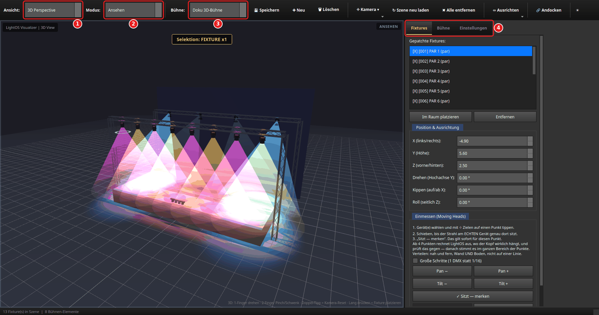
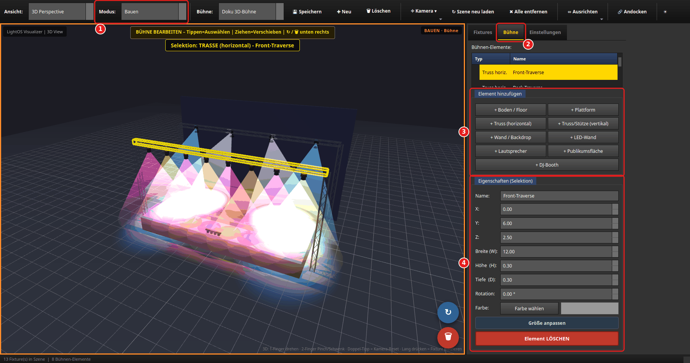
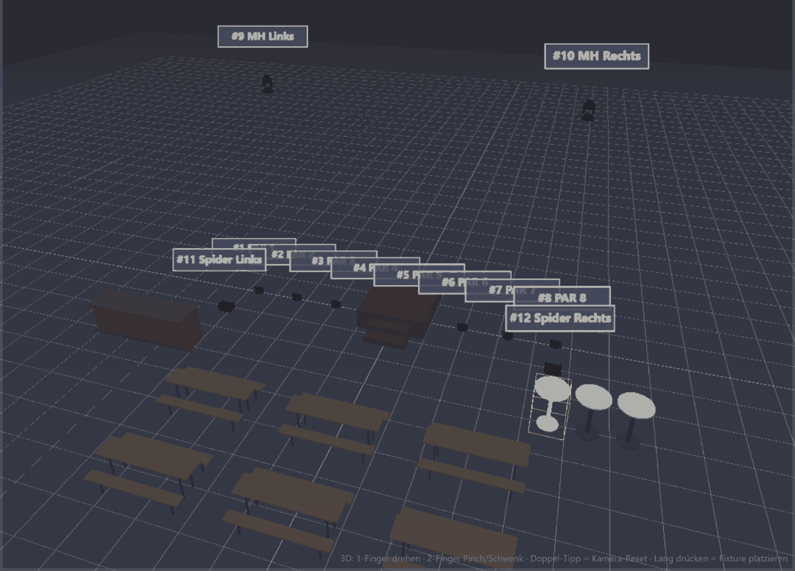
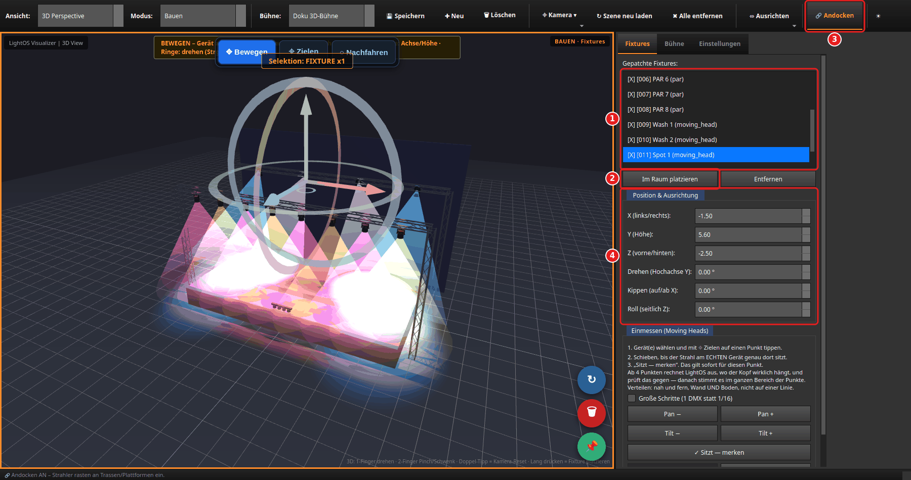
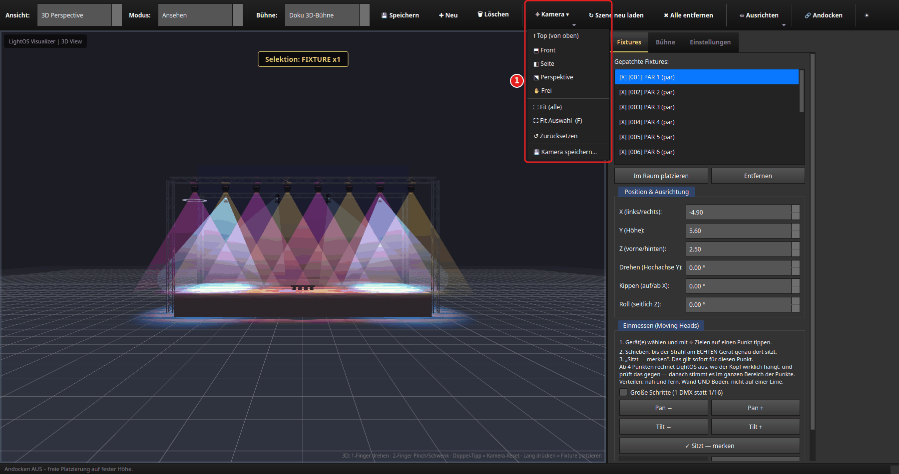
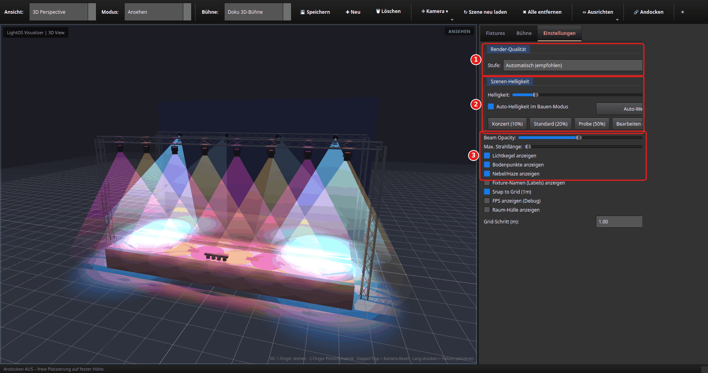
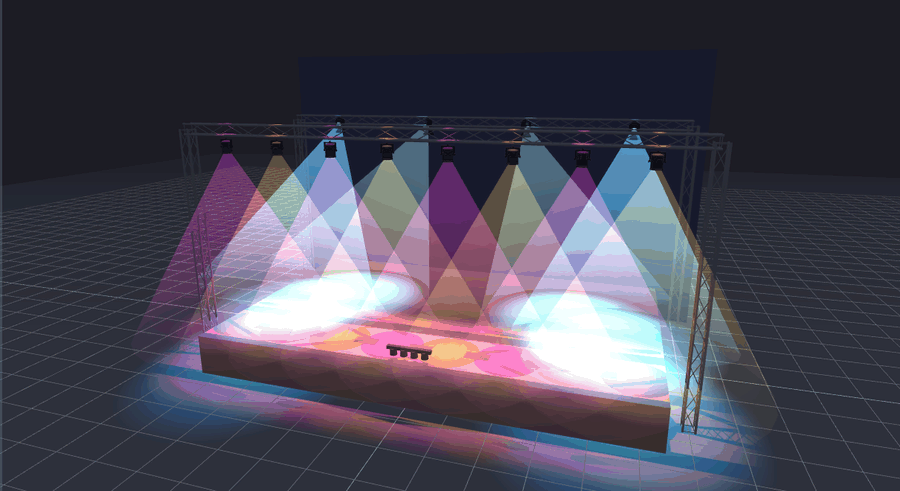
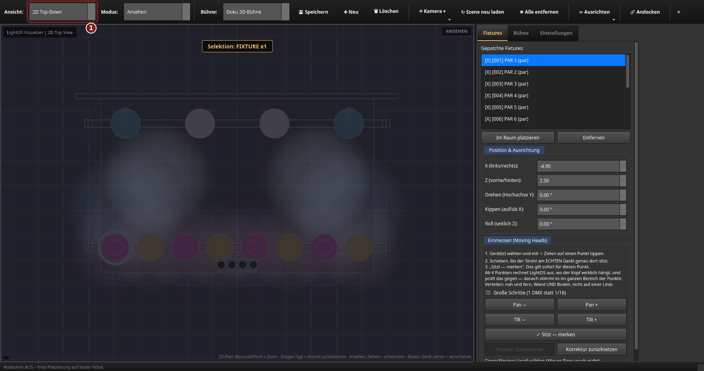

# 3D-Visualizer: Bühne bauen & Fixtures hängen

Diese Anleitung zeigt **Schritt für Schritt**, wie im LightOS-3D-Visualizer eine Bühne
gebaut wird (Traversen, Stützen, Plattform, Rückwand), wie Geräte daran gehängt werden,
wie du die Kamera führst und wie du die Darstellung der Lichtstrahlen einstellst.

Die Bilder zeigen die Doku-Demo des Bild-Werkzeugs: acht PARs an einer Front-Traverse,
zwei Wash- und zwei Spot-Moving-Heads an einer Back-Traverse, eine LED-Leiste vorn auf
der Bühnenkante. Die Schritte gelten für jede Show mit gepatchten Geräten. Die Bilder
entstehen aus dem Code am echten Bildschirm
(`tools/anleitungsbilder/szenen_3d_buehne.py`, siehe
[Anleitungsbilder](../ANLEITUNGSBILDER.md)).

1. **Ansicht** — „3D Perspective" oder „2D Top-Down" (Taste `V`).
2. **Modus** — „Ansehen" oder „Bauen" (Taste `E`).
3. **Bühne** — welche gespeicherte Bühne geladen ist; daneben **Speichern**, **Neu**,
   **Löschen**.
4. **Reiter** — **Fixtures** (Geräte), **Bühne** (Bühnen-Elemente), **Einstellungen**
   (Darstellung). Im Bild ist PAR 1 gewählt (oben in der Ansicht „Selektion: FIXTURE
   x1“); darunter zeigt **Position & Ausrichtung** seine Werte: Er hängt mit `Y=5.6`
   an der Front-Traverse.

## Vorbereitung

1. Show mit gepatchten Geräten öffnen.
2. Menü **Visualizer → 3D Visualizer öffnen**. Das Fenster öffnet sich neben dem
   Hauptfenster; beim ersten Öffnen dauert es einige Sekunden, bis die 3D-Szene steht.
   Alle gepatchten Geräte stehen im Reiter **Fixtures** in der Liste, z. B.
   `[X] [001] PAR 1 (par)`. Geräte, die in der 2D-Bühne (Sektion **Bühne**) schon
   eine Lage haben, erscheinen sofort im Raum. Die Statuszeile unten zählt mit:
   „13 Fixture(s) in Szene | 8 Bühnen-Elemente".

## Ansehen und Bauen

Der Visualizer hat **zwei Modi**:

- **Ansehen** — nichts ist anfassbar; Ziehen mit der Maus dreht die Kamera. Rechts
  oben in der 3D-Ansicht steht „ANSEHEN".
- **Bauen** — erst jetzt lassen sich Geräte und Bühnen-Elemente anfassen. *Welche*,
  entscheidet der Reiter rechts: **Fixtures** oder **Bühne**. Der orange Rahmen um die
  Ansicht zeigt beides an: „BAUEN · Fixtures" bzw. „BAUEN · Bühne".

Ein Klick auf einen Reiter schaltet den Modus **nicht** um. Wer im Ansehen-Modus nur
die Liste ansehen will, macht damit nichts versehentlich anfassbar. Im Bauen-Modus
hellt **Auto-Helligkeit** die Szene auf (siehe [Teil D](#teil-d--darstellung-reiter-einstellungen)).

## Teil A — Bühne bauen (Reiter „Bühne")

1. **Modus → Bauen** stellen.
2. Reiter **Bühne** wählen (Taste `S`). Oben in der Ansicht erscheint das gelbe Banner
   „BÜHNE BEARBEITEN – Tippen=Auswählen | Ziehen=Verschieben | ↻ / 🗑 unten rechts";
   die runden Knöpfe unten rechts drehen bzw. löschen das gewählte Element.
3. **Element hinzufügen:** Boden / Floor · Plattform · Truss (horizontal) ·
   Truss/Stütze (vertikal) · Wand / Backdrop · LED-Wand · Lautsprecher ·
   Publikumsfläche · DJ-Booth, dazu die **Objekt-Bibliothek** (Biertischgarnitur · Stehtisch ·
   Bar / Theke · Podest mit Treppe · Mischpult-Tisch, s. unten). Ein neues Element erscheint sofort in der Szene und in
   der Liste „Bühnen-Elemente" darüber und ist gleich gewählt.
4. **Eigenschaften (Selektion):** Name, Position `X`/`Y`/`Z` (Mittelpunkt des
   Elements, in Metern), Größe `Breite (W)`/`Höhe (H)`/`Tiefe (D)`, Rotation und Farbe.
   Das gewählte Element leuchtet in der Szene gelb, oben steht z. B.
   „Selektion: TRASSE (horizontal) - Front-Traverse".

So entsteht die Bühne im Bild:

1. **Plattform (Bühnenboden):** „**+ Plattform**" legt eine Fläche von 6 × 0,4 × 4 m an.
   Im Bild: `Breite=11`, `Höhe=1`, `Tiefe=7`, `Y=0.5` (Mittelpunkt auf halber Höhe —
   die Oberkante liegt damit bei 1 m).
2. **Traverse:** „**+ Truss (horizontal)**" legt eine 4 m lange Traverse auf 8 m Höhe
   an. Im Bild die Front-Traverse: `X=0`, `Y=6`, `Z=2.5`, `Breite=12`; die
   Back-Traverse genauso mit `Z=-2.5`. Positiv `Z` ist vorn (zum Publikum).
3. **Werte eingeben:** Feld anklicken → `Strg+A` → Wert tippen. Der Wert gilt **schon
   beim Tippen**, das Element wandert sofort mit; ENTER oder TAB sind nicht nötig.
   Punkt und Komma gehen beide („5.7" und „5,7").
4. **Verschieben per Maus:** Element in der Szene anfassen und ziehen — es bewegt sich
   in der Bodenebene (`X`/`Z` ändern sich, die Felder ziehen mit). Die Höhe (`Y`)
   stellst du über das Feld ein.
5. **Stützen:** „**+ Truss/Stütze (vertikal)**" (4 m hoch). Über `X`/`Z` an die Enden
   der Traversen setzen — im Bild `X=±6`, `Z=±2.5`, `Höhe=6`, `Y=3` — ergibt zwei
   „Goalposts".
6. **Rückwand:** „**+ Wand / Backdrop**" hinter die Back-Traverse (`Z=-3.6`).

> **„Größe anpassen"** schaltet nur die Ziehgriffe am Element in der Szene ein (der Knopf
> wird gelb); die Größen-Felder bleiben dabei frei. **Element LÖSCHEN** entfernt das
> gewählte Element.

### Objekt-Bibliothek: Halle mit Biertischen, Bar, Podest (VIZ-68)

Unter „Element hinzufügen" gibt es je Möbel einen Knopf. Die Objekte haben reale
Standardmaße und lassen sich wie jedes Bühnenelement verschieben, drehen, in der Größe
ändern und einfärben (nur der Korpus — Beine und Gestelle bleiben metallfarben):

| Knopf | Standardmaß (B × H × T) | Hinweis |
|---|---|---|
| **+ Biertischgarnitur** | 2,20 × 0,76 × 1,30 m | Tisch 220 × 50 cm, zwei Bänke |
| **+ Stehtisch** | 0,80 × 1,10 × 0,80 m | runde Platte, Säule, Fußteller |
| **+ Bar / Theke** | 3,00 × 1,10 × 0,80 m | Gästeseite vorn (+Z) mit Fußreling; Strahler lassen sich draufstellen |
| **+ Podest mit Treppe** | 2,00 × 0,60 × 2,80 m | Treppe vorn mittig; Strahler lassen sich draufstellen |
| **+ Mischpult-Tisch** | 1,80 × 0,90 × 0,90 m | Tisch mit Pult-Aufsatz (FOH) |

**Mehrere auf einmal:** In der Zeile **„Anzahl: Reihen × Spalten — Abstand"** z. B.
`2 × 3`, Abstand `1,00 m` einstellen, dann **„+ Biertischgarnitur"** → sechs Garnituren
im Raster, um den Standardplatz zentriert. Die ganze Reihe ist **ein** Undo-Schritt
(`Strg+Z` nimmt alle zurück). Danach springt die Anzahl von selbst auf `1 × 1` zurück.
Das Raster gilt nur für die Möbel oben — Böden, Trassen, Wände usw. entstehen immer einzeln.
Bei mehr als 200 Objekten auf einmal fragt LightOS nach (große Mengen machen die 3D-Ansicht langsamer).
Der Abstand geht bis 10 m; ein Raster, das über ±200 m hinausreichen würde, legt LightOS nicht an, sondern meldet es.
Gespeichert wird mit der Bühne ([Teil F](#teil-f--speichern)) — Typ, Lage, Größe und Farbe bleiben erhalten.

## Teil B — Geräte platzieren und hängen (Reiter „Fixtures")

1. **Gerät wählen** — in der Liste (`[X]` = im Raum, `[ ]` = noch nicht platziert) oder
   in der Szene antippen. Mehrere Geräte wählst du in der Liste mit `Strg`/`Umschalt`
   oder in der Szene mit einem Rahmen.
2. **Im Raum platzieren** setzt das gewählte Gerät in die Szene; **Entfernen** nimmt
   es wieder heraus. Schneller geht es per **Ziehen**: Gerät aus der Liste in die
   3D-Ansicht ziehen. Ein halbtransparenter Geist zeigt, wo es landet; färbt er sich
   **grün**, dockt es beim Loslassen an die Traverse darunter an. Ziehen wirkt nur im
   Bauen-Modus — im Ansehen-Modus zeigt der Mauszeiger, dass hier nichts abgelegt werden
   kann.
3. **Andocken** (Taste `D`): an, rasten Geräte beim Platzieren und Ziehen an Traversen
   ein (sie hängen darunter) bzw. stehen oben auf Plattform, Boden, Lautsprecher,
   Publikumsfläche oder DJ-Booth — und wandern mit, wenn du das Element verschiebst.
   Aus, platzierst du frei auf fester Höhe. Die Statuszeile meldet den Zustand.
4. **Position & Ausrichtung** — die Felder des gewählten Geräts:
   - **Unten an die Traverse:** `Y` = Unterkante der Traverse minus 0,25 m. Im Bild hängt
     Spot 1 an der Back-Traverse (`Y=6`, 0,3 m hoch): `Y=5.6`, `Z=-2.5`, `X` entlang
     der Traverse verteilen. Genau diese Höhe setzt auch das Andocken.
   - **Oben auf die Traverse:** `Y` knapp über die Traverse (z. B. `Y=6.5`).
   - **Seitlich:** an eine Stütze setzen (deren `X`/`Z`, mittlere `Y`) und mit **Drehen
     (Hochachse Y)** zur Seite ausrichten.
   - **Ausrichten:** **Drehen (Hochachse Y)**, **Kippen (auf/ab X)**, **Roll (seitlich
     Z)**. Moving Heads folgen zusätzlich live ihren Pan/Tilt-Werten.

Ist ein Gerät gewählt, zeigt die Szene oben die Werkzeugleiste **Bewegen · Zielen ·
Nachfahren** und am Gerät ein Gizmo: am Boden ziehen verschiebt in `X`/`Z`, die Pfeile
verschieben je Achse bzw. in der Höhe, die Ringe drehen (mit `Strg` frei, ohne Raster).
**Zielen** richtet gewählte Strahler auf einen angetippten Punkt aus — wie du das an den
echten Aufbau angleichst, steht in [Moving Heads einmessen](../anleitung_einmessen/ANLEITUNG_EINMESSEN.md).
Mehrere gewählte Geräte lassen sich über **⬄ Ausrichten** auf eine Linie legen,
gleichmäßig verteilen oder als Reihe, Raster oder Kreis anordnen.

## Teil C — Kamera

Das Menü **⌖ Kamera** hält alles zur Kamera an einer Stelle:

- **Presets:** Top (von oben) · Front · Seite · Perspektive · Frei. Das Bild zeigt die
  Bühne nach **Front**.
- **Fit (alle)** rückt alle Geräte ins Bild, **Fit Auswahl (F)** nur die gewählten
  (`F` wirkt so, wenn die 3D-Ansicht den Fokus hat; sonst springt `F` auf den Reiter
  Fixtures).
- **Zurücksetzen** — Startansicht (auch: Doppel-Tipp in die Ansicht).
- **Kamera speichern…** fragt nach einem Namen. Gespeicherte Kameras gehören zur Show
  und stehen danach unten im Menü (`↦ Name`) zum Abruf.

Mit der Maus: Ziehen dreht, Mausrad zoomt; am Touchscreen drehst du mit einem Finger
und schwenkst/zoomst mit zwei.

## Teil D — Darstellung (Reiter „Einstellungen")

1. **Render-Qualität — Stufe:** „Automatisch (empfohlen)" prüft beim Start die
   Grafikkarte (Name, sonst eine kurze Start-Messung) und wählt passend; „Hoch (Desktop-GPU)", „Niedrig (schwache/mobile
   GPU)" bzw. „Maximal (starke Desktop-GPU)" überschreiben das — Details und Tabelle in
   [Qualitätsstufe](#qualitätsstufe-tab-einstellungen--render-qualität). Niedrig rechnet ohne Kantenglättung, mit weniger Auflösung,
   Schatten und Kegeldetail — flüssiger auf schwachen Chips. Die Wahl gilt für diesen
   Rechner, nicht für die Show; die Szene lädt danach neu.
2. **Szenen-Helligkeit:** Grundlicht der Szene. Niedrig = dunkel, Strahlen gut sichtbar;
   hoch = Bühne gut sichtbar zum Bauen. Schnellwahl Konzert (10 %) · Standard (20 %) ·
   Probe (50 %) · Bearbeiten (75 %) · Vollhell (100 %). **Auto-Helligkeit im
   Bauen-Modus** springt beim Wechsel auf Bauen auf 65 % und zurück auf 20 % im
   Ansehen-Modus. Der ☀-Regler in der Werkzeugleiste ist derselbe Regler.
3. **Strahlen:**
   - **Beam Opacity** — wie deckend die Lichtkegel sind (im Bild 35 %).
   - **Max. Strahllänge** — deckelt die sichtbare Länge der Kegel (0 = aus). Hilft bei
     waagerecht oder nach oben zeigenden Köpfen, deren Strahl nie auf den Boden trifft.
     Ändert nichts an der DMX-Ausgabe.
   - **Laser** zeichnen keinen Kegel, sondern einen Fächer aus fünf dünnen Strahlen,
     die 25 m weit nach vorn über die Bühne ins Publikum reichen. Sie folgen Farbe und
     Helligkeit aus dem DMX, hängen aber bewusst **nicht** an Beam Opacity und Max.
     Strahllänge — ein Laserstrahl fächert nicht auf und läuft bis zur Wand. Ist der
     Laser-NOT-AUS gedrückt oder der Shutter zu, bleiben die Strahlen dunkel.
   - **Laser-Kanäle im Bild:** X/Y-Bewegung (oder Pan/Tilt) schwenkt und neigt den
     Fächer, X/Y-Zoom (oder Zoom) macht ihn breiter oder schmaler, die Muster-Rotation
     dreht ihn um die Strahlachse. Musterbank bzw. Musterauswahl wählen **grob** eine
     von vier Formen: Fächer, Einzelstrahl, Strahlenkranz oder Lichtfläche. Die echten
     Muster des Geräts zeichnet die Ansicht nicht nach. Steht ein Kanal in einem
     Bereich, in dem das Gerät selbst fährt (beim L2600 z. B. „Welle“ oder „Lauf“), oder
     läuft im 6-Kanal-Modus das Programm mit Geschwindigkeit über 0, schwenkt der
     Fächer langsam von selbst.
   - **Optik, Gobo und Prisma** (Moving Heads und feste Scheinwerfer, sofern das
     Profil die Kanäle hat): **Zoom** macht Kegel und Bodenfleck weiter oder enger
     (0 = eng, 255 = weit), die **Iris** schließt ihn bis auf rund ein Drittel.
     **Fokus** ist bei 128 scharf und wird zu beiden Enden weicher, **Frost** macht die
     Kante weich und den Kegel etwas breiter. Ein **Gobo** formt den Strahl: statt des
     vollen Kegels siehst du einzelne Teilstrahlen (bei der Spirale eine Wendel um die
     Strahlachse), und im Bodenfleck erscheint das Muster mit dunklen Lücken
     dazwischen. Der volle runde Lichtkreis am Boden tritt dabei stark zurück. Das
     Motiv kommt aus dem Namen des Gobo-Bereichs (etwa „Spirale“, „Punkte“, „Ring“);
     heißt ein Bereich nur „Gobo 3“, bekommt er ein festes Ersatzmotiv je Nummer, damit
     verschiedene Gobos verschieden aussehen. Das Ersatzmotiv ist eine Annäherung,
     nicht das echte Glas des Geräts. „Offen“ = voller Kegel wie ohne Gobo. Die
     **Gobo-Rotation** dreht Teilstrahlen und Bodenmuster auf einen festen Winkel
     (0–255 = eine Umdrehung). Auf den Stufen **Hoch** und **Maximal** wirft ein
     Gerät, das gerade eines der echten Lichter hält, sein Gobo wirklich in den
     Raum: Das Muster liegt auf allem, was der Strahl trifft (Boden, Podest,
     Traverse, andere Geräte), und hinter einem Hindernis bleibt der Schatten
     dunkel. Gobo-Geräte ohne echtes Licht und alle Geräte auf **Niedrig** zeigen
     das Muster als flachen Fleck auf der Fläche, die die Strahlmitte trifft (siehe
     [Was bei großen Rigs anders aussieht](#was-bei-großen-rigs-anders-aussieht)).
     Ein **Prisma** teilt den Strahl in mehrere Kegel um den
     Hauptstrahl (Facettenzahl aus dem Bereichsnamen, z. B. „6-fach Prisma“; ohne
     Zahl drei); die **Prisma-Rotation** dreht den Fächer ebenfalls auf einen festen
     Winkel. Ein Dauerdrehen, wie es echte Geräte im oberen Bereich dieser Kanäle
     machen, zeigt die Ansicht nicht. Auf der Qualitätsstufe für schwache Grafik
     zeichnet ein Prisma höchstens drei Strahlen. Geräte ohne diese Kanäle behalten
     ihren festen Kegel.
   - **Lichtkegel**, **Bodenpunkte** und **Nebel/Haze** einzeln ein- und ausschalten.
     Einzelne Geräte nimmst du über das Rechtsklick-Menü der Fixture-Liste aus der
     Kegel-Anzeige.

Darunter: **Fixture-Namen (Labels)** an den Geräten, **Snap to Grid** mit
**Grid-Schritt**, **Raum-Hülle** (eine neutrale Wand-/Deckenfläche als
Größen-Orientierung, aus in der 2D-Draufsicht) und **FPS anzeigen** zur Fehlersuche.

Die Szene zeigt live, was die Ausgabe sendet — Farbe, Dimmer, Pan/Tilt, Farbrad:

## Teil E — Draufsicht (2D Top-Down)

**Ansicht → 2D Top-Down** (Taste `V` schaltet hin und zurück) zeigt den Plan von oben:
Traversen und Bühnen-Elemente als Umrisse, Geräte als farbige Kreise, die Lichtflecken am
Boden. Im Plan zoomt das Mausrad, ein Doppel-Tipp setzt die Ansicht zurück; im
Ansehen-Modus schwenkt Ziehen den Plan, im Bauen-Modus verschiebt es Geräte. Das Feld
`Y (Höhe)` ist hier ausgeblendet — von oben gibt es keine Höhe. Ist das Bild zu klein,
hilft **Kamera → Fit (alle)**.

## Teil F — Speichern

- **Bühne** (Elemente aus Teil A) über **💾 Speichern** in der Visualizer-Werkzeugleiste
  unter einem Namen. Sie steht danach in der Auswahl **Bühne:**; beim Schließen mit
  ungespeicherten Änderungen fragt der Visualizer nach. **✚ Neu** beginnt eine leere
  Bühne, **🗑 Löschen** entfernt die gewählte.
- **Show** (Geräte, Positionen, gespeicherte Kameras, Gruppen, Effekte, VC) im
  Hauptfenster über **Datei → Speichern** bzw. **Speichern unter…**.

Rückgängig/Wiederholen (`Strg+Z`/`Strg+Y`) wirkt auch im Visualizer-Fenster.

## Was bei großen Rigs anders aussieht

Ab dem **9. Gerät im Raum** (Stufe Hoch) beleuchten nicht mehr alle Scheinwerfer
die Umgebung selbst.

**Echte Lichter:** Jeder Scheinwerfer zeigt immer seinen Lichtkegel, seinen
Bodenfleck und die leuchtende Linse. Die Umgebung (Bühne, Wände, Traversen,
andere Geräte) **beleuchten** aber nur die hellsten Strahlen: auf **Hoch** die
8 hellsten, auf **Niedrig** die 4, auf **Maximal** die 16 hellsten (Tabelle
unten). Ein Rig mit höchstens so vielen Scheinwerfern sieht deshalb genau aus wie
bisher. Bei mehr Geräten wandern die echten Lichter mit dem Geschehen, aber
gebremst. Ein anderer Strahl übernimmt ein Licht erst, wenn er mindestens ein
Viertel heller ist als der bisherige Halter **in dessen letztem Höhepunkt**. Ein
leuchtendes Licht bleibt mindestens 0,4 s beim selben Gerät, und gewechselt wird
höchstens fünfmal pro Sekunde. Bei einer schnellen Dimmer-Welle (bis etwa 2 s je
Durchgang) bleiben die Lichter deshalb stehen. Bei langsameren Wellen und
Lauflichtern ziehen sie mit. Geht ein Gerät schlagartig aus (Lauflicht, Blackout),
ist sein Licht sofort frei. Sind viele Strahlen gleich hell, verteilen sich die
Lichter über die Bühne. Der Unterschied im Bild ist klein: an einer
80-Geräte-Bühne wichen rund 2 % der Bildpunkte merklich ab, vor allem die von
vielen Scheinwerfern zugleich angestrahlte Bühnenfront und die Gehäuse.

**Gobo-Muster:** Auf **Hoch** und **Maximal** projizieren die Geräte mit echtem
Licht ihr Gobo in den Raum (Muster auf Hindernissen, Schatten dahinter). Alle
übrigen Gobo-Geräte zeigen das Muster als flachen Fleck am Boden. Wechselt ein
echtes Licht zu einem anderen Strahl, wechselt das Gerät zwischen beiden
Darstellungen; Größe und Lage des Musters bleiben dabei gleich.

**Warum das so ist:** jedes echte Licht rechnet die Grafikkarte für **jeden
Bildpunkt jeder beleuchteten Fläche** einmal durch. Mit 68 Lichtern brauchte ein
Bild der 80-Geräte-Bühne gemessen rund 55 ms (unter 20 Bilder pro Sekunde), mit 8
echten Lichtern rund 20–25 ms.

**Schlagschatten** werfen nur die echten Lichter: auf Hoch höchstens **8 Schlagschatten**,
auf Niedrig 4, auf Maximal 16 — und zwar die der gerade hellsten Strahlen. Auf
sehr schwachen Grafikchips (weniger als 14 Textur-Einheiten) werfen noch weniger
Lichter Schatten. Jeder schattenwerfende Scheinwerfer zeichnet die ganze Szene
noch einmal aus seiner Sicht, und jeder kostet Platz im Beleuchtungs-Programm —
ohne Grenze scheiterte auf Rechnern mit stärkerer Grafik ab 26 Schatten das
Übersetzen dieses Programms, die Ansicht stürzte ohne Meldung ab. Neu berechnet
werden die Schatten nur, wenn sich etwas bewegt (Pan/Tilt, verschobene Geräte
oder Bühnenteile, ein Licht wechselt zu einem anderen Strahl) — Kamerafahrten und
reine Farb- oder Dimmerwechsel kosten keinen Schattendurchlauf.

**Die Bühne als ein Körper:** im Modus **Ansehen** zeichnet die Ansicht alle
Bühnenelemente mit gleichem Aussehen (zum Beispiel alle grauen Traversen) in
einem Zug. Sichtbar ändert sich nichts. Sobald du auf **Bauen** wechselst, ein
Element auswählst oder in die 2D-Draufsicht gehst, sind es wieder einzelne,
bearbeitbare Elemente; Andocken und Anklicken funktionieren in beiden Modi gleich.

Wie lange die Ansicht je Bild braucht, lässt sich messen:
`./venv/bin/python tools/viz_render_benchmark.py 12 32 48` (echtes Fenster
nötig, misst auf der echten Grafikkarte).

## Qualitätsstufe (Tab „Einstellungen" → „Render-Qualität")

Die Stufe gilt für **dieses Gerät**, nicht für die Show — sie hängt an der
Grafikkarte des Rechners. Sie wirkt auf das Vollfenster und die 3D-Ansicht in
der Live View gleichermaßen; nach dem Umstellen lädt die Szene einmal neu.
Neben der Auswahl steht, welche Stufe gerade **aktiv** ist.

| Stufe | Lichtupdates | Bildschärfe (Pixeldichte) | Echte Lichter | Schlagschatten | Gobo-Muster | Beim Drehen der Kamera |
|---|---|---|---|---|---|---|
| **Niedrig** | 15 pro Sekunde | höchstens 1,25-fach | 4 hellste | 4, einfach | flacher Fleck | immer kurz gröber |
| **Hoch** (Standard) | 30 pro Sekunde | höchstens 2-fach | 8 hellste | 8, weich | projiziert (echte Lichter) | gröber nur, wenn die Grafikkarte nicht nachkommt (sie verpasst regelmäßig Bilder gegenüber dem Bildschirmtakt) |
| **Maximal** | 44 pro Sekunde | volle Bildschirmdichte | 16 hellste | 16, weich | projiziert (echte Lichter) | nie gröber |

**Echte Lichter** heißt: so viele Strahlen beleuchten höchstens gleichzeitig die
Umgebung (siehe [Was bei großen Rigs anders aussieht](#was-bei-großen-rigs-anders-aussieht)).
Kegel, Bodenflecken und Linsen zeigen alle Geräte auf jeder Stufe.

- **Automatisch (empfohlen)** prüft beim Start die Grafikkarte und wählt
  **Niedrig** oder **Hoch**. **Maximal** wählt die Automatik nie — nur von Hand.
  Entschieden wird zuerst am **Namen der Grafikkarte**, den der Browser meldet:
  eine eigene Grafikkarte (GeForce, Radeon RX, Arc, Apple M …) ergibt **Hoch**,
  Software-Darstellung, Handy-Grafik, Intel HD/UHD und Einstiegskarten ergeben
  **Niedrig**. Sagt der Name nichts Eindeutiges (z. B. Grafik im Prozessor,
  Snapdragon X oder ein verborgener Name), misst die Ansicht beim Start kurz,
  wie schnell die Grafik zeichnet (**Start-Messung**), und stuft danach ein.
  Erst wenn auch das nicht geht, zählt die alte Faustregel (Anzahl der
  Textur-Einheiten). Passt die Wahl nicht, die Stufe von Hand einstellen.
- **Bildschirmtakt:** ob die Grafikkarte „nicht nachkommt“, misst die Ansicht
  gegen die Bildwiederholrate des Bildschirms, auf dem das Fenster gerade
  liegt. Wird das 3D-Fenster auf einen anderen Bildschirm geschoben (etwa einen
  Fernseher mit 30 Hz), übernimmt es dessen Takt sofort.
- **Lichtupdates** heißt: so oft pro Sekunde kommen Farbe, Dimmer und Pan/Tilt
  in der 3D-Ansicht an. 44 entspricht der DMX-Ausgabe selbst; schneller gibt es
  nichts Neues. Ein Blackout ist auch auf Niedrig sofort dunkel — es kommen nur
  weniger Zwischenschritte eines Effekts an.
- **Gröber beim Drehen:** während die Kamera fährt, rechnet die Ansicht mit
  etwas weniger Bildpunkten und wird dadurch flüssiger. Etwa 0,2 Sekunden nach
  dem Loslassen ist das Bild wieder voll scharf. Ein Sprung auf eine
  Kamera-Ansicht (Oben, Vorne, …) zählt nicht als Fahrt.
- **Maximal** nur auf einer starken Desktop-Grafikkarte wählen. Ruckelt die
  Ansicht, zurück auf **Hoch**.

## Tastenkürzel im Visualizer

| Taste | Wirkung |
|---|---|
| `V` | 3D ↔ 2D Top-Down |
| `E` | Ansehen ↔ Bauen |
| `F` | Fokus in der 3D-Ansicht: Fit Auswahl; sonst Reiter Fixtures |
| `S` | Reiter Bühne |
| `D` | Andocken an/aus |
| `Strg+Z` / `Strg+Y` | Rückgängig / Wiederholen |

## Früher bekannte Macken (alle erledigt)

Ältere Fassungen dieser Anleitung nannten hier offene Punkte. Sie sind behoben bzw. ließen
sich nicht mehr nachstellen (Details im BACKLOG-Archiv):
- **3D-Bearbeiten reagierte nicht** (bis 2026-07-07): Hinzufügen, Verschieben, Drehen und
  Kamera-Reset blieben ohne Wirkung, Geräte erschienen erst nach einem Neustart. Die
  3D-Seite holt sich Zustand und Ereignisse seither selbst ab.
- **VIZ-TRUSS-ADD:** „+ Truss (horizontal)" legt die Traverse auch bei geladenen Geräten
  zuverlässig an.
- **VIZ-STAGE-PANEL:** Felder übernehmen den Wert beim Tippen, „Größe anpassen" sperrt
  keine Felder, Auswahl in Tabelle und Szene bleibt gleich.
- **VIZ-FIX-DECIMAL:** Positionsfelder nehmen Punkt und Komma.
- **VC-WIDGET-DRAG:** VC-Widgets lassen sich im Bearbeiten-Modus per Ziehen umplatzieren.

Die Grundschritte davor (Patch, Gruppen, Effekte, Virtuelle Konsole) zeigen
[Erste Schritte](../anleitung_erste_schritte/ANLEITUNG.md) und
[Programmer-Grundlagen](../anleitung_programmer_grundlagen/ANLEITUNG.md).
