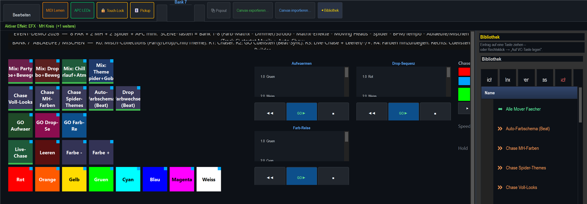
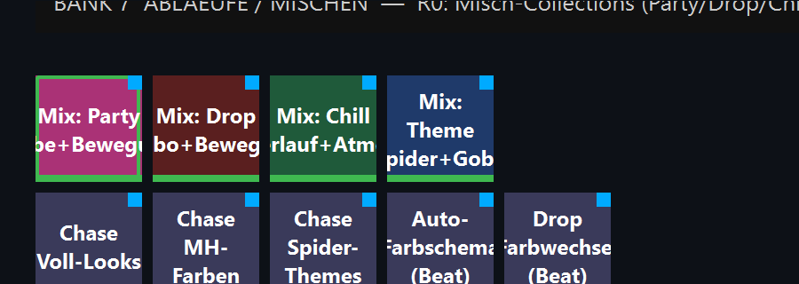
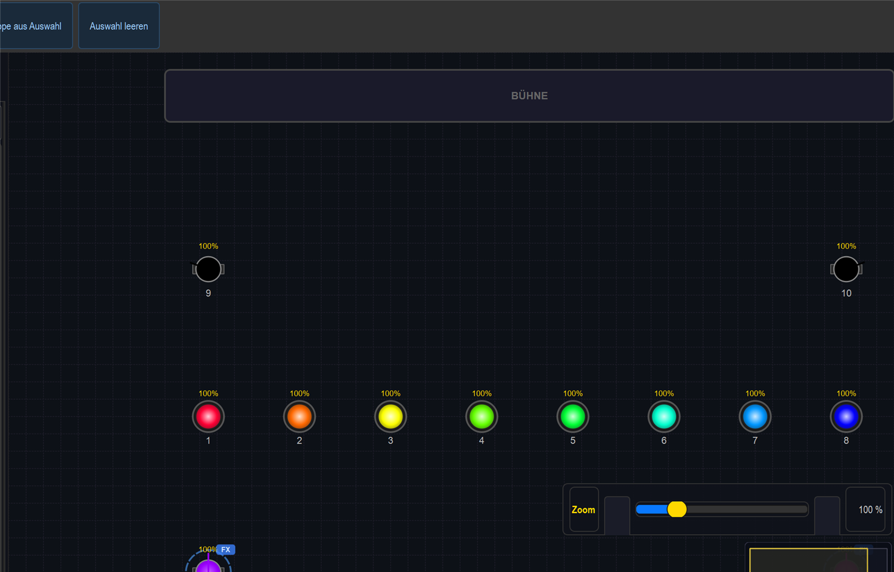

# Anleitung: Abläufe & Mischen (Farbe × Bewegung × Strobo)

> **Lernziel:** Fertige **Misch-Abläufe** auf einen Knopf legen — Farbe, Bewegung und Strobo
> kombiniert — dazu **Chaser**, **Beat-Sync-Cuelisten (GO)** und der **Live-Chase** zum
> spontanen Farbsequenzen-Bauen.
>
> Show: `shows/Event_Demo_2026.lshow`, **Bank 7 „Abläufe / Mischen"** (SCENE-Taste 7).
> Diese Anleitung wurde **live in der App durchgeklickt**.

---

## 1. Misch-Abläufe (Reihe 0) — der schnellste Weg zum fertigen Look

Jede dieser Tasten ist eine **Collection** = mehrere Effekte gleichzeitig (Farbe + Bewegung +
ggf. Strobo) auf einen Druck. Exklusiv — ein neuer Mix löst den vorigen ab:

| Taste | Kombiniert |
|---|---|
| **Mix: Party (Farbe+Bewegung)** | Regenbogen-Farbmatrix + MH-Fächer + Spider-Schere |
| **Mix: Drop (Strobo+Bewegung)** | Dimmer-Blitz + MH-Acht + Spider-Strobe |
| **Mix: Chill (Verlauf+Atmen)** | Farbverlauf + Dimmer-Atmen + MH-Kreis |
| **Mix: Theme (Spider+Gobo)** | Spider Grün/Magenta + MH-Gobo + Spider-Wippe |

### Live durchgeklickt: „Mix: Party (Farbe+Bewegung)"

Ein Druck auf **Mix: Party (Farbe+Bewegung)** — die Taste bekommt einen grünen Rahmen (läuft):

In der Live View sieht man sofort das Ergebnis: die **PAR-Reihe in voller Regenbogen-Farbe**,
die **Moving Heads als aktive Strahlen** (MH-Fächer) und die Spider mitgefärbt — Farbe **und**
Bewegung aus einer Taste:

## 2. Chaser (Reihe 1)

Laufende Sequenzen, die Szenen/Looks der Reihe nach durchschalten:

| Taste | Ablauf |
|---|---|
| **Chase Voll-Looks** | Rot → Grün → Blau → Weiß (ganze Reihe) |
| **Chase MH-Farben** | MH-Farbrad durchschalten |
| **Chase Spider-Themes** | Spider-Themes durchschalten |
| **Auto-Farbschema (Beat)** | wechselt das Farbschema **alle 4 Takte** (beat-getriggert) |
| **Drop Farbwechsel (Beat)** | harte Farbwechsel jeden halben Takt |

## 3. Beat-Sync-Cuelisten — GO (Reihe 2) + Anzeige rechts

Drei Cuelisten laufen **zur Musik** (zwei beat-genau, eine als Zeit-Fade). Die GO-Tasten starten/stoppen sie, rechts
zeigen die Cuelisten-Fenster den aktuellen Schritt:

| GO-Taste | Cueliste |
|---|---|
| **GO Aufwärmen** | ruhige Farbreise (Zeit-Fade) |
| **GO Drop-Sequenz** | Beat-Sync, 1 Cue pro Takt |
| **GO Farb-Reise** | Beat-Sync, 1 Cue alle 2 Takte |

Die Fader **Dim 1/2/3** regeln die Helligkeit der jeweiligen Cueliste.

## 4. Live-Chase selbst bauen (Reihen 3–4 + Chase-Builder)

- **Farb-Kacheln (Reihe 4):** Rot/Orange/Gelb/Grün/Cyan/Blau/Magenta/Weiß antippen =
  diese Farbe **zur Live-Sequenz hinzufügen**.
- **Reihe 3:** **Live-Chase** (Start/Stop) · **Leeren** · **Farbe −/+** (in der Sequenz blättern).
- Rechts der **Chase-Builder** — alles-in-einem zum Zusammenklicken und Tempo/Übergang einstellen.

So baust du **während** der Show eine eigene Farbfolge: Farben antippen → „Live-Chase" starten.

---

## Typischer Ablauf

1. Schneller Einstieg: **Mix: Party** (oder Chill/Drop/Theme) drücken → kompletter Look läuft.
2. Für Spannung: zusätzlich eine **Beat-Sync-Cueliste** mit **GO** dazuschalten.
3. Eigener Akzent: ein paar **Farb-Kacheln** antippen → **Live-Chase** starten.
4. Tempo aller Abläufe taktgenau koppeln → siehe
   [Speed/BPM-Anleitung](../anleitung_speed_bpm/ANLEITUNG_SPEED_BPM.md).
