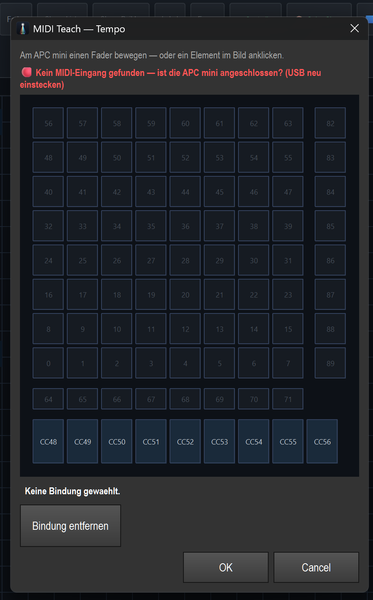

# Anleitung: APC mini auf die Virtuelle Konsole mappen

> Die **Akai APC mini** (Original oder **mk2**) wird als Hardware-Controller für die
> Virtuelle Konsole genutzt: Pads lösen VC-Tasten aus, die Fader steuern VC-Fader. Mit
> **LED-Feedback** spiegeln die Pads den Zustand zurück. Alles ohne Code, direkt in der
> Oberfläche.

---

## 1. Was wird gemappt?

Jedes **VC-Widget** kann an ein APC-Element gebunden werden:
- **VCButton** (Look-Toggle, Farb-Kachel, TAP, Blackout …) → an ein **Pad** (Note) oder eine Track-/Scene-Taste. Geht **beidseitig**: per „MIDI Lernen" (Weg A) **oder** „MIDI Teach" (Weg B).
- **VCSlider** (Master, BPM, Effekt-Tempo …) → an einen **Fader** (**CC**). Fader werden **nur über „MIDI Teach" (Weg B)** gebunden — „MIDI Lernen" (Weg A) armiert ausschließlich Tasten/Pads, **kein** angeklickter Fader.

Die Bindung wird **mit der Show** gespeichert.

## 2. Weg A — schnell per „MIDI Lernen" (nur Tasten/Pads)

> **Wichtig:** „MIDI Lernen" bindet **ausschließlich VCButtons** (Pads/Tasten). Ein angeklickter
> **Fader/VCSlider wird NICHT armiert** — für Fader gibt es **Weg B** (MIDI Teach, bindet **CC**).

1. In der **Virtual Console** die Toolbar **„MIDI Lernen"** aktivieren (wird orange, der Hinweis
   „MIDI-Learn: Klicke einen Button an..." erscheint auf dem Raster).
2. Den gewünschten **VC-Button anklicken** (der Button wird bewaffnet; ein Klick auf einen Fader oder
   ins Leere bricht den Modus ab).
3. Am APC mini die **Taste/das Pad drücken** — die erste eingehende MIDI-Nachricht wird dem Button
   zugewiesen (Pad/Taste = Note).
4. **„MIDI Lernen"** wieder ausschalten.

> Für **Fader/VCSlider** stattdessen **Weg B** nutzen (Rechtsklick → **„🎹 MIDI Teach..."**) — dort wird
> der Fader an einen **CC** gebunden.

## 3. Weg B — MIDI-Teach-Dialog (mit APC-Abbild)

Im **Bearbeiten**-Modus das Widget **rechtsklicken → „🎹 MIDI Teach..."**. Es öffnet sich ein Abbild
der APC mini:

- Entweder am Gerät die Taste/den Fader **betätigen** (das Element leuchtet im Bild auf),
- **oder** das Element im Bild direkt **anklicken** — das funktioniert **auch ohne angeschlossene APC**.
- **„Bindung entfernen"** löscht eine bestehende Zuordnung, **OK** speichert.

> Steht oben „🔴 Kein MIDI-Eingang gefunden", ist keine APC erkannt — der Dialog bleibt trotzdem per
> Klick benutzbar. Zum Steuern in Echtzeit die APC per USB anschließen (ggf. neu einstecken).

## 4. APC-mini-Belegung (Noten/CC)

| Bereich | Bereich-Werte | Hinweis |
|---|---|---|
| **Pad-Grid 8×8** | Note **0–63** | `note = Reihe×8 + Spalte`, Reihe 0 = unten |
| **Track-Tasten** (unter dem Grid) | Note **64–71** | 8 Tasten links→rechts |
| **Scene-Tasten** (rechte Spalte) | Note **82–89** | 82 = oben |
| **Fader** (8 + Master) | **CC 48–56** | CC56 = Master-Fader |

Der **mk2** hat dasselbe **Eingangs**-Layout (nur die RGB-LED-Ausgabe ist anders — wird automatisch
erkannt).

## 5. LED-Feedback

Toolbar **„APC LEDs"** einschalten → die Pads spiegeln den Zustand zurück:
- Look-/Funktions-Pad **aktiv** = hell, **gedrückt** = weißer Blitz.
- Farb-Kachel-Pad zeigt die **echte Farbe** (mk2: pulst, wenn die Farbe im Programmer aktiv ist).
- **TAP-Pad** blinkt (mk2) im **Beat** mit (weiß), AUTO/MANUAL-Pad zeigt den Modus.

Original-APC: Grün/Rot/Gelb + Blink. mk2: volle RGB-Farben + Ripple-/Beat-Animationen. Der passende
Modus wird am Port-Namen automatisch gewählt.

## 6. Soft-Takeover (Fader-Pickup)

Damit Fader nach einem **Bank-/Seitenwechsel** nicht springen, gibt es **Pickup**: der physische Fader
übernimmt erst, wenn er den aktuellen VC-Wert **einmal durchfährt**. Ein **gelber Pfeil** zeigt, wohin
der Fader bewegt werden muss. In der VC-Toolbar als **„🎚 Pickup"** schaltbar (aktiv: **„🎚 Pickup AN"**).

---

**Kurz:** **Tasten/Pads** → Virtual Console → **MIDI Lernen** an → Button klicken → APC-Pad drücken.
**Fader** → Rechtsklick → **🎹 MIDI Teach...** → Fader bewegen oder Element im Bild anklicken (bindet **CC**).
Danach **APC LEDs** an für Rückmeldung. Bindungen werden mit der Show gespeichert. Ohne APC läuft alles
per Touch/Tastatur weiter.

## 7. MIDI Show Control (MSC) — Cues vom Lichtpult

Große Pulte geben Cue-Befehle über **MIDI Show Control** an andere Software
weiter: grandMA2/grandMA3, Hog 4, ETC Eos und Avolites Titan. LightOS nimmt
diese Befehle an — per MIDI-Kabel (SysEx) oder bei grandMA zusätzlich per
Netzwerk (GMA-MSC, UDP-Port 6004).

**Einstellen** (MIDI-Ansicht, Kasten „MIDI Show Control (MSC)“):

- **MSC an** — MSC-Befehle annehmen (Standard: an).
- **Device-ID** — die eigene MSC-Geräte-ID, wie sie am Pult als Ziel
  eingetragen ist. **127 = alle annehmen.** Ein Befehl an 127 (Broadcast)
  erreicht LightOS immer.
- **GMA-MSC über Netzwerk** — nur für grandMA: Empfang per UDP (Standard: aus).
  **Schnittstelle** ist die Netzwerkkarte, auf der gelauscht wird — dieselbe
  Liste wie bei Art-Net/sACN; für ein Pult im Netz dessen Karte wählen.
  „nur dieser Rechner (127.0.0.1)“ erreicht kein Pult im Netz, „alle
  Schnittstellen (0.0.0.0)“ nimmt Befehle aus jedem angeschlossenen Netz an
  (Hinweis in der Ansicht). **Port** standardmäßig 6004. Mit **Übernehmen**
  wirksam; das Log meldet, ob der Port belegt werden konnte.
- **SET-Belegung** — wie der Befehl SET (Fader setzen) gelesen wird; die Pulte
  belegen die vier Datenbytes unterschiedlich:
  - **grandMA (Executor, Seite)** — Standard. Byte 1 = Executor (ab 0),
    Byte 2 = Seite (ab 1), danach der Wert als Feinanteil und Prozent
    (0…100). „Executor 3, Seite 1, 50 %“ kommt als `02 01 00 32` und setzt
    den Fader von Executor 3 auf der **Executor-Seite 1** von LightOS — egal,
    welche Seite gerade angezeigt wird.
  - **Standard (14-Bit-Regler)** — die Lesart der MSC-Spezifikation:
    Reglernummer *n* (ab 0, zwei Bytes) setzt Executor *n+1* der **aktuellen**
    Seite, Wert 0…16383.

  grandMA ist die Vorgabe, weil es das einzige Pult mit eigenem Netzwerkweg ist
  und ein grandMA-SET in der Standard-Lesart praktisch nie wirkt (die Seite im
  zweiten Byte ergäbe Regler 128 und höher). Gibt es den angesprochenen
  Executor oder die Seite nicht, steht das einmal je Ziel im Diagnose-Log
  (`[still:midi.msc.set] …`) — mit dem Hinweis, die Belegung umzustellen.
- **alle Formate annehmen** — Standard: aus. MSC-Befehle tragen ein
  „Command Format“ (Gewerk). LightOS nimmt nur Licht (`01`–`0F`) und „alle“
  (`7F`) an; ein GO für Ton, Maschinerie oder Video löst so keine Licht-Cue
  aus, auch wenn die Device-ID auf 127 steht. Nur einschalten, wenn das Pult
  ein anderes Format sendet und sich nicht umstellen lässt.

Die Einstellungen werden mit **Übernehmen** gespeichert (gerätegebunden in den
UI-Einstellungen, nicht in der Show) und beim nächsten Start wieder angewendet.

**Was die Befehle tun:**

| MSC-Befehl | Wirkung in LightOS |
|---|---|
| GO / TIMED_GO / RESUME | Cueliste → Executor (Nummer = Executor-Platz auf der aktuellen Seite, sonst Name des Executors oder der Cueliste; ohne Liste Executor 1). Mit Cue-Nummer (z. B. `1.5`) wird diese Cue angesprungen, ohne Nummer die nächste Cue. |
| STOP / GO_OFF | Cueliste des Executors stoppen; ohne Cueliste werden **alle** laufenden Cuelisten gestoppt (MSC-Spezifikation). |
| SET | Setzt einen Executor-Fader — je nach **SET-Belegung**: grandMA = Executor und Seite aus dem Befehl, Wert in Prozent; Standard = Regler *n* (ab 0) → Executor *n+1* der aktuellen Seite, Wert 0…16383. |
| FIRE | Makro *n* startet die Funktion (Szene/Chaser) mit der ID *n*. |
| ALL_OFF | Alle Cuelisten auf allen Seiten stoppen. |

LOAD, RESTORE und RESET werden erkannt, lösen aber nichts aus. Im MIDI-Monitor
erscheinen empfangene Befehle als `MSC  [Quelle] GO Cue=… Liste=…` bzw.
`MSC  [Quelle] SET Executor=… Seite=… Wert=…`. Die Quelle ist der MIDI-Eingang
oder **`MSC/UDP`** für Befehle aus dem Netzwerk — auch die erscheinen dort.
Befehle mit fremder Device-ID oder fremdem Format werden verworfen und nicht
angezeigt.

**Am Pult:**

- **grandMA2/3:** Setup → MIDI Show Control: *MSC Out* auf die MIDI-Schnittstelle
  bzw. „Ethernet“ (dann die IP des LightOS-Rechners und Port 6004), *Exec* als
  Cueliste, Device-ID passend zu LightOS, Command Format „All“ oder „General
  Light“ (andere Formate verwirft LightOS, siehe „alle Formate annehmen“).
  SET-Belegung in LightOS auf „grandMA (Executor, Seite)“ lassen.
- **Andere Pulte mit SET:** SET-Belegung „Standard (14-Bit-Regler)“.
- **Hog 4:** MIDI → Show Control: Ausgang aktivieren, Device-ID setzen.
- **ETC Eos:** Setup → Show Control → MIDI Show Control: *MSC Transmit* an,
  Device-ID setzen; Eos sendet Cueliste und Cuenummer.
- **Avolites Titan:** Systemeinstellungen → MIDI → MSC senden; Cuelisten werden
  über ihre Nummer übertragen.

Unter Windows (WinMM) stellt LightOS dafür eigene SysEx-Puffer bereit; ohne sie
hätte Windows jede MSC-Nachricht verworfen.
