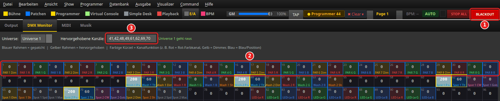

# Setting up output: ENTTEC USB Pro, Art-Net and sACN

> **English version** of [Ausgabe einrichten: ENTTEC USB Pro, Art-Net und sACN](ANLEITUNG.md).
> LightOS itself speaks German: every button, menu and field is quoted here **exactly as it
> appears on screen**, with an English translation in brackets the first time it shows up.
> The screenshots are the same as in the German guide.

> LightOS calculates 512 DMX channels for every universe. For them to reach your fixtures,
> every universe needs an **output**: an **ENTTEC DMX USB Pro** on a USB port, or an
> **Art-Net** or **sACN (E1.31)** receiver on the network. The output applies
> **per universe** — you can mix the three ways freely, up to 32 universes. This guide
> shows the dialog *Ausgabe konfigurieren* (configure output), the two monitors for
> checking, and the warnings in the status bar. The red numbers in the pictures match the
> numbered points in the text.

## What you need

- A show with at least one patched fixture. How to do that is shown in
  [Erste Schritte](../anleitung_erste_schritte/ANLEITUNG.md) (German).
- **For USB:** an ENTTEC DMX USB Pro. Windows brings the driver along; notes are in
  [INSTALL.md](../../INSTALL.md#enttec-dmx-usb-pro) (German).
- **For network:** an Art-Net or sACN node (or a fixture with a built-in network input)
  and a computer **on the same network**, see
  [Network pitfall](#network-pitfall-with-art-net-and-sacn).

The pictures show an **example configuration**: Universe 1 via an ENTTEC on
`/dev/ttyUSB0`, Universe 2 via Art-Net to a node with the address `192.168.1.50`.
Port and addresses are examples — on your computer you will see your own. On Windows the
port is called `COM3`, for example, on Linux usually `/dev/ttyUSB0`.
The **status bar** at the bottom of the pictures is not part of this example configuration:
the pictures are made on a computer without a connected ENTTEC, which is why it says
„Enttec: nicht gefunden“ (Enttec: not found) there.

---

## 1. Open the dialog

1. Menu **Ausgabe** (Output) → **Konfigurieren...** (Configure...)
2. Or: click the Enttec indicator at the bottom left of the status bar
   (`Enttec: …`). It opens the same dialog.

The dialog **Ausgabe konfigurieren** has five tabs: **Enttec Pro USB**, **Art-Net**,
**sACN (E1.31)**, **DMX Input** and **Universen** (universes). There are two ways:

- **Individual tabs** (steps 2–4): put one universe on one output and connect right
  away.
- **Universen tab** (step 5): all universes in one table, saved and applied with one
  click.

Both write to the same file `universes.json` in the LightOS data folder
(Windows `%APPDATA%\LightOS`, Linux `~/.local/share/LightOS`), so you can mix them. On the next start LightOS automatically sets up the outputs saved there again.
**Schließen** (close) ends the dialog; afterwards LightOS updates the status bar.

The **DMX Input** tab is not part of the output: there LightOS receives DMX from
outside (Art-Net on port 6454, sACN on port 5568) and mixes it into a universe of its
own.

## 2. ENTTEC DMX USB Pro

Tab **Enttec Pro USB**:

1. **COM-Port:** — all serial ports of the computer. A detected ENTTEC carries the
   suffix `[Enttec Pro]`. If the saved port is not there at the moment, it is listed with
   `— derzeit nicht gefunden` (currently not found) instead of silently jumping to
   another port. Without any port it says `Kein Port gefunden` (no port found).
2. **Ports aktualisieren** (refresh ports) — read the list in again after plugging in.
   The selection is kept.
3. **Universe:** — which LightOS universe goes out through this adapter. The field is
   pre-filled with the saved value; set it deliberately **before** you click
   **Verbinden** (connect).
4. **Verbinden** — removes any other output of this universe, opens the adapter and
   saves the assignment. The status then first reports
   `Eingerichtet: … (gespeichert), verbinde …` (set up: … (saved), connecting …) and
   shortly afterwards the result: `Verbunden: … (gespeichert)` (connected: … (saved)),
   or `Port lässt sich nicht öffnen — gespeichert, aber es geht kein DMX raus` (port
   cannot be opened — saved, but no DMX is going out), or
   `antwortet nicht — Port/Kabel prüfen` (not responding — check port/cable).
5. **Status:** — when the dialog opens, this shows what is **saved**
   (`Gespeichert: /dev/ttyUSB0 → Universe 1` = saved: …). Whether the adapter really
   sends is only shown by the status bar (step 8).

## 3. Art-Net

Tab **Art-Net**:

1. **Art-Net aktivieren** (enable Art-Net) — tick the box. Without the tick,
   **Übernehmen** (apply) removes the Art-Net output of the universe that was last
   assigned via this tab.
2. **Netzwerkkarte:** (network card) — which card Art-Net **and** sACN go out through.
   `Automatisch (Betriebssystem entscheidet)` (automatic, the operating system decides)
   uses the default route. The other entries show name, address and broadcast for each
   card, for example `eth0 — 192.168.1.10  (Broadcast 192.168.1.255)`. With a card
   selected, Art-Net goes to that card's broadcast instead of `255.255.255.255` —
   routers do not pass that one on. The choice applies to **this computer**, not to the
   show; new connections use it immediately, existing ones from the next start.
3. **Universe:** — the LightOS universe that **Übernehmen** acts on. Only this one;
   other universes stay unchanged.
4. **Ziel-IP / Broadcast:** (target IP / broadcast) — the address of the node (here
   `192.168.1.50`) or `255.255.255.255` for everyone on the network. Empty also means
   `255.255.255.255`.
5. **Art-Net Startuniversum:** (Art-Net start universe) — the Art-Net universe number
   the node expects. It is pre-filled with the LightOS universe minus 1: so Universe 2
   sends on Art-Net universe `1`, Universe 1 on `0`.
6. **Übernehmen** — sets up the output and saves it. The status then shows
   `Aktiv → <Adresse> · Universe <n> (gespeichert)` (active → \<address> · Universe \<n>
   (saved)); when the dialog opens, it shows the saved state
   (`Gespeichert: 192.168.1.50 · Universe 2`).

## 4. sACN (E1.31)

Tab **sACN (E1.31)**:

1. **sACN (E1.31) aktivieren** (enable sACN (E1.31)) — tick the box (without the tick,
   **Übernehmen** removes the sACN output again).
2. **Universe:** — the LightOS universe. It sends on the sACN universe number with the
   same number.
3. **Multicast (239.255.0.x)** — the default. Every sACN receiver on the network that
   listens to this universe gets the data.
4. **Unicast Ziel-IP:** (unicast target IP) — only when the Multicast box is
   **unticked**: the address of a single receiver. If it stays empty, it is multicast.
5. **Übernehmen** — sets up the output and saves it; the status reads, for example,
   `Aktiv · Multicast (239.255.0.x) · Universe 1 (gespeichert)`.

## 5. All universes at once: the Universen tab

Tab **Universen** — here you see and edit all outputs in one table:

Each row is one universe: **#** (1–32), **Name** (free to choose) and:

1. **Output** — `Disabled`, `Enttec`, `sACN` or `ArtNet`.
2. **Patch (Port/IP)** — depending on the output: for `Enttec` the port (`COM3`,
   `/dev/ttyUSB0`), for `ArtNet` the target IP (empty = `255.255.255.255`), for `sACN` a
   unicast IP (empty = multicast).
3. **Ext-Universe** — optionally the universe number on the network. If empty, the
   default applies: Art-Net `#` minus 1, sACN `#`.
4. **+ Universe hinzufügen** (add universe) — new row (32 at most). **Löschen** (delete)
   removes the selected rows from the table; this only takes effect with **Speichern**
   (save).
5. **Speichern** — writes `universes.json` (in the LightOS data folder) and applies the configuration
   **immediately**, without a restart. As confirmation LightOS shows the path of the
   file.

When saving, LightOS checks the table and speaks up if

- a **#** is outside 1–32 (*Universe-Nummer angepasst* = universe number adjusted),
- an **Ext-Universe** does not fit the output type (*Externe Universe-Nummer angepasst*
  = external universe number adjusted),
- **two rows end up at the same target** (*Zwei Universen auf demselben Ziel* = two
  universes on the same target). This leads to flickering at the receiver; it is saved
  anyway. What counts as "the same target" is explained in
  [Zwei Universen über zwei Adapter](../anleitung_zwei_universen/ANLEITUNG.md#hinweis-zwei-universen-auf-demselben-ziel)
  (German).

## 6. Check: the Output monitor

Section **E/A** (input/output), tab **Output**. In the picture PAR 1–4 of the
documentation demo show are set to red and PAR 5–8 to blue, each with a full dimmer:

1. **Universe:** — which universe is shown (1–32).
2. One tile per channel: the value at the top (0–255), the channel number small at the
   bottom. Channels above 0 have a blue background. PAR 1 occupies channels 1–4 here
   (dimmer, red, green, blue): `255 255 0 0`.

What is shown is what is sent — that is, already including grand master and blackout.

## 7. Check: the DMX Monitor

Tab **DMX Monitor** next to it — the same values, but with fixture names:

1. **Universe:** — choice of `Universe 1` to `Universe 32`.
2. **Hervorgehobene Kanäle:** (highlighted channels) — for example `1,5,10-20`; these
   channels get a yellow frame.
3. The output display: `Universe 1 geht raus` (Universe 1 is going out) means this
   universe has an output and is being sent. Otherwise it says
   `⚠ Universe <n> hat keinen Ausgang — nur gerechnet` (Universe \<n> has no output —
   only calculated) or `⚠ Universe <n>: <Weg> sendet NICHT` (Universe \<n>: \<route> is
   NOT sending).
4. The legend: blue frame = patched, yellow frame = highlighted. Each patched tile
   carries an abbreviation of fixture and channel, for example `PAR 1 R`.

**The monitor shows values, but the fixture stays dark?** Then the problem lies on the
way out, not in the patch: wrong port, wrong target IP, wrong network (below) or a
different DMX address set on the fixture.

**This is what BLACKOUT looks like in the monitor.** In the picture the PARs are set as
above, the moving heads are lit and set to pan 200 / tilt 60. Then **BLACKOUT** was
pressed in the header bar:

1. **BLACKOUT** is latched (red).
2. All PAR channels are at 0 — dimmer and colour.
3. Under **Hervorgehobene Kanäle:** the pan/tilt channels of the four moving heads are
   entered here. They keep their values (200 and 60), only their dimmer goes to 0. So
   the heads stay where they are and do not first drive back when you release the
   blackout.

Fixtures without a dimmer channel, lasers and fog machines go completely off during a
blackout.

## 8. Reading warnings in the status bar

The status bar reports permanently whether something is not going out. In the picture,
Universe 1 had its output removed while fixtures are patched on it:

1. The DMX Monitor reports `⚠ Universe 1 hat keinen Ausgang — nur gerechnet`.
2. **Enttec indicator** at the bottom left:

   | Display | Meaning |
   |---|---|
   | `Enttec: nicht gefunden` (red) | No ENTTEC set up and none plugged in. Without an ENTTEC (pure Art-Net/sACN) this is normal. |
   | `Enttec: <Port> erkannt, kein Universe` (= detected, no universe; orange) | The adapter is plugged in, but no universe outputs through it → assign one in step 2 or 5. |
   | `Enttec: <Port> verbindet …` (= connecting …; orange) | The port is being opened right now. If it stays like that, the adapter cannot be reached. |
   | `Enttec: <Port> aktiv (1 Universe)` (= active; green) | Set up, and the adapter is sending. |
   | `Enttec: <Port> sendet NICHT (Universe <n>)` (= is NOT sending; red) | Set up, but the port is not open — no DMX is going out. Check the USB cable and the port. |
   | `Enttec: falsch konfiguriert` (= misconfigured; orange) | The port entered cannot be right on this computer (e.g. a Windows `COM` port on Linux). The tooltip gives the reason. |

3. **Output indicator** at the bottom right: normally a list such as
   `Ausgabe: U1 Art-Net` (*Ausgabe* = output; three entries at most, the rest as `+n`).
   With `⚠` and in orange: `U<n> ohne Ausgang` (U\<n> without output) — fixtures are
   patched there, but no output is set up. Red if an output that has been set up is not
   sending. `Ausgabe: —` means no universe outputs anything at all. The tooltip of the
   indicator gives the details in each case.

A click on the Enttec indicator opens the dialog from step 1 directly.

## Network pitfall with Art-Net and sACN

The computer must be **on the same network** as the node. If the node has `192.168.1.50`,
the computer's network card needs an address `192.168.1.x` (mask `255.255.255.0`).
A common mistake: a USB network adapter without DHCP only gets an address `169.254.x.x` —
then Art-Net does not reach the node, even though the dialog reports „Aktiv" (active).
The fix: give the adapter a fixed address in the node's network and check it with
`ping 192.168.1.50`. If the computer has several cards (Wi-Fi and lighting network),
choose the right **Netzwerkkarte:** in step 3.

More about Art-Net (port 6454, universe numbers): [ARTNET.md](../ARTNET.md) (German).
Basics of DMX and universes: [DMX_PROTOCOL.md](../DMX_PROTOCOL.md) (German).

## Further reading

- [Zwei Universen über zwei Adapter](../anleitung_zwei_universen/ANLEITUNG.md) (German)
  — ENTTEC on Universe 1 and Art-Net on Universe 2 step by step, with the rules for
  duplicate targets.
- [Enttec und Art-Net gleichzeitig](../anleitung_enttec_artnet/ANLEITUNG_ENTTEC_ARTNET.md)
  (German) — the same principle with a second example.
- [Erste Schritte](../anleitung_erste_schritte/ANLEITUNG.md) (German) — create a show,
  patch a fixture, first value in the Programmer.

<!-- Bilder: venv/bin/python tools/anleitungsbilder.py ausgabe_einrichten (docs/ANLEITUNGSBILDER.md) -->
