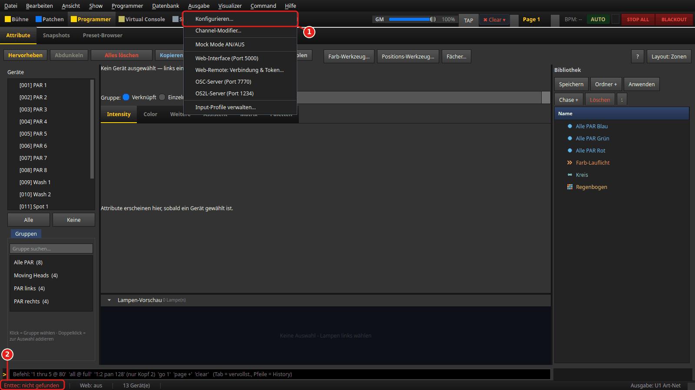
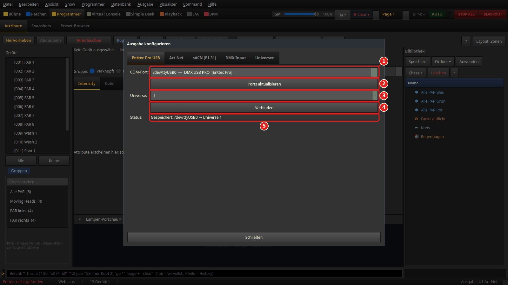
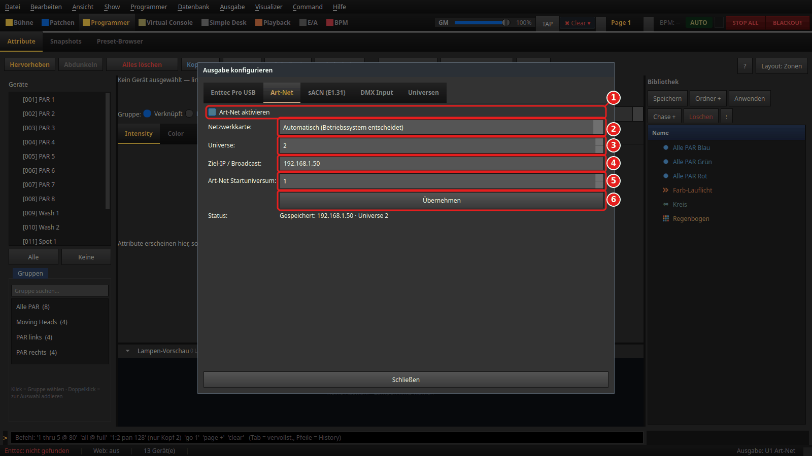
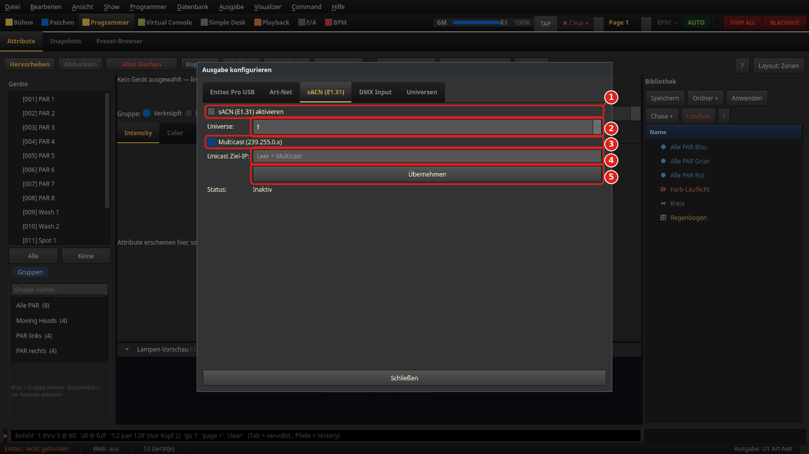
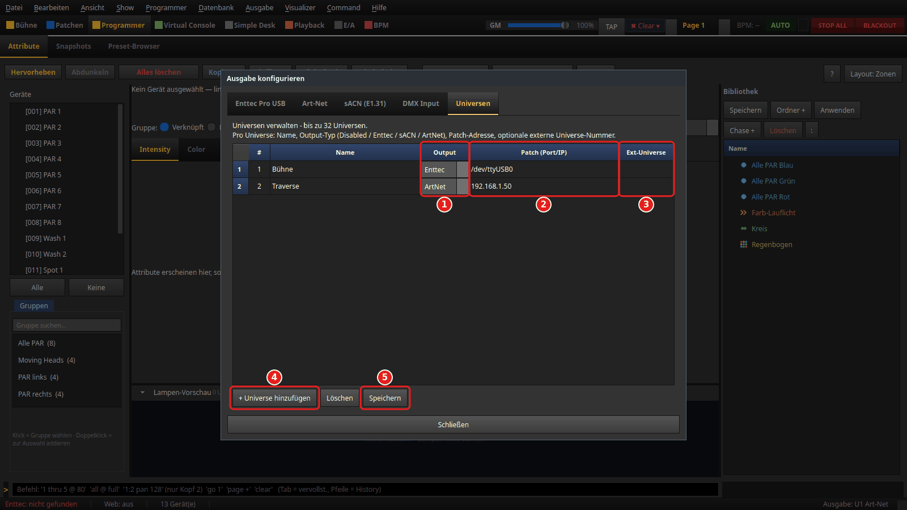
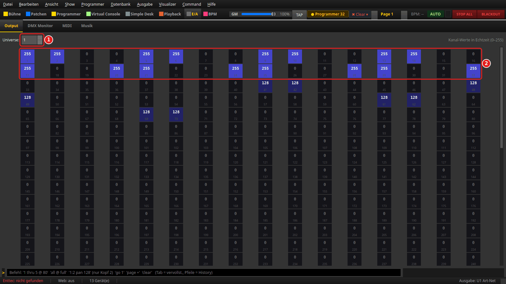
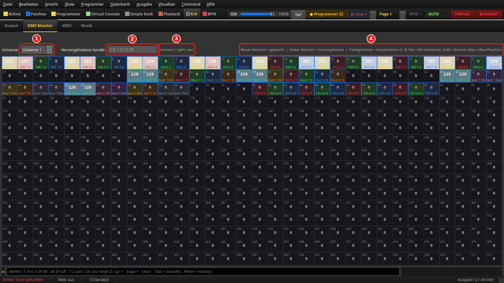
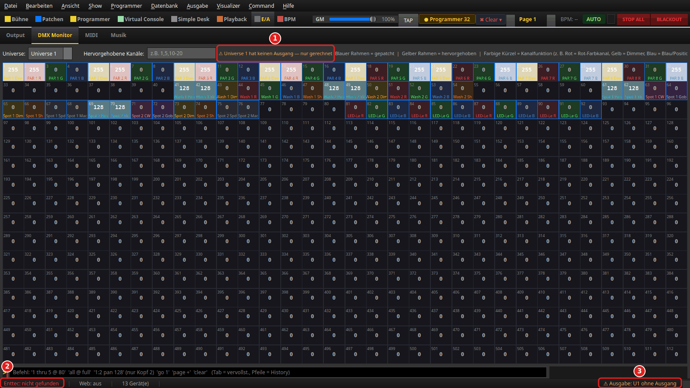

# Ausgabe einrichten: ENTTEC USB Pro, Art-Net und sACN

> LightOS rechnet für jedes Universum 512 DMX-Kanäle. Damit sie bei deinen Geräten
> ankommen, braucht jedes Universum einen **Ausgang**: einen **ENTTEC DMX USB Pro** am
> USB-Anschluss oder einen **Art-Net**- bzw. **sACN (E1.31)**-Empfänger im Netzwerk.
> Der Ausgang gilt **je Universum** — du kannst die drei Wege frei mischen, bis zu 32
> Universen. Diese Anleitung zeigt den Dialog *Ausgabe konfigurieren*, die beiden
> Monitore zur Kontrolle und die Warnungen in der Statusleiste. Die roten Zahlen in den
> Bildern gehören zu den gleich nummerierten Punkten im Text.

## Was du brauchst

- Eine Show mit mindestens einem gepatchten Gerät. Wie das geht, zeigt
  [Erste Schritte](../anleitung_erste_schritte/ANLEITUNG.md).
- **Für USB:** einen ENTTEC DMX USB Pro. Den Treiber bringt Windows mit, Hinweise
  stehen in [INSTALL.md](../../INSTALL.md#enttec-dmx-usb-pro).
- **Für Netzwerk:** einen Art-Net- oder sACN-Node (oder ein Gerät mit eingebautem
  Netzwerkeingang) und einen Rechner **im selben Netz**, siehe
  [Netzwerk-Falle](#netzwerk-falle-bei-art-net-und-sacn).

Die Bilder zeigen eine **Beispiel-Konfiguration**: Universe 1 über einen ENTTEC an
`/dev/ttyUSB0`, Universe 2 über Art-Net an einen Node mit der Adresse `192.168.1.50`.
Port und Adressen sind Beispiele — bei dir stehen dort deine eigenen. Unter Windows
heißt der Port zum Beispiel `COM3`, unter Linux meist `/dev/ttyUSB0`.
Die **Statusleiste** unten in den Bildern gehört nicht zu dieser Beispiel-Konfiguration: Die Bilder
entstehen auf einem Rechner ohne angeschlossenen ENTTEC, deshalb steht dort „Enttec: nicht gefunden“.

---

## 1. Den Dialog öffnen

1. Menü **Ausgabe** → **Konfigurieren...**
2. Oder: Klick auf die Enttec-Anzeige unten links in der Statusleiste
   (`Enttec: …`). Sie öffnet denselben Dialog.

Der Dialog **Ausgabe konfigurieren** hat fünf Reiter: **Enttec Pro USB**, **Art-Net**,
**sACN (E1.31)**, **DMX Input** und **Universen**. Es gibt zwei Wege:

- **Einzel-Reiter** (Schritte 2–4): ein Universum auf einen Ausgang legen und sofort
  verbinden.
- **Reiter Universen** (Schritt 5): alle Universen in einer Tabelle, mit einem Klick
  speichern und anwenden.

Beide schreiben in dieselbe Datei `data/universes.json` im LightOS-Ordner, du kannst sie
also mischen. Beim nächsten Start richtet LightOS die dort gespeicherten Ausgänge
automatisch wieder ein. **Schließen** beendet den Dialog; danach aktualisiert LightOS
die Statusleiste.

Der Reiter **DMX Input** gehört nicht zur Ausgabe: dort empfängt LightOS DMX von
außen (Art-Net auf Port 6454, sACN auf Port 5568) und mischt es in ein eigenes
Universum.

## 2. ENTTEC DMX USB Pro

Reiter **Enttec Pro USB**:

1. **COM-Port:** — alle seriellen Anschlüsse des Rechners. Ein erkannter ENTTEC trägt
   den Zusatz `[Enttec Pro]`. Ist der gespeicherte Port gerade nicht da, steht er mit
   `— derzeit nicht gefunden` in der Liste, statt still auf einen anderen Port
   umzuspringen. Ohne jeden Port steht dort `Kein Port gefunden`.
2. **Ports aktualisieren** — nach dem Einstecken die Liste neu einlesen. Die Auswahl
   bleibt dabei erhalten.
3. **Universe:** — welches LightOS-Universum über diesen Adapter hinausgeht. Das Feld
   ist mit dem gespeicherten Wert vorbelegt; stell es **vor** dem Klick auf
   **Verbinden** bewusst ein.
4. **Verbinden** — entfernt einen anderen Ausgang dieses Universums, öffnet den Adapter
   und speichert die Zuordnung. Danach meldet der Status erst
   `Eingerichtet: … (gespeichert), verbinde …` und wenig später das Ergebnis:
   `Verbunden: … (gespeichert)`, oder `Port lässt sich nicht öffnen — gespeichert, aber
   es geht kein DMX raus`, oder `antwortet nicht — Port/Kabel prüfen`.
5. **Status:** — beim Öffnen steht hier, was **gespeichert** ist
   (`Gespeichert: /dev/ttyUSB0 → Universe 1`). Ob der Adapter wirklich sendet, zeigt
   erst die Statusleiste (Schritt 8).

## 3. Art-Net

Reiter **Art-Net**:

1. **Art-Net aktivieren** — Haken setzen. Ohne Haken entfernt **Übernehmen** den
   Art-Net-Ausgang des Universums, das zuletzt über diesen Reiter belegt wurde.
2. **Netzwerkkarte:** — über welche Karte Art-Net **und** sACN hinausgehen.
   `Automatisch (Betriebssystem entscheidet)` nimmt die Standardroute. Die übrigen
   Einträge zeigen je Karte Name, Adresse und Broadcast, zum Beispiel
   `eth0 — 192.168.1.10  (Broadcast 192.168.1.255)`. Mit einer gewählten Karte geht
   Art-Net an deren Broadcast statt an `255.255.255.255` — den reichen Router nicht
   weiter. Die Wahl gilt für **diesen Rechner**, nicht für die Show; neue Verbindungen
   nutzen sie sofort, bestehende ab dem nächsten Start.
3. **Universe:** — das LightOS-Universum, auf das **Übernehmen** wirkt. Nur dieses eine;
   andere Universen bleiben unverändert.
4. **Ziel-IP / Broadcast:** — die Adresse des Nodes (hier `192.168.1.50`) oder
   `255.255.255.255` für alle im Netz. Leer bedeutet ebenfalls `255.255.255.255`.
5. **Art-Net Startuniversum:** — die Art-Net-Universumsnummer, die der Node erwartet.
   Vorbelegt ist LightOS-Universum minus 1: Universe 2 sendet also auf Art-Net-Universum
   `1`, Universe 1 auf `0`.
6. **Übernehmen** — richtet den Ausgang ein und speichert ihn. Der Status zeigt dann
   `Aktiv → <Adresse> · Universe <n> (gespeichert)`; beim Öffnen des Dialogs steht dort
   der gespeicherte Stand (`Gespeichert: 192.168.1.50 · Universe 2`).

## 4. sACN (E1.31)

Reiter **sACN (E1.31)**:

1. **sACN (E1.31) aktivieren** — Haken setzen (ohne Haken entfernt **Übernehmen** den
   sACN-Ausgang wieder).
2. **Universe:** — das LightOS-Universum. Es sendet auf die sACN-Universumsnummer
   mit derselben Zahl.
3. **Multicast (239.255.0.x)** — Standard. Jeder sACN-Empfänger im Netz, der dieses
   Universum hört, bekommt die Daten.
4. **Unicast Ziel-IP:** — nur wenn der Haken bei Multicast **aus** ist: die Adresse eines
   einzelnen Empfängers. Leer bleibt es Multicast.
5. **Übernehmen** — richtet den Ausgang ein und speichert ihn; Status zum Beispiel
   `Aktiv · Multicast (239.255.0.x) · Universe 1 (gespeichert)`.

## 5. Alle Universen auf einmal: Reiter Universen

Reiter **Universen** — hier siehst und bearbeitest du alle Ausgänge in einer Tabelle:

Jede Zeile ist ein Universum: **#** (1–32), **Name** (frei wählbar) und:

1. **Output** — `Disabled`, `Enttec`, `sACN` oder `ArtNet`.
2. **Patch (Port/IP)** — je nach Output: bei `Enttec` der Port (`COM3`,
   `/dev/ttyUSB0`), bei `ArtNet` die Ziel-IP (leer = `255.255.255.255`), bei `sACN` eine
   Unicast-IP (leer = Multicast).
3. **Ext-Universe** — optional die Universumsnummer im Netzwerk. Leer gilt der Standard:
   Art-Net `#` minus 1, sACN `#`.
4. **+ Universe hinzufügen** — neue Zeile (höchstens 32). **Löschen** entfernt die
   markierten Zeilen aus der Tabelle; wirksam wird das erst mit **Speichern**.
5. **Speichern** — schreibt `data/universes.json` und wendet die Konfiguration
   **sofort** an, ohne Neustart. Zur Bestätigung zeigt LightOS den Pfad der Datei.

Beim Speichern prüft LightOS die Tabelle und meldet sich, wenn

- eine **#** außerhalb von 1–32 liegt (*Universe-Nummer angepasst*),
- eine **Ext-Universe** nicht zum Ausgabetyp passt (*Externe Universe-Nummer angepasst*),
- **zwei Zeilen am selben Ziel** landen (*Zwei Universen auf demselben Ziel*). Das führt
  am Empfänger zu Flackern; gespeichert wird trotzdem. Was dabei als „dasselbe Ziel"
  zählt, erklärt
  [Zwei Universen über zwei Adapter](../anleitung_zwei_universen/ANLEITUNG.md#hinweis-zwei-universen-auf-demselben-ziel).

## 6. Kontrolle: der Output-Monitor

Sektion **E/A**, Reiter **Output**. Im Bild stehen PAR 1–4 der Doku-Demo-Show auf Rot
und PAR 5–8 auf Blau, jeweils mit vollem Dimmer:

1. **Universe:** — welches Universum angezeigt wird (1–32).
2. Je Kanal eine Kachel: oben der Wert (0–255), unten klein die Kanalnummer. Kanäle über
   0 sind blau hinterlegt. PAR 1 belegt hier die Kanäle 1–4 (Dimmer, Rot, Grün, Blau):
   `255 255 0 0`.

Gezeigt wird, was gesendet wird — also schon mit Grand Master und Blackout verrechnet.

## 7. Kontrolle: der DMX Monitor

Reiter **DMX Monitor** daneben — dieselben Werte, aber mit Gerätenamen:

1. **Universe:** — Auswahl `Universe 1` bis `Universe 32`.
2. **Hervorgehobene Kanäle:** — zum Beispiel `1,5,10-20`; diese Kanäle bekommen einen
   gelben Rahmen.
3. Die Ausgangs-Anzeige: `Universe 1 geht raus` heißt, dieses Universum hat einen
   Ausgang und wird gesendet. Andernfalls steht dort `⚠ Universe <n> hat keinen
   Ausgang — nur gerechnet` oder `⚠ Universe <n>: <Weg> sendet NICHT`.
4. Die Legende: blauer Rahmen = gepatcht, gelber Rahmen = hervorgehoben. Jede
   gepatchte Kachel trägt ein Kürzel aus Gerät und Kanal, zum Beispiel `PAR 1 R`.

**Monitor zeigt Werte, aber das Gerät bleibt dunkel?** Dann liegt es am Weg nach
draußen, nicht am Patch: falscher Port, falsche Ziel-IP, falsches Netz (unten) oder eine
andere DMX-Adresse am Gerät.

## 8. Warnungen in der Statusleiste lesen

Die Statusleiste meldet dauerhaft, ob etwas nicht hinausgeht. Im Bild wurde Universe 1
der Ausgang genommen, während dort Geräte gepatcht sind:

1. Der DMX Monitor meldet `⚠ Universe 1 hat keinen Ausgang — nur gerechnet`.
2. **Enttec-Anzeige** unten links:

   | Anzeige | Bedeutung |
   |---|---|
   | `Enttec: nicht gefunden` (rot) | Kein ENTTEC eingerichtet und keiner angesteckt. Ohne ENTTEC (reines Art-Net/sACN) ist das normal. |
   | `Enttec: <Port> erkannt, kein Universe` (orange) | Der Adapter steckt, aber kein Universum gibt über ihn aus → in Schritt 2 oder 5 zuweisen. |
   | `Enttec: <Port> verbindet …` (orange) | Der Port wird gerade geöffnet. Bleibt es dabei, ist der Adapter nicht erreichbar. |
   | `Enttec: <Port> aktiv (1 Universe)` (grün) | Eingerichtet, und der Adapter sendet. |
   | `Enttec: <Port> sendet NICHT (Universe <n>)` (rot) | Eingerichtet, aber der Port ist nicht offen — es geht kein DMX raus. USB-Kabel und Port prüfen. |
   | `Enttec: falsch konfiguriert` (orange) | Der eingetragene Port kann auf diesem Rechner nicht stimmen (z. B. ein Windows-`COM`-Port unter Linux). Der Tooltip nennt den Grund. |

3. **Ausgabe-Anzeige** unten rechts: normal eine Liste wie `Ausgabe: U1 Art-Net`
   (höchstens drei Einträge, der Rest als `+n`). Mit `⚠` und orange:
   `U<n> ohne Ausgang` — dort sind Geräte gepatcht, aber kein Ausgang ist eingerichtet.
   Rot, wenn ein eingerichteter Ausgang nicht sendet. `Ausgabe: —` heißt, kein Universum
   gibt überhaupt etwas aus. Der Tooltip der Anzeige nennt jeweils die Einzelheiten.

Ein Klick auf die Enttec-Anzeige öffnet direkt den Dialog aus Schritt 1.

## Netzwerk-Falle bei Art-Net und sACN

Der Rechner muss **im selben Netz** wie der Node liegen. Hat der Node `192.168.1.50`,
braucht die Netzwerkkarte des Rechners eine Adresse `192.168.1.x` (Maske
`255.255.255.0`). Häufiger Fehler: ein USB-Netzwerkadapter ohne DHCP bekommt nur eine
Adresse `169.254.x.x` — dann erreicht Art-Net den Node nicht, obwohl der Dialog
„Aktiv" meldet. Abhilfe: dem Adapter eine feste Adresse im Netz des Nodes geben und mit
`ping 192.168.1.50` prüfen. Hat der Rechner mehrere Karten (WLAN und Lichtnetz), wähle
in Schritt 3 die richtige **Netzwerkkarte:**.

Mehr zu Art-Net (Port 6454, Universumsnummern): [ARTNET.md](../ARTNET.md). Grundlagen zu
DMX und Universen: [DMX_PROTOCOL.md](../DMX_PROTOCOL.md).

## Weiterlesen

- [Zwei Universen über zwei Adapter](../anleitung_zwei_universen/ANLEITUNG.md) — ENTTEC
  auf Universe 1 und Art-Net auf Universe 2 Schritt für Schritt, mit den Regeln für
  doppelte Ziele.
- [Enttec und Art-Net gleichzeitig](../anleitung_enttec_artnet/ANLEITUNG_ENTTEC_ARTNET.md)
  — dasselbe Prinzip an einem zweiten Beispiel.
- [Erste Schritte](../anleitung_erste_schritte/ANLEITUNG.md) — Show anlegen, Gerät
  patchen, erster Wert im Programmer.

<!-- Bilder: venv/bin/python tools/anleitungsbilder.py ausgabe_einrichten (docs/ANLEITUNGSBILDER.md) -->
