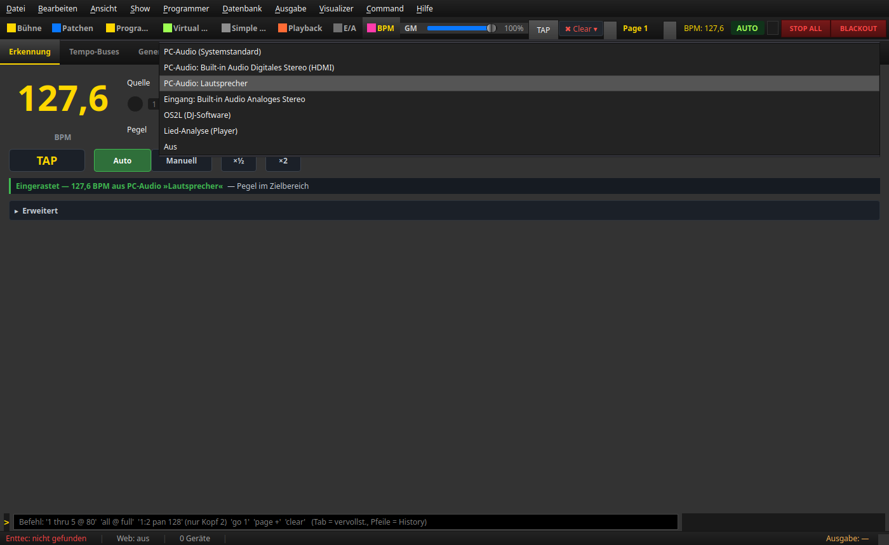
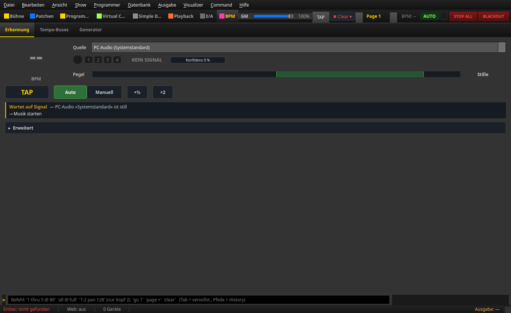
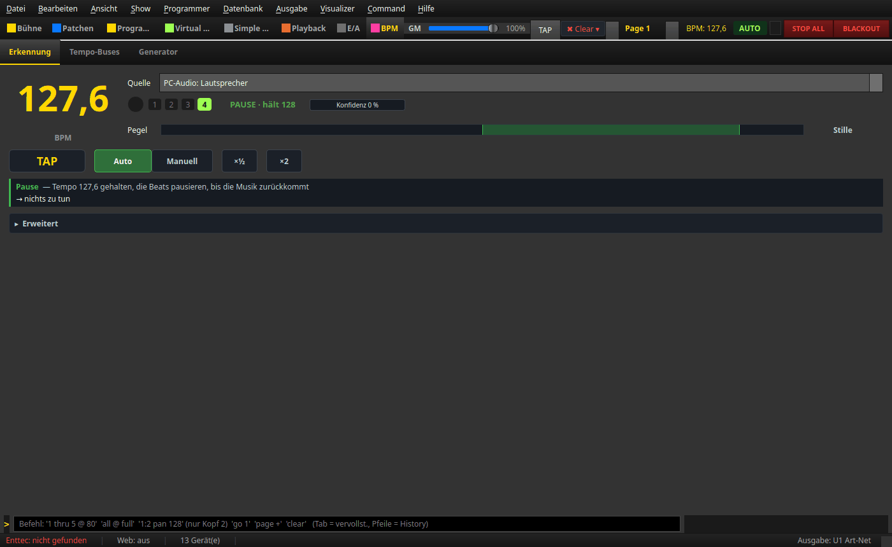
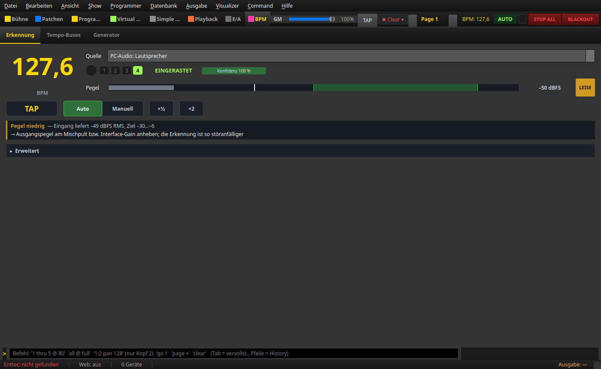

# BPM manager — guide

> **English version** of [BPM-Manager — Anleitung](ANLEITUNG_BPM_MANAGER.md). LightOS itself speaks German: every button, menu and field is quoted here **exactly as it appears on screen**, with an English translation in brackets the first time it shows up. The screenshots are the same as in the German guide.

> **What is it for?** The **BPM** section is the timekeeper of LightOS. It listens to the music
> (or takes the tempo from the DJ software, an analysed song or your TAP) and delivers the
> **beats** that all tempo-coupled effects run on: Matrix, EFX, Chaser, sequences, Virtual
> Console.
>
> **Opening it:** click **BPM** in the section bar or press **Strg+8** (Strg = Ctrl). The
> section has three sub-tabs: **Erkennung · Tempo-Buses · Generator** (detection · tempo
> buses · generator). This guide mainly explains **Erkennung**; the other two are covered
> briefly at the end.

As of: **2026-09-16**. All pictures come from the running app (the test device is called
„Lautsprecher" (speakers)); the labels have been checked against the source code
(`src/ui/views/bpm_manager_view.py`, `src/ui/bpm_status_rules.py`,
`src/ui/views/bpm_generator_view.py`, `src/core/audio/bpm_settings.py`).

---

## Ready in 30 seconds

1. **Choose the source** — top right, the list **Quelle** (source). Music is playing on this
   computer → **PC-Audio (Systemstandard)** (PC audio, system default). Music comes from the
   mixing desk → **Eingang: <dein Interface>** (input: <your interface>).
2. **Check the level** — the bar in the row **Pegel** (level) should swing within the
   **green range** (−30 to −6 dBFS). Grey = too quiet, red = too loud.
3. **Wait for EINGERASTET** (locked in) — after starting or changing the source this takes
   **about 4–6 seconds**. Then **EINGERASTET** appears in green, the beat dot flashes, done.

If something does not work, the **status line** (green, yellow or red bar below the buttons)
tells you in one sentence what is going on and what you can do — see
[When nothing is detected](#when-nothing-is-detected).

---

## 1. The interface at a glance


From top left to bottom:

| # | Element | In the picture | What it is |
|---|---|---|---|
| 1 | **Sub-tabs** | Erkennung · Tempo-Buses · Generator | Erkennung is underlined in yellow = active. |
| 2 | **Large BPM number** | „127,6" in yellow, below it „BPM" | The valid tempo. **Yellow** = Auto, **green** = Manuell (manual), grey **--** = no tempo yet (e.g. right after starting). If the detection falls back to **KEIN SIGNAL** (no signal), the last valid number stays. |
| 3 | **Quelle** | „PC-Audio: Lautsprecher" | Where the tempo comes from (section 2). **Control.** |
| 4 | **Beat dot + bar cells** | yellow circle, cells 1 · 2 · 3 · 4 | Flash along in time; the **1** (downbeat) lights up gold. How many cells: *Beats/Takt* (beats per bar) in Erweitert (advanced). |
| 5 | **State word** | „EINGERASTET" in green | What the detection is doing right now (section 3.1). |
| 6 | **Konfidenz** (confidence) | small bar „Konfidenz 100 %" | How certain the detection is. |
| 7 | **Pegel** | wide bar, green target zone, bright line, „−19 dBFS" | How loud the signal arrives (section 3.2). When there are disturbances, **chips** appear to the right of it. |
| 8 | **TAP** | large button, yellow lettering | Re-set the beat or tap in the tempo (section 4.1). **Control.** |
| 9 | **Auto \| Manuell** | Auto with green background = active | Follows the music or holds your tempo. **Control.** |
| 10 | **×½ / ×2** | two small buttons | Half / double tempo. **Controls.** |
| 11 | **Status line** | green border: „Eingerastet — 127,6 BPM aus PC-Audio »Lautsprecher« — Pegel im Zielbereich" (locked in — 127.6 BPM from PC audio »Lautsprecher« — level in the target range) | Always one sentence: what is going on, why, what to do (section 3.3). |
| 12 | **▸ Erweitert** | collapsed bar | Fine settings and diagnostics (section 5). **Control.** |

At the very top, in the **header**, you always see — no matter which section you are in —
**TAP** (the same button as no. 8), **BPM: 127,6** and the mode field **AUTO**.

> **Remember:** In normal operation you only need **six** controls: Quelle, TAP,
> Auto | Manuell, ×½, ×2 and Erweitert. Everything else is a display.

---

## 2. Choose the source



The list reads in the devices **anew every time you open it** — so a USB interface you have
just plugged in is in it straight away. Your choice is remembered and switched on again at
the next start.

| Entry | Pick this if … | Note |
|---|---|---|
| **PC-Audio (Systemstandard)** | the music is playing **on this computer** (player, Spotify, browser) and you don't want to bother with devices. | Listens in on the output device that is currently the **default** in the operating system — if you change the device there, LightOS follows. |
| **PC-Audio: <Ausgabegerät>** (PC audio: <output device>) | the music on this computer is playing through a **specific** device (in the picture „Lautsprecher" or „Built-in Audio Digitales Stereo (HDMI)"). | One entry per output device. If the music plays through a different device, LightOS hears silence. |
| **Eingang: <Gerät>** (input: <device>) | the music comes **from outside**: mixing desk, guest DJ, band — via line-in, microphone or audio interface. | One entry per input. Adjust the level on the mixing desk/interface until the bar is green. |
| **OS2L (DJ-Software)** | a DJ is playing with **VirtualDJ** (or another OS2L-capable program). | Tempo and beats come directly from the DJ program; LightOS then does not listen itself. Switch on OS2L in the DJ program. The menu item *Ausgabe → OS2L-Server (Port 1234)* (Output → OS2L server) is the same switch: checked = source OS2L, unchecked = back to the source before. |
| **Lied-Analyse (Player)** (song analysis, player) | you are playing a **song analysed beforehand in the Generator** in the player and want the light to sit exactly in time. | Takes the track that is currently loaded in the player (section 7.2). The Generator button **Im Player laden & als BPM-Quelle nutzen** (load in player & use as BPM source) selects this entry itself. |
| **Aus** (off) | you don't want any detection — e.g. only Manuell with TAP. | The status line then says „Erkennung aus — keine Beat-Quelle gewählt" (detection off — no beat source selected). |

A saved device that is not plugged in at the moment appears in the list as
**„… (nicht gefunden)"** (not found).

**From the Virtual Console** (or a pad on the APC) the key **Musik-BPM** (music BPM) switches
the same list — the list follows along every time, and the choice is remembered in the same
way:

* **On:** the last chosen audio source together with its device (PC-Audio or Eingang; with no
  history **PC-Audio (Systemstandard)**), plus **Auto**. A running OS2L server is switched off.
* **Off:** back to the last chosen other source — **OS2L**, **Lied-Analyse** or **Aus**.
  Listening stops completely.

**Locking in takes about 4–6 seconds.** The detection needs a filled analysis window of
roughly six seconds of music before it reports beats. Until then it shows **SUCHT**
(searching). It goes faster if you press **TAP** three or four times in time (section 4.1).

---

## 3. Reading the displays

### 3.1 The state word

| State word | Meaning |
|---|---|
| **KEIN SIGNAL** (grey) | Nothing usable is arriving — the status line also says „Kein Signal" (level below −60 dBFS), „Wartet auf Signal" (waiting for signal) or an audio error. Also right after starting, as long as the music is not playing yet. |
| **SUCHT** (orange) | A signal is there, the analysis window is filling or no stable beat has been found yet. **Also:** the beat has become uncertain (confidence below 15 % for ½ s, status line „Takt unsicher" (beat uncertain)) — the old tempo then keeps running; if no clear beat comes back, the detection lets go of it after about 2 s. With a completely even sound without any attack (a pad in the breakdown) it holds the tempo until beats come again. |
| **EINGERASTET** (green) | The tempo is set, the beats are running, the beat is certain (confidence from 15 %) and enough signal is arriving. |
| **EINGERASTET · BEATS STUMM** (locked in · beats muted; orange) | The tempo is set, but for at least 2 s the beat grid has not matched the hits it hears (usually after a tempo change) — during that time the detection sends **no beats**. Usually sorts itself out; otherwise tap TAP once on the beat. |
| **PAUSE · hält 128** (pause · holding 128; green) | The music is silent, the last tempo is **held**; the beats pause until the music comes back. |
| **MANUELL** (manual) | You set the tempo (TAP, Nudge, Manuell button). |
| **OS2L** / **OS2L · wartet auf DJ-Software** (OS2L · waiting for DJ software) | Source OS2L — connected, or no DJ program connected yet. |
| **LIED-ANALYSE** / **AUS** (song analysis / off) | The corresponding source is selected. |

The state word can be followed by a short addition, e.g. **„· Tap"** (the tempo last came
from TAP) or **„· 🔒"** (tempo frozen).

**When you start without music** it looks like this:



The BPM number shows **--**, the state word **KEIN SIGNAL**, and to the right of the level it
says **Stille** (silence). The status line is yellow (a hint, not an error):
„**Wartet auf Signal** — PC-Audio »Systemstandard« ist still — → Musik starten" (waiting for
signal — PC audio »system default« is silent — → start the music). That is exactly what to
do.

**When the music drops out briefly** (break, announcement, change of song):



The tempo stays (**PAUSE · hält 128**), beats and bar cells pause, and the status line is
**green**: „**Pause** — Tempo 127,6 gehalten, die Beats pausieren, bis die Musik
zurückkommt — → nichts zu tun" (pause — tempo 127.6 held, the beats pause until the music
comes back — → nothing to do).
When the music comes back in, the beats continue at the held tempo. If it stays silent for
**10 seconds**, the detection forgets the beat and shows **KEIN SIGNAL**. The large number
stays on the last tempo, and the beats stay off. The next entry of the music is searched for
afresh and locked in; only then do beats come again, possibly at a new tempo.
If the beats should keep running at the old tempo even through long pauses: **Manuell**. If
you only want the number not to jump to a new tempo when the music comes back in:
**Tempo einfrieren** (freeze tempo) (Erweitert).

### 3.2 Level and chips

The **Pegel** row shows how loud the signal of the chosen source arrives (averaged over
0.3 s). On the right the value is shown as a number, e.g. **−19 dBFS**, and with digital
silence **Stille**.

| Bar colour | Range | Meaning |
|---|---|---|
| **green** | −30 to −6 dBFS (dark green target zone in the background) | ideal for the detection |
| **yellow** | just below −30 or above −6 dBFS | works, but a little quiet or already hot |
| **grey** | below −45 dBFS | too quiet or no signal |
| **red** | above −3 dBFS | too loud, about to overdrive |

The **bright vertical line** briefly holds the last peak. When the signal is overdriven, a
red **CLIP** appears at the end of the bar.

**Chips** can show up to the right of the level — displays only; they appear when a
disturbance lasts about 2 s and disappear about 3 s after it ends (brief flickering does not
show anything):

| Chip | Meaning |
|---|---|
| **CLIP** (red) | overdriven: the signal hits 0 dBFS |
| **BRUMM** (hum; orange) | mains hum 50/60 Hz in the bass, usually a ground loop |
| **LEISE** (quiet; yellow) | level below −40 dBFS |
| **AUSSETZER** (dropouts; yellow) | audio arrives in bursts, the computer is overloaded |
| **DC** (yellow) | DC offset at the input (check the interface or cable) |

### 3.3 Confidence and status line

**Konfidenz** (0–100 %) tells you how certain the detection is. High = clear beat. Low =
pause, speech, music without a distinct beat — or a disturbance such as hum. If it stays
below 15 % for half a second, the display no longer shows EINGERASTET but SUCHT
(„Takt unsicher"). If the music ends with noise instead of silence (applause, announcement),
the confidence stays high for a few more seconds: the detection looks at the last 6 seconds.
With silence the display switches to PAUSE after only about one second.

The **status line** is **never empty** and is always built the same way:

```
Problem — cause (with the measured value)
→ remedy
```

* **Colour of the left border:** green = everything is fine, yellow = hint, red = problem.
* **Remedy underlined (blue)** = clickable. LightOS then carries out the remedy itself:
  opens the Quelle list, reconnects the audio, starts a recording or expands „Erweitert".
* Normally there is no remedy line — then everything is on one line, as in the first picture
  („Eingerastet — 127,6 BPM aus PC-Audio »Lautsprecher« — Pegel im Zielbereich").

> **Rule of thumb for the evening:** If the light is off the beat, check in this order:
> Does it say **EINGERASTET**? Is the **level green**? What does the **status line** say? If
> the dot is just flashing off the music → press **TAP** once.

---

## 4. Operating

### 4.1 TAP — two roles

| You tap … | What happens |
|---|---|
| **once** | The beat is set to **"now"**. The tempo stays. Use this when the beat dot is flashing at the right tempo but **offset** from the music. |
| **twice** | Nothing yet — an accidental double-click does not change anything. |
| **three or four times in time** (less than 2 s apart) | From the **3rd tap** the detection searches around your tempo (this also helps with half/double tempo). From the **4th tap** TAP sets the tempo itself and switches to **Manuell**. |

Back to the music: click **Auto**. The **TAP in the header** is the same button — you can
also tap from any other section.

### 4.2 Auto | Manuell

* **Auto:** The tempo follows the chosen source.
* **Manuell:** The tempo stays as you set it with TAP or Nudge. The source keeps running in
  the background; the status line tells you, for example, „Manuell — 128 BPM per Tap/Nudge;
  Erkennung würde 127,6 sagen — → Auto setzt die Erkennung fort" (manual — 128 BPM via
  Tap/Nudge; detection would say 127.6 — → Auto resumes the detection).

### 4.3 ×½ and ×2

If the light runs **twice as fast** as the music → **×½**. If it runs **half as fast**
→ **×2**.

* In **Auto** the button switches the detection to the other octave. It stays that way until
  you change the source or set a new tempo with TAP.
* In **Manuell** it halves or doubles your tempo.
* If the target lies **outside the tempo range** (Erweitert), nothing happens, and the status
  line says so, e.g. „×2 nicht möglich — 256 BPM liegt außerhalb des
  Tempo-Bereichs 60–200 (Bereich endet bei 200) — → Tempo-Bereich in „Erweitert" anpassen"
  (×2 not possible — 256 BPM lies outside the tempo range 60–200 (range ends at 200) —
  → adjust the tempo range in „Erweitert"). The range is never changed behind your back.
* If the detection itself thinks the other octave fits about as well, the status line
  suggests the right button („… Halbtempo 63,8 ist ähnlich plausibel — → läuft
  das Licht zu schnell: ×½ klicken" = … half tempo 63.8 is similarly plausible — → if the
  light runs too fast: click ×½).

**Limits:** Many styles with a kick on every quarter note (House, Techno, Hardstyle, Drum &
Bass with a continuous kick) are detected by LightOS at full tempo. On the other hand,
**breakbeat/Amen breaks, two-step, halftime** and tracks with a **very loud snare** often
stay at **half** tempo. There, click **×2** once — or set the **Tempo-Bereich** (tempo range)
permanently to a suitably narrow window (e.g. with the **Vorlage** (template) „Drum & Bass"
165–180).

---

## 5. „Erweitert"


Expand it with **▸ Erweitert**. The section is collapsed again at the next start.

| Row in the picture | Element | What it does / when you need it |
|---|---|---|
| **Tempo-Bereich** | **von** / **bis** (from / to) (20–400, default 60–200) | The detection only searches within this window; estimates outside it are doubled/halved until they fit. **Set it narrow = no half/double tempo, permanently.** |
| | **Vorlage ▾** | Menu with music styles and their ranges — sets **only** Tempo-Bereich and Beats/Takt (table below). |
| | **Beats/Takt** (default 4) | Every N beats there is a "one" (downbeat). 4 = normal bar, 8 or 16 = long phrases. Does **not** change the tempo, only the division into bars and the number of bar cells. |
| **Beat-Latenz** (beat latency) | number field in ms (−300 to +300, 5 ms steps) | Shifts **when** LightOS reports the beat. The label next to it reads **„+ = Licht früher, − = später"** (+ = light earlier, − = later). See below. |
| **Tempo halten** (hold tempo) | **🔒 Tempo einfrieren** | Freezes the BPM: no source changes it any more until you release the button. The beats keep running. Good before announcements, breaks, shaky transitions. |
| **Nudge** | **−5 · −1 · +1 · +5** | Shifts the tempo in fixed steps. **Switches to Manuell.** |
| **Lied-Analyse** | ☑ **Taktgenau** (beat-accurate) (default on) | Takes effect when an analysed song in the player is leading (source *Lied-Analyse*, Auto): beats hit the song's beatgrid exactly (section 7.3). |
| **Aufnahme** (recording) | **Eingang 30 s aufnehmen** (record input for 30 s) | Records 30 s of the running audio source for troubleshooting (section 6). |
| **Diagnose** (diagnostics) | text line | Raw values of the detection (see below). |
| **Spektrum** (spectrum) | eight bars | Where in the frequency range the energy is — bass on the left, treble on the right. In the picture mainly the two bass bands are active. |

**Templates in the „Vorlage ▾" menu:**

| Template | Range | Template | Range |
|---|---|---|---|
| Allgemein (general) | 70–180 | Frenchcore / Uptempo | 180–230 |
| House / Tech-House | 118–130 | Drum & Bass | 165–180 |
| Techno | 125–140 | Dubstep | 135–145 |
| Trance | 130–145 | Trap / Hip-Hop | 70–100 |
| Hardstyle / Rawstyle | 145–160 | Pop / Rock | 90–140 |

### 5.1 Beat latency in practice

Between the music and the light there are delays: the audio path into the computer, the
detection, the DMX output, sluggish lamps. Listen to and watch a kick and a strobe or a hard
colour change:

* **The light comes audibly too late** → **increase** the value (into the **plus**). Plus
  means: LightOS reports the beat earlier, so the light comes earlier.
* **The light comes too early** → **lower** the value (into the **minus**).

Proceed in steps of 5 to 10 ms. The value is remembered.

### 5.2 The diagnostic line, field by field

The picture shows: *roh 127,6 · alt 63,8 (0,36) · Fenster 6,0/6 s · Pegel −22 dBFS ·
Rauschteppich −29 dBFS · Brumm — · DC +0,002 · Jitter 19 ms · Rückstand 39 ms ·
Kontrast 27,4 · Chunk p95 41 ms*

| Field | Meaning | What to watch for |
|---|---|---|
| **roh** (raw) | The tempo the detection is measuring right now, before the octave decision and smoothing | if it jumps a lot, the beat is unclear |
| **alt … (Zahl)** (alternative … (number)) | the other octave (here half tempo 63,8) and how plausible it is, 0–1 | from about 0.7 the status line suggests ×½/×2 |
| **Fenster** (window) | how far the analysis window is filled (out of 6 s) | below 6 s: still SUCHT |
| **Pegel** | the loudness as the detection sees it | same as the level row |
| **Rauschteppich** (noise floor) | background noise between the hits | if it is close to the level, the beat is weak |
| **Brumm** (hum) | „—" = no hum, otherwise e.g. „Brumm 50 Hz 99 %" | high percentages = ground loop |
| **DC** | DC offset | above ±0.02 the DC chip appears |
| **Jitter** | how irregularly the audio packets arrive | small values are normal |
| **Rückstand** (backlog) | how far the detection is lagging behind the audio | above 250 ms: AUSSETZER chip |
| **Kontrast** (contrast) | how clearly the hits stand out | high = clear beat |
| **Hinweis** (hint) (only when set) | the search tempo given by TAP | — |
| **Chunk p95** | spacing of the audio packets from the driver (95 % are below it) | normally about 21–43 ms, above 70 ms: AUSSETZER |

---

## When nothing is detected

**Read the status line first.** It names the problem, the cause with a measured value, and
the remedy. The most common cases, as they appear in the app:

### Level too low



The bar is **grey** and short, on the right **−50 dBFS** and the chip **LEISE**. In the
picture the detection is actually still running (EINGERASTET), but like this it is prone to
disturbances.

### Overdriven


The bar reaches beyond the target zone, at its end **CLIP** lights up red, and there is the
red chip **CLIP** as well. Turn it down until CLIP is gone and the bar swings in the green.

### Mains hum


The level looks good (−12 dBFS), yet it says **SUCHT** and the confidence is at **1 %**: the
signal is almost nothing but hum. The remedy is **underlined** — clicking it starts the 30 s
recording straight away. BRUMM only appears when the detection is **not** locked in and there
really is a sharp 50/60 Hz line; a deep, sustained bass in the breakdown does not trigger it.

### No signal


Level **Stille**, state word **KEIN SIGNAL**. The large number still shows the last tempo
(127,6). Clicking the underlined link opens the Quelle list.

### All status lines at a glance

| Status line (beginning) | Means | What to do |
|---|---|---|
| **Wartet auf Signal** — … ist still (waiting for signal — … is silent) | source switched on, but no music is playing (yet) | start the music |
| **Kein Signal** — PC-Audio »…« liefert Stille (digital 0) (no signal — PC audio »…« delivers silence) | nothing is coming through this output device | Is the music playing through exactly this device? Otherwise choose another one (the link opens the list) |
| **Kein Signal** — Eingang »…« liefert −70 dBFS (no signal — input »…« delivers −70 dBFS) | practically nothing is arriving at the input (below −60 dBFS) | check the cable/device or choose another input |
| **Pegel niedrig** — Eingang liefert −49 dBFS RMS, Ziel −30…−6 (level low — input delivers −49 dBFS RMS, target −30…−6) | too quiet (below −40 dBFS) | raise the output level on the mixing desk or the interface gain |
| **Übersteuert** — Spitze −1,4 dBFS, 4138 Clip-Samples/s (overdriven — peak −1.4 dBFS, 4138 clip samples/s) | too loud | lower the level on the mixing desk/interface (target −30…−6 dBFS) |
| **Netzbrumm 50 Hz** — Brummanteil im Bassband 99 % (mains hum 50 Hz — hum share in the bass band 99 %) | ground loop, the hum covers the beat | DI box/ground lift, a different power supply, a balanced cable; make a recording |
| **Audio kommt stoßweise (Aussetzer)** (audio arrives in bursts (dropouts)) | the computer delivers the audio jerkily | close other programs; the beats stay in time but come later |
| **Gleichspannungsversatz** (DC offset) | DC at the input | check the interface/cable (faulty input, phantom power on the line input?) |
| **Sucht Tempo** — N s Musik gehört, Fenster braucht ~6 s (searching for tempo — N s of music heard, window needs ~6 s) | just starting up | wait; faster: TAP in time |
| **Kein Takt gefunden** — Signal da, aber kein stabiles Tempo seit N s (no beat found — signal present, but no stable tempo for N s) | music without a clear beat, speech | tap TAP four times — or make a recording |
| **Takt unsicher** — Konfidenz N %, das Tempo … läuft noch weiter (beat uncertain — confidence N %, the tempo … keeps running) | the beat is gone (announcement, breakdown, end of the song), the old tempo is still running | nothing if the beat comes back soon — otherwise TAP in time |
| **Eingerastet — N BPM · Beats stumm** — das Beat-Raster passt nicht zu den Schlägen (locked in — N BPM · beats muted — the beat grid does not match the hits) | grid and music are drifting apart (usually after a tempo change), the beats are muted | nothing, it usually sorts itself out — otherwise TAP once on the beat |
| **Pause** — Tempo … gehalten, die Beats pausieren … | the music is silent | nothing to do |
| **Eingerastet — … ähnlich plausibel** (locked in — … similarly plausible) | half/double tempo possible | click ×½ or ×2 |
| **Ausgabegerät nicht gefunden** (output device not found) | the remembered device is missing, the default output is being listened to instead | plug in the device or choose an existing one |
| **Audio gestoppt** / **Audio-Fehler** (audio stopped / audio error) | device unplugged or a driver problem | plug in the device, then the link **erneut verbinden** (reconnect) |
| **OS2L wartet** — Server läuft, keine DJ-Software verbunden (OS2L waiting — server running, no DJ software connected) | source OS2L, but no DJ program | activate OS2L in VirtualDJ |
| **Lied-Analyse** — kein analysierter Titel im Player (song analysis — no analysed track in the player) | nothing there to follow | analyse a track in the Generator and load it into the player |
| **Eingefroren** (frozen) | „Tempo einfrieren" is active | release it in „Erweitert" |

**If none of this helps:** make a recording (next section).

---

## 6. Record 30 s of input

**When:** when the detection does not work on the real setup and the status line does not
name a suitable remedy — or when it suggests „Aufnahme machen und schicken" (make a
recording and send it).

**How:**

1. Let the music **play just as it did when the problem occurred** (same source, same level).
2. Click **▸ Erweitert → Eingang 30 s aufnehmen** — or the underlined link in the status
   line.
3. Wait 30 s. The button counts along („Aufnahme … 12 s" = recording … 12 s), and the status
   line says „Aufnahme läuft" (recording in progress). A second click cancels; the file is
   then shorter, but usable.
4. Afterwards the status line says, for example, „Aufnahme gespeichert —
   audio_diag/lightos_eingang_20260916-213000.wav — → Datei an den Support schicken"
   (recording saved — … — → send the file to support).

**Where the files are:** in the LightOS data folder, subfolder `audio_diag/`:

* Linux: `~/.local/share/LightOS/audio_diag/`
* Windows: `%APPDATA%\LightOS\audio_diag\`

There are always **two files with the same name**: the **WAV** (the sound, 16 bit mono) and a
**JSON** with the measured values. Send **both**. The JSON contains:

| Field | Content |
|---|---|
| `version` | version of the JSON format |
| `zeit_utc` | start time of the recording (UTC) |
| `dauer_s` / `soll_s` | actual / planned length in seconds |
| `sample_rate`, `format` | sample rate, „WAV PCM 16 bit mono" |
| `quelle`, `geraet` | kind of source (`loopback` = PC-Audio, `input` = Eingang) and device name |
| `rms_dbfs`, `peak_dbfs` | average level and peak over the whole recording |
| `clip_samples` | number of overdriven samples |
| `dc_offset` | DC offset |
| `datei` | `audio_diag/<Name>.wav` (only relative to the data folder) |
| `plattform` | operating system (e.g. `win32`, `linux`) |
| `abgebrochen` | `true` if the recording ended early; then additionally `grund` |
| `chunk_ms_p95` | timing of the incoming audio blocks (95 % value, ms) |
| `hum_ratio`, `hum_hz` | hum share and hum frequency (50/60 Hz) |
| `erkennung` | state of the detection at the end: `zustand`, `bpm`, `konfidenz`, `backlog_ms` |
| `lightos_version` | LightOS version |

No user name and no full path. The fields from `chunk_ms_p95` onwards are missing if the
respective value could not be read at the time.

**Nothing is sent automatically.** The recording stays on the computer until you pass it on
yourself. The button is grey when no audio source is running at the moment (Aus, OS2L,
Lied-Analyse or audio stopped).

---

## 7. The other sub-tabs

### 7.1 Tempo-Buses


Here you decide **which group of effects runs at which tempo**:

* **Tempo-Speeds & Grand-Master:** The table lists the tempo buses with **Rolle** (role)
  (Master/Sub), **Folgt** (follows), **Faktor** (factor) and the current **BPM**. The bus
  **Default (Sound-BPM)** automatically follows the tempo from the Erkennung sub-tab (128 in
  the picture). **Grand-Master scharf** (grand master armed) forces all masters onto one
  common tempo. **Auto-Sync** makes newly started effects come in in time with the bar,
  **Jetzt synchronisieren** (synchronise now) sets all running effects together to the next
  "one".
* **Effekte je Bus — taktgleich** (effects per bus — in time with the bar): which effects
  follow which bus; checked = starts in time with the bar on the common beat grid.

In detail:
[Tempo & Synchronisierung](../ANLEITUNG_TEMPO_SYNC.md) (German) ·
[Tempo-Controller-Widget](../anleitung_tempo_controller/ANLEITUNG_TEMPO_CONTROLLER.md) (German) ·
[Speed-Dial, Master/Sub & Grand-Master](../anleitung_speed/ANLEITUNG_SPEED.md) (German).

### 7.2 Generator — whole song → beatgrid

![Sub-tab Generator: box Quelle, Genre & Engine with Datei (Keine Datei gewählt), Datei wählen…, Genre Allgemein with 70–180 BPM · Prior 120, Engine Eingebaut (numpy), Fenster (s) 8,00, Schritt (s) 2,00, Takt 4/4, the buttons Analysieren and Ordner analysieren…; box BPM-Verlauf & Beatgrid with an empty plot „Noch keine Analyse", beatgrid buttons ½×, 2×, ◀ nudge, nudge ▶, Downbeat ◀, Downbeat ▶, the hint Klick im Plot = Downbeat setzen, ▶ Vorhören, Im Player laden & als BPM-Quelle nutzen, Als .json exportieren](img/generator.png)

The **Generator** analyses a **complete song** in advance and produces a **BPM curve over
time** plus a **beatgrid** (the exact beat times) — like the beatgrid in VirtualDJ or Serato.
This is worth it when a particular track has to sit **exactly in time**; the live detection,
by contrast, only ever estimates the current moment.

**Step by step:**

1. **Datei wählen…** (choose file…) — load an audio file
   (`.mp3 .m4a .mp4 .aac .flac .ogg .wav`).
2. Choose the **Genre** — next to it the search window is shown, e.g.
   „70–180 BPM · Prior 120".
3. Choose the **Engine** (table below).
4. Optionally **Fenster (s)** (window, default 8), **Schritt (s)** (step, default 2) and
   **Takt** (time signature) (4/4, 3/4, 6/8, 2/4). Larger window = smoother curve, smaller
   step = finer resolution.
5. Click **Analysieren** (analyse). This runs in the background; the interface stays usable.
   With **Ordner analysieren…** (analyse folder…) you prepare a whole set in one go.
6. Check the result in the box **BPM-Verlauf & Beatgrid** (BPM curve & beatgrid): the key
   figures at the top, below them the plot with the BPM curve and the beatgrid (downbeats
   highlighted). If the analysis suggests a genre or time signature,
   **Vorschlag übernehmen** (accept suggestion) appears.
7. Correct it if necessary (beatgrid buttons below) and check it with **▶ Vorhören**
   (preview) — the song plays with a click on every beat.
8. **Im Player laden & als BPM-Quelle nutzen** — loads the song into the player, attaches the
   beatgrid and sets the source to **Lied-Analyse (Player)** so that the analysis leads: the
   Quelle list in the Erkennung sub-tab switches over by itself, PC-Audio/Eingang and OS2L
   are switched off. Then play it in the Musik (music) tab. If the detection is set to
   **Manuell**, your tempo stays — set it to **Auto** for the song analysis.
9. Optionally **Als .json exportieren** (export as .json).

**Engines:**

| Engine | What | When |
|---|---|---|
| **Eingebaut (numpy)** (built-in) | always available | fast, a good default |
| **librosa (DP-Beat-Tracking)** | classic beat tracker | clean studio tracks |
| **Beat This! (SOTA / KI)** (KI = AI) | AI model with real downbeats | highest accuracy, tricky pieces |

Engines that are not installed appear in the list with the suffix „(nicht installiert)" (not
installed) and fall back to the built-in one.

**Beatgrid buttons:**

* **½× / 2×** — halve/double the beat density (wrong octave).
* **◀ nudge / nudge ▶** — shift the whole grid by 8 ms.
* **Downbeat ◀ / Downbeat ▶** — shift the start of the bar by one beat.
* **Klick im Plot** (click in the plot) — set the downbeat at this point.

More details (cache, song structure, cheat sheet):
[BPM-Generator-Anleitung](../anleitung_bpm_generator/ANLEITUNG_BPM_GENERATOR.md) (German).

### 7.3 Taktgenau

If you play an analysed song with the source **Lied-Analyse (Player)** and **Taktgenau**
(Erweitert) is on, every beat hits the song's **beatgrid exactly**:

* The player reports its position only roughly. LightOS attaches the beatgrid to it and keeps
  calculating in fine steps in between — so every beat of the song comes on time, and the
  downbeats align the bar.
* There is always **exactly one** beat source: timer **or** live audio **or** beatgrid.
* **Taktgenau off:** Then only the **BPM value** follows the song; the beats run freely and
  can drift slightly.

**Requirements:** song analysed in the Generator · source **Lied-Analyse (Player)** ·
**Auto** · song playing in the Musik tab. Pause/stop in the player also stops the beats.

---

## 8. Settings & upgrading

### 8.1 What is remembered

The settings are stored in the LightOS data folder in `ui_prefs.json` (section
`bpm_settings`) and are applied immediately at start — the source is switched on again as
well.

| Remembered | Default |
|---|---|
| Quelle and device | PC-Audio (Systemstandard) |
| Auto \| Manuell | Auto |
| Tempo-Bereich | 60–200 BPM |
| Beats/Takt | 4 |
| Beat-Latenz | 0 ms |
| Taktgenau | on |

**Not** remembered: „Tempo einfrieren", ×½/×2 and whether „Erweitert" is expanded.

The beatgrid of an analysed song is saved with the track in the show playlist.

### 8.2 First start with old settings

The settings carry a version number; the current one is **version 3**. On the first start
with an older file, LightOS takes over the source, device, mode, tempo range, beats per bar
and Taktgenau. Values that no longer exist are discarded and written to the log once.
Before LightOS saves the file in the new format for the first time (as soon as you change a
setting), it creates a **one-time backup** of the old file. Its name depends on where the
file comes from:

* File from version 2: `ui_prefs.json.v2.bak`
* File from version 1 (very old versions, without a version number): `ui_prefs.json.v1.bak`.
  In that case no `.v2.bak` is created.

> **Caution when going back:** An older LightOS version cannot read the new file and starts
> with default values. If you have to go back, rename the existing backup
> (`ui_prefs.json.v2.bak` or `ui_prefs.json.v1.bak`) back to `ui_prefs.json`.

### 8.3 What no longer exists — and what replaces it

| Before | Now |
|---|---|
| Sliders **Empfindlichkeit** (sensitivity) and **Glättung** (smoothing) (formerly in the settings block) | no longer needed — the detection adjusts itself to the level |
| Genre preset selection + „Anwenden" (apply) (removed) | **Vorlage ▾** in Erweitert (sets only Tempo-Bereich + Beats/Takt) |
| Analysis song selection (removed) | Source **Lied-Analyse (Player)** takes the track loaded in the player |
| Subdivision and quick select 4/8/16 (removed) | dropped; long phrases via **Beats/Takt** |
| Nudge ±10 (removed) | Nudge −5/−1/+1/+5 |
| 🔒 button in the main view (removed) | **Tempo einfrieren** in Erweitert |
| Tab Audio Input in the E/A (input/output) section (formerly; removed) | **Pegel** row and **Quelle** list directly in the Erkennung sub-tab |
| Tempo buses in the same sub-tab (formerly) | a sub-tab of their own, **Tempo-Buses** |

---

## 9. Known limits

* **Locking in takes 4–6 seconds** after starting or changing the source. Faster: TAP in
  time.
* **Half tempo** with breakbeat/Amen, two-step, halftime and a very loud snare → ×2 or the
  tempo range (section 4.3).
* **Thresholds not yet calibrated on a real rig.** The target zone, „Pegel niedrig"
  (−40 dBFS), „Kein Signal" (−60 dBFS), hum and dropouts are based on measurements with
  artificial signals. Windows with a real rig is still untested. That is exactly what the
  [30 s recording](#6-record-30-s-of-input) is for.
* **Pure hum without music:** The status line first briefly shows „Sucht Tempo — N s Musik
  gehört"; **BRUMM** appears after about 5 s. If locked-in music was playing before, it takes
  about 10 s, because the detection holds the tempo that long — this is intended.

---

## Related guides

* [Tempo & Synchronisierung — Gesamtüberblick](../ANLEITUNG_TEMPO_SYNC.md) (German)
* [BPM-Generator (ganzes Lied → Beatgrid)](../anleitung_bpm_generator/ANLEITUNG_BPM_GENERATOR.md) (German)
* [Tempo-Controller-Widget](../anleitung_tempo_controller/ANLEITUNG_TEMPO_CONTROLLER.md) (German)
* [Speed-Dial, Master/Sub & Grand-Master](../anleitung_speed/ANLEITUNG_SPEED.md) (German)
* [Tempo / Speed / Master-Sub](../anleitung_speed_bpm/ANLEITUNG_SPEED_BPM.md) (German)
* [Musik-Synchronisation](../anleitung_musik_sync/ANLEITUNG_MUSIK_SYNC.md) (German)
* [VC-Widget-Referenz: BPM-Manager](../anleitung_vc_widgets/20_bpm_manager.md) (German)
