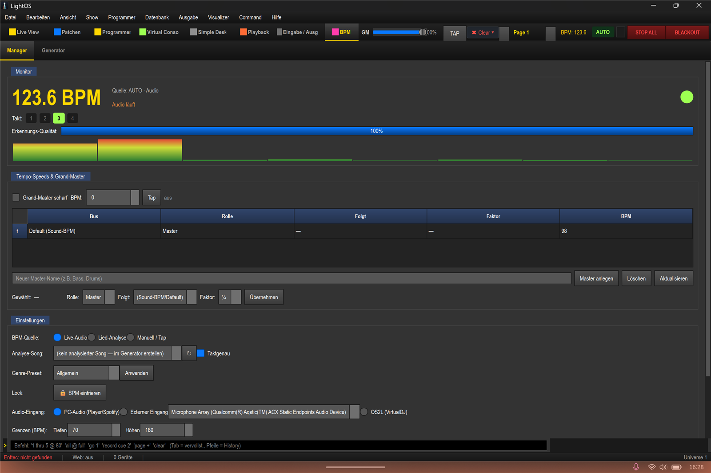
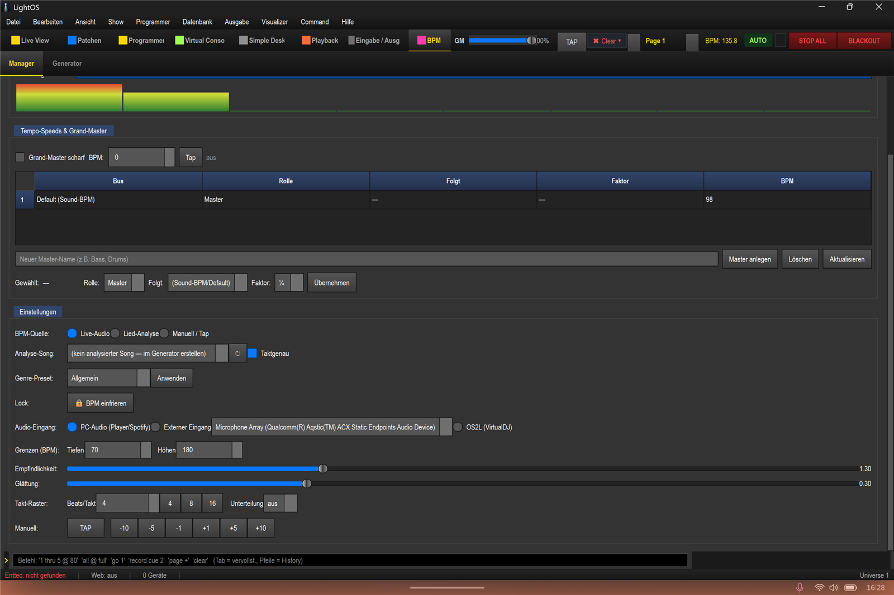
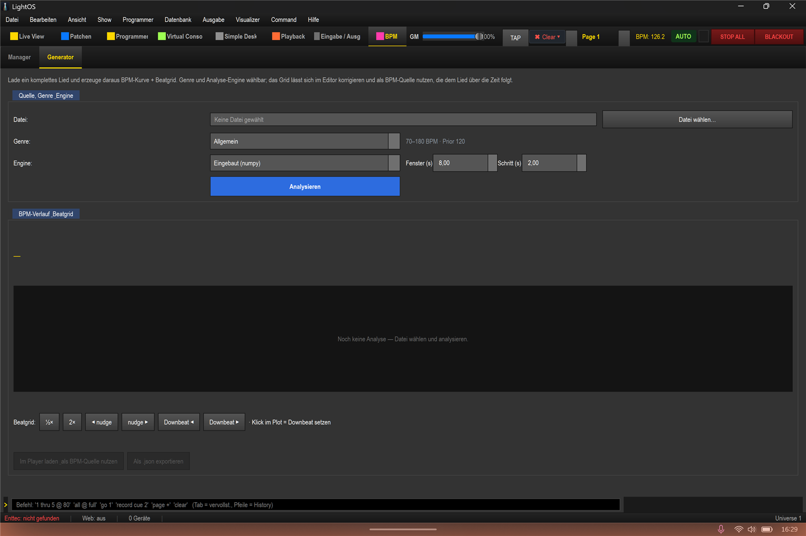

# BPM-Manager — die neuen Funktionen (Anleitung)

> **Was ist das?** Die BPM-Sektion in LightOS ist der zentrale **Tempo-Leader**: Sie
> erkennt das Tempo der Musik (oder lässt es dich vorgeben) und liefert die **Beats**,
> auf die sich alle tempo-gekoppelten Effekte (Matrix, EFX, Chaser, Sequenzen, VC)
> synchronisieren. Diese Anleitung erklärt die **neuen** Funktionen rund um den
> BPM-Manager: den Quellen-Umschalter, Genre-Presets, das Takt-Raster, die smartere
> Live-Erkennung, den **BPM-Generator** (ganzes Lied → Beatgrid) samt Analyse-Engines
> und Beatgrid-Editor sowie die **taktgenaue** Beat-Wiedergabe.
>
> **Öffnen:** Oben in der Sektionsleiste auf **BPM** klicken (oder Tastenkürzel **Strg+8**).
> Die Sektion hat jetzt zwei Unter-Tabs: **Manager** und **Generator**.

Stand: 2026-06-21. Verifiziert gegen die laufende App und den Quellcode
(`src/ui/views/bpm_manager_view.py`, `bpm_generator_view.py`,
`src/core/engine/bpm_manager.py`, `src/core/audio/{beat_detector,genre_presets,offline_timeline,analysis_engines,bpm_settings,music_show}.py`).

---

## 0. In 30 Sekunden: Welche BPM-Quelle nehme ich?

Im **Manager**-Tab unter *Einstellungen* ganz oben steht der wichtigste neue Schalter,
die **BPM-Quelle**. Er ist die einfache Hauptsteuerung — alles andere ist Feintuning.

| Du willst… | BPM-Quelle | Voraussetzung |
|---|---|---|
| dass das Licht **live zur laufenden Musik** läuft (DJ-Set, Party, Spotify) | **Live-Audio** | Musik läuft hörbar über den PC oder ein externes Signal |
| ein **vorbereitetes Lied** sauber & exakt zum Beat abspielen | **Lied-Analyse** | Song vorher im **Generator** analysiert |
| das Tempo **selbst vorgeben** (Bandprobe, Klick, kein verwertbares Audio) | **Manuell / Tap** | — |

> **Faustregel:** *Live-Audio* ist der Standard und für 90 % der Fälle richtig.
> *Lied-Analyse* lohnt sich, wenn ein bestimmter Track **taktgenau** sitzen muss.
> *Manuell* ist der Notnagel, wenn keine brauchbare Tonquelle da ist.

---

## 1. Der Manager-Tab

Der Manager-Tab besteht von oben nach unten aus drei Blöcken: **Monitor** (Anzeige),
**Tempo-Speeds & Grand-Master** (Bus-Tempi) und **Einstellungen** (alle Regler).

### 1.1 Monitor — was läuft gerade?

* **Große BPM-Zahl** (gelb): die aktuelle globale BPM. Grau/„-- BPM", wenn nichts erkannt wird.
* **Quelle:** zeigt, *welche* Quelle gerade führt — z. B. `AUTO · Audio`, `AUTO · Lied-Analyse`,
  `MANUAL · Tap`, `OS2L (extern)`. So siehst du auf einen Blick, woher das Tempo kommt.
* **Status** (orange): „Audio läuft" / „Audio gestoppt" oder eine Fehlermeldung des Eingangs.
* **Takt: 1 · 2 · 3 · 4** — die Zähl-Zellen leuchten im Takt mit; die **1** (Downbeat) ist
  gold, die anderen grün. Die Zahl der Zellen folgt dem **Takt-Raster** (s. u.).
* **Beat-Punkt** (rechts): blinkt auf jedem Beat.
* **Erkennungs-Qualität:** wie stabil/sicher die Live-Erkennung gerade ist (0–100 %).
  Hohe Werte = sauberer 4/4-Beat erkannt; niedrige Werte = unklares/wechselndes Signal.
* **Spektrum:** 8-Band-Pegelanzeige des Eingangssignals (nur Anzeige).

> **Wozu:** Der Monitor ist deine Kontrollinstanz. Wenn das Licht „daneben" läuft,
> schau zuerst hierher: Stimmt die Zahl? Führt die richtige Quelle? Ist die
> Erkennungs-Qualität hoch?

### 1.2 Tempo-Speeds & Grand-Master (kurz)

Diese Tabelle steuert die **Tempo-Busse** (eigene Tempi pro Effektgruppe, ½×/2× usw.)
und den **Grand-Master**, der bei Bedarf *alle* Master-Busse auf ein gemeinsames Tempo
zwingt. Das ist ein eigenes Thema — Details in
[ANLEITUNG_SPEED_BPM.md](../anleitung_speed_bpm/ANLEITUNG_SPEED_BPM.md). Für den
BPM-Manager reicht: der Bus **„Default (Sound-BPM)"** folgt automatisch der hier
erkannten/gesetzten globalen BPM.

### 1.3 Einstellungen — alle Regler im Detail

#### BPM-Quelle  (Live-Audio / Lied-Analyse / Manuell / Tap)
Der Hauptumschalter aus Abschnitt 0.

* **Einstellen:** Radio-Button anklicken.
* **Wozu:** schaltet im Hintergrund automatisch das Richtige — *Live-Audio* startet die
  Audio-Erkennung; *Lied-Analyse* schaltet Live-Audio ab und lässt die Song-Analyse führen;
  *Manuell* schaltet auf Hand-Tempo (Tap/Eingabe).
* **Use-Case:** Während eines Sets von „Live-Audio" auf „Lied-Analyse" wechseln, wenn ein
  besonders wichtiger, vorbereiteter Track kommt — danach zurück auf „Live-Audio".

#### Analyse-Song  (+ ↻ + „Taktgenau")
Nur relevant, wenn BPM-Quelle = **Lied-Analyse**.

* **Auswahl:** Liste aller Songs, die im **Generator** analysiert wurden (haben ein
  gespeichertes Beatgrid). `↻` aktualisiert die Liste. Ist nichts analysiert, steht hier
  „(kein analysierter Song — im Generator erstellen)".
* **„Taktgenau"** (Checkbox, standardmäßig **an**): Wenn aktiv, treffen die Beats **exakt
  das Beatgrid des Liedes** (nicht nur den BPM-Wert) — die Lichtshow sitzt also phasen-genau
  auf der Musik. Aus = es folgt nur der **BPM-Wert** (Phase läuft frei mit).
* **Wozu/Use-Case:** Für vorbereitete Tracks, bei denen jeder Hit sitzen soll (z. B. ein
  Drop, ein Break), willst du „Taktgenau" **an** lassen. Die Beat-Phase wird dabei beim
  Abspielen laufend an die echten Lied-Beats (inkl. Downbeats) angehängt.

> **Wichtig:** Die Lied-Analyse **führt nur, wenn Live-Audio aus ist** — der Live-Detektor
> hat im AUTO-Modus Vorrang. Genau deshalb schaltet die Quelle „Lied-Analyse" das
> Live-Audio automatisch ab. Außerdem muss der Song im **Musik-Tab abgespielt** werden,
> damit die Analyse dem Lied über die Zeit folgt.

#### Genre-Preset  (Dropdown + „Anwenden")
Ein Klick stellt **Tempo-Grenzen, Empfindlichkeit, Glättung und Takt** passend zum
Musikstil ein.

* **Einstellen:** Genre wählen → **Anwenden**. Die Regler darunter (Grenzen,
  Empfindlichkeit, Glättung, Beats/Takt) springen auf die Preset-Werte.
* **Wozu:** Der größte Hebel für **treffsichere** Erkennung ist ein **enges Tempo-Fenster**
  plus passender Tempo-Schwerpunkt. Damit verschwindet der häufigste Fehler — dass z. B.
  75 statt 150 BPM (halbes/doppeltes Tempo) erkannt wird.
* **Use-Case:** Vor einem Techno-Set einmal „Techno" anwenden → die Erkennung bleibt sicher
  im 125–140-BPM-Fenster und springt nicht mehr auf 65 BPM.

Die Presets (Werte aus `genre_presets.py`):

| Preset | Tempo-Fenster | Schwerpunkt (Prior) | Empfindl. | Glättung |
|---|---|---|---|---|
| Allgemein | 70–180 | 120 | 1.30 | 0.30 |
| House / Tech-House | 118–130 | 125 | 1.25 | 0.40 |
| Techno | 125–140 | 132 | 1.30 | 0.40 |
| Trance | 130–145 | 138 | 1.25 | 0.40 |
| Hardstyle / Rawstyle | 145–160 | 150 | 1.35 | 0.35 |
| Frenchcore / Uptempo | 180–230 | 200 | 1.45 | 0.30 |
| Drum & Bass | 165–180 | 174 | 1.40 | 0.30 |
| Dubstep | 135–145 | 140 | 1.35 | 0.35 |
| Trap / Hip-Hop | 70–100 | 85 | 1.25 | 0.35 |
| Pop / Rock | 90–140 | 120 | 1.20 | 0.30 |

#### Lock  („🔒 BPM einfrieren")
* **Einstellen:** Schalter umlegen.
* **Wozu:** Friert die aktuelle BPM **ein** — keine Quelle ändert sie mehr, bis du den Lock
  wieder löst. Use-Case: Das Tempo passt, du willst kurzes Reinreden des Detektors
  (Ansage, Stille, Übergang) **nicht** durchlassen.

#### Audio-Eingang  (PC-Audio / Externer Eingang / OS2L)
Das Detail-Setting für „Live-Audio": **woher** das Tonsignal kommt.

* **PC-Audio (Player/Spotify):** greift die PC-Wiedergabe ab (WASAPI-Loopback) — der
  eingebaute Player **und** Spotify/YouTube usw. laufen darüber. **Standard.**
* **Externer Eingang:** Mikrofon / Line-In (Gerät im Dropdown wählbar) — z. B. ein
  Mikro im Raum oder ein Mischpult-Ausgang.
* **OS2L (VirtualDJ):** das Tempo kommt vom externen DJ-Programm (VirtualDJ/Mixxx) über
  das OS2L-Protokoll, statt aus dem Audio.
* **Wozu/Use-Case:** „Externer Eingang" nimmst du, wenn die Musik **nicht** über diesen PC
  läuft (Fremd-DJ, Live-Band) — dann ein Mikro/Line-Signal anschließen. „OS2L" ist die
  präziseste Variante, wenn du ohnehin mit VirtualDJ auflegst.

#### Grenzen (BPM)  („Tiefen" / „Höhen")
Die untere und obere Grenze, in die die Erkennung das Tempo **faltet** (20–400 möglich).

* **Einstellen:** Zahlen für Tiefen (min) und Höhen (max) setzen.
* **Wozu:** Außerhalb liegende Schätzungen werden per **Oktav-Faltung** (×2 / ÷2) in dieses
  Fenster geholt. Ein enges Fenster verhindert das Halb-/Doppel-Tempo-Springen.
* **Tipp:** Meist über das **Genre-Preset** setzen lassen — manuell nur fürs Feintuning.

#### Empfindlichkeit  (0.50–3.00, Standard 1.30)
Wie stark ein Beat aus dem Bass herausragen muss, um zu zählen.
* **Niedriger** = empfindlicher (mehr Beats, auch leise) · **höher** = strenger (nur klare Beats).
* **Use-Case:** Bei basslastiger, „matschiger" Musik etwas höher; bei leisem/sauberem
  Material etwas niedriger.

#### Glättung  (0.00–1.00, Standard 0.30)
Wie träge der BPM-Wert reagiert (EMA-Glättung).
* **Höher** = stabiler, aber langsamer bei Tempowechsel · **niedriger** = reagiert schneller, zappelt aber eher.
* **Use-Case:** Für gleichmäßige Vier-zum-Boden-Sets ruhig höher; für Live-Bands mit
  Tempo-Schwankungen niedriger.

#### Takt-Raster  (Beats/Takt + Unterteilung) — *neu*
Bestimmt, **wann ein Takt beginnt** (Downbeat) und ob es **Zwischen-Ticks** gibt.

* **Beats/Takt** (1–32; Schnellwahl-Buttons **4 · 8 · 16**): Alle N Beats wird ein
  **Downbeat / Bar-Event** ausgelöst und die Takt-Zählung beginnt neu. 4 = klassischer
  Viertakt, 16 = „Sechzehntakt" (langer Bogen). **Ändert nicht** die Beat-Geschwindigkeit,
  nur die Takt-Einteilung.
* **Unterteilung** (aus, 1/2, 1/3, 1/4, 1/6, 1/8, 1/16): zusätzliche **Sub-Ticks pro Beat**
  für schnellere Effekte. Wirkt im **Timer-/Tap-/Datei-Modus**; bei Live-Audio gibt es nur
  die Beat-Rate (kein künstliches Unterteilen des erkannten Beats).
* **Wozu/Use-Case:**
  * *Beats/Takt 16* → ein Effekt, der „einmal pro Takt" etwas tut (Farbwechsel, Chase-Reset,
    Downbeat-Flash), löst nur alle 16 Beats aus → ruhige, große Bögen statt Geflacker.
  * *Unterteilung 1/2 oder 1/4* → ein Strobe/Chase, der „auf jeden Beat" läuft, läuft
    doppelt/vierfach so schnell, ohne die globale BPM zu ändern.

#### Manuell  (TAP + Nudge −10 −5 −1 +1 +5 +10)
* **TAP:** im Takt mehrmals klicken → setzt die BPM aus deinem Tipp-Tempo (schaltet auf MANUAL).
* **Nudge** (±1/±5/±10): die aktuelle BPM in Schritten anheben/absenken — zum Feinjustieren,
  wenn die Erkennung leicht daneben liegt.

---

## 2. Der Generator-Tab — ganzes Lied → Beatgrid

Der **Generator** analysiert ein **komplettes Lied** offline und erzeugt daraus eine
**BPM-Kurve über die Zeit** plus ein **echtes Beatgrid** (die exakten Beat-Zeitpunkte).
Das Ergebnis kannst du im Editor korrigieren und dann als **BPM-Quelle** verwenden, die dem
Lied beim Abspielen folgt — die Grundlage für die **taktgenaue** Wiedergabe aus Abschnitt 1.3.

> **Warum überhaupt?** Live-Erkennung schätzt das Tempo *im Moment*. Bei einem vorbereiteten
> Track ist eine **einmalige Komplett-Analyse** genauer: Sie sieht das ganze Lied, erkennt
> Tempowechsel ehrlich und legt ein phasen-genaues Raster — wie das Beatgrid in VirtualDJ/Serato.

### 2.1 Schritt für Schritt

1. **Datei wählen…** — Audiodatei laden. Unterstützt: `.mp3 .m4a .mp4 .aac .flac .ogg .wav`
   (über die System-Codecs; `.wav` läuft direkt).
2. **Genre** wählen — setzt das Tempo-Fenster + den Schwerpunkt für die Analyse
   (z. B. „Allgemein · 70–180 BPM · Prior 120"). Gleiche Presets wie im Manager.
3. **Engine** wählen (siehe 2.2).
4. Optional **Fenster (s)** und **Schritt (s)** anpassen: das gleitende Analyse-Fenster
   (Standard 8 s Fenster, alle 2 s ein Stützpunkt). Größeres Fenster = ruhigere Kurve,
   kleinerer Schritt = feinere Auflösung.
5. **Analysieren** klicken. Das Lied wird dekodiert und analysiert (läuft im Hintergrund,
   die Oberfläche bleibt bedienbar).
6. Ergebnis prüfen: Über dem Plot stehen **Kennzahlen** (Ø / Median / Min–Max / „stabil"
   oder „wechselnd" / Anzahl Beats / Dauer / Engine). Der Plot zeigt die **BPM-Kurve** (gelb)
   und darunter das **Beatgrid** (Beats blau, **Downbeats pink**).
7. Bei Bedarf im **Beatgrid-Editor** korrigieren (siehe 2.3).
8. **„Im Player laden & als BPM-Quelle nutzen"** — lädt den Song in den Player, hängt das
   Beatgrid an und schaltet Live-Audio ab. Danach im **Musik-Tab abspielen**: die BPM (und
   bei „Taktgenau" die Beat-Phase) folgt dem Lied über die Zeit.
9. Optional **„Als .json exportieren"** — Beatgrid/BPM-Kurve als Datei sichern.

### 2.2 Analyse-Engines

Drei austauschbare Engines; alle liefern dasselbe Format (BPM-Kurve + Beatgrid). Nicht
installierte Engines werden im Dropdown als „nicht installiert" markiert und fallen sauber
auf die eingebaute Engine zurück (kein Absturz).

| Engine | Was | Wann |
|---|---|---|
| **Eingebaut (numpy)** | Multiband-Onset + Phasen-Fit-Beatgrid; immer verfügbar | Schnell, kein Zusatz nötig — guter Standard |
| **librosa (DP-Beat-Tracking)** | Klassischer Beat-Tracker (Ellis) + dynamisches Tempo | Saubere Studio-Tracks, robustes Grid |
| **Beat This! (SOTA / KI)** | Transformer-Modell (ISMIR 2024), inkl. echter Downbeats | Höchste Genauigkeit, auch knifflige Stücke |

> Auf diesem System sind **alle drei** Engines installiert und auswählbar
> (`numpy`, `librosa`, `torch`+`beat_this`).

### 2.3 Beatgrid-Editor

Sitzt das Raster nicht perfekt, korrigierst du es per Knopf — wie bei VirtualDJ/Serato:

* **½×** / **2×** — Beat-Dichte halbieren/verdoppeln (falsches Oktav-Tempo korrigieren).
* **◀ nudge** / **nudge ▶** — das ganze Grid um 8 ms nach vorne/hinten schieben (Offset).
* **Downbeat ◀** / **Downbeat ▶** — den **Taktanfang** um einen Beat verschieben.
* **Klick im Plot** = den **Downbeat** an die geklickte Stelle setzen.

Jede Änderung leitet die BPM-Kurve neu ab und aktualisiert die Anzeige.

---

## 3. „Taktgenau" — wie die Lichtshow exakt auf dem Lied sitzt

Wenn du einen analysierten Song als **Lied-Analyse**-Quelle abspielst und **„Taktgenau"**
aktiv ist, passiert beim Abspielen Folgendes:

* Der Player meldet seine Position (relativ grob, ~¼–1 s). LightOS hängt das **Beatgrid** an
  dieser Position an und **interpoliert mit einem schnellen 15-ms-Timer** dazwischen — so
  wird **jeder Lied-Beat exakt** ausgelöst, **Downbeats** richten die Takt-Phase aus.
* Damit ist das Grid die **alleinige Beat-Quelle** (statt des freilaufenden Timers): Es gilt
  immer **genau eine** Beat-Quelle — Timer **oder** Live-Audio **oder** Beatgrid.
* **„Taktgenau" aus:** Dann folgt nur der **BPM-Wert** dem Lied; die Beat-Phase läuft über
  den freilaufenden Timer (kann minimal „weglaufen"). Reicht, wenn nur das Tempo, nicht die
  exakte Phase zählt.

**Voraussetzungen:** Song im Generator analysiert (Beatgrid vorhanden) · Quelle „Lied-Analyse" ·
Live-Audio aus · Song läuft im Musik-Tab · Pause/Stop hält die taktgenaue Wiedergabe an.

---

## 4. Smartere Live-Erkennung (läuft automatisch im Hintergrund)

Die Live-Erkennung wurde robuster gemacht — du musst dafür nichts einstellen, aber gut zu wissen:

* **Robuste Tempo-Schätzung (Median + Ausreißer-Filter):** Statt eines flachen Mittelwerts
  über viele Schläge nimmt LightOS die **letzten ≤ 9 Beats**, bildet deren **Median** als
  Bezug, **verwirft Ausreißer (±35 % vom Median)** und mittelt nur die verbliebenen Werte.
  Verpasste oder doppelte Schläge ziehen den Wert nicht mehr weg, und Tempowechsel kommen
  schneller durch.
* **Oktav-Faltung mit Kontinuität:** Halb-/Doppel-Tempo-Passagen springen nicht mehr hin und
  her — die zur bisherigen BPM **nächstliegende** Oktave wird gehalten.
* **Stille-Re-Lock:** Nach ~3 s **Stille** wird der alte BPM-Zustand verworfen, damit der
  nächste Einsatz **frisch** einrastet (statt das alte Tempo „festzuhalten").
* **Erkennungs-Qualität:** Der Prozentbalken im Monitor zeigt, wie stabil die Schätzungen
  gerade sind — dein Indikator, ob die Erkennung dem Signal traut.

---

## 5. Persistenz & Standardwerte

Alle Einstellungen liegen user-global in `%APPDATA%/LightOS/ui_prefs.json` (Block
`bpm_settings`) und werden beim Start angewandt. Standardwerte (`bpm_settings.py`):

| Einstellung | Standard |
|---|---|
| AUTO beim Start | an |
| Grenzen (Tiefen/Höhen) | 60 / 200 BPM |
| Empfindlichkeit | 1.30 |
| Glättung | 0.30 |
| Audio-Eingang | PC-Audio (Loopback) |
| Beats/Takt · Unterteilung | 4 · aus |
| Taktgenau | an |

Das **analysierte Beatgrid** eines Songs wird in der Show-Playlist mitgespeichert (mit dem
Track) — eine einmal analysierte Datei bleibt also über Sitzungen hinweg als BPM-Quelle nutzbar.

---

## 6. Use-Case-Szenarien (Zusammenfassung)

* **DJ-Set / Party (Spotify, Fremd-DJ):** BPM-Quelle **Live-Audio**, Audio-Eingang **PC-Audio**
  (oder **Externer Eingang** bei Fremd-DJ). Vorab das passende **Genre-Preset** anwenden.
* **VirtualDJ:** Audio-Eingang **OS2L** → präzises Tempo direkt vom DJ-Programm.
* **Wichtiger vorbereiteter Track, alles muss sitzen:** im **Generator** analysieren (Engine
  *Beat This!* für maximale Genauigkeit), ggf. im **Beatgrid-Editor** nachziehen,
  **„Im Player laden"**, Quelle **Lied-Analyse**, **„Taktgenau" an**, im Musik-Tab abspielen.
* **Bandprobe / kein verwertbares Audio:** Quelle **Manuell / Tap**, Tempo per **TAP** geben,
  mit **Nudge** feinjustieren, bei Bedarf **Lock**.
* **Schnelle/langsame Effekte ohne Tempowechsel:** **Takt-Raster** nutzen — Beats/Takt für
  große Bögen, Unterteilung für schnellere Strobes/Chases.

---

## 7. Stolpersteine

* **„Lied-Analyse" tut nichts:** Läuft Live-Audio noch? Es hat im AUTO Vorrang — die Quelle
  „Lied-Analyse" schaltet es ab; prüfe, dass der Song wirklich **abgespielt** wird.
* **Tempo erkannt, aber halb/doppelt:** **Genre-Preset** anwenden (engt das Fenster ein) oder
  die **Grenzen** manuell setzen.
* **Erkennung zappelt:** **Glättung** erhöhen. **Erkennung träge:** Glättung senken.
* **Unterteilung wirkt nicht bei Live-Audio:** Sub-Ticks gibt es nur im Timer-/Tap-/Datei-Modus
  — bei Live-Audio kommt nur die echte Beat-Rate (so gewollt).
* **Datei lässt sich nicht analysieren:** Fehlt evtl. der System-Codec — als `.wav`
  konvertieren und erneut versuchen.

---

## Verwandte Anleitungen

* [Tempo / Speed / Master-Sub / Grand-Master](../anleitung_speed_bpm/ANLEITUNG_SPEED_BPM.md)
* [Musik-Synchronisation](../anleitung_musik_sync/ANLEITUNG_MUSIK_SYNC.md)
