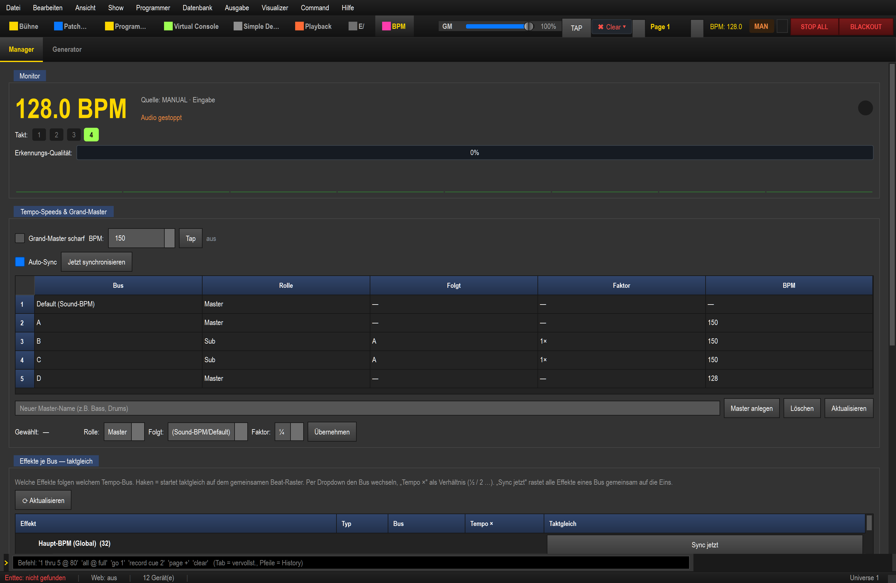
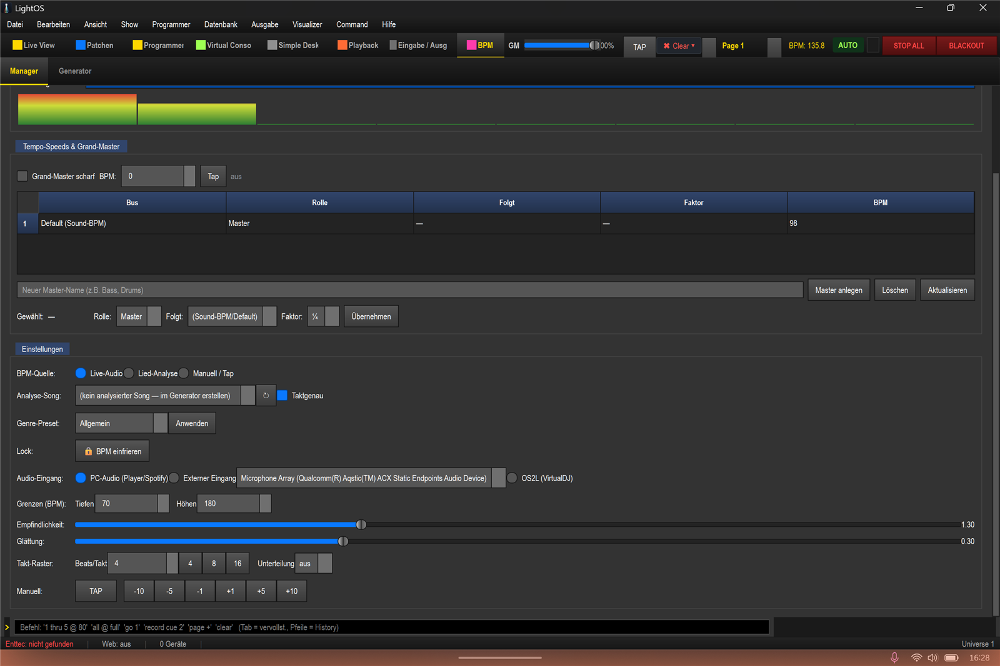
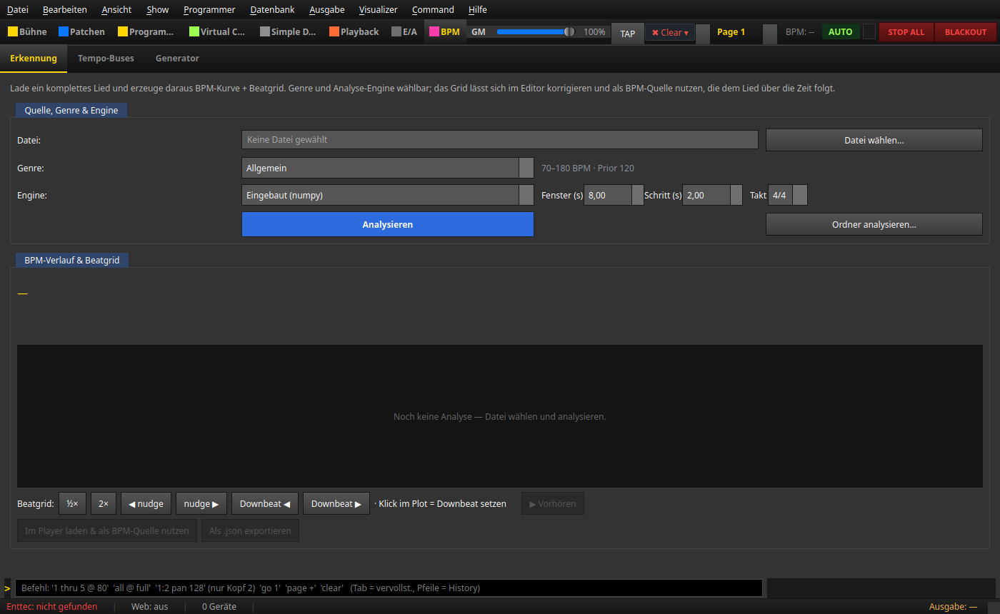

# BPM-Manager — die neuen Funktionen (Anleitung)

> **Was ist das?** Die BPM-Sektion in LightOS ist der zentrale **Tempo-Leader**: Sie
> erkennt das Tempo der Musik (oder lässt es dich vorgeben) und liefert die **Beats**,
> auf die sich alle tempo-gekoppelten Effekte (Matrix, EFX, Chaser, Sequenzen, VC)
> synchronisieren. Diese Anleitung erklärt den Sub-Tab **„Erkennung"** (Quelle, TAP,
> Auto | Manuell, ×½/×2, „Erweitert"), die Live-Erkennung, den **BPM-Generator**
> (ganzes Lied → Beatgrid) samt Analyse-Engines und Beatgrid-Editor sowie die
> **taktgenaue** Beat-Wiedergabe.
>
> **Öffnen:** Oben in der Sektionsleiste auf **BPM** klicken (oder Tastenkürzel **Strg+8**).
> Die Sektion hat drei Unter-Tabs: **Erkennung | Tempo-Buses | Generator**.

Stand: 2026-09-14 (Sub-Tab „Erkennung", BPM-09). Verifiziert gegen den Quellcode
(`src/ui/views/bpm_manager_view.py`, `bpm_generator_view.py`, `src/ui/bpm_tap_helper.py`,
`src/ui/bpm_source_controller.py`, `src/core/engine/bpm_manager.py`,
`src/core/audio/{beat_detector,genre_presets,offline_timeline,analysis_engines,bpm_settings,music_show}.py`).
Die Bilder unten zeigen noch den früheren Manager-Tab (bis 2026-09-14) — die Beschriftungen
im Text gelten.

---

## 0. In 30 Sekunden: Welche Quelle nehme ich?

Im Sub-Tab **Erkennung** steht oben rechts die Liste **Quelle**. Sie ist die einfache
Hauptsteuerung — alles andere ist Feintuning.

| Du willst… | Quelle | Voraussetzung |
|---|---|---|
| dass das Licht **live zur laufenden Musik** läuft (Spotify, Player auf diesem PC) | **PC-Audio** (Standard-Ausgabe) oder **PC-Audio: <Ausgabegerät>** | Musik läuft hörbar über den PC (bzw. über dieses Ausgabegerät) |
| Musik von **außen** (Fremd-DJ, Mischpult, Live-Band) | **Eingang: <Gerät>** | Mikro/Line-In/Interface angeschlossen |
| das Tempo **vom DJ-Programm** (VirtualDJ, Mixxx) | **OS2L (DJ-Software)** | OS2L im DJ-Programm aktiviert |
| ein **vorbereitetes Lied** sauber & exakt zum Beat abspielen | **Lied-Analyse (Player)** | Song vorher im **Generator** analysiert und im Player geladen |
| das Tempo **selbst vorgeben** (Bandprobe, Klick, kein verwertbares Audio) | beliebig + **Manuell** (oder **Aus**) | — |

> **Faustregel:** *PC-Audio* bzw. *Eingang* ist der Standard und für 90 % der Fälle richtig.
> *Lied-Analyse* lohnt sich, wenn ein bestimmter Track **taktgenau** sitzen muss.
> *Manuell* + **TAP** ist der Notnagel, wenn keine brauchbare Tonquelle da ist.

---

## 1. Der Sub-Tab „Erkennung"

Die Standardansicht hat **genau sechs Bedienelemente** — mehr braucht es im Betrieb nicht:

| # | Element | Was es tut |
|---|---|---|
| 1 | **Quelle** (Liste) | PC-Audio (folgt dem Standard-Ausgabegerät) · PC-Audio: <Ausgabegerät> (je Lautsprecher/HDMI/USB-Ausgang ein Eintrag) · Eingang: <Gerät> (je Eingang ein Eintrag) · OS2L (DJ-Software) · Lied-Analyse (Player) · Aus. Die Liste liest die Geräte beim Öffnen neu; ein gespeichertes, gerade nicht vorhandenes Gerät steht als „(nicht gefunden)" drin. Was du wählst, wird gemerkt. |
| 2 | **TAP** (großer Knopf) | **Zwei Rollen:** *einmal* tippen = Beat-Punkt auf „jetzt" setzen, wenn er neben der Musik blinkt (Tempo bleibt). *Viermal im Takt* tippen = Tempo setzen (zwei Tipps ändern noch nichts — ein Doppelklick kippt nicht nach Manuell); ab dem dritten Tipp sucht die Erkennung um dieses Tempo (und entscheidet damit auch Halb/Doppel). Der TAP oben in der Kopfzeile ist derselbe Knopf. |
| 3 | **Auto \| Manuell** | **Auto** folgt der Quelle. **Manuell** hält dein Tempo (TAP/Nudge) — die Quelle ändert es nicht, läuft aber im Hintergrund weiter (das Zustandswort zeigt, was sie erkennen würde). |
| 4 | **×½** | Halbes Tempo mit einem Klick: läuft das Licht doppelt so schnell wie die Musik. In Auto zwingt das die Erkennung auf die halbe Oktave, in Manuell halbiert es dein Tempo. |
| 5 | **×2** | Doppeltes Tempo — das Gegenstück. Tipp: ein enger Tempo-Bereich (Erweitert) verhindert den Fehler dauerhaft. |
| 6 | **▸ Erweitert** | Klappt die Feineinstellungen auf (Abschnitt 1.3). Bleibt nur für die Sitzung offen. |

### 1.1 Anzeigen — was läuft gerade?

* **Große BPM-Zahl:** gelb = Auto, grün = Manuell, grau „--" = kein Tempo.
* **Pegelmeter** direkt unter der BPM-Zahl (nur bei PC-Audio/Eingang; reine Anzeige):
  der Balken zeigt, wie laut das Signal ankommt (−60 bis 0 dBFS, gemittelt über 0,3 s).
  **Grün** = gut für die Erkennung (Zielbereich **−30 bis −6 dBFS**, heller Streifen im
  Hintergrund) · **gelb** = knapp daneben (etwas leise bzw. schon heiß) · **grau** = zu leise
  oder kein Signal (unter −45 dBFS: Kabel, Gerät, Lautstärke am Mischpult prüfen) ·
  **rot** = zu laut (über −3 dBFS). Der **helle Strich** hält die letzte Spitze kurz fest
  und fällt dann langsam ab. **CLIP** (rotes Feld rechts, bleibt 1 s stehen) = das Signal
  übersteuert — Mischpult/Eingangsverstärkung runterdrehen, bis CLIP weg ist und der
  Balken im grünen Bereich pendelt.
* **Beat-Punkt + Taktzellen 1 · 2 · 3 · 4:** blinken im Takt mit; die **1** (Downbeat) ist
  gold. Die Zahl der Zellen folgt **Beats/Takt** (Erweitert).
* **Zustandswort** (immer sichtbar, nie nur Farbe):
  **KEIN SIGNAL** — nichts zu hören (Kabel? richtiges Gerät? läuft die Musik über diesen
  Ausgang?) · **SUCHT** — Signal da, das Analysefenster füllt sich (~4 s nach Start oder
  Quellenwechsel) · **EINGERASTET** — Beats laufen · **PAUSE · hält 128** — Stille, das Tempo
  wird gehalten und die Beats laufen weiter (nach 10 s Stille wird losgelassen) ·
  **MANUELL** — du gibst das Tempo vor · **OS2L · wartet auf DJ-Software** — Server läuft,
  kein Client · **LIED-ANALYSE** / **AUS**.
* **Quelle-Text** neben dem Zustandswort: wer die BPM zuletzt gesetzt hat (Audio, Tap,
  Nudge, Lied-Analyse, OS2L) und ob **🔒** eingefroren ist.
* **Konfidenz:** wie sicher die Erkennung ist (0–100 %). Hoch = klarer Beat; niedrig =
  unklares Signal, Pause, Sprache.
* **Status-Zeile** (orange): erscheint nur bei einem Eingangs-Fehler („⚠ …").

> **Wozu:** Wenn das Licht „daneben" läuft, schau zuerst hierher: Stimmt die Zahl? Sagt
> das Zustandswort EINGERASTET? Ist die Konfidenz hoch? Blinkt der Punkt neben der Musik →
> **TAP** einmal.

### 1.2 Tempo-Speeds & Grand-Master (kurz — Sub-Tab „Tempo-Buses")

Der Sub-Tab **„Tempo-Buses"** steuert die **Tempo-Busse** (eigene Tempi pro Effektgruppe, ½×/2× usw.)
und den **Grand-Master**, der bei Bedarf *alle* Master-Busse auf ein gemeinsames Tempo
zwingt. Das ist ein eigenes Thema — Details in
[ANLEITUNG_SPEED_BPM.md](../anleitung_speed_bpm/ANLEITUNG_SPEED_BPM.md). Für die
Erkennung reicht: der Bus **„Default (Sound-BPM)"** folgt automatisch der hier
erkannten/gesetzten globalen BPM.

### 1.3 „Erweitert" — die Feineinstellungen

Aufklappen mit **▸ Erweitert**. Elf Bedienelemente, alle werden gespeichert:

#### Tempo-Bereich  (von / bis, 20–400 BPM) + „Vorlage ▾"
Die untere und obere Grenze, in die die Erkennung das Tempo **faltet**.

* **Wozu:** Außerhalb liegende Schätzungen werden per **Oktav-Faltung** (×2 / ÷2) in dieses
  Fenster geholt. Ein enges Fenster verhindert das Halb-/Doppel-Tempo-Springen dauerhaft
  (×½/×2 sind die Einmal-Korrektur).
* **„Vorlage ▾":** Menü mit den Genre-Bereichen — setzt **nur** Tempo-Bereich und Beats/Takt:

| Vorlage | Tempo-Bereich | Vorlage | Tempo-Bereich |
|---|---|---|---|
| Allgemein | 70–180 | Frenchcore / Uptempo | 180–230 |
| House / Tech-House | 118–130 | Drum & Bass | 165–180 |
| Techno | 125–140 | Dubstep | 135–145 |
| Trance | 130–145 | Trap / Hip-Hop | 70–100 |
| Hardstyle / Rawstyle | 145–160 | Pop / Rock | 90–140 |

* **Use-Case:** Vor einem Techno-Set einmal „Techno" wählen → die Erkennung bleibt sicher
  im 125–140-BPM-Fenster und springt nicht mehr auf 65 BPM.

#### Beats/Takt  (1–32)
Alle N Beats wird ein **Downbeat / Bar-Event** ausgelöst und die Takt-Zählung beginnt neu.
4 = klassischer Viertakt, 16 = „Sechzehntakt" (langer Bogen). **Ändert nicht** die
Beat-Geschwindigkeit, nur die Takt-Einteilung. Auch der Takt-1-Akzent des Beat-Punkts in
der Kopfzeile folgt diesem Wert.

#### Beat-Latenz  (−300 … +300 ms)
Beats **früher (+)** oder **später (−)** melden — gleicht die Laufzeit von Audio-Weg und
Lichtausgabe aus. Wenn das Licht hörbar hinter dem Beat liegt: in 5-ms-Schritten ins Plus.

#### Tempo einfrieren  („🔒 Tempo einfrieren")
Friert die aktuelle BPM **ein** — keine Quelle ändert sie mehr, bis du den Schalter wieder
löst; die Beats laufen weiter. Use-Case: Das Tempo passt, du willst kurzes Reinreden der
Erkennung (Ansage, Stille, Übergang) **nicht** durchlassen.

#### Nudge  (−5 · −1 · +1 · +5)
Die aktuelle BPM in Schritten anheben/absenken — zum Feinjustieren, wenn die Erkennung
leicht daneben liegt (schaltet auf Manuell).

#### Taktgenau  (Checkbox, standardmäßig an)
Nur für die Quelle **Lied-Analyse**: Wenn aktiv, treffen die Beats **exakt das Beatgrid
des Liedes** (nicht nur den BPM-Wert) — die Lichtshow sitzt phasen-genau auf der Musik.
Aus = es folgt nur der **BPM-Wert** (Phase läuft frei mit). Details in Abschnitt 3.

#### Diagnose + Spektrum  (nur Anzeige)
Rohwerte des Detektors: Roh-Tempo, Alternativ-Oktave mit Wert, Fensterfüllung, Pegel,
Rauschteppich, Brumm (50/60 Hz, Anteil), DC, Jitter, Rückstand, Beat-Kontrast, gesetzter
Tempo-Hinweis. Darunter das 8-Band-**Spektrum** des Eingangssignals. Beides hilft, wenn
etwas nicht erkannt wird (Brummanteil hoch? Pegel −70 dBFS = nichts da?).

> **Entfernt seit 2026-09-14:** Empfindlichkeit, Glättung, Genre-Preset + Anwenden (entfernt),
> Analyse-Song + ↻ (entfernt), Schnellwahl 4/8/16, Unterteilung, Nudge ±10 (entfernt), der
> 🔒-Knopf in der Standardansicht. Die neue Erkennung (seit BPM-06) kalibriert sich selbst; die
> Genre-Bereiche gibt es unter „Vorlage ▾" weiter; die Lied-Analyse nimmt den Titel, der
> im Player geladen ist; „Tempo einfrieren" steht in „Erweitert".

---

## 2. Der Generator-Tab — ganzes Lied → Beatgrid

Der **Generator** analysiert ein **komplettes Lied** offline und erzeugt daraus eine
**BPM-Kurve über die Zeit** plus ein **echtes Beatgrid** (die exakten Beat-Zeitpunkte).
Das Ergebnis kannst du im Editor korrigieren und dann als **BPM-Quelle** verwenden, die dem
Lied beim Abspielen folgt — die Grundlage für die **taktgenaue** Wiedergabe aus Abschnitt 1.3.

> **Warum überhaupt?** Live-Erkennung schätzt das Tempo *im Moment*. Bei einem vorbereiteten
> Track ist eine **einmalige Komplett-Analyse** genauer: Sie sieht das ganze Lied, erkennt
> Tempowechsel ehrlich und legt ein phasen-genaues Raster — wie das Beatgrid in VirtualDJ/Serato.

### 2.1 Schritt für Schritt

1. **Datei wählen…** — Audiodatei laden. Unterstützt: `.mp3 .m4a .mp4 .aac .flac .ogg .wav`
   (über die System-Codecs; `.wav` läuft direkt).
2. **Genre** wählen — setzt das Tempo-Fenster + den Schwerpunkt für die Analyse
   (z. B. „Allgemein · 70–180 BPM · Prior 120"). Gleiche Presets wie im Manager.
3. **Engine** wählen (siehe 2.2).
4. Optional **Fenster (s)** und **Schritt (s)** anpassen: das gleitende Analyse-Fenster
   (Standard 8 s Fenster, alle 2 s ein Stützpunkt). Größeres Fenster = ruhigere Kurve,
   kleinerer Schritt = feinere Auflösung.
5. **Analysieren** klicken. Das Lied wird dekodiert und analysiert (läuft im Hintergrund,
   die Oberfläche bleibt bedienbar).
6. Ergebnis prüfen: Über dem Plot stehen **Kennzahlen** (Ø / Median / Min–Max / „stabil"
   oder „wechselnd" / Anzahl Beats / Dauer / Engine). Der Plot zeigt die **BPM-Kurve** (gelb)
   und darunter das **Beatgrid** (Beats blau, **Downbeats pink**).
7. Bei Bedarf im **Beatgrid-Editor** korrigieren (siehe 2.3).
8. **„Im Player laden & als BPM-Quelle nutzen"** — lädt den Song in den Player, hängt das
   Beatgrid an und schaltet Live-Audio ab. Danach im **Musik-Tab abspielen**: die BPM (und
   bei „Taktgenau" die Beat-Phase) folgt dem Lied über die Zeit.
9. Optional **„Als .json exportieren"** — Beatgrid/BPM-Kurve als Datei sichern.

### 2.2 Analyse-Engines

Drei austauschbare Engines; alle liefern dasselbe Format (BPM-Kurve + Beatgrid). Nicht
installierte Engines werden im Dropdown als „nicht installiert" markiert und fallen sauber
auf die eingebaute Engine zurück (kein Absturz).

| Engine | Was | Wann |
|---|---|---|
| **Eingebaut (numpy)** | Multiband-Onset + Phasen-Fit-Beatgrid; immer verfügbar | Schnell, kein Zusatz nötig — guter Standard |
| **librosa (DP-Beat-Tracking)** | Klassischer Beat-Tracker (Ellis) + dynamisches Tempo | Saubere Studio-Tracks, robustes Grid |
| **Beat This! (SOTA / KI)** | Transformer-Modell (ISMIR 2024), inkl. echter Downbeats | Höchste Genauigkeit, auch knifflige Stücke |

> Auf diesem System sind **alle drei** Engines installiert und auswählbar
> (`numpy`, `librosa`, `torch`+`beat_this`).

### 2.3 Beatgrid-Editor

Sitzt das Raster nicht perfekt, korrigierst du es per Knopf — wie bei VirtualDJ/Serato:

* **½×** / **2×** — Beat-Dichte halbieren/verdoppeln (falsches Oktav-Tempo korrigieren).
* **◀ nudge** / **nudge ▶** — das ganze Grid um 8 ms nach vorne/hinten schieben (Offset).
* **Downbeat ◀** / **Downbeat ▶** — den **Taktanfang** um einen Beat verschieben.
* **Klick im Plot** = den **Downbeat** an die geklickte Stelle setzen.

Jede Änderung leitet die BPM-Kurve neu ab und aktualisiert die Anzeige.

---

## 3. „Taktgenau" — wie die Lichtshow exakt auf dem Lied sitzt

Wenn du einen analysierten Song als **Lied-Analyse**-Quelle abspielst und **„Taktgenau"**
aktiv ist, passiert beim Abspielen Folgendes:

* Der Player meldet seine Position (relativ grob, ~¼–1 s). LightOS hängt das **Beatgrid** an
  dieser Position an und **interpoliert mit einem schnellen 15-ms-Timer** dazwischen — so
  wird **jeder Lied-Beat exakt** ausgelöst, **Downbeats** richten die Takt-Phase aus.
* Damit ist das Grid die **alleinige Beat-Quelle** (statt des freilaufenden Timers): Es gilt
  immer **genau eine** Beat-Quelle — Timer **oder** Live-Audio **oder** Beatgrid.
* **„Taktgenau" aus:** Dann folgt nur der **BPM-Wert** dem Lied; die Beat-Phase läuft über
  den freilaufenden Timer (kann minimal „weglaufen"). Reicht, wenn nur das Tempo, nicht die
  exakte Phase zählt.

**Voraussetzungen:** Song im Generator analysiert (Beatgrid vorhanden) · Quelle **Lied-Analyse
(Player)** (schaltet das Live-Audio ab) · **Auto** · Song läuft im Musik-Tab · Pause/Stop hält
die taktgenaue Wiedergabe an.

---

## 4. Die Live-Erkennung (läuft automatisch im Hintergrund)

Seit 2026-09-14 (BPM-06) arbeitet eine neue Erkennung (Spectral Flux + Autokorrelation) —
du musst dafür nichts einstellen, aber gut zu wissen:

* **Selbstkalibrierend:** Das Signal wird je Frequenzband auf seinen eigenen Pegel normiert
  („Whitening") — Empfindlichkeit und Glättung gibt es deshalb nicht mehr. Netzbrumm, kurze
  Onsets und stoßweise Audio-Chunks stören nicht.
* **Einrasten dauert ~4 s:** Nach Start oder Quellenwechsel füllt sich erst das Analysefenster
  (Zustandswort **SUCHT**); vorher werden keine Beats gemeldet. Schneller: **TAP** drei-,
  viermal im Takt — die Erkennung sucht dann um dein Tempo.
* **Oktave:** Der Tempo-Bereich (Erweitert) entscheidet, welche Oktave gilt; **×½ / ×2**
  korrigieren einmalig, ein TAP-Tempo setzt die Oktave ebenfalls.
* **Stille:** Das Tempo wird **gehalten** (Zustandswort **PAUSE · hält N**, Beats laufen
  weiter) und nach 10 s Stille losgelassen (**KEIN SIGNAL**) — der nächste Einsatz rastet
  frisch ein. **Manuell** hält das Tempo beliebig lange.
* **Konfidenz:** Der Balken zeigt, wie sicher die Erkennung ist (Periodizität × Beat-Kontrast);
  Beats werden nur im Zustand EINGERASTET gemeldet.

---

## 5. Persistenz & Standardwerte

Alle Einstellungen liegen user-global in `%APPDATA%/LightOS/ui_prefs.json` (Block
`bpm_settings`) und werden beim Start angewandt. Standardwerte (`bpm_settings.py`):

| Einstellung | Standard |
|---|---|
| Quelle · Gerät | PC-Audio · (kein Eingangsgerät) |
| Modus | Auto |
| Tempo-Bereich | 60 / 200 BPM |
| Beats/Takt | 4 |
| Beat-Latenz | 0 ms |
| Taktgenau | an |

Die Sektion trägt ein Versionsfeld (v3 seit 2026-09-14). Alte Dateien werden beim ersten
Start übernommen (Tempo-Bereich, Gerät, Takt); die früheren Werte Empfindlichkeit, Glättung
und Unterteilung (bis 2026-09-14) werden verworfen und einmal ins Log geschrieben. Nicht gespeichert werden
„Tempo einfrieren", ×½/×2 und der Aufklapp-Zustand von „Erweitert".

Das **analysierte Beatgrid** eines Songs wird in der Show-Playlist mitgespeichert (mit dem
Track) — eine einmal analysierte Datei bleibt also über Sitzungen hinweg als BPM-Quelle nutzbar.

---

## 6. Use-Case-Szenarien (Zusammenfassung)

* **DJ-Set / Party (Spotify, Fremd-DJ):** Quelle **PC-Audio** (oder **Eingang: <Gerät>** bei
  Fremd-DJ), **Auto**. Vorab in „Erweitert" die passende **Vorlage** wählen.
* **VirtualDJ:** Quelle **OS2L (DJ-Software)** → präzises Tempo direkt vom DJ-Programm.
* **Wichtiger vorbereiteter Track, alles muss sitzen:** im **Generator** analysieren (Engine
  *Beat This!* für maximale Genauigkeit), ggf. im **Beatgrid-Editor** nachziehen,
  **„Im Player laden"**, Quelle **Lied-Analyse (Player)**, **„Taktgenau" an**, im Musik-Tab
  abspielen.
* **Bandprobe / kein verwertbares Audio:** **Manuell**, Tempo per **TAP** (3–4× im Takt) geben,
  mit **Nudge** feinjustieren, bei Bedarf **Tempo einfrieren**.
* **Beat-Punkt blinkt neben der Musik:** einmal **TAP** — setzt die Phase, das Tempo bleibt.
* **Große Bögen ohne Tempowechsel:** **Beats/Takt** hochsetzen (8/16) — ein Effekt „einmal pro
  Takt" läuft dann nur alle 8/16 Beats.

---

## 7. Stolpersteine

* **„Lied-Analyse" tut nichts:** Steht der Schalter auf **Auto**? Ist ein **analysierter** Titel
  im Player geladen (im Generator „Im Player laden")? Wird der Song wirklich **abgespielt**?
* **Tempo erkannt, aber halb/doppelt:** **×½ / ×2** klicken (Einmal-Korrektur) oder in
  „Erweitert" den **Tempo-Bereich** enger setzen bzw. eine **Vorlage** wählen (dauerhaft).
* **KEIN SIGNAL bei laufender Musik:** Läuft die Musik über das Gerät, das die Quelle mithört?
  Bei „Eingang" das richtige Gerät in der Liste wählen; die Diagnosezeile zeigt den Pegel.
* **SUCHT bleibt stehen:** Musik ohne klaren Beat, Sprache, Pause? **TAP** drei-, viermal im
  Takt — die Erkennung sucht dann um dein Tempo.
* **Licht liegt hörbar hinter dem Beat:** **Beat-Latenz** in „Erweitert" ins Plus.
* **Datei lässt sich nicht analysieren:** Fehlt evtl. der System-Codec — als `.wav`
  konvertieren und erneut versuchen.

---

## Verwandte Anleitungen

* [Tempo / Speed / Master-Sub / Grand-Master](../anleitung_speed_bpm/ANLEITUNG_SPEED_BPM.md)
* [Musik-Synchronisation](../anleitung_musik_sync/ANLEITUNG_MUSIK_SYNC.md)
