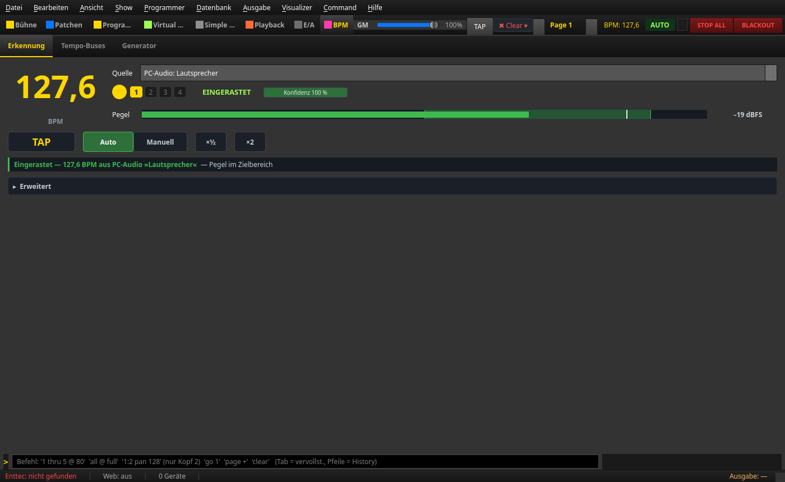
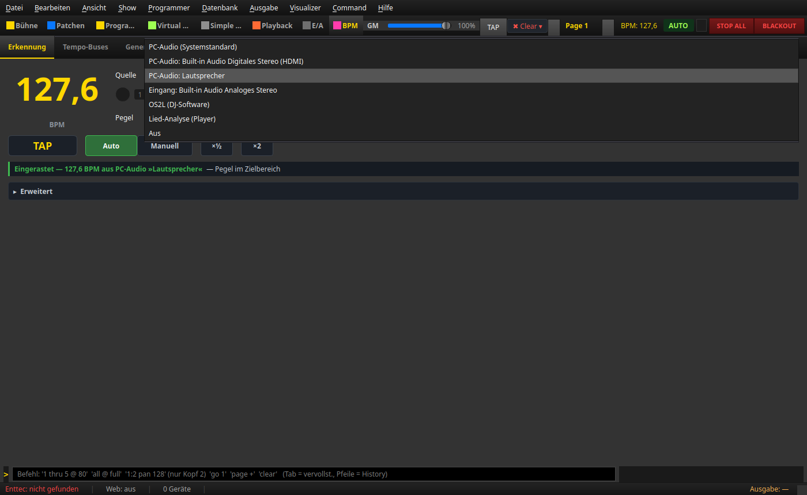
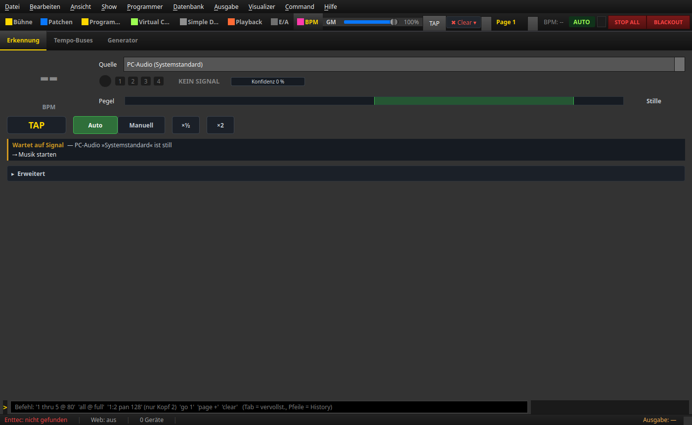
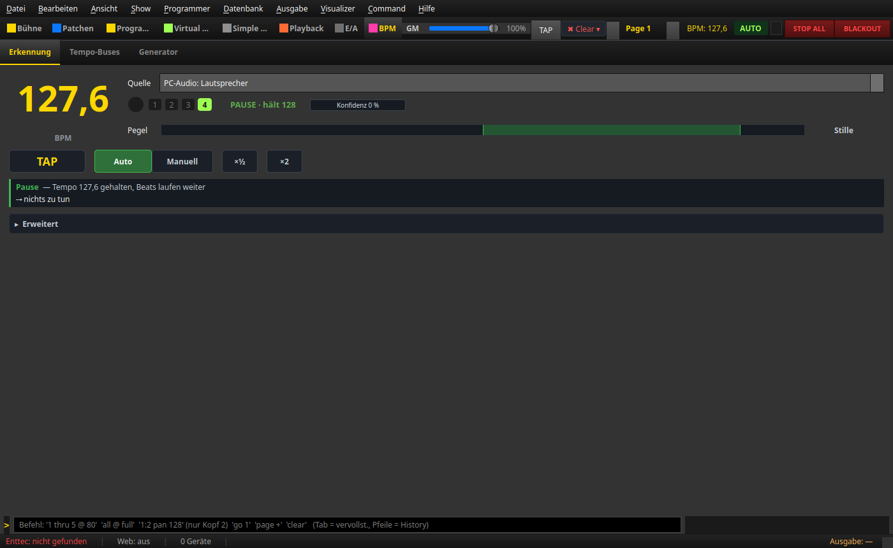
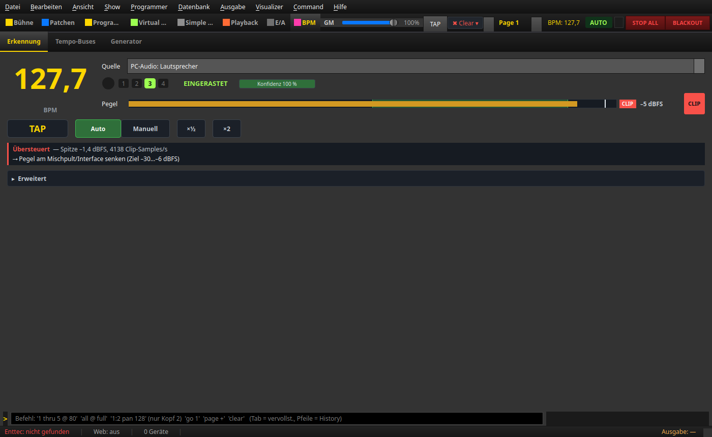

# BPM-Manager — Anleitung

> **Wofür?** Die Sektion **BPM** ist der Taktgeber von LightOS. Sie hört die Musik (oder
> nimmt das Tempo von der DJ-Software, einem analysierten Lied oder deinem TAP) und liefert
> die **Beats**, auf die alle tempo-gekoppelten Effekte laufen: Matrix, EFX, Chaser,
> Sequenzen, Virtuelle Konsole.
>
> **Öffnen:** in der Sektionsleiste auf **BPM** klicken oder **Strg+8**. Die Sektion hat drei
> Sub-Tabs: **Erkennung · Tempo-Buses · Generator**. Diese Anleitung erklärt vor allem
> **Erkennung**; die beiden anderen kommen am Ende kurz dran.

Stand: **2026-09-16**. Alle Bilder stammen aus der laufenden App (das Testgerät heißt
„Lautsprecher"); Beschriftungen sind gegen den Quellcode geprüft
(`src/ui/views/bpm_manager_view.py`, `src/ui/bpm_status_rules.py`,
`src/ui/views/bpm_generator_view.py`, `src/core/audio/bpm_settings.py`).

---

## In 30 Sekunden startklar

1. **Quelle wählen** — oben rechts die Liste **Quelle**. Musik läuft auf diesem Rechner →
   **PC-Audio (Systemstandard)**. Musik kommt vom Mischpult → **Eingang: <dein Interface>**.
2. **Pegel prüfen** — der Balken in der Zeile **Pegel** soll im **grünen Bereich** pendeln
   (−30 bis −6 dBFS). Grau = zu leise, rot = zu laut.
3. **Auf EINGERASTET warten** — nach dem Start oder einem Quellenwechsel dauert das
   **etwa 4–6 Sekunden**. Dann steht grün **EINGERASTET**, der Beat-Punkt blinkt, fertig.

Klappt etwas nicht, sagt dir die **Statuszeile** (grüner, gelber oder roter Balken unter den
Knöpfen) in einem Satz, was los ist und was du tun kannst — siehe
[Wenn nichts erkannt wird](#wenn-nichts-erkannt-wird).

---

## 1. Die Oberfläche auf einen Blick



Von oben links nach unten:

| # | Element | Im Bild | Was es ist |
|---|---|---|---|
| 1 | **Sub-Tabs** | Erkennung · Tempo-Buses · Generator | Erkennung ist gelb unterstrichen = aktiv. |
| 2 | **Große BPM-Zahl** | „127,6" in Gelb, darunter „BPM" | Das gültige Tempo. **Gelb** = Auto, **grün** = Manuell, grau **--** = kein Tempo. |
| 3 | **Quelle** | „PC-Audio: Lautsprecher" | Woher das Tempo kommt (Abschnitt 2). **Bedienelement.** |
| 4 | **Beat-Punkt + Taktzellen** | gelber Kreis, Zellen 1 · 2 · 3 · 4 | Blinken im Takt mit; die **1** (Downbeat) leuchtet gold. Wie viele Zellen: *Beats/Takt* in Erweitert. |
| 5 | **Zustandswort** | „EINGERASTET" in Grün | Was die Erkennung gerade tut (Abschnitt 3.1). |
| 6 | **Konfidenz** | kleiner Balken „Konfidenz 100 %" | Wie sicher die Erkennung ist. |
| 7 | **Pegel** | breiter Balken, grüne Zielzone, heller Strich, „−19 dBFS" | Wie laut das Signal ankommt (Abschnitt 3.2). Rechts daneben erscheinen bei Störungen **Chips**. |
| 8 | **TAP** | großer Knopf, gelbe Schrift | Beat nachsetzen oder Tempo eintippen (Abschnitt 4.1). **Bedienelement.** |
| 9 | **Auto \| Manuell** | Auto grün hinterlegt = aktiv | Folgt der Musik oder hält dein Tempo. **Bedienelement.** |
| 10 | **×½ / ×2** | zwei kleine Knöpfe | Halbes / doppeltes Tempo. **Bedienelemente.** |
| 11 | **Statuszeile** | grüner Rand: „Eingerastet — 127,6 BPM aus PC-Audio »Lautsprecher« — Pegel im Zielbereich" | Immer ein Satz: was los ist, warum, was tun (Abschnitt 3.3). |
| 12 | **▸ Erweitert** | zugeklappte Leiste | Feineinstellungen und Diagnose (Abschnitt 5). **Bedienelement.** |

Ganz oben in der **Kopfzeile** siehst du immer, egal in welcher Sektion du bist: **TAP**
(derselbe Knopf wie Nr. 8), **BPM: 127,6** und das Modus-Feld **AUTO**.

> **Merke:** Im Normalbetrieb brauchst du nur **sechs** Bedienelemente: Quelle, TAP,
> Auto | Manuell, ×½, ×2 und Erweitert. Alles andere sind Anzeigen.

---

## 2. Quelle wählen



Die Liste liest die Geräte **jedes Mal beim Aufklappen neu** ein — ein eben angestecktes
USB-Interface steht also sofort drin. Deine Wahl wird gemerkt und beim nächsten Start
wieder eingeschaltet.

| Eintrag | Nimm das, wenn … | Hinweis |
|---|---|---|
| **PC-Audio (Systemstandard)** | die Musik **auf diesem Rechner** läuft (Player, Spotify, Browser) und du dich nicht um Geräte kümmern willst. | Hört das Ausgabegerät mit, das im Betriebssystem gerade **Standard** ist — wechselst du dort das Gerät, folgt LightOS. |
| **PC-Audio: <Ausgabegerät>** | die Musik auf diesem Rechner über ein **bestimmtes** Gerät läuft (im Bild „Lautsprecher" oder „Built-in Audio Digitales Stereo (HDMI)"). | Je Ausgabegerät ein Eintrag. Läuft die Musik über ein anderes Gerät, hört LightOS Stille. |
| **Eingang: <Gerät>** | die Musik **von außen** kommt: Mischpult, Fremd-DJ, Band — über Line-In, Mikrofon oder Audio-Interface. | Je Eingang ein Eintrag. Pegel am Mischpult/Interface einstellen, bis der Balken grün ist. |
| **OS2L (DJ-Software)** | ein DJ mit **VirtualDJ** (oder einem anderen OS2L-fähigen Programm) auflegt. | Tempo und Beats kommen direkt aus dem DJ-Programm; LightOS hört dann nicht selbst zu. Im DJ-Programm OS2L einschalten. |
| **Lied-Analyse (Player)** | du ein **vorher im Generator analysiertes Lied** im Player abspielst und das Licht taktgenau sitzen soll. | Nimmt den Titel, der gerade im Player geladen ist (Abschnitt 7.2). |
| **Aus** | du keine Erkennung willst — z. B. nur Manuell mit TAP. | Die Statuszeile sagt dann „Erkennung aus — keine Beat-Quelle gewählt". |

Ein gespeichertes Gerät, das gerade nicht angesteckt ist, steht als **„… (nicht gefunden)"**
in der Liste.

**Einrasten dauert etwa 4–6 Sekunden.** Die Erkennung braucht ein gefülltes
Analysefenster von rund sechs Sekunden Musik, bevor sie Beats meldet. Solange steht
**SUCHT**. Schneller geht's mit **TAP** drei-, viermal im Takt (Abschnitt 4.1).

---

## 3. Anzeigen lesen

### 3.1 Das Zustandswort

| Zustandswort | Bedeutung |
|---|---|
| **KEIN SIGNAL** (grau) | Es kommt nichts Brauchbares an — oder die Erkennung ist gerade gestartet und die Musik läuft noch nicht. |
| **SUCHT** (orange) | Signal ist da, das Analysefenster füllt sich bzw. es wird noch kein stabiler Takt gefunden. |
| **EINGERASTET** (grün) | Tempo steht, die Beats laufen. |
| **PAUSE · hält 128** (grün) | Die Musik ist still, das letzte Tempo wird **gehalten**, die Beats laufen weiter. |
| **MANUELL** | Du gibst das Tempo vor (TAP, Nudge, Manuell-Knopf). |
| **OS2L** / **OS2L · wartet auf DJ-Software** | Quelle OS2L — verbunden bzw. noch kein DJ-Programm verbunden. |
| **LIED-ANALYSE** / **AUS** | Die entsprechende Quelle ist gewählt. |

Hinter dem Zustandswort kann ein kurzer Zusatz stehen, z. B. **„· Tap"** (Tempo kam zuletzt
vom TAP) oder **„· 🔒"** (Tempo eingefroren).

**Beim Start ohne Musik** sieht es so aus:



Die BPM-Zahl zeigt **--**, das Zustandswort **KEIN SIGNAL**, rechts neben dem Pegel steht
**Stille**. Die Statuszeile ist gelb (Hinweis, kein Fehler):
„**Wartet auf Signal** — PC-Audio »Systemstandard« ist still — → Musik starten". Genau das
ist zu tun.

**Wenn die Musik kurz aussetzt** (Break, Ansage, Liedwechsel):



Das Tempo bleibt stehen (**PAUSE · hält 128**), die Taktzellen laufen weiter, die
Statuszeile ist **grün**: „**Pause** — Tempo 127,6 gehalten, Beats laufen weiter —
→ nichts zu tun". Setzt die Musik wieder ein, läuft die Erkennung einfach weiter. Bleibt es
länger als etwa **10–15 Sekunden** still, lässt sie los und zeigt **KEIN SIGNAL** — der
nächste Einsatz rastet frisch ein. Soll das Tempo auch über lange Pausen stehen bleiben:
**Manuell** oder **Tempo einfrieren** (Erweitert).

### 3.2 Pegel und Chips

Die Zeile **Pegel** zeigt, wie laut das Signal der gewählten Quelle ankommt (gemittelt über
0,3 s). Rechts steht der Wert als Zahl, z. B. **−19 dBFS**, bei digitaler Stille **Stille**.

| Balkenfarbe | Bereich | Bedeutung |
|---|---|---|
| **grün** | −30 bis −6 dBFS (dunkelgrüne Zielzone im Hintergrund) | ideal für die Erkennung |
| **gelb** | knapp unter −30 oder über −6 dBFS | geht, aber etwas leise bzw. schon heiß |
| **grau** | unter −45 dBFS | zu leise oder kein Signal |
| **rot** | über −3 dBFS | zu laut, gleich übersteuert |

Der **helle senkrechte Strich** hält kurz die letzte Spitze fest. Bei Übersteuerung
erscheint am Balkenende ein rotes **CLIP**.

Rechts neben dem Pegel können **Chips** auftauchen — reine Anzeigen, sie erscheinen, wenn
eine Störung etwa 2 s anhält, und verschwinden etwa 3 s nach ihrem Ende (kurzes Flackern
zeigt nichts an):

| Chip | Bedeutung |
|---|---|
| **CLIP** (rot) | übersteuert: das Signal stößt an 0 dBFS |
| **BRUMM** (orange) | Netzbrumm 50/60 Hz im Bass, meist eine Masseschleife |
| **LEISE** (gelb) | Pegel unter −40 dBFS |
| **AUSSETZER** (gelb) | Audio kommt stoßweise, der Rechner ist ausgelastet |
| **DC** (gelb) | Gleichspannungsversatz am Eingang (Interface oder Kabel prüfen) |

### 3.3 Konfidenz und Statuszeile

**Konfidenz** (0–100 %) sagt, wie sicher die Erkennung ist. Hoch = klarer Beat. Niedrig =
Pause, Sprache, Musik ohne deutlichen Schlag — oder eine Störung wie Brumm.

Die **Statuszeile** ist **nie leer** und immer gleich aufgebaut:

```
Problem — Ursache (mit dem gemessenen Wert)
→ Abhilfe
```

* **Farbe des linken Randes:** grün = alles in Ordnung, gelb = Hinweis, rot = Problem.
* **Abhilfe unterstrichen (blau)** = anklickbar. LightOS führt die Abhilfe dann selbst aus:
  Quelle-Liste öffnen, Audio erneut verbinden, eine Aufnahme starten oder „Erweitert"
  aufklappen.
* Im Normalfall gibt es keine Abhilfe-Zeile — dann steht alles in einer Zeile, wie im
  ersten Bild („Eingerastet — 127,6 BPM aus PC-Audio »Lautsprecher« — Pegel im Zielbereich").

> **Faustregel für den Abend:** Läuft das Licht daneben, schau in dieser Reihenfolge:
> Steht **EINGERASTET**? Ist der **Pegel grün**? Was sagt die **Statuszeile**? Blinkt der
> Punkt nur neben der Musik → **TAP** einmal.

---

## 4. Bedienen

### 4.1 TAP — zwei Rollen

| Du tippst … | Was passiert |
|---|---|
| **einmal** | Der Beat wird auf **„jetzt"** gesetzt. Das Tempo bleibt. Nimm das, wenn der Beat-Punkt im richtigen Tempo, aber **versetzt** zur Musik blinkt. |
| **zweimal** | Noch nichts — ein versehentlicher Doppelklick verstellt nichts. |
| **drei-, viermal im Takt** (Abstand unter 2 s) | Ab dem **3. Tipp** sucht die Erkennung um dein Tempo herum (hilft auch bei Halb/Doppelt). Ab dem **4. Tipp** setzt TAP das Tempo selbst und schaltet auf **Manuell**. |

Zurück zur Musik: **Auto** klicken. Der **TAP in der Kopfzeile** ist derselbe Knopf — du
kannst auch aus jeder anderen Sektion tippen.

### 4.2 Auto | Manuell

* **Auto:** Das Tempo folgt der gewählten Quelle.
* **Manuell:** Das Tempo bleibt, wie du es per TAP oder Nudge gesetzt hast. Die Quelle läuft
  im Hintergrund weiter; die Statuszeile sagt dir z. B. „Manuell — 128 BPM per Tap/Nudge;
  Erkennung würde 127,6 sagen — → Auto setzt die Erkennung fort".

### 4.3 ×½ und ×2

Läuft das Licht **doppelt so schnell** wie die Musik → **×½**. Läuft es **halb so schnell**
→ **×2**.

* In **Auto** stellt der Knopf die Erkennung auf die andere Oktave um. Das bleibt so, bis du
  die Quelle wechselst oder per TAP ein neues Tempo vorgibst.
* In **Manuell** halbiert bzw. verdoppelt er dein Tempo.
* Liegt das Ziel **außerhalb des Tempo-Bereichs** (Erweitert), passiert nichts, und die
  Statuszeile sagt es, z. B. „×2 nicht möglich — 256 BPM liegt außerhalb des
  Tempo-Bereichs 60–200 (Bereich endet bei 200) — → Tempo-Bereich in „Erweitert" anpassen".
  Der Bereich wird nie heimlich verstellt.
* Meint die Erkennung selbst, dass die andere Oktave ähnlich gut passt, schlägt die
  Statuszeile den richtigen Knopf vor („… Halbtempo 63,8 ist ähnlich plausibel — → läuft
  das Licht zu schnell: ×½ klicken").

**Grenzen:** Viele Stile mit Kick auf jedem Viertel (House, Techno, Hardstyle, Drum & Bass
mit durchgehender Kick) erkennt LightOS im vollen Tempo. **Halb** bleiben dagegen oft
**Breakbeat/Amen-Breaks, Two-Step, Halftime** und Stücke mit **sehr lauter Snare**. Dort
einmal **×2** klicken — oder dauerhaft den **Tempo-Bereich** passend eng setzen
(z. B. per **Vorlage** „Drum & Bass" 165–180).

---

## 5. „Erweitert"


Aufklappen mit **▸ Erweitert**. Der Bereich klappt beim nächsten Start wieder zu.

| Zeile im Bild | Element | Was es tut / wann du es brauchst |
|---|---|---|
| **Tempo-Bereich** | **von** / **bis** (20–400, Standard 60–200) | Die Erkennung sucht nur in diesem Fenster; Schätzungen außerhalb werden verdoppelt/halbiert, bis sie hineinpassen. **Eng setzen = dauerhaft kein Halb-/Doppeltempo.** |
| | **Vorlage ▾** | Menü mit Musikstilen und ihrem Bereich — setzt **nur** Tempo-Bereich und Beats/Takt (Tabelle unten). |
| | **Beats/Takt** (Standard 4) | Alle N Beats ist eine „Eins" (Downbeat). 4 = normaler Takt, 8 oder 16 = lange Bögen. Ändert **nicht** das Tempo, nur die Takt-Einteilung und die Zahl der Taktzellen. |
| **Beat-Latenz** | Zahlenfeld in ms (−300 bis +300, 5-ms-Schritte) | Verschiebt, **wann** LightOS den Beat meldet. Beschriftung daneben: **„+ = Licht früher, − = später"**. Siehe unten. |
| **Tempo halten** | **🔒 Tempo einfrieren** | Friert die BPM ein: keine Quelle ändert sie mehr, bis du den Knopf wieder löst. Die Beats laufen weiter. Gut vor Ansagen, Breaks, wackeligen Übergängen. |
| **Nudge** | **−5 · −1 · +1 · +5** | Tempo in festen Schritten verschieben. **Schaltet auf Manuell.** |
| **Lied-Analyse** | ☑ **Taktgenau** (Standard an) | Nur bei Quelle *Lied-Analyse*: Beats treffen exakt das Beatgrid des Lieds (Abschnitt 7.3). |
| **Aufnahme** | **Eingang 30 s aufnehmen** | Nimmt 30 s der laufenden Audio-Quelle für die Fehlersuche auf (Abschnitt 6). |
| **Diagnose** | Textzeile | Rohwerte der Erkennung (siehe unten). |
| **Spektrum** | acht Balken | Wo im Frequenzbereich Energie liegt — links Bass, rechts Höhen. Im Bild arbeiten vor allem die beiden Bass-Bänder. |

**Vorlagen im Menü „Vorlage ▾":**

| Vorlage | Bereich | Vorlage | Bereich |
|---|---|---|---|
| Allgemein | 70–180 | Frenchcore / Uptempo | 180–230 |
| House / Tech-House | 118–130 | Drum & Bass | 165–180 |
| Techno | 125–140 | Dubstep | 135–145 |
| Trance | 130–145 | Trap / Hip-Hop | 70–100 |
| Hardstyle / Rawstyle | 145–160 | Pop / Rock | 90–140 |

### 5.1 Beat-Latenz praktisch

Zwischen Musik und Licht liegen Laufzeiten: Audio-Weg in den Rechner, Erkennung,
DMX-Ausgabe, träge Lampen. Hör und schau auf eine Kick und ein Strobe oder einen harten
Farbwechsel:

* **Licht kommt hörbar zu spät** → Wert **erhöhen** (ins **Plus**). Plus heißt: LightOS
  meldet den Beat früher, das Licht kommt früher.
* **Licht kommt zu früh** → Wert **senken** (ins **Minus**).

In 5- bis 10-ms-Schritten vorgehen. Der Wert wird gemerkt.

### 5.2 Die Diagnosezeile, Feld für Feld

Im Bild steht: *roh 127,6 · alt 63,8 (0,36) · Fenster 6,0/6 s · Pegel −22 dBFS ·
Rauschteppich −29 dBFS · Brumm — · DC +0,002 · Jitter 19 ms · Rückstand 39 ms ·
Kontrast 27,4 · Chunk p95 41 ms*

| Feld | Bedeutung | Worauf achten |
|---|---|---|
| **roh** | Tempo, das die Erkennung gerade misst, vor Oktav-Entscheidung und Glättung | springt es stark, ist der Beat unklar |
| **alt … (Zahl)** | die andere Oktave (hier Halbtempo 63,8) und wie plausibel sie ist, 0–1 | ab etwa 0,7 schlägt die Statuszeile ×½/×2 vor |
| **Fenster** | wie weit das Analysefenster gefüllt ist (von 6 s) | unter 6 s: noch SUCHT |
| **Pegel** | Lautstärke, wie die Erkennung sie sieht | wie die Pegelzeile |
| **Rauschteppich** | Grundgeräusch zwischen den Schlägen | liegt er nah am Pegel, ist der Beat schwach |
| **Brumm** | „—" = kein Brumm, sonst z. B. „Brumm 50 Hz 99 %" | hohe Prozente = Masseschleife |
| **DC** | Gleichspannungsversatz | über ±0,02 erscheint der Chip DC |
| **Jitter** | wie unregelmäßig die Audio-Pakete ankommen | kleine Werte sind normal |
| **Rückstand** | wie weit die Erkennung hinter dem Audio herhinkt | über 250 ms: Chip AUSSETZER |
| **Kontrast** | wie deutlich sich die Schläge abheben | hoch = klarer Beat |
| **Hinweis** (nur wenn gesetzt) | das per TAP vorgegebene Suchtempo | — |
| **Chunk p95** | Abstand der Audio-Pakete vom Treiber (95 % liegen darunter) | normal etwa 21–43 ms, über 70 ms: AUSSETZER |

---

## Wenn nichts erkannt wird

**Erst die Statuszeile lesen.** Sie nennt Problem, Ursache mit Messwert und Abhilfe. Die
häufigsten Fälle, so wie sie in der App stehen:

### Pegel zu leise


Der Balken ist **grau** und kurz, rechts **−50 dBFS** und der Chip **LEISE**. Die Erkennung
läuft im Bild sogar noch (EINGERASTET), ist so aber störanfällig.

### Übersteuert



Der Balken reicht über die Zielzone hinaus, am Ende leuchtet **CLIP** rot, dazu der rote
Chip **CLIP**. Runterdrehen, bis CLIP weg ist und der Balken grün pendelt.

### Netzbrumm


Der Pegel sieht gut aus (−12 dBFS), trotzdem steht **SUCHT** und die Konfidenz liegt bei
**1 %**: Das Signal ist fast nur Brumm. Die Abhilfe ist **unterstrichen** — ein Klick darauf
startet gleich die 30-s-Aufnahme. BRUMM erscheint nur, wenn die Erkennung **nicht**
eingerastet ist und wirklich eine scharfe 50/60-Hz-Linie da ist; ein tiefer, gehaltener Bass
im Breakdown löst ihn nicht aus.

### Kein Signal


Pegel **Stille**, Zustandswort **KEIN SIGNAL**. Die große Zahl zeigt noch das letzte Tempo
(127,6). Ein Klick auf den unterstrichenen Link öffnet die Quelle-Liste.

### Alle Statuszeilen im Überblick

| Statuszeile (Anfang) | Bedeutet | Was tun |
|---|---|---|
| **Wartet auf Signal** — … ist still | Quelle eingeschaltet, aber es läuft (noch) keine Musik | Musik starten |
| **Kein Signal** — PC-Audio »…« liefert Stille (digital 0) | über dieses Ausgabegerät kommt nichts | Läuft die Musik über genau dieses Gerät? Sonst anderes wählen (Link öffnet die Liste) |
| **Kein Signal** — Eingang »…« liefert −70 dBFS | am Eingang kommt praktisch nichts an (unter −60 dBFS) | Kabel/Gerät prüfen oder anderen Eingang wählen |
| **Pegel niedrig** — Eingang liefert −49 dBFS RMS, Ziel −30…−6 | zu leise (unter −40 dBFS) | Ausgangspegel am Mischpult bzw. Interface-Gain anheben |
| **Übersteuert** — Spitze −1,4 dBFS, 4138 Clip-Samples/s | zu laut | Pegel am Mischpult/Interface senken (Ziel −30…−6 dBFS) |
| **Netzbrumm 50 Hz** — Brummanteil im Bassband 99 % | Masseschleife, Brumm überdeckt den Beat | DI-Box/Ground-Lift, anderes Netzteil, symmetrisches Kabel; Aufnahme machen |
| **Audio kommt stoßweise (Aussetzer)** | Rechner liefert das Audio ruckelig | andere Programme schließen; Beats bleiben im Takt, kommen aber später |
| **Gleichspannungsversatz** | DC am Eingang | Interface/Kabel prüfen (defekter Eingang, Phantomspeisung am Line-Eingang?) |
| **Sucht Tempo** — N s Musik gehört, Fenster braucht ~6 s | läuft gerade an | warten; schneller: TAP im Takt |
| **Kein Takt gefunden** — Signal da, aber kein stabiles Tempo seit N s | Musik ohne klaren Beat, Sprache | TAP viermal tippen — oder Aufnahme machen |
| **Eingerastet — … ähnlich plausibel** | Halb-/Doppeltempo möglich | ×½ bzw. ×2 klicken |
| **Ausgabegerät nicht gefunden** | gemerktes Gerät fehlt, es wird die Standardausgabe mitgehört | Gerät anstecken oder ein vorhandenes wählen |
| **Audio gestoppt** / **Audio-Fehler** | Gerät gezogen oder Treiber-Problem | Gerät anstecken, dann Link **erneut verbinden** |
| **OS2L wartet** — Server läuft, keine DJ-Software verbunden | Quelle OS2L, aber kein DJ-Programm | in VirtualDJ OS2L aktivieren |
| **Lied-Analyse** — kein analysierter Titel im Player | nichts zum Folgen da | Titel im Generator analysieren und in den Player laden |
| **Eingefroren** | „Tempo einfrieren" ist aktiv | in „Erweitert" lösen |

**Hilft nichts davon:** eine Aufnahme machen (nächster Abschnitt).

---

## 6. Eingang 30 s aufnehmen

**Wann:** wenn die Erkennung am echten Aufbau nicht klappt und die Statuszeile keine
passende Abhilfe nennt — oder wenn sie „Aufnahme machen und schicken" vorschlägt.

**Wie:**

1. Musik **so laufen lassen wie im Problemfall** (gleiche Quelle, gleicher Pegel).
2. **▸ Erweitert → Eingang 30 s aufnehmen** klicken — oder den unterstrichenen Link in der
   Statuszeile.
3. 30 s warten. Der Knopf zählt mit („Aufnahme … 12 s"), die Statuszeile sagt
   „Aufnahme läuft". Ein zweiter Klick bricht ab; die Datei ist dann kürzer, aber brauchbar.
4. Danach steht in der Statuszeile z. B. „Aufnahme gespeichert —
   audio_diag/lightos_eingang_20260916-213000.wav — → Datei an Robin/Support schicken".

**Wo die Dateien liegen:** im LightOS-Datenordner, Unterordner `audio_diag/`:

* Linux: `~/.local/share/LightOS/audio_diag/`
* Windows: `%APPDATA%\LightOS\audio_diag\`

Es sind immer **zwei Dateien mit gleichem Namen**: die **WAV** (der Ton) und eine **JSON**
mit den Messwerten (Gerät, Pegel, Spitze, Clips, Brumm, Version, Zeit — ohne Benutzername
und ohne Pfade). Schick **beide**.

**Nichts wird automatisch versendet.** Die Aufnahme bleibt auf dem Rechner, bis du sie
selbst weitergibst. Der Knopf ist grau, wenn gerade keine Audio-Quelle läuft (Aus, OS2L,
Lied-Analyse oder Audio gestoppt).

---

## 7. Die anderen Sub-Tabs

### 7.1 Tempo-Buses


Hier legst du fest, **welche Effektgruppe in welchem Tempo** läuft:

* **Tempo-Speeds & Grand-Master:** Die Tabelle listet die Tempo-Buses mit **Rolle**
  (Master/Sub), **Folgt**, **Faktor** und aktuellem **BPM**. Der Bus
  **Default (Sound-BPM)** folgt automatisch dem Tempo aus dem Sub-Tab Erkennung (im Bild 128).
  **Grand-Master scharf** zwingt alle Master auf ein gemeinsames Tempo. **Auto-Sync** lässt
  neu gestartete Effekte taktgleich einsetzen, **Jetzt synchronisieren** setzt alle laufenden
  Effekte gemeinsam auf die nächste Eins.
* **Effekte je Bus — taktgleich:** welche Effekte welchem Bus folgen; Haken = startet
  taktgleich auf dem gemeinsamen Beat-Raster.

Ausführlich:
[Tempo & Synchronisierung](../ANLEITUNG_TEMPO_SYNC.md) ·
[Tempo-Controller-Widget](../anleitung_tempo_controller/ANLEITUNG_TEMPO_CONTROLLER.md) ·
[Speed-Dial, Master/Sub & Grand-Master](../anleitung_speed/ANLEITUNG_SPEED.md).

### 7.2 Generator — ganzes Lied → Beatgrid

![Sub-Tab Generator: Kasten Quelle, Genre & Engine mit Datei (Keine Datei gewählt), Datei wählen…, Genre Allgemein mit 70–180 BPM · Prior 120, Engine Eingebaut (numpy), Fenster (s) 8,00, Schritt (s) 2,00, Takt 4/4, Knöpfen Analysieren und Ordner analysieren…; Kasten BPM-Verlauf & Beatgrid mit leerem Plot „Noch keine Analyse", Beatgrid-Knöpfen ½×, 2×, ◀ nudge, nudge ▶, Downbeat ◀, Downbeat ▶, Hinweis Klick im Plot = Downbeat setzen, ▶ Vorhören, Im Player laden & als BPM-Quelle nutzen, Als .json exportieren](img/generator.png)

Der **Generator** analysiert ein **komplettes Lied** vorab und erzeugt eine
**BPM-Kurve über die Zeit** plus ein **Beatgrid** (die genauen Beat-Zeitpunkte) — wie das
Beatgrid in VirtualDJ oder Serato. Das lohnt sich, wenn ein bestimmter Track **taktgenau**
sitzen muss; die Live-Erkennung schätzt dagegen immer nur den Moment.

**Schritt für Schritt:**

1. **Datei wählen…** — Audiodatei laden (`.mp3 .m4a .mp4 .aac .flac .ogg .wav`).
2. **Genre** wählen — daneben steht das Suchfenster, z. B. „70–180 BPM · Prior 120".
3. **Engine** wählen (Tabelle unten).
4. Optional **Fenster (s)** (Standard 8), **Schritt (s)** (Standard 2) und **Takt**
   (4/4, 3/4, 6/8, 2/4). Größeres Fenster = ruhigere Kurve, kleinerer Schritt = feinere
   Auflösung.
5. **Analysieren** klicken. Das läuft im Hintergrund, die Oberfläche bleibt bedienbar.
   Mit **Ordner analysieren…** bereitest du ein ganzes Set auf einmal vor.
6. Ergebnis im Kasten **BPM-Verlauf & Beatgrid** prüfen: oben die Kennzahlen, darunter der
   Plot mit BPM-Kurve und Beatgrid (Downbeats hervorgehoben). Schlägt die Analyse Genre oder
   Takt vor, erscheint **Vorschlag übernehmen**.
7. Bei Bedarf korrigieren (Beatgrid-Knöpfe unten) und mit **▶ Vorhören** prüfen — der Song
   spielt mit Klick auf jedem Beat.
8. **Im Player laden & als BPM-Quelle nutzen** — lädt den Song in den Player, hängt das
   Beatgrid an und schaltet die Live-Erkennung ab, damit die Analyse führt. Dann im
   Musik-Tab abspielen. Im Sub-Tab Erkennung steht die Quelle dafür auf
   **Lied-Analyse (Player)** — falls nicht, dort auswählen.
9. Optional **Als .json exportieren**.

**Engines:**

| Engine | Was | Wann |
|---|---|---|
| **Eingebaut (numpy)** | immer verfügbar | schnell, guter Standard |
| **librosa (DP-Beat-Tracking)** | klassischer Beat-Tracker | saubere Studio-Tracks |
| **Beat This! (SOTA / KI)** | KI-Modell mit echten Downbeats | höchste Genauigkeit, knifflige Stücke |

Nicht installierte Engines stehen mit dem Zusatz „(nicht installiert)" in der Liste und
fallen auf die eingebaute zurück.

**Beatgrid-Knöpfe:**

* **½× / 2×** — Beat-Dichte halbieren/verdoppeln (falsche Oktave).
* **◀ nudge / nudge ▶** — ganzes Grid um 8 ms verschieben.
* **Downbeat ◀ / Downbeat ▶** — den Taktanfang um einen Beat verschieben.
* **Klick im Plot** — Downbeat an diese Stelle setzen.

Mehr Details (Cache, Songstruktur, Spickzettel):
[BPM-Generator-Anleitung](../anleitung_bpm_generator/ANLEITUNG_BPM_GENERATOR.md).

### 7.3 Taktgenau

Spielst du ein analysiertes Lied mit Quelle **Lied-Analyse (Player)** und ist
**Taktgenau** (Erweitert) an, trifft jeder Beat **exakt das Beatgrid** des Lieds:

* Der Player meldet seine Position nur grob. LightOS hängt das Beatgrid daran an und
  rechnet dazwischen in feinen Schritten weiter — so kommt jeder Lied-Beat pünktlich, die
  Downbeats richten den Takt aus.
* Es gibt immer **genau eine** Beat-Quelle: Timer **oder** Live-Audio **oder** Beatgrid.
* **Taktgenau aus:** Dann folgt nur der **BPM-Wert** dem Lied; die Beats laufen frei und
  können minimal weglaufen.

**Voraussetzungen:** Lied im Generator analysiert · Quelle **Lied-Analyse (Player)** ·
**Auto** · Song läuft im Musik-Tab. Pause/Stopp im Player hält auch die Beats an.

---

## 8. Einstellungen & Umstieg

### 8.1 Was gemerkt wird

Die Einstellungen liegen im LightOS-Datenordner in `ui_prefs.json` (Abschnitt
`bpm_settings`) und werden beim Start sofort angewandt — auch die Quelle wird wieder
eingeschaltet.

| Gemerkt | Standard |
|---|---|
| Quelle und Gerät | PC-Audio (Systemstandard) |
| Auto \| Manuell | Auto |
| Tempo-Bereich | 60–200 BPM |
| Beats/Takt | 4 |
| Beat-Latenz | 0 ms |
| Taktgenau | an |

**Nicht** gemerkt: „Tempo einfrieren", ×½/×2 und ob „Erweitert" aufgeklappt ist.

Das Beatgrid eines analysierten Lieds wird mit dem Track in der Show-Playlist gespeichert.

### 8.2 Erster Start mit alten Einstellungen

Die Einstellungen tragen eine Versionsnummer; aktuell ist **Version 3**. Beim ersten Start
mit einer älteren Datei übernimmt LightOS Quelle, Gerät, Modus, Tempo-Bereich, Takt und
Taktgenau. Werte, die es nicht mehr gibt, werden verworfen und einmal ins Log geschrieben.
Vorher legt LightOS **einmalig eine Sicherung** der alten Datei an:
`ui_prefs.json.v2.bak` (bei ganz alten Dateien `ui_prefs.json.v1.bak`).

> **Achtung beim Zurückgehen:** Eine ältere LightOS-Version kann die neue Datei nicht lesen
> und startet mit Standardwerten. Wer zurück muss, benennt `ui_prefs.json.v2.bak` wieder in
> `ui_prefs.json` um.

### 8.3 Was es nicht mehr gibt — und womit du es ersetzt

| Früher | Heute |
|---|---|
| Regler **Empfindlichkeit** und **Glättung** (früher im Einstellungsblock) | nicht mehr nötig — die Erkennung stellt sich selbst auf den Pegel ein |
| Auswahl Genre-Preset + „Anwenden" (entfernt) | **Vorlage ▾** in Erweitert (setzt nur Tempo-Bereich + Beats/Takt) |
| Auswahl Analyse-Song (entfernt) | Quelle **Lied-Analyse (Player)** nimmt den im Player geladenen Titel |
| Unterteilung und Schnellwahl 4/8/16 (entfernt) | entfällt; lange Bögen über **Beats/Takt** |
| Nudge ±10 (entfernt) | Nudge −5/−1/+1/+5 |
| 🔒-Knopf in der Hauptansicht (entfernt) | **Tempo einfrieren** in Erweitert |
| Tab Audio Input in der Sektion E/A (früher; entfernt) | **Pegel**-Zeile und **Quelle**-Liste direkt im Sub-Tab Erkennung |
| Tempo-Buses im selben Sub-Tab (früher) | eigener Sub-Tab **Tempo-Buses** |

---

## 9. Bekannte Grenzen

* **Einrasten braucht 4–6 Sekunden** nach Start oder Quellenwechsel. Schneller: TAP im Takt.
* **Halbes Tempo** bei Breakbeat/Amen, Two-Step, Halftime und sehr lauter Snare → ×2 oder
  Tempo-Bereich (Abschnitt 4.3).
* **Schwellen noch nicht am echten Rig geeicht.** Zielzone, „Pegel niedrig" (−40 dBFS),
  „Kein Signal" (−60 dBFS), Brumm und Aussetzer beruhen auf Messungen mit künstlichen
  Signalen. Windows mit echtem Rig ist noch ungetestet. Genau dafür ist die
  [30-s-Aufnahme](#6-eingang-30-s-aufnehmen) da.
* **Reines Brummen ohne Musik:** Die Statuszeile zeigt zuerst kurz „Sucht Tempo — N s Musik
  gehört"; **BRUMM** erscheint nach etwa 5 s. Lief vorher eingerastete Musik, dauert es etwa
  10 s, weil die Erkennung so lange das Tempo hält — das ist gewollt.

---

## Verwandte Anleitungen

* [Tempo & Synchronisierung — Gesamtüberblick](../ANLEITUNG_TEMPO_SYNC.md)
* [BPM-Generator (ganzes Lied → Beatgrid)](../anleitung_bpm_generator/ANLEITUNG_BPM_GENERATOR.md)
* [Tempo-Controller-Widget](../anleitung_tempo_controller/ANLEITUNG_TEMPO_CONTROLLER.md)
* [Speed-Dial, Master/Sub & Grand-Master](../anleitung_speed/ANLEITUNG_SPEED.md)
* [Tempo / Speed / Master-Sub](../anleitung_speed_bpm/ANLEITUNG_SPEED_BPM.md)
* [Musik-Synchronisation](../anleitung_musik_sync/ANLEITUNG_MUSIK_SYNC.md)
* [VC-Widget-Referenz: BPM-Manager](../anleitung_vc_widgets/20_bpm_manager.md)
