# Große Bühnen-Show: Effekte selbst bauen

Diese Anleitung baut auf der großen Bühnen-Show sieben Effekte von Hand nach, Klick für Klick
in der Oberfläche: ein Lauflicht von innen nach außen, eine Pan-Welle über alle Moving Heads,
Schwenker im Wechsel, Stroboskop, eine langsame Laser-Bewegung, eigene Knöpfe in der Virtual
Console und zuletzt die 3D-Ansicht mit Nebel und zurückhaltenden Strahlen. Alles entsteht mit
Funktionen, die LightOS schon hat: Matrix, EFX, Szene, Chaser, Gruppen und Virtual Console.

Was in der fertigen Show steckt (Rig, alle Knöpfe, Kamerafahrten), steht in
[Große Bühnen-Show 2026](ANLEITUNG_BUEHNEN_SHOW.md).

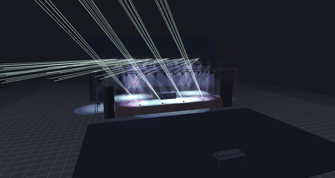

## Vorbereitung

Die Show baut ein Generator. Er legt sie nach `shows/` und überschreibt nie eine vorhandene
Datei:

```bash
venv/bin/python tools/build_buehnen_show_2026.py      # -> shows/Buehnen_Show_2026.lshow
```

Danach in LightOS **Datei → Öffnen...** und `Buehnen_Show_2026.lshow` wählen. Der Generator
legt außerdem die Bühne „Bühnen-Show 2026" für die 3D-Ansicht an.

Die Show bringt 40 PARs, 20 Moving Heads, 8 Strobes, 10 Laser und 2 Hazer mit, dazu die
Gruppen, die hier gebraucht werden. Wichtig sind:

| Gruppe | Geräte | Reihenfolge |
|---|---|---|
| **PAR alle (links → rechts)** | 40 PARs: Front-Traverse, Boden, Türme | von links nach rechts über die ganze Bühne |
| **MH alle (links → rechts)** | 20 Moving Heads der Mittel- und Rück-Traverse | von links nach rechts |
| **Strobes** | 8 Strobes auf der Mittel-Traverse | |
| **Laser** | 10 Laser | von links nach rechts |

Die Reihenfolge einer Gruppe ist die Reihenfolge, in der Matrix und EFX ihre Geräte
durchlaufen. Deshalb arbeiten alle Effekte unten mit den „links → rechts"-Gruppen.

> **Farbe und Dimmer bleiben getrennt.** Die Matrizen dieser Anleitung haben den Stil
> **Dimmer** und schreiben nur Helligkeit. Die Farbe kommt aus eigenen Knöpfen der Show
> (zum Beispiel **Magenta** oder **MH Blau** auf der ersten Seite der Virtual Console). Ohne
> Farbe bleiben die RGB-PARs dunkel, obwohl der Dimmer läuft.

**Mehr Platz für die Editoren:** Unter dem Programmer liegt die **Lampen-Vorschau**. Ein
Klick auf das Dreieck davor klappt sie ein; die Bilder unten zeigen sie eingeklappt.

## 1. Lauflicht von innen nach außen (Matrix)

In der Sektion **Programmer**, Reiter **Attribute**:

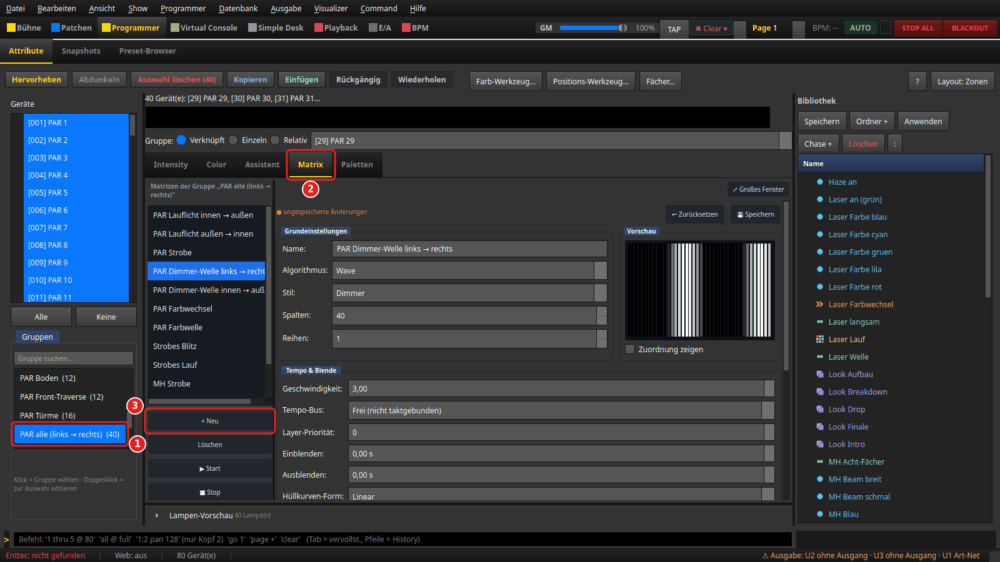

1. Links unter **Gruppen** auf **PAR alle (links → rechts) (40)** klicken. Der Programmer
   springt dabei selbst in den Reiter **Matrix**.
2. Der Reiter **Matrix** zeigt die Matrizen dieser Gruppe.
3. **+ Neu** legt eine neue Matrix an. Sie übernimmt die Gruppe als Raster: 40 Spalten,
   1 Reihe.

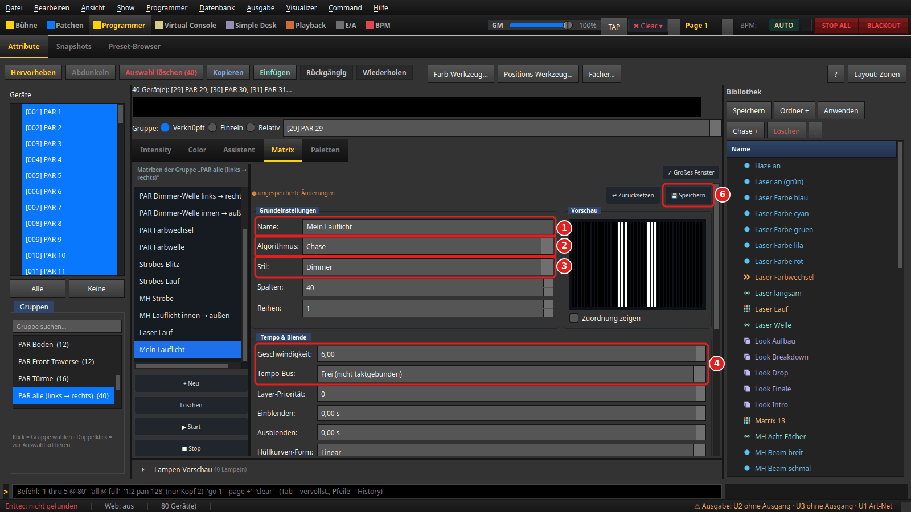

In der Gruppe **Grundeinstellungen**:

1. **Name:** `Mein Lauflicht`
2. **Algorithmus:** **Chase**
3. **Stil:** **Dimmer** — die Matrix schreibt nur Helligkeit.

In der Gruppe **Tempo & Blende**:

4. **Geschwindigkeit:** `6` und **Tempo-Bus:** **Frei (nicht taktgebunden)**. Mit der
   Voreinstellung **Global (taktgleich, Standard)** läuft die Matrix taktgleich zum
   Tempo-Bus; mit **Frei** gilt genau die eingestellte Geschwindigkeit.

Bis zum Speichern steht oben „ungespeicherte Änderungen". **💾 Speichern** (6) kommt nach
dem nächsten Schritt.

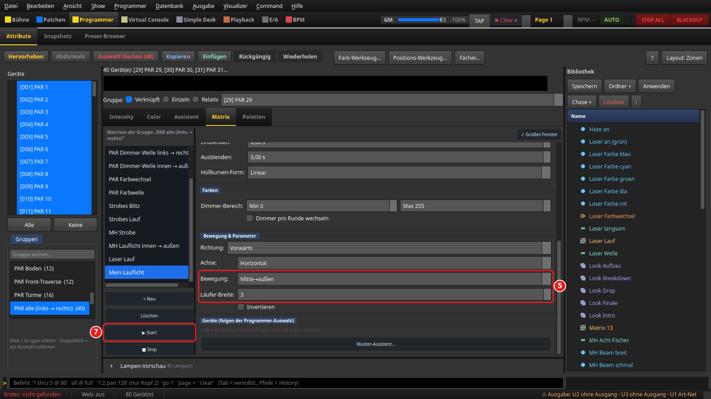

Weiter unten, in der Gruppe **Bewegung & Parameter**:

5. **Bewegung:** **Mitte→außen** und **Läufer-Breite:** `3`.

Dann oben **💾 Speichern** (6) und links **▶ Start** (7).

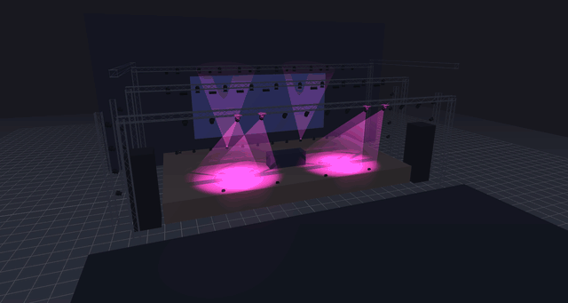

Das GIF zeigt das Lauflicht im 3D-Visualizer; die Farbe kommt vom Knopf **Magenta** der Show.

**So sieht es im DMX aus** (Dimmer der 40 PARs, gezählt in Gruppen-Reihenfolge, alle
4 DMX-Frames ≈ 0,09 s): Erst sind die Plätze 20 und 21 hell, dann 19–22, dann 18–23, dann
17–19 und 22–24 — zwei Läufer laufen spiegelgleich von der Mitte zu den Türmen. Die PARs
außerhalb der Läufer stehen auf 0.

**Variante Welle statt Lauflicht:** In derselben Matrix **Algorithmus:** **Wave** und
**Ursprung:** **Mitte** wählen, wieder **💾 Speichern**. Statt harter Läufer laufen weiche
Helligkeitsbänder; der Dimmer der 40 PARs ist dann spiegelgleich zur Mitte abgestuft
(zum Beispiel 0, 1, 145, 238, 248, 171, 34 …).

## 2. Pan-Welle über alle Moving Heads (EFX mit Versatz)

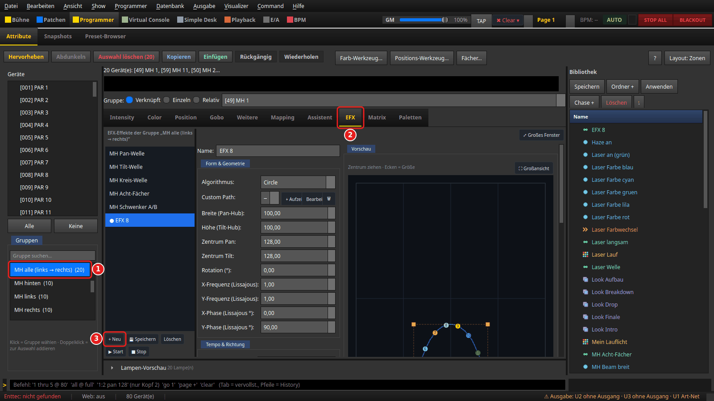

1. Links unter **Gruppen** auf **MH alle (links → rechts) (20)** klicken.
2. Der Programmer springt in den Reiter **Matrix**. Selbst auf den Reiter **EFX** wechseln.
   Er erscheint nur, wenn die Auswahl Geräte mit Pan und Tilt enthält.
3. **+ Neu** legt einen neuen EFX an. Er gehört sofort zu den 20 gewählten Köpfen (der
   Editor folgt der Programmer-Auswahl).

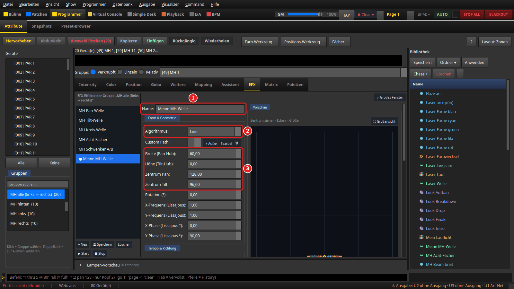

1. **Name:** `Meine MH-Welle`
2. **Algorithmus:** **Line** — eine gerade Bahn.
3. **Breite (Pan-Hub):** `60`, **Höhe (Tilt-Hub):** `0`, **Zentrum Pan:** `128`,
   **Zentrum Tilt:** `96`. Die Köpfe schwenken also nur waagerecht, leicht nach vorn
   geneigt.

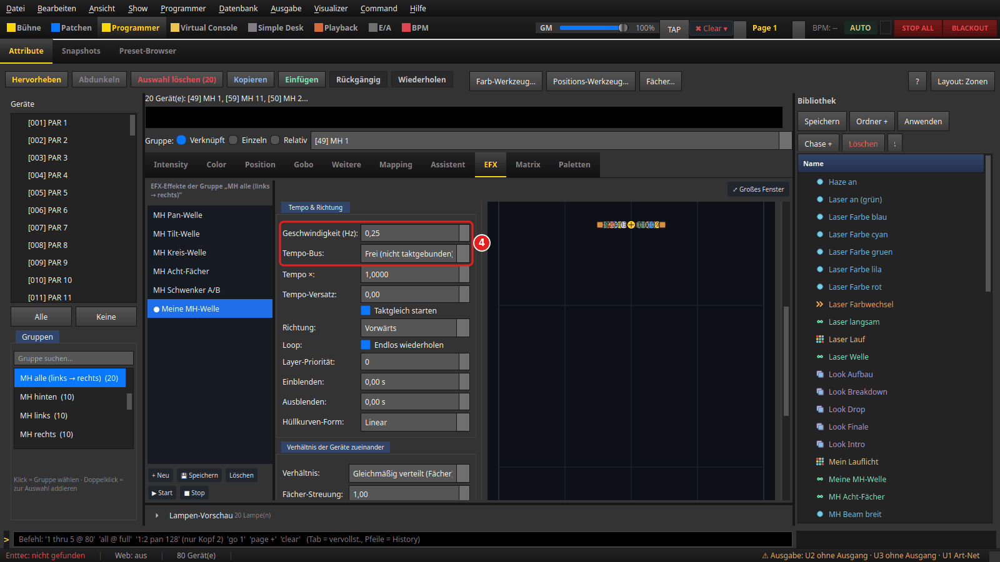

4. In **Tempo & Richtung**: **Geschwindigkeit (Hz):** `0,25` (eine Bahn in 4 Sekunden) und
   **Tempo-Bus:** **Frei (nicht taktgebunden)**.

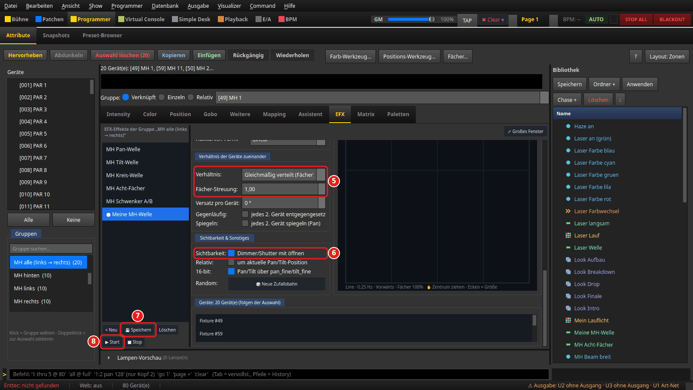

5. In **Verhältnis der Geräte zueinander**: **Verhältnis:** **Gleichmäßig verteilt (Fächer)**
   und **Fächer-Streuung:** `1,00`. Damit ist eine ganze Periode auf die 20 Köpfe verteilt:
   jeder Kopf läuft ein Stück später als sein linker Nachbar — die Welle.
6. In **Sichtbarkeit & Sonstiges**: **Sichtbarkeit:** **Dimmer/Shutter mit öffnen**
   anhaken. Sonst bewegen sich die Köpfe, bleiben aber dunkel.
7. **💾 Speichern**. Bis dahin ist der EFX ein Entwurf (in der Liste mit **●**).
8. **▶ Start**.

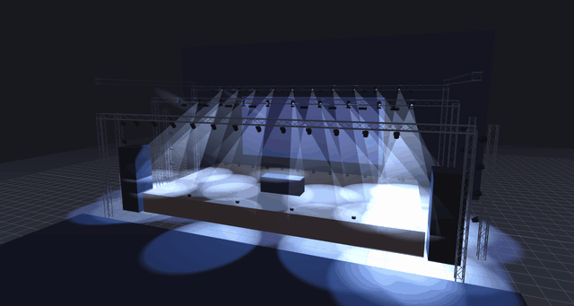

**So sieht es im DMX aus:** Zu einem Zeitpunkt stehen die 20 Köpfe auf Pan 157, 154, 148,
141, 132, 122 … 98, 98, 101 … 155, 157 — ein ganzer Wellenzug über die Reihe. Eine halbe
Sekunde später ist er weitergewandert (145, 136, 127 …). Tilt steht bei allen auf 96, der
Dimmer auf 255.

> **Achtung, der angezeigte EFX folgt der Auswahl.** Wer bei offenem Reiter **EFX** auf
> **Keine** klickt oder eine andere Gruppe wählt, bindet den gerade angezeigten EFX an die neue
> Auswahl — auch einen schon gespeicherten. Vor dem Wechsel der Auswahl erst auf einen anderen
> Reiter gehen (zum Beispiel **Intensity**). Siehe Backlog UI-77.

## 3. Schwenker, die sich abwechseln (EFX, 180° Versatz)

Gleicher Weg wie in Schritt 2: Gruppe **MH alle (links → rechts) (20)**, Reiter **EFX**,
**+ Neu**. Dann:

- **Name:** `Meine Schwenker`, **Algorithmus:** **Line**
- **Breite (Pan-Hub):** `80`, **Höhe (Tilt-Hub):** `0`, **Zentrum Tilt:** `100`
- **Geschwindigkeit (Hz):** `0,30`, **Tempo-Bus:** **Frei (nicht taktgebunden)**

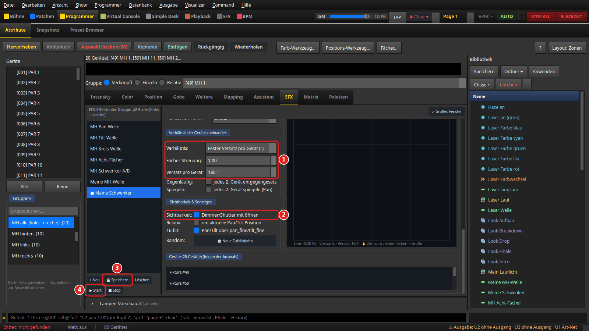

1. **Verhältnis:** **Fester Versatz pro Gerät (°)** und **Versatz pro Gerät:** `180 °`.
   Jeder Kopf läuft eine halbe Bahn hinter seinem Nachbarn: schwenkt einer nach links, schwenkt
   der nächste nach rechts.
2. **Sichtbarkeit:** **Dimmer/Shutter mit öffnen** anhaken.
3. **💾 Speichern**
4. **▶ Start**

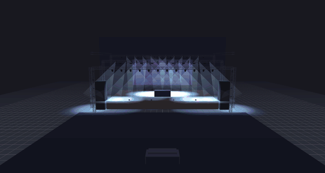

**So sieht es im DMX aus:** Die Pan-Werte wechseln von Kopf zu Kopf, zum Beispiel
165, 90, 165, 90 … und kurz darauf 156, 99, 156, 99 … Die beiden Werte liegen immer
spiegelbildlich um die Mitte 128.

Die Show hat denselben Effekt als **MH Schwenker A/B** mit den Gruppen **MH A (jeder zweite)**
und **MH B (jeder zweite)**. Der Weg hier kommt ohne eigene Gruppen aus.

## 4. Stroboskop (Matrix Strobe)

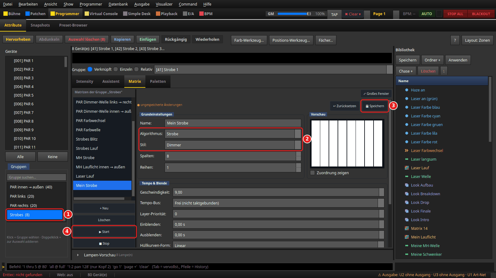

1. Gruppe **Strobes (8)** anklicken; der Programmer springt in den Reiter **Matrix**.
   Dort **+ Neu**, **Name:** `Mein Strobe`.
2. **Algorithmus:** **Strobe**, **Stil:** **Dimmer**. Darunter **Geschwindigkeit:** `9` und
   **Tempo-Bus:** **Frei (nicht taktgebunden)**.
3. **💾 Speichern**
4. **▶ Start**

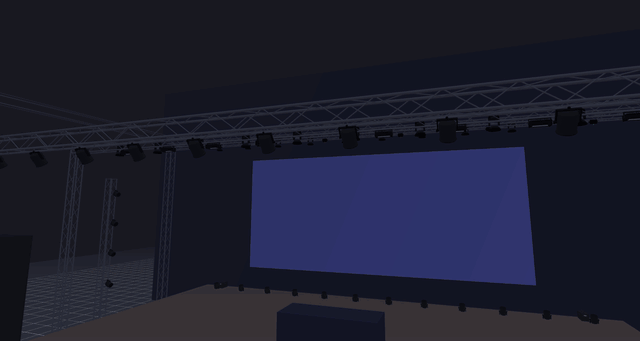

**So sieht es im DMX aus** (Dimmer von Strobe 1, jeder DMX-Frame, 44 pro Sekunde):
255, 255, 255, 255, 0, 0, 0, 0, 0, 255 … — hart an und aus, rund vier Blitze pro Sekunde.
Alle acht Strobes blitzen gleichzeitig.

Dieselbe Matrix auf der Gruppe **PAR alle (links → rechts)** lässt die PARs blitzen; die Show
hat das als **PAR Strobe**.

## 5. Langsame Laser-Bewegung (Szenen + Chaser mit Überblendung)

Ein EFX lässt sich in der Oberfläche nur auf Pan/Tilt legen, nicht auf die X-/Y-Bewegung eines
Lasers (Backlog LAS-22). Eine langsame Bewegung entsteht deshalb aus zwei Szenen, zwischen
denen ein Chaser weich überblendet.

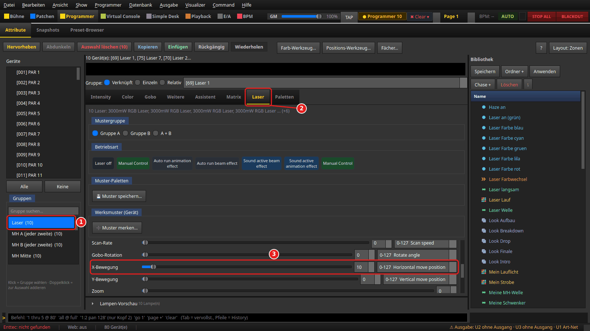

1. Gruppe **Laser (10)** anklicken.
2. Reiter **Laser** öffnen.
3. Unter den Reglern **X-Bewegung** auf `10` stellen. Der Bereich daneben zeigt
   **0-127 Horizontal move position**: 0–127 ist die Position. Den Bereich 128–255 führt das
   Profil als **Horizontal move speed** (eine Bewegung im Gerät selbst); er wird hier nicht
   gebraucht.

Jetzt den Wert als Szene speichern: Reiter **Assistent** → **Programmer → Szene**.

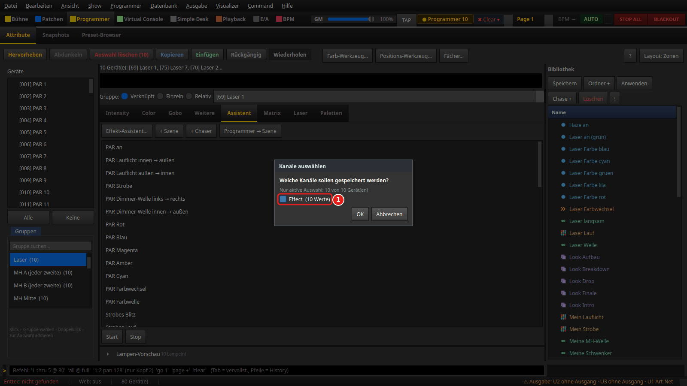

Im Dialog **Kanäle auswählen** steht nur **Effect (10 Werte)** — die X-Bewegung der zehn Laser.
Angehakt lassen, **OK**. Bei **Name der Szene:** `Laser links` eingeben, **OK**.

Dann im Reiter **Laser** **X-Bewegung** auf `118` stellen und genauso die Szene
`Laser rechts` speichern. Danach oben **✖ Clear ▾ → Programmer leeren** wählen; sonst hält der
Programmer die X-Bewegung fest und der Chaser bewegt nichts.

Im Reiter **Assistent** auf **+ Chaser**. Es öffnet sich **Bearbeiten: Neuer Chaser**:

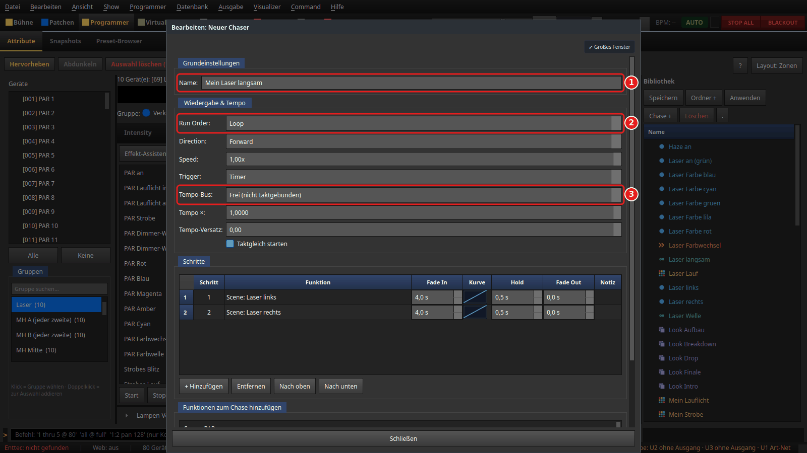

1. **Name:** `Mein Laser langsam`
2. **Run Order:** **Loop**
3. **Tempo-Bus:** **Frei (nicht taktgebunden)**

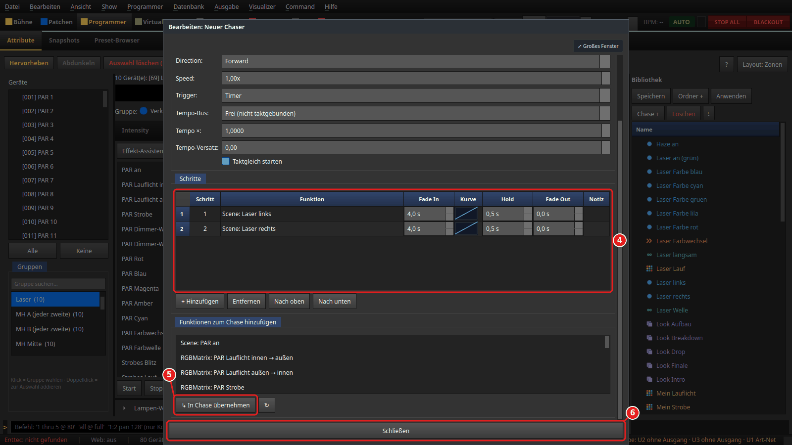

4. In der Liste **Funktionen zum Chase hinzufügen** `Scene: Laser links` und
   `Scene: Laser rechts` markieren, dann **↳ In Chase übernehmen** (5). In der Tabelle
   **Schritte** bei beiden Schritten **Fade In** auf `4,0 s` und **Hold** auf `0,5 s` stellen.
6. **Schließen**.

Zum Starten den Chaser im Reiter **Assistent** in der Liste wählen und **Start** — oder einen
Knopf dafür anlegen (Schritt 6). Die Laser müssen dazu an sein, in der Show über den Knopf
**Laser an**.

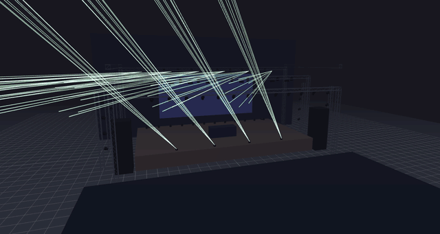

**So sieht es im DMX aus** (X-Bewegung von Laser 1, alle 0,5 s): 10, 11, 24, 38, 51, 65, 78,
92, 105, 118, 117, 104, 90, 77 … — der Wert gleitet in 4 Sekunden von links nach rechts und
wieder zurück, bei allen zehn Lasern gleich.

> **Grenze der 3D-Ansicht:** Der Visualizer zeichnet Laser als feste Kegel. Er zeigt An/Aus
> und Farbe, aber keine X-/Y-Bewegung — im GIF steht der Laser still, obwohl der DMX-Wert
> wandert (Backlog VIZ-81). Am echten Gerät ist die Bewegung zu sehen.

## 6. Effekte auf eigene Knöpfe legen (Virtual Console)

In der Sektion **Virtual Console**:

- Mit **▶** neben der Bank-Anzeige auf eine freie Bank wechseln (die Show belegt Bank 1).
- **Bearbeiten** einschalten (der Knopf heißt dann **Bearbeiten ✓**).
- Rechtsklick auf eine freie Stelle → **Hinzufügen** → **Button**.
- Doppelklick auf den neuen Knopf öffnet **Button Einstellungen**:

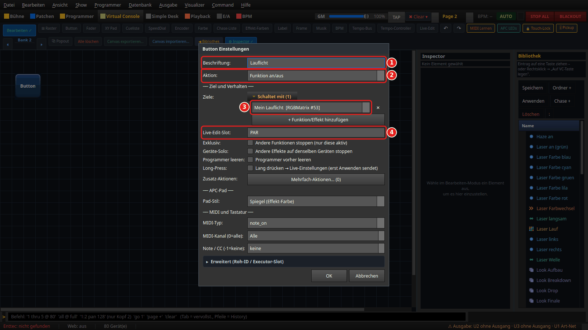

1. **Beschriftung:** `Lauflicht`
2. **Aktion:** **Funktion an/aus**
3. Unter **Ziele:** auf **+ Funktion/Effekt hinzufügen** und in der Auswahl
   **Mein Lauflicht** wählen.
4. **Live-Edit-Slot:** `PAR`

**OK**. Genauso die anderen Knöpfe:

| Beschriftung | Funktion | Live-Edit-Slot |
|---|---|---|
| Lauflicht | Mein Lauflicht | PAR |
| MH-Welle | Meine MH-Welle | MH |
| Schwenker | Meine Schwenker | MH |
| Strobe | Mein Strobe | STR |
| Laser langsam | Mein Laser langsam | LAS |

Knöpfe mit **demselben** Live-Edit-Slot lösen einander ab: **Schwenker** stoppt die
**MH-Welle** und umgekehrt, weil zwei Bewegungen derselben Köpfe nicht gleichzeitig laufen
sollen. Knöpfe in anderen Slots laufen weiter.

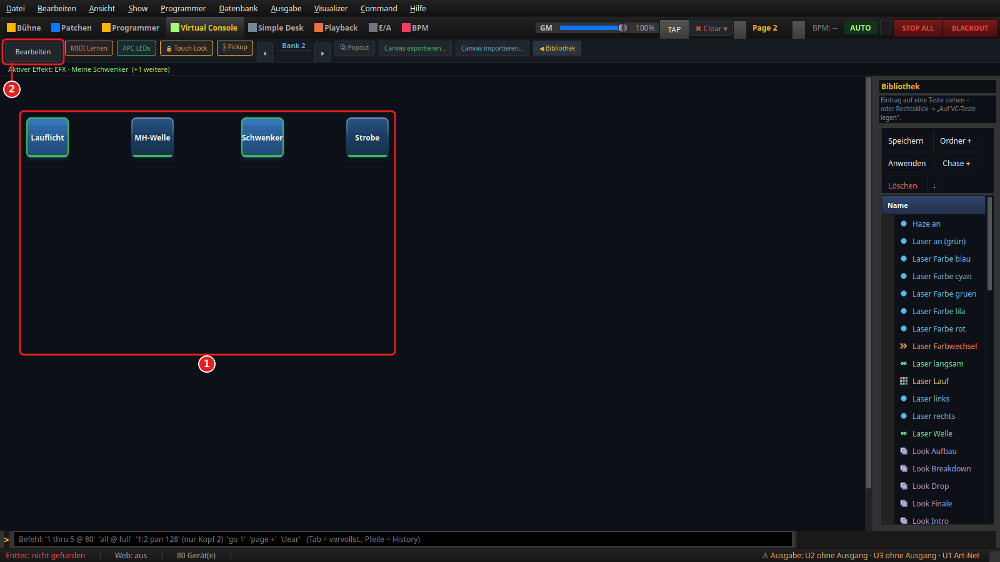

1. Die fünf Knöpfe; **Lauflicht** und **Schwenker** laufen gerade (grüner Rand).
2. **Bearbeiten** wieder ausschalten, dann schalten die Knöpfe.

**So sieht es aus, geprüft:** Nach **Lauflicht** und **MH-Welle** laufen beide Funktionen.
Ein Druck auf **Schwenker** stoppt die MH-Welle (Slot MH), das Lauflicht läuft weiter, und
die Pan-Werte der Köpfe wechseln wieder spiegelbildlich (165, 90, 165, 90 …).

## 7. Nebel, Strahl-Deckkraft und 3D-Ansicht

Den Visualizer öffnet **Visualizer → 3D Visualizer öffnen**. Rechts im Reiter
**Einstellungen**:

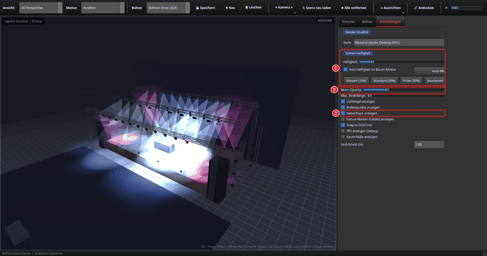

1. **Szenen-Helligkeit:** **Konzert (10%)** — die Bühne liegt im Dunkeln, das Licht der Geräte
   trägt das Bild.
2. **Beam Opacity:** etwa `20` %. Viele Strahlen addieren sich; bei 70 % (Voreinstellung)
   wird eine Bühne mit 20 Moving Heads im Nebel schnell weiß. Zwischen 15 und 25 % bleiben
   Bühne und Traversen zwischen den Strahlen sichtbar. (Ist die rechte Spalte schmal, ist die
   Prozentanzeige rechts neben dem Regler abgeschnitten — Backlog VIZ-74.)
3. **Nebel/Haze anzeigen** anhaken.

Der Nebel im Raum kommt von den Hazern der Show: Der Knopf **Haze an** setzt bei beiden Hazern
Nebel 90 und Lüfter 80 (DMX geprüft). **Nebel/Haze anzeigen** schaltet nur die Darstellung im
Visualizer.

Für ruhige Bilder: Unter **Stufe** die Render-Qualität wählen. Auf **Hoch** wird die Auflösung
während einer Kamerafahrt kurz gröber, wenn die Grafikkarte nicht nachkommt; **Maximal** bleibt
immer scharf, braucht aber eine starke Grafikkarte.

## Wie die Bilder entstehen

Die Oberflächen-Bilder und die GIFs baut `tools/anleitungsbilder/szenen_buehnen_effekte.py`
in einer Wegwerf-Sandbox, mit den echten Knöpfen und Dialogen. Jeder Effekt wird dabei per DMX
geprüft; die Zahlen oben stammen aus diesem Lauf. Die 3D-GIFs brauchen einen echten Bildschirm:

```bash
venv/bin/python tools/anleitungsbilder.py buehnen_effekte                # Oberfläche
DISPLAY=:0 venv/bin/python tools/anleitungsbilder.py buehnen_effekte --bildschirm   # 3D
```
