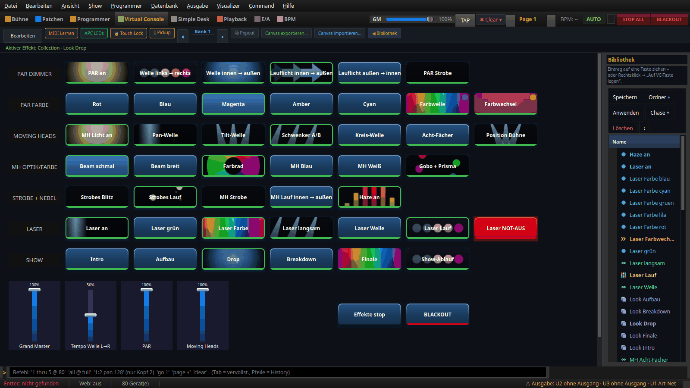
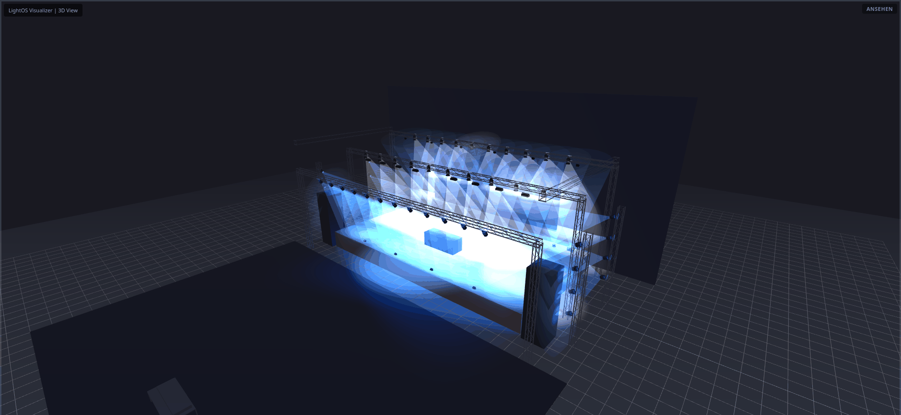
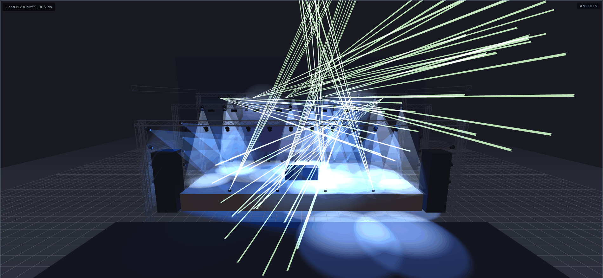
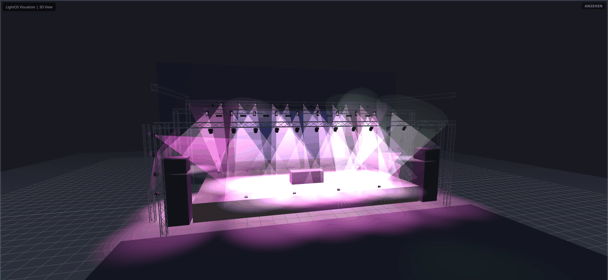
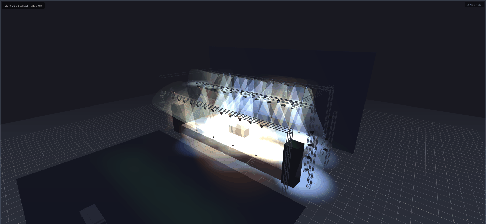
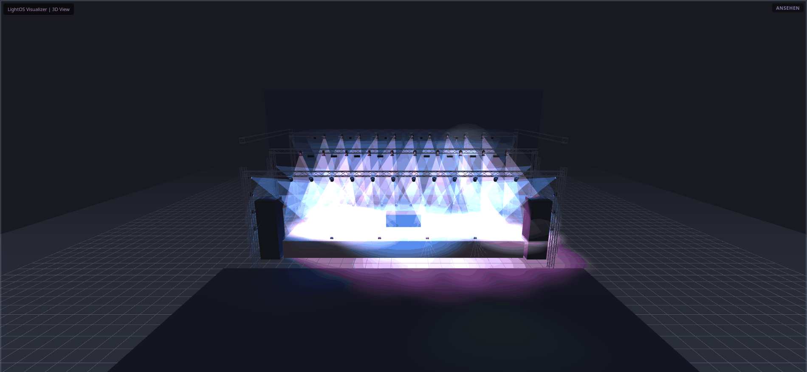
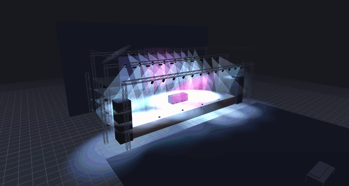
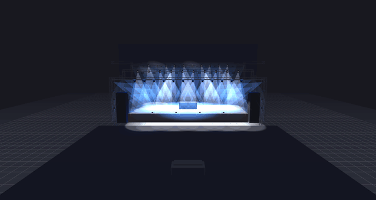
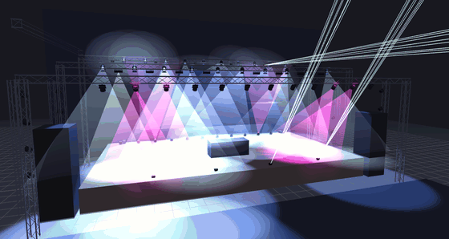

# Große Bühnen-Show 2026 — Wellen, Lauflichter, Strobe, Laser

Eine große Testbühne (20 m breit, 11 m tief, 1,5 m hoch) mit drei Traversen-Ebenen
(7,5 m vor der Bühne, 8,5 m und 9,5 m darüber), zwei PAR-Türmen je Seite, LED-Wand,
DJ-Pult und Boxen-Türmen. Alle Effekte sind mit vorhandenen LightOS-Funktionen gebaut
(Matrix, EFX, Chaser, Collections, Gruppen, Virtuelle Konsole), nur mit mitgelieferten
Profilen.

```bash
./venv/bin/python tools/build_buehnen_show_2026.py            # -> shows/Buehnen_Show_2026.lshow
./venv/bin/python tools/lint_show.py --strict shows/Buehnen_Show_2026.lshow
```

Der Generator überschreibt nie eine vorhandene Show und legt die Bühne
„Bühnen-Show 2026" im LightOS-Datenordner an.

Wie man solche Effekte selbst baut — Klick für Klick in der Oberfläche —, zeigt
[Große Bühnen-Show: Effekte selbst bauen](ANLEITUNG.md).

## Rig (80 Geräte)

| Universum | Geräte | Profil | Ort |
|---|---|---|---|
| 1 | 40 PAR | FLAT PRO 7, 8-Kanal Voll | 12 Front-Traverse, 12 Boden-Uplights hinten, 16 an den Seiten-Türmen |
| 1 | 8 Strobe | Strobe 2ch | Mittel-Traverse |
| 2 | 20 Moving Head | Moving Head Spot 16ch | je 10 an Mittel- und Rück-Traverse |
| 3 | 10 Laser | 3000mW RGB Laser, 25 Channel | 6 Rück-Traverse, 4 Bühnenkante |
| 3 | 2 Hazer | HZ-1500 Pro, 2-Kanal | hinten links/rechts auf der Bühne |

Farbe und Dimmer sind getrennt: Farb-Knöpfe schreiben nur Farbkanäle, Helligkeit
kommt aus den Dimmer-Knöpfen (PAR an, Wellen, Lauflichter, Strobe).

## Virtuelle Konsole



Knöpfe einer Reihe mit demselben Live-Edit-Slot lösen einander ab (ein neuer Dimmer-
Effekt ersetzt den alten, Farbe läuft weiter).

| Reihe | Knöpfe |
|---|---|
| PAR DIMMER | PAR an · Welle links → rechts · Welle innen → außen · Lauflicht innen → außen · Lauflicht außen → innen · PAR Strobe |
| PAR FARBE | Rot · Blau · Magenta · Amber · Cyan · Farbwelle · Farbwechsel |
| MOVING HEADS | MH Licht an · Pan-Welle · Tilt-Welle · Schwenker A/B · Kreis-Welle · Acht-Fächer · Position Bühne |
| MH OPTIK/FARBE | Beam schmal · Beam breit · Farbrad · MH Blau · MH Weiß · Gobo + Prisma |
| STROBE | Strobes Blitz · Strobes Lauf · MH Strobe · MH Lauf innen → außen |
| LASER + NEBEL | Laser an · Laser langsam · Laser Welle · Laser Lauf · Laser Farbe · Haze an |
| SHOW | Intro · Aufbau · Drop · Breakdown · Finale · Show-Ablauf (alle Looks im Wechsel) |
| unten | Grand Master · Tempo Welle · PAR · Moving Heads · Effekte stop · BLACKOUT (solange gedrückt) |

Wellen: Die Dimmer- und Farbwellen laufen als Matrix über alle 40 PARs in
x-Reihenfolge, die Pan-/Tilt-Wellen als EFX mit Phasenversatz („fan") über die
20 Moving Heads. Bei „Schwenker A/B" fährt jeder zweite Kopf um eine halbe Periode
versetzt — die Strahlen schwenken gegeneinander.

## Bilder











Kamerafahrten, während die Effekte laufen:







Neu erzeugen (am Bildschirm, 3D braucht WebGL):

```bash
DISPLAY=:0 venv/bin/python tools/anleitungsbilder.py buehnen_show --bildschirm
venv/bin/python tools/anleitungsbilder.py buehnen_show      # VC-Bild offscreen
```

Darstellung im 3D-Visualizer: Strahl-Deckkraft 22 %, Nebel an, Szenen-Helligkeit 10.
