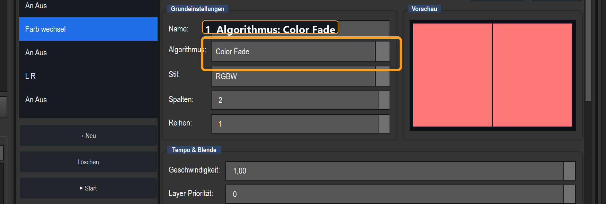
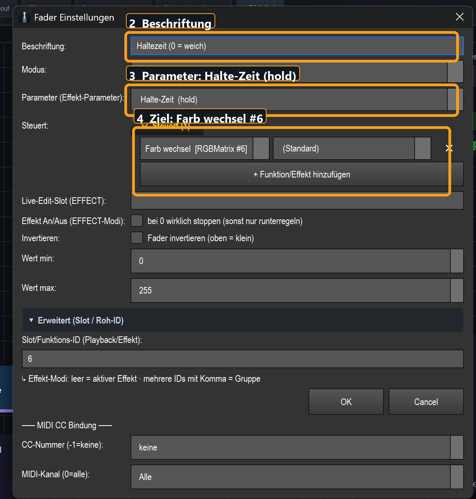
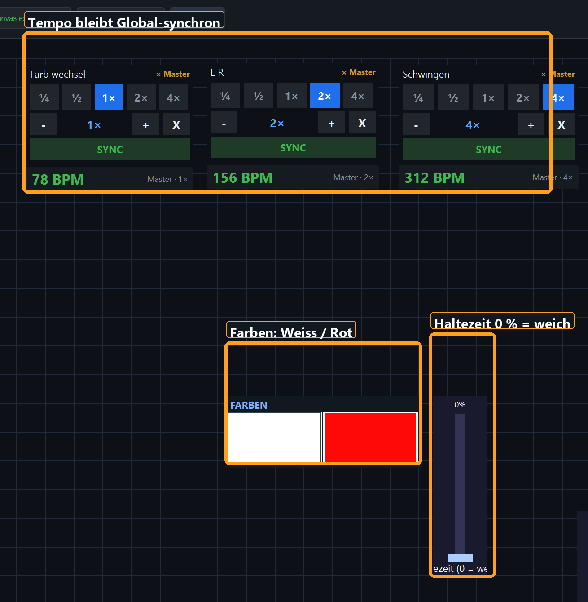

# Weiche Farbwechsel in der virtuellen Konsole

Diese Anleitung zeigt, wie eine RGB-/RGBW-Matrix **weich zwischen mehreren Farben
überblendet**, ohne dass der Tempo-Sync verloren geht.

Die Beispielkonfiguration ist bereits in `shows/test1234.lshow` eingerichtet:

- Effekt: **Farb wechsel**
- Algorithmus: **Color Fade**
- Farben: **Weiß → Rot**
- Tempo-Bus: **Global**
- Tempo-Multiplikator: **1×**
- Haltezeit: **0 %** für einen durchgehend weichen Übergang

## Welcher Fade ist welcher?

| Einstellung | Wirkung |
|---|---|
| **Fade ein/aus (s)** | Blendet den **gesamten Effekt** beim Starten und Stoppen ein oder aus. |
| **Color Fade** | Überblendet während des laufenden Effekts weich von einer Farbe zur nächsten. |
| **Halte-Zeit** | Bestimmt, wie lange eine Farbe stehen bleibt, bevor übergeblendet wird. |
| **After Fade** | Erzeugt bei einem **Chase** nur einen nachlaufenden Schweif hinter dem Läufer. |

Für einen laufenden Weiß-Rot-Farbverlauf wird daher **Color Fade + Haltezeit**
verwendet. Der Start-/Stop-Fade ist davon unabhängig.

## 1. Matrix auf „Color Fade“ stellen

1. Öffne **Programme → Matrix**.
2. Wähle den vorhandenen Effekt, beispielsweise **Farb wechsel**.
3. Stelle **Algorithmus** auf **Color Fade**.
4. Lasse den Stil auf **RGB** oder **RGBW**.
5. Stelle unter **Bewegung & Parameter** die **Halte-Zeit auf 0,00**.
6. Speichere den Matrix-Effekt.

`0,00` bedeutet: Die komplette Zeit zwischen zwei Farbpunkten wird zum
Überblenden verwendet. Es gibt keinen harten Farbsprung.

## 2. Den VC-Regler richtig belegen

1. Öffne die gewünschte VC-Bank und aktiviere **Bearbeiten**.
2. Rechtsklicke den bisherigen Fade-Regler und öffne **Einstellungen**.
3. Verwende diese Werte:
   - **Beschriftung:** `Haltezeit (0 = weich)`
   - **Modus:** `Effekt-Parameter`
   - **Parameter:** `Halte-Zeit (hold)`
   - **Steuert:** der gewünschte Matrix-Effekt, hier `Farb wechsel [RGBMatrix #6]`
   - **Invertieren:** aus
   - **Wert min/max:** `0` / `255`
4. Bestätige mit **OK**.
5. Deaktiviere **Bearbeiten** und ziehe den Regler für einen kontinuierlichen
   Übergang ganz nach unten auf **0 %**.

## 3. Bedienung während der Show

- **0 % Haltezeit:** durchgehender, weicher Crossfade.
- **25–50 %:** Farben bleiben kurz stehen, der Übergang wird kompakter.
- **nahe 100 %:** lange Haltephase und kurzer, beinahe harter Farbwechsel.
- Das **Speed-Rad** bestimmt weiterhin die Geschwindigkeit relativ zum
  Global-Tempo.
- **SYNC** setzt nur die Phase neu; die Haltezeit und Farbreihenfolge bleiben erhalten.
- Der An/Aus-Schalter auf einer anderen Bank darf denselben Effekt steuern.

## Start-/Stop-Fade zusätzlich verwenden

Der Effekt in `test1234.lshow` besitzt weiterhin **10 Sekunden Ein- und
Ausblendzeit**. Das bedeutet:

- Beim Einschalten wird der gesamte Color-Fade-Effekt über 10 Sekunden sichtbar.
- Beim Ausschalten wird seine komplette Ausgabe über 10 Sekunden ausgeblendet.
- Innerhalb dieser Hüllkurve läuft der Weiß-Rot-Crossfade weiter temposynchron.

Wenn nur die Farbwechsel weich sein sollen, aber Start und Stop sofort erfolgen
sollen, setze im Matrix-Editor **Einblenden** und **Ausblenden** auf `0,00 s`.

## Für neue Effekte merken

Beim Ziehen einer Farbmatrix auf die virtuelle Konsole:

1. **Color Fade** als Matrix-Algorithmus wählen.
2. **Farben ändern** und **Tempo** als Bedienelemente hinzufügen.
3. Unter **Mehr Parameter** den Parameter **Halte-Zeit** hinzufügen.
4. **Fade ein+aus (s)** nur zusätzlich wählen, wenn auch das Starten und Stoppen
   des gesamten Effekts weich erfolgen soll.

