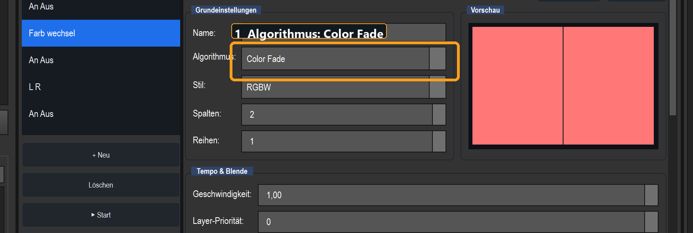
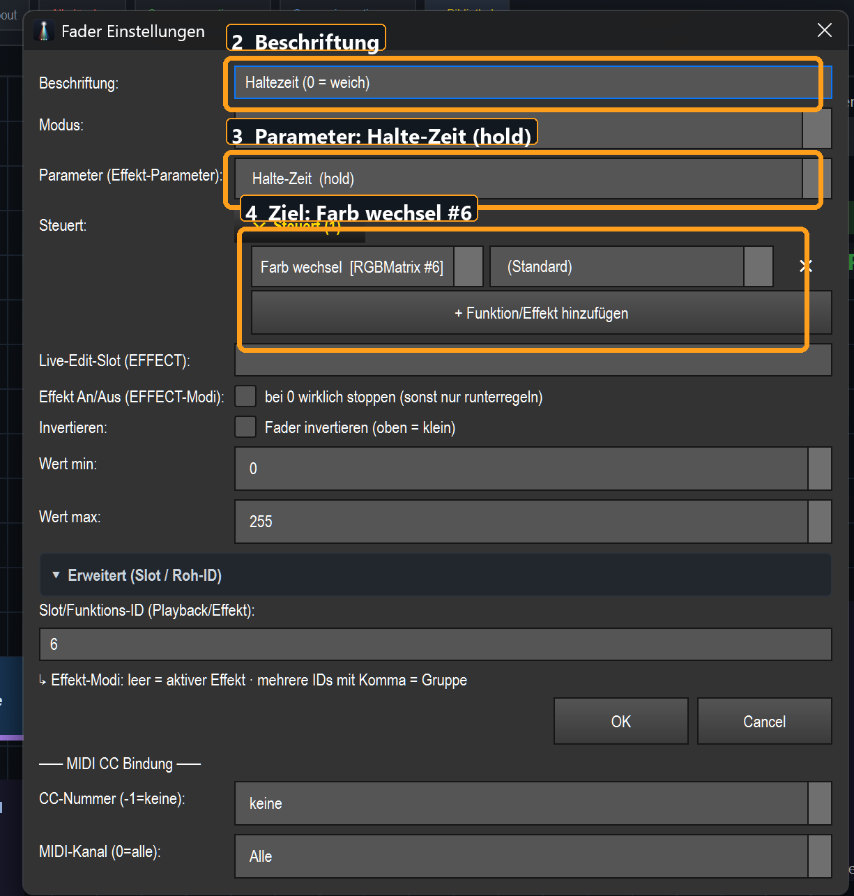
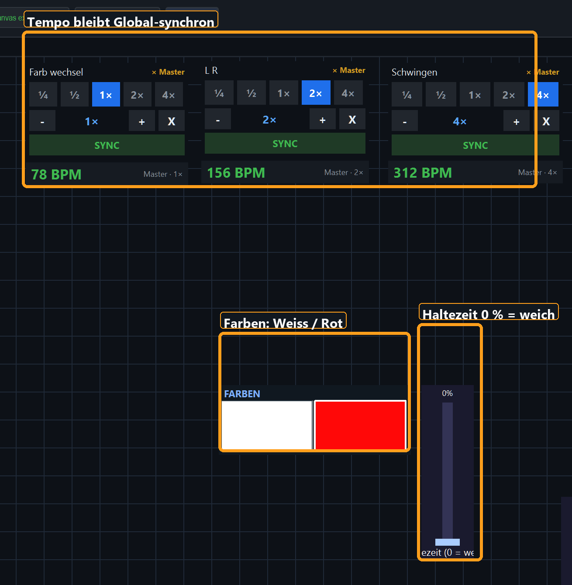

# Weiche Farbwechsel in der virtuellen Konsole

Diese Anleitung zeigt, wie eine RGB-/RGBW-Matrix **weich zwischen mehreren Farben
überblendet**, ohne dass der Tempo-Sync verloren geht.

Die Beispielwerte stammen aus einer privaten Show, die nicht im Repository liegt und
von keinem Generator erzeugt wird. Lege den Effekt wie unten beschrieben selbst an;
die Zielwerte sind:

- Effekt: **Farb wechsel**
- Algorithmus: **Color Fade**
- Farben: **Weiß → Rot**
- Tempo-Bus: **Global**
- Tempo-Multiplikator: **1×**
- Übergangs-Pause: **0 %** für einen durchgehend weichen Übergang

## Welcher Fade ist welcher?

| Einstellung | Wirkung |
|---|---|
| **Fade ein+aus (s)** | Blendet den **gesamten Effekt** beim Starten und Stoppen ein oder aus. |
| **Color Fade** | Überblendet während des laufenden Effekts weich von einer Farbe zur nächsten. |
| **Übergangs-Pause** | Bestimmt, wie lange eine Farbe stehen bleibt, bevor übergeblendet wird. |
| **Schweif (%)** | Erzeugt bei einem **Chase** nur einen nachlaufenden Schweif hinter dem Läufer. |

Für einen laufenden Weiß-Rot-Farbverlauf wird daher **Color Fade + Übergangs-Pause**
verwendet. Der Start-/Stop-Fade ist davon unabhängig.

## 1. Matrix auf „Color Fade“ stellen

1. Öffne **Programmer → Matrix**. Drücke vorher im Programmer **Keine** (Auswahl
   leeren): Die eingebettete Matrix folgt der Programmer-Auswahl und übernimmt
   gewählte Geräte **sofort** als Raster der markierten Matrix, auch ohne Speichern.
2. Wähle den vorhandenen Effekt, beispielsweise **Farb wechsel**.
3. Stelle **Algorithmus** auf **Color Fade**.
4. Lasse den Stil auf **RGB** oder **RGBW**.
5. Stelle unter **Bewegung & Parameter** die **Übergangs-Pause auf 0,00**.
6. Speichere den Matrix-Effekt.

`0,00` bedeutet: Die komplette Zeit zwischen zwei Farbpunkten wird zum
Überblenden verwendet. Es gibt keinen harten Farbsprung.

## 2. Den VC-Regler richtig belegen

1. Öffne die gewünschte VC-Bank und aktiviere **Bearbeiten**.
2. Rechtsklicke den bisherigen Fade-Regler und öffne **Einstellungen**.
3. Verwende diese Werte:
   - **Beschriftung:** `Übergangs-Pause (0 = weich)`
   - **Modus:** `Effekt-Parameter`
   - **Parameter (Effekt-Parameter):** `Übergangs-Pause (crossfade_hold)`
   - **Steuert:** der gewünschte Matrix-Effekt, hier `Farb wechsel [RGBMatrix #6]`
   - **Invertieren:** aus
   - **Wert min/max:** `0` / `255`
4. Bestätige mit **OK**.
5. Deaktiviere **Bearbeiten** und ziehe den Regler für einen kontinuierlichen
   Übergang ganz nach unten auf **0 %**.

## 3. Bedienung während der Show

- **0 % Übergangs-Pause:** durchgehender, weicher Crossfade.
- **25–50 %:** Farben bleiben kurz stehen, der Übergang wird kompakter.
- **nahe 100 %:** lange Haltephase und kurzer, beinahe harter Farbwechsel.
- Ein **Speed-Rad im Multiplikator-Modus** (Tasten ¼ ½ 1× 2× 4×, wie im Bild)
  bestimmt die Geschwindigkeit relativ zum Global-Tempo. Ein Speed-Rad im
  Funktions-Modus stellt dagegen nur „Geschwindigkeit" — das wirkt bei laufender
  BPM nicht.
- **SYNC** setzt nur die Phase neu; die Übergangs-Pause und Farbreihenfolge bleiben erhalten.
- Der An/Aus-Schalter auf einer anderen Bank darf denselben Effekt steuern.

## Start-/Stop-Fade zusätzlich verwenden

Hat der Effekt eine Ein- und Ausblendzeit (im Beispiel **10 Sekunden**), gilt:

- Beim Einschalten wird der gesamte Color-Fade-Effekt über 10 Sekunden sichtbar.
- Beim Ausschalten wird seine komplette Ausgabe über 10 Sekunden ausgeblendet.
- Innerhalb dieser Hüllkurve läuft der Weiß-Rot-Crossfade weiter temposynchron.

Wenn nur die Farbwechsel weich sein sollen, aber Start und Stop sofort erfolgen
sollen, setze im Matrix-Editor **Einblenden** und **Ausblenden** auf `0,00 s`.

## Für neue Effekte merken

1. Im Matrix-Editor **Color Fade** als Algorithmus wählen und **💾 Speichern**.
   (Das Fenster beim Ziehen auf die VC hat keine Algorithmus-Wahl.)
2. Die Matrix auf die virtuelle Konsole ziehen und im Fenster **„Effekt einrichten"**
   **„Farben ändern…"** und **„Tempo-Multiplikator (×½ ×2)…"** ankreuzen. Nicht
   **„Tempo (Geschwindigkeit)"**: dieses Rad stellt nur „Geschwindigkeit", und die
   wirkt bei laufender BPM nicht.
3. Den zugeklappten Bereich **„Mehr Parameter (N)"** aufklappen und
   **„Parameter: Übergangs-Pause"** ankreuzen.
4. **„Parameter: Fade ein+aus (s)"** nur zusätzlich wählen, wenn auch das Starten und
   Stoppen des gesamten Effekts weich erfolgen soll.

