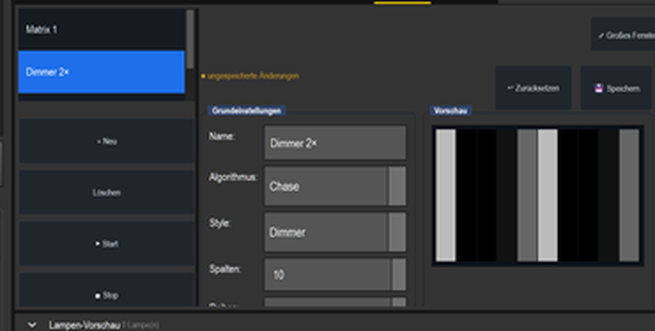
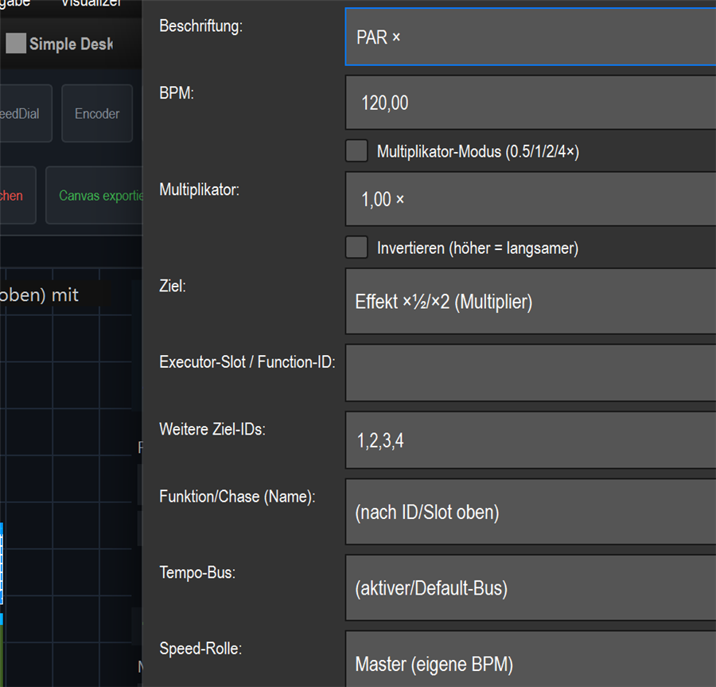
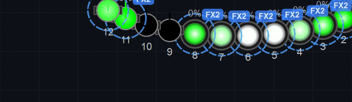

# Anleitung: Dimmer-Matrix & Geschwindigkeit (Helligkeit als eigene Ebene)

> Eine **Dimmer-Matrix** treibt nicht die *Farbe*, sondern die **Helligkeit** der Geräte —
> als eigene Lauflicht-/Puls-Ebene **über** einer Farb-Matrix. Im Hardstyle-Look läuft sie
> z. B. **schneller als der Farb-Chase** und lässt sich musik-synchron koppeln (das Koppeln
> selbst passiert in der **Virtuellen Konsole** bzw. der **BPM-Sektion**, nicht im Matrix-Editor).
> Genutzt wird die vorhandene **RGB-Matrix** mit **Style = Dimmer**.

---

## 1. Idee: Farbe und Helligkeit als getrennte Ebenen

- **Farb-Matrix** (Style RGB/RGBW) setzt nur die **Farbe** der Geräte (siehe Anleitung *Farbchase*).
- **Dimmer-Matrix** (Style **Dimmer**) setzt nur den **Dimmer-/Helligkeitskanal** — sie schreibt
  Graustufen (an/aus bzw. Verlauf) und lässt die Farbe in Ruhe.
- Beide laufen **gleichzeitig** über dieselben Geräte: Farbe von der einen, Helligkeit von der
  anderen. So bekommst du z. B. einen **blauen Chase**, dessen Helligkeit zusätzlich pulst.

## 2. Dimmer-Matrix anlegen

Programmer → Tab **Matrix** → **+ Neu** → in **Grundeinstellungen**:

- **Algorithmus: Chase** (Lauflicht; alternativ *Atmen (Puls)* = pulsierend, *Strobe* = hartes An/Aus)
- **Style: Dimmer**
- **Spalten/Reihen** musst du nicht von Hand setzen: Der eingebettete Editor folgt automatisch
  der **Programmer-Auswahl** (die manuellen Zuweisungs-Buttons sind ausgeblendet). Daraus ergibt
  sich das Geräte-Grid von selbst — bei loser Auswahl als **Spalten = Anzahl der Geräte**
  (hier 10 = PAR + Spider), **Reihen = 1**.

Die **Vorschau** zeigt die Helligkeit als Graustufen-Lauflicht (weiße Balken = hell):

> In **Bewegung & Parameter** steuerst du die **Läufer-Anzahl** (mehr Läufer = voller/dichter),
> die **Läufer-Breite** und **After Fade** (in %: 0 % → harter Wechsel, höher → langes weiches
> Nachfaden hinter dem Läufer). In der Gruppe **Farben** legst du bei Style *Dimmer* über den
> **Dimmer-Bereich** (Spinboxen **Min** / **Max**) den Helligkeitsbereich fest.

## 3. Geschwindigkeit: fest einstellen oder ans Tempo koppeln

Im Matrix-Editor gibt es in der Gruppe **Tempo & Blende** nur diese Felder:
**Geschwindigkeit**, **Layer-Priorität**, **Einblenden**, **Ausblenden** und **Hüllkurven-Form**.

- Über **Geschwindigkeit** stellst du das Tempo der Matrix als festen Faktor ein (1,0 = normal,
  2,0 = doppelt so schnell). So läuft der Dimmer-Puls z. B. schneller als der Farb-Chase, indem
  du seiner Dimmer-Matrix einfach einen höheren Wert gibst.
- Mit **Layer-Priorität** entscheidest du, wer gewinnt, wenn zwei Effekte denselben Kanal
  schreiben (höher gewinnt; bei gleicher Priorität der zuletzt gestartete Effekt).
- **Einblenden / Ausblenden** sind die Ein-/Ausblendzeiten (in Sekunden) beim Start/Stopp; die
  **Hüllkurven-Form** bestimmt deren Verlauf.

> **Wichtig:** Eine **Tempo-Bus-Zuweisung**, einen **„Tempo ×"-Multiplikator** oder eine
> **Phasen-Synchronisation** gibt es im Matrix-Editor **nicht**. Wer die Matrix taktgenau ans
> Lied oder an andere Effekte koppeln will, macht das in der **Virtuellen Konsole** bzw. der
> **BPM-Sektion** (siehe unten).

### Ans Tempo koppeln (Virtuelle Konsole / BPM)

Die eigentliche Tempo-Kopplung läuft über die **Virtuelle Konsole**:

- **Effekt per Smart-Drop** auf eine VC-Seite ziehen → im geführten Dialog die Tempo-Steuerung
  wählen (z. B. ein **SpeedDial** für die Matrix).
- Ein **SpeedDial** kann als **Tempo-Bus**-Steller, als **Effekt ×½/×2 (Multiplier)** oder als
  **Speed-Knoten (Master/Sub)** arbeiten — hier liegen die Faktoren ¼ ½ 1× 2× 4× und das
  Tap-Tempo.
- Ein **Tempo-Bus-Selektor** schaltet mit einem Tipp den aktiven Bus scharf; **Buttons** mit den
  Aktionen **TAP_BUS / SYNC_BUS / ARM_BUS** geben Tap-Tempo, gleichen die Phase an (Sync) bzw.
  schalten einen Bus scharf.
- Die **Bus-Auswahl** im SpeedDial-/Slider-Dialog bietet *(aktiver/Default-Bus)*, **Bus A**,
  **Bus B**, **Bus C** und **Bus D**; die **BPM-Anzeige** nennt den Leerwert (globaler Leader)
  **Global (Leader)**. Der **Tempo-Bus-Selektor** erlaubt dagegen **frei benannte Buses**: im
  Eigenschaften-Dialog im Feld **Buses** als Komma-Liste eintragen (z. B. `A, B, C, D`).
- Der **Default-/Leader-Bus** spiegelt die **Master-/Sound-BPM** (`bpm_global`), die der **Musik**
  folgt: legst du Farb- und Dimmer-Matrix auf den Default-Bus, laufen beide automatisch im
  Lied-Tempo (siehe Anleitung *Musik-Sync*).

## 4. Ergebnis

So sieht ein Dimmer-Layer (hier grün-weiß, atmend) über den Geräten aus:

Im Hardstyle-Look kombiniert: blauer Farb-Chase + schnellerer Dimmer-Puls, per VC auf den
**Default-/Leader-Bus** gelegt und damit musik-synchron — zu sehen in der laufenden Show
(siehe *Virtuelle Konsole*, GIF „Hardstyle-Show läuft").

---

**Kurz:** Matrix-Tab → **+ Neu** → **Style Dimmer** + Algorithmus *Chase* → Spalten = Geräte →
Tempo im Editor über **Geschwindigkeit** (fester Faktor), Helligkeit über **Dimmer-Bereich**
(Min/Max). Für taktgenaues, musik-synchrones Koppeln den Effekt in der **Virtuellen Konsole**
(SpeedDial / Tempo-Bus-Selektor / TAP_BUS-SYNC_BUS-ARM_BUS-Buttons) auf einen Bus legen — der
**Default-/Leader-Bus** folgt der Musik (`bpm_global`), und der Tempo-Bus-Selektor erlaubt
frei benannte Buses (Komma-Liste im Feld **Buses**). Farbe und Helligkeit bleiben getrennte,
kombinierbare Ebenen.
