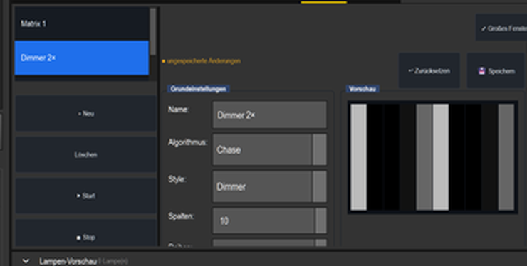
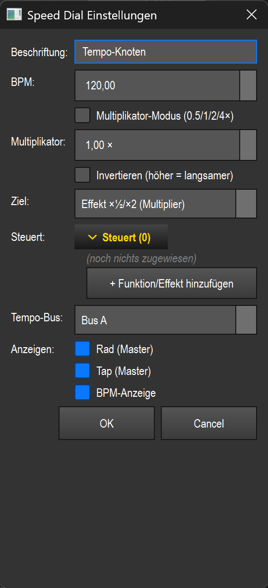
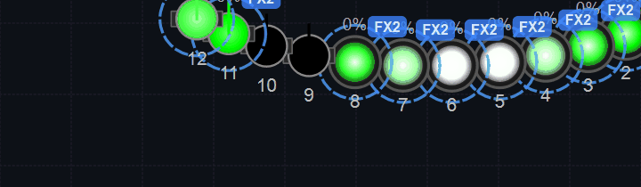

# Anleitung: Dimmer-Matrix & Geschwindigkeit (Helligkeit als eigene Ebene)

> Eine **Dimmer-Matrix** treibt nicht die *Farbe*, sondern die **Helligkeit** der Geräte —
> als eigene Lauflicht-/Puls-Ebene **über** einer Farb-Matrix. Im Hardstyle-Look läuft sie
> z. B. **schneller als der Farb-Chase** und lässt sich musik-synchron koppeln (das Koppeln
> stellst du direkt im Matrix-Editor ein — **Tempo-Bus**, Standard „Global" folgt der Musik-BPM;
> die Virtuelle Konsole dient zum Live-Umschalten). Genutzt wird die vorhandene **RGB-Matrix**
> mit **Stil = Dimmer**.

---

## 1. Idee: Farbe und Helligkeit als getrennte Ebenen

- **Farb-Matrix** (Stil RGB/RGBW) setzt nur die **Farbe** der Geräte (siehe Anleitung *Farbchase*).
- **Dimmer-Matrix** (Stil **Dimmer**) setzt nur den **Dimmer-/Helligkeitskanal** — sie schreibt
  Graustufen (an/aus bzw. Verlauf) und lässt die Farbe in Ruhe. Auf Geräten **ohne** eigenen
  Dimmer-Kanal (reine RGB-Geräte) bewirkt sie deshalb nichts.
- Beide laufen **gleichzeitig** über dieselben Geräte: Farbe von der einen, Helligkeit von der
  anderen. So bekommst du z. B. einen **blauen Chase**, dessen Helligkeit zusätzlich pulst.

## 2. Dimmer-Matrix anlegen

Programmer → Tab **Matrix** → **+ Neu** → in **Grundeinstellungen**:

- **Algorithmus: Chase** (Lauflicht; alternativ *Atmen (Puls)* = pulsierend, *Strobe* = hartes An/Aus)
- **Stil: Dimmer**
- **Spalten/Reihen** musst du nicht von Hand setzen: Der eingebettete Editor folgt automatisch
  der **Programmer-Auswahl** (die manuellen Zuweisungs-Buttons sind ausgeblendet). Daraus ergibt
  sich das Geräte-Grid von selbst — bei loser Auswahl als **Spalten = Anzahl der Geräte**
  (hier 10 = PAR + Spider), **Reihen = 1**.
- **💾 Speichern**, dann in der Liste links **▶ Start** — gestartet wird immer die gespeicherte
  Fassung.

Die **Vorschau** zeigt die Helligkeit als Graustufen-Lauflicht (weiße Balken = hell):

> In **Bewegung & Parameter** steuerst du die **Läufer-Anzahl** (mehr Läufer = voller/dichter),
> die **Läufer-Breite** und **Schweif (%)** (0 % → harte Kante ohne Schweif, höher → langes weiches
> Nachfaden hinter dem Läufer). In der Gruppe **Farben** legst du bei Stil *Dimmer* über den
> **Dimmer-Bereich** (Spinboxen **Min** / **Max**) den Helligkeitsbereich fest — außer wenn
> **„Dimmer pro Runde wechseln"** aktiv ist: dann gilt die Dimmerwert-Folge, Min/Max sind
> ausgeblendet.

## 3. Geschwindigkeit: fest einstellen oder ans Tempo koppeln

Im Matrix-Editor gibt es in der Gruppe **Tempo & Blende** jetzt direkt:
**Geschwindigkeit**, **Tempo-Bus**, **Tempo ×**, **Tempo-Versatz**, **Taktgleich starten**
(diese drei nur bei gewähltem Bus), **Layer-Priorität**, **Einblenden**, **Ausblenden** und
**Hüllkurven-Form**.

- **Geschwindigkeit** ist die eigene Rate der Matrix (Schritte pro Sekunde). Sie wirkt nur im
  **Frei-Lauf** — Tempo-Bus *Frei* — bzw. solange der gewählte Bus noch keine BPM hat. Läuft
  eine BPM (Tap oder Musik), bestimmt **Tempo ×** das Tempo: für einen doppelt so schnellen
  Dimmer-Puls also bei der Dimmer-Matrix **Tempo × = 2** einstellen, die Farb-Matrix bleibt
  auf 1.
- Mit **Layer-Priorität** entscheidest du, wer gewinnt, wenn zwei Effekte denselben Kanal
  schreiben (höher gewinnt; bei gleicher Priorität der zuletzt gestartete Effekt).
- **Einblenden / Ausblenden** sind die Ein-/Ausblendzeiten (in Sekunden) beim Start/Stopp; die
  **Hüllkurven-Form** bestimmt deren Verlauf.

Neue Matrix-Effekte stehen standardmäßig auf **Tempo-Bus = Global**,
**Tempo × = 1** und **Tempo-Versatz = 0**. Damit laufen sie automatisch im gemeinsamen
Taktraster. Nur wenn ein Effekt bewusst unabhängig laufen soll, wählst du
**Frei (nicht taktgebunden)**.

### Ans Tempo koppeln (Programmer / Virtuelle Konsole / BPM)

Die dauerhafte Grundkonfiguration stellst du direkt im **Programmer-Matrix-Editor** ein.
Die Virtuelle Konsole dient anschließend zum Live-Umschalten der Faktoren:

- **Effekt per Smart-Drop** auf eine VC-Seite ziehen → im geführten Dialog für musik-synchrones
  Tempo **„Tempo-Multiplikator (×½ ×2)…"** wählen (erzeugt ein Speed-Rad im Multiplier-Modus).
  „Tempo (Geschwindigkeit)" stellt dagegen die *Geschwindigkeit* — mit derselben Einschränkung
  wie oben.
- Ein **SpeedDial** kann als **Tempo-Bus**-Steller, als **Effekt ×½/×2 (Multiplier)** oder als
  **Speed-Knoten (Master/Sub)** arbeiten — hier liegen die Faktoren ¼ ½ 1× 2× 4× und das
  Tap-Tempo.
- Das Element **Tempo-Bus** (Werkzeugleiste der VC; Einstellungsfenster „Bus-Auswahl") schaltet
  mit einem Tipp den aktiven Bus scharf; **Buttons** mit den Aktionen **„Tap-Tempo (Bus)"**,
  **„Sync (Bus)"** bzw. **„Bus scharf schalten"** geben Tap-Tempo, gleichen die Phase an bzw.
  schalten einen Bus scharf.
- Die **Bus-Auswahl** im SpeedDial-/Slider-Dialog bietet *(aktiver/Default-Bus)*, **Bus A**,
  **Bus B**, **Bus C** und **Bus D**; die **BPM-Anzeige** nennt den Leerwert (globaler Leader)
  **Global (Leader)**. Das Element **Tempo-Bus** zeigt dagegen die Buses aus seinem
  Eigenschaften-Dialog (Feld **Buses:** als Komma-Liste, z. B. `A, B, C, D`).
- Der **Default-/Leader-Bus** spiegelt die **Master-/Sound-BPM** (`bpm_global`), die der **Musik**
  folgt: legst du Farb- und Dimmer-Matrix auf den Default-Bus, laufen beide automatisch im
  Lied-Tempo (siehe Anleitung *Musik-Sync*).

## 4. Ergebnis

So sieht ein Dimmer-Layer (hier grün-weiß, atmend) über den Geräten aus:

Im Hardstyle-Look kombiniert: blauer Farb-Chase + schnellerer Dimmer-Puls, per VC auf den
**Default-/Leader-Bus** gelegt und damit musik-synchron — zu sehen in der laufenden Show
(siehe *Virtuelle Konsole*, GIF „Hardstyle-Show läuft").

---

**Kurz:** Gruppe wählen → Matrix-Tab → **+ Neu** → **Stil Dimmer** + Algorithmus *Chase* (Raster
folgt der Auswahl) → Helligkeit über **Dimmer-Bereich** (Min/Max) → **💾 Speichern** →
**▶ Start**. Tempo: neue Matrizen hängen am Bus **Global** (folgt der Musik-BPM); schneller als
die Farb-Matrix wird der Puls über **Tempo ×** — **Geschwindigkeit** wirkt nur ohne laufende BPM.
Live umschalten in der **Virtuellen Konsole** (Speed-Rad, Element **Tempo-Bus**, Buttons
„Tap-Tempo (Bus)" / „Sync (Bus)" / „Bus scharf schalten"). Farbe und Helligkeit bleiben
getrennte, kombinierbare Ebenen.
