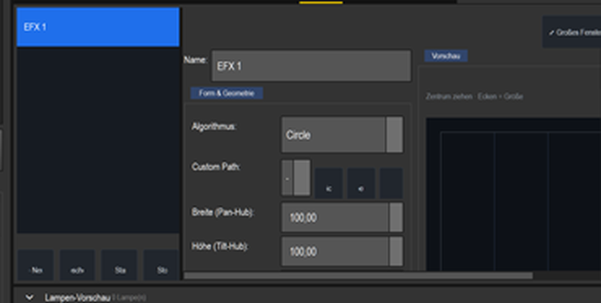
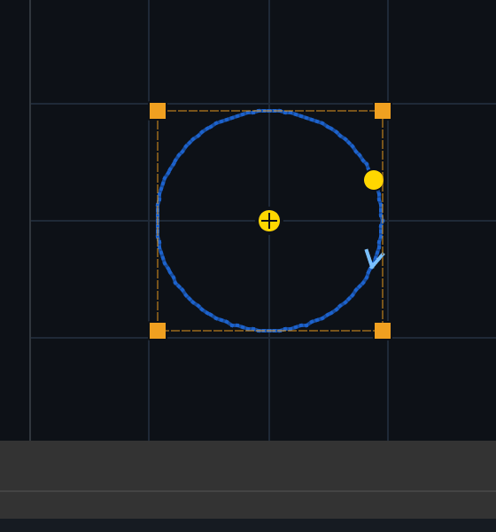

# Anleitung: EFX — Moving-Head-Bewegung (Kreise, Achten …)

> Ein **EFX** bewegt die **Pan/Tilt**-Achsen von Moving Heads (und Spidern) auf einer Bahn —
> Kreis, Acht, Linie, eigene Pfade. Wichtig für die Hardstyle-Show: der EFX **bewegt** die
> Moving Heads, und mit **„Dimmer/Shutter mit öffnen"** **öffnet** er sie auch (Shutter + Dimmer),
> sonst bleiben sie dunkel.

---

## 1. EFX anlegen & an die Geräte binden

Programmer → links unter **Gruppen** die Gruppe wählen (z. B. **Moving Heads (2)** bzw. **Alle
Mover**). Der Gruppen-Klick springt in den Reiter **Matrix** — wechsle danach selbst in den Reiter
**EFX** (er erscheint nur, wenn die Auswahl Geräte mit Pan/Tilt enthält) und drücke **+ Neu**. Der
eingebettete EFX **folgt der Programmer-Auswahl LIVE**: der gerade angezeigte EFX bindet sich
sofort an genau die ausgewählten Geräte. Das gilt, wenn du den EFX im sichtbaren Editor anklickst
oder dort die Auswahl wechselst — beim Laden einer Show folgt kein EFX der Auswahl, die
gespeicherten Geräte bleiben, wie sie in der Datei stehen.

**Wichtig — Speichern:** Ein neuer EFX ist zunächst ein **Entwurf** (in der Liste mit **●**
markiert). Erst **💾 Speichern** macht ihn dauerhaft und bindet ihn an die aktive Gruppe. Einen
ungespeicherten Entwurf verwirft LightOS ohne Rückfrage, sobald du einen anderen Effekt anklickst,
eine Gruppe anklickst (Sprung in den Reiter Matrix) oder den Reiter bzw. die Ansicht wechselst.

Dass der EFX der Auswahl folgt, siehst du an der Geräte-Box im Editor: Sie heißt dynamisch
**„Geräte (folgen der Auswahl)"** und zeigt bei aktiver Auswahl z. B. **„Geräte: 2 Gerät(e)
(folgen der Auswahl)"** (bei reinen Spidern **„Geräte: 2 Spider (folgen der Auswahl)"**; bzw.
**„Geräte: keine beweglichen Geräte in der Auswahl"**, falls nichts Passendes markiert ist — der
EFX bindet nur Geräte mit Pan **und** Tilt bzw. Doppel-Tilt-Fixtures).

In der Gruppe **Form & Geometrie** stellst du ein:
- **Algorithmus:** Die Namen erscheinen englisch — *Circle* (Kreis), *Eight* (Acht), *Line* (Linie),
  *Diamond* (Raute), *Square* (Quadrat), *Trapez*, *Lissajous*, *Random* (Zufall), *Triangle*
  (Dreieck) sowie *Custom Path* für eigene, aufgezeichnete Bahnen.
- **Breite (Pan-Hub)** / **Höhe (Tilt-Hub):** wie weit die Bewegung ausschlägt (0–255, DMX-Wert).
- **Geschwindigkeit (Hz)** (Tempo, siehe Abschnitt 4) und **Richtung** (in der Gruppe *Tempo &
  Richtung*).

Sind **nur Spider** ausgewählt, ersetzt der Editor *Form & Geometrie* durch **Bewegungsmuster
(Spider)** (Wippe, Welle, Zacken, Flackern, Puls) mit **Schwung (Tilt-Hub)**, **Mitte (Tilt)** und
**Welle (Versatz)**.

> Merke: Im Programmer zeigt die EFX-Liste nur die Effekte der **aktiven Gruppe**; ein
> gespeicherter Effekt gehört zu der Gruppe, die beim **💾 Speichern** aktiv war. Der gerade
> angezeigte Effekt übernimmt sofort die aktuelle Auswahl — einen Effekt anklicken und Geräte
> markieren heißt also, ihn an diese Geräte zu binden.

## 2. Die Köpfe „aufmachen" — „Dimmer/Shutter mit öffnen"

Moving Heads haben Shutter + Dimmer. Läuft nur die Bewegung, bleiben sie oft **dunkel**. Lösung:
in der Gruppe **„Sichtbarkeit & Sonstiges"**, Zeile **„Sichtbarkeit:"**, die Checkbox
**„Dimmer/Shutter mit öffnen" AN** — dann öffnet der EFX bei Bewegung **Shutter + Dimmer**
automatisch (Dimmer auf voll). Erst dann sieht man die bewegten Strahlen. Den **Shutter** öffnet
er nur, wenn das Geräteprofil einen offenen Bereich belegt; sonst bleibt der Shutter, wie er ist.

> Farbe bekommen die Moving Heads separat — bei Geräten ohne RGB (z. B. ZQ02001) über das
> **Farbrad**: im Programmer-Reiter **Color** oder per Farbrad-Taste (siehe *Moving Heads*). Eine
> Farb-Matrix, die die MH mit abdeckt, kann bei Farbrad-Geräten nur den nächstgelegenen Slot
> setzen. Bewegung (EFX) + Farbe + „Dimmer/Shutter mit öffnen" ergeben den vollen Look.

## 3. Verhältnis mehrerer Geräte

Bei mehreren Movern stellst du in der Gruppe **„Verhältnis der Geräte zueinander"** ein, wie sie
zueinander durch die Figur laufen. Die echten Bedienelemente sind:

- **Verhältnis:** (Auswahlfeld) — bestimmt das Grundmuster:
  - *Synchron (alle Köpfe gleich)* — alle fahren dieselbe Figur gleichzeitig.
  - *Gleichmäßig verteilt (Fächer)* — die Köpfe sind über die Figur gefächert (2 Köpfe = 180°
    auseinander).
  - *Fester Versatz pro Gerät (°)* — jeder weitere Kopf läuft um die eingestellten Grad später.
- **Fächer-Streuung:** (Drehfeld) — nur aktiv bei **Gleichmäßig verteilt (Fächer)**: wie weit die
  Köpfe gefächert sind (0 = praktisch synchron, 1 = voller Fächer).
- **Versatz pro Gerät:** (Drehfeld, in °) — nur aktiv bei **Fester Versatz pro Gerät (°)**: um wie
  viel Grad jeder weitere Kopf nachläuft (z. B. 15° leichter Nachlauf, 180° gegenphasig).
- **Gegenläufig:** Checkbox *„jedes 2. Gerät entgegengesetzt"* — jeder zweite Kopf durchläuft die
  Figur rückwärts (z. B. zwei Köpfe gegenläufig im Kreis: einer cw, einer ccw).
- **Spiegeln:** Checkbox *„jedes 2. Gerät spiegeln (Pan)"* — spiegelt bei jedem zweiten Kopf die
  Pan-Achse → symmetrische (spiegelbildliche) statt versetzter Bewegung.

So laufen z. B. die beiden Hardstyle-MH gegenläufige Kreise: **Verhältnis** = *Synchron* und
**Gegenläufig** anhaken.

## 4. Tempo & Musik-Sync

- Neue EFX stehen bereits auf **Tempo-Bus = Global (taktgleich, Standard)**. Sobald eine BPM läuft
  (Tap, Musik-BPM, Player), fährt die Figur genau **einen Umlauf pro Beat × Tempo ×** — bei 150 BPM
  also 2,5 Umläufe pro Sekunde. Für Moving Heads meist **Tempo ×** 0,25 oder 0,5 wählen.
  **Taktgleich starten** setzt den Start aufs gemeinsame Beat-Raster, **Tempo-Versatz** verschiebt
  die Phase.
- **Geschwindigkeit (Hz)** gilt nur bei freiem Lauf — Tempo-Bus **Frei (nicht taktgebunden)** —
  oder solange noch keine BPM läuft. Läuft eine BPM, wirken Geschwindigkeit (Hz) und die
  Effekt-Tempo-Fader der VC nicht.
- Die Gruppe *Tempo & Richtung* enthält außerdem **Richtung**, **Loop**, **Layer-Priorität**,
  **Einblenden**, **Ausblenden** und **Hüllkurven-Form**.
- In der **Virtuellen Konsole** lässt sich die Bus-/Faktor-Umschaltung zusätzlich **live** steuern
  (**SpeedDial** / Element **Tempo-Bus** — siehe *Musik-Sync* / *Dimmer-Matrix*).

## 5. Starten

Den EFX **💾 Speichern** und mit **▶ Start** starten (**■ Stop** daneben). So sieht eine Kreis-Bewegung aus:

---

**Kurz:** Gruppe (Moving Heads) wählen → Reiter **EFX** → **+ Neu** (der EFX folgt der Auswahl
live) → Algorithmus (Circle …) + Pan/Tilt-Hub (0–255) → **„Dimmer/Shutter mit öffnen" AN** (sonst
dunkel) → Verhältnis der Geräte zueinander (Verhältnis: Synchron/Fächer/Versatz, dazu
Gegenläufig/Spiegeln) → **💾 Speichern** → **▶ Start**. Tempo: neue EFX folgen dem Bus **Global**
(ein Umlauf pro Beat × **Tempo ×**); **Geschwindigkeit (Hz)** nur im Frei-Lauf. Farbe der MH
separat (Farbrad im Reiter Color).
