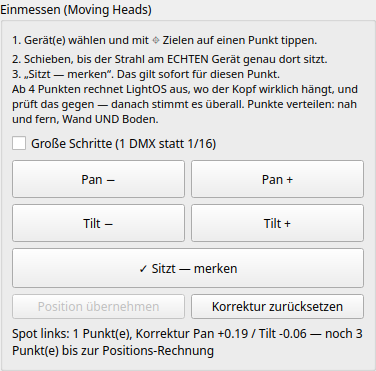

# Moving Heads einmessen — der Strahl trifft, wo du hintippst

Wenn du im 3D-Visualizer mit **⌖ Zielen** auf einen Punkt tippst, rechnet LightOS aus,
wie jeder Moving Head Pan und Tilt stellen muss, um genau dorthin zu leuchten. Das
klappt nur so gut, wie der **eingetragene Standort** stimmt: hängt der Kopf in
Wirklichkeit 30 cm weiter links oder ist er ein paar Grad verdreht, leuchtet er
daneben — und zwar an jedem Punkt ein bisschen anders.

Das **Einmessen** gleicht das am echten Aufbau aus. Es funktioniert für jede
Aufstellung: stehend auf dem Boden, hängend an der Traverse oder seitlich montiert,
an jeder Stelle im Raum.

## Wo

Visualizer → Reiter **Fixtures** → ganz unten die Gruppe **Einmessen (Moving Heads)**
(bei kleinem Bildschirm nach unten scrollen).

## So geht's

1. **Gerät wählen** — in der Liste „Gepatchte Fixtures" (einen oder mehrere Moving Heads).
2. **⌖ Zielen** — auf einen Punkt tippen, den du im Saal gut siehst (eine Ecke, ein
   Klebeband-Kreuz auf dem Boden, eine Markierung an der Wand).
3. **Schieben**, bis der Strahl am **echten** Gerät genau auf dem Punkt sitzt:
   **Pan − / Pan +** und **Tilt − / Tilt +**. Ein Klick ist 1/16 DMX-Schritt;
   gedrückt halten schiebt weiter. Für große Wege **Große Schritte** anhaken.
4. **✓ Sitzt — merken.**

Ab jetzt trifft das Zielen **diesen** Punkt genau. Das reicht für einen Abend, wenn du
immer auf ungefähr dieselbe Stelle zielst.

### Damit es überall stimmt: vier Punkte

Wiederhole Schritt 2 bis 4 an **weiteren Punkten**. Ab **vier** Punkten rechnet LightOS
aus, wo der Kopf **wirklich** hängt und wie er gedreht ist, und **prüft das gegen**:
jeder Punkt wird einmal weggelassen und nachgesehen, ob die Rechnung ihn trotzdem
trifft. Nur wenn das hält, erscheint in der Statuszeile *„Position gefunden …"* und
**Position übernehmen** wird anklickbar.

Nach dem Übernehmen stimmt das Zielen **an jedem Punkt**, auch an solchen, die du nie
angetippt hast — und das 3D-Bild zeigt den Kopf dort, wo er wirklich hängt.

**Tipps für die Punkte:**

- **Verteilen:** nah **und** fern, Wand **und** Boden, links **und** rechts.
  Vier Punkte auf einer Wand nebeneinander sagen wenig darüber, wie weit der Kopf
  vorne oder hinten hängt.
- **Genau einstellen lohnt sich.** Gemessen an 600 zufälligen Aufbauten: wer auf
  etwa 1 cm genau einstellt, landet danach an neuen Punkten meist bei 1–2 cm, selten
  über 5 cm. Bei 2 cm Ungenauigkeit bietet LightOS die Position seltener an — lieber
  gar keine als eine falsche.
- **Hält die Gegenprobe nicht**, sagt die Statuszeile das. Dann einfach noch einen
  Punkt an einer anderen Stelle nehmen.

## Was die Statuszeile sagt

| Meldung | Bedeutung |
|---|---|
| *„noch N Punkt(e) bis zur Positions-Rechnung"* | Korrektur ist gemerkt und wirkt für diesen Punkt; für die Position fehlen noch Punkte. |
| *„Gegenprobe hält noch nicht …"* | Genug Punkte, aber sie passen nicht sicher zu einem Standort — weitere Punkte an anderen Stellen nehmen. |
| *„Position gefunden (N Punkte, Gegenprobe X cm): … neben dem eingetragenen Standort"* | Sicher gerechnet. **Position übernehmen** ist frei. |
| *„⚠ … — stimmen Standort, Montage und Pan/Tilt-Bereich im Patch?"* | Die Korrektur ist größer als ~10°. Das ist fast nie ein Feinabgleich, sondern ein falscher Eintrag: Kopf hängend statt stehend, falscher Pan/Tilt-Bereich (z. B. 540° statt 630°) oder ein grob falscher Standort. Erst das im Patch prüfen. |

## Zurücksetzen und Rückgängig

- **Korrektur zurücksetzen** löscht die gemerkte Korrektur und die gesammelten Punkte
  der gewählten Geräte.
- **Merken** und **Position übernehmen** lassen sich mit **Rückgängig** zurücknehmen.
- Die Korrektur und die übernommene Position werden **mit der Show gespeichert**. Die
  gesammelten Punkte nicht — wer die App neu startet, beginnt mit dem Sammeln von vorn
  (die Korrektur bleibt).

## Grenzen

- **Mover-Bars** (mehrere Köpfe auf einer Schiene) lassen sich noch nicht einmessen —
  die Köpfe sitzen an verschiedenen Stellen, eine Position für „das Gerät" wäre falsch.
- Die Rechnung setzt voraus, dass **Pan/Tilt-Bereich** und **Nullpunkt** im Patch zum
  Gerät passen (Datenblatt). Einmessen gleicht den **Standort** aus, nicht ein falsch
  eingetragenes Gerät.
- Feinkanäle (Pan fein/Tilt fein) machen das Schieben feiner. Ohne sie ist ein Schritt
  ein ganzer DMX-Schritt — bei 540° Pan gut 2°, auf 5 m rund 18 cm.
