# First steps with LightOS

> **English version** of [Erste Schritte](ANLEITUNG.md). LightOS itself speaks German:
> every button, menu and tab is quoted here **exactly as it appears on screen**, with an
> English translation in brackets the first time it shows up. The screenshots are the
> same as in the German guide.

> You have just installed LightOS and want to know where everything is? This guide walks
> once through the main window, creates a new show, patches a fixture, makes it light up
> in the Programmer and saves the result as a show file. It takes about ten minutes. The
> red numbers in the pictures match the numbered points in the text.

## What you need

- **LightOS, installed and starting.** How to do that on Windows and Linux is described in
  [INSTALL.md](../../INSTALL.md). On Linux you start LightOS from the LightOS folder with
  `venv/bin/python main.py`.
- **No hardware.** Your computer is enough for this guide. Whether DMX really comes out is
  set up afterwards:
  [Ausgabe einrichten (ENTTEC, Art-Net, sACN)](../anleitung_ausgabe_einrichten/ANLEITUNG.md)
  (setting up output, German).
- The example fixture is a built-in profile that every installation ships with:
  **Generic — LED PAR Dimmer+RGB 4ch** (4 channels: dimmer, red, green, blue). If you have
  a fixture of your own, simply search for its name in step 5.

---

## 1. The main window

After starting, LightOS opens in the **Bühne** (stage) section. From top to bottom:

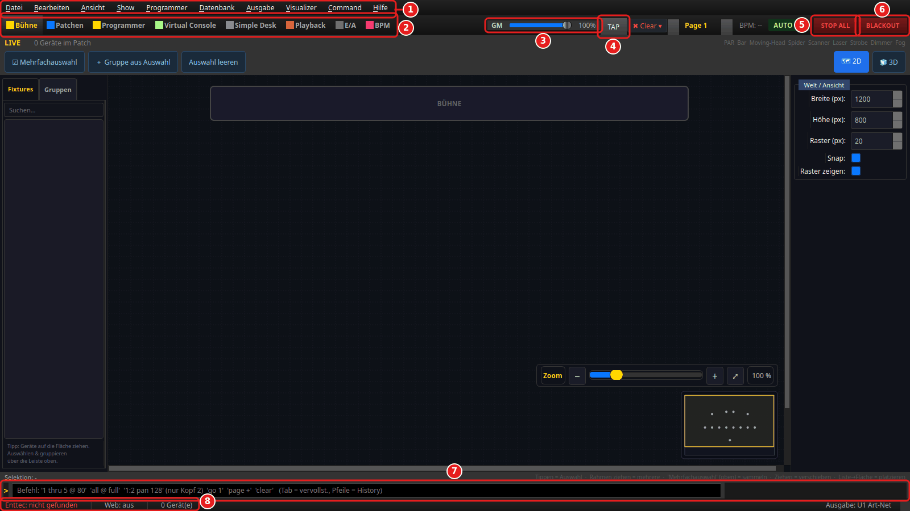

1. **Menu bar** — `Datei` (File), `Bearbeiten` (Edit), `Ansicht` (View), `Show`,
   `Programmer`, `Datenbank` (Database), `Ausgabe` (Output), `Visualizer`, `Command`,
   `Hilfe` (Help). Saving and opening (step 7) and the output settings live here.
2. **Section bar** — the eight work areas of LightOS, see step 2.
3. **GM** — the grand master. It controls the overall brightness from 0 to 100 %.
   Lasers without a dimmer channel are not dimmed gradually; they are switched off at 0 % —
   but only if the fixture profile knows an off value. Only the **laser emergency stop**
   switches a laser off reliably.
4. **TAP** — tap the tempo. According to its tooltip: one tap sets the beat to "now", four
   taps in time set the tempo.
5. **STOP ALL** — stops everything that is running: cue lists on all pages and all started
   functions (scenes, chasers, effects).
6. **BLACKOUT** — makes everything dark: all channels go to 0, only moving heads with a
   dimmer channel keep their position (including gobo/prism/zoom) — so they do not drive
   to their home position and back again when you release the blackout. Unpatched
   channels, fixtures without a dimmer, lasers and fog machines go completely off. The
   button latches; a second click releases the blackout.
   What this looks like in the DMX monitor is shown in
   [Ausgabe einrichten, step 7](../anleitung_ausgabe_einrichten/ANLEITUNG.md#7-kontrolle-der-dmx-monitor).
   To black out only some fixtures or groups, use a
   [blackout button with a target](../anleitung_vc_widgets/01_button.md#blackout-mit-ziel-vcb-11)
   in the Virtual Console.
7. **Command line** — for keyboard commands such as `1 thru 5 @ 80`. Examples are shown as
   placeholder text in the field.
8. **Status bar** — on the left the state of the ENTTEC adapter
   (`Enttec: nicht gefunden` = not found, as long as none is connected), the web server
   and the number of fixtures (`0 Gerät(e)`). On the far right it says where the output
   goes (`Ausgabe: …`). What the messages there mean is explained in
   [Ausgabe einrichten, step 8](../anleitung_ausgabe_einrichten/ANLEITUNG.md#8-warnungen-in-der-statusleiste-lesen).

To the right of TAP further indicators appear when needed, for example
**● Programmer** with the number of active values as soon as something is in the
Programmer (see step 6).

## 2. The eight sections

Clicking a name switches the work area. With the keyboard use **Strg+1** to **Strg+8**
(Strg = Ctrl).

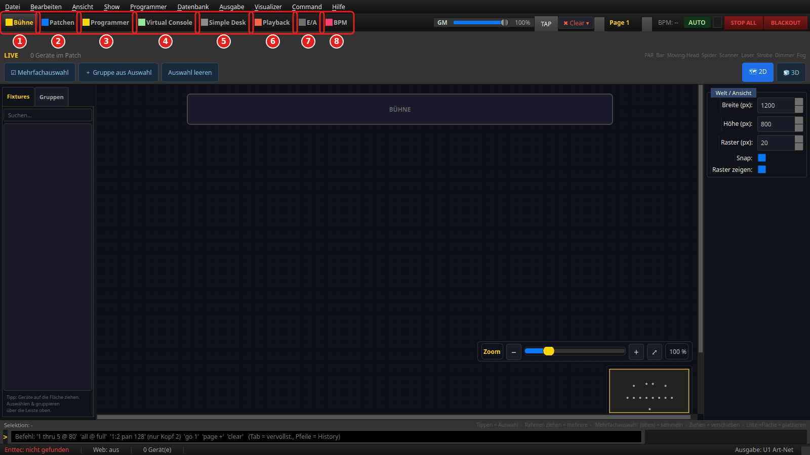

1. **Bühne** (stage) — 2D top view of your fixtures. On the left the list **Fixtures** /
   **Gruppen** (groups); drag fixtures onto the area. Top right switches between **2D**
   and **3D**.
2. **Patchen** (patch) — create fixtures, put them on DMX addresses and combine them into
   groups (step 5). In detail:
   [Patchen & Gruppen](../anleitung_patch_gruppen/ANLEITUNG_PATCH_GRUPPEN.md) (German).
3. **Programmer** — select fixtures and set their values by hand (step 6). What the
   Programmer shows for each fixture type:
   [Programmer: jedes Gerät richtig bedienen](../anleitung_geraete_bedienen/ANLEITUNG_GERAETE_BEDIENEN.md)
   (German).
4. **Virtual Console** — your own control surface made of buttons, faders and displays.
   Getting started: [Virtuelle Konsole bauen](../anleitung_vc/ANLEITUNG_VC.md) (German),
   reference: [VC-Bau-Elemente](../anleitung_vc_widgets/README.md) (German).
5. **Simple Desk** — each of the 512 DMX channels of a universe as its own fader, direct
   and without any fixture logic.
6. **Playback** — play back cue lists.
7. **E/A** (input/output) — monitors for the DMX values LightOS calculates, plus MIDI and
   music. The monitors are shown in
   [Ausgabe einrichten](../anleitung_ausgabe_einrichten/ANLEITUNG.md#6-kontrolle-der-output-monitor).
8. **BPM** — tempo detection from music. In detail:
   [BPM-Manager](../anleitung_bpm_manager/ANLEITUNG_BPM_MANAGER.md) (German).

Which tabs a section has is shown at the top left below the section bar as soon as you
open it — for **Patchen**, for example, **Patch** and **Fixture-Gruppen** (fixture
groups; picture in step 5).

## 3. Create a new show

Open the **Datei** (File) menu and choose **Neue Show** (new show) (1). The keyboard
shortcut is **Strg+N**.

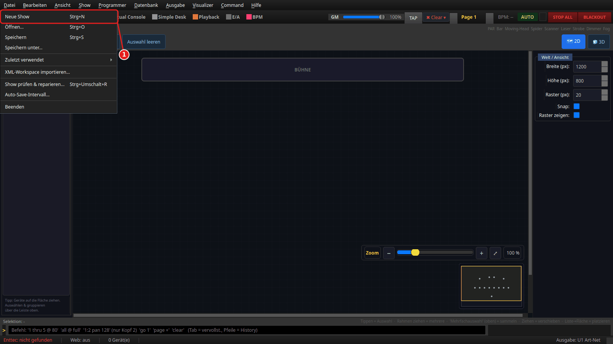

## 4. Confirm the question

LightOS asks before it discards the current show:

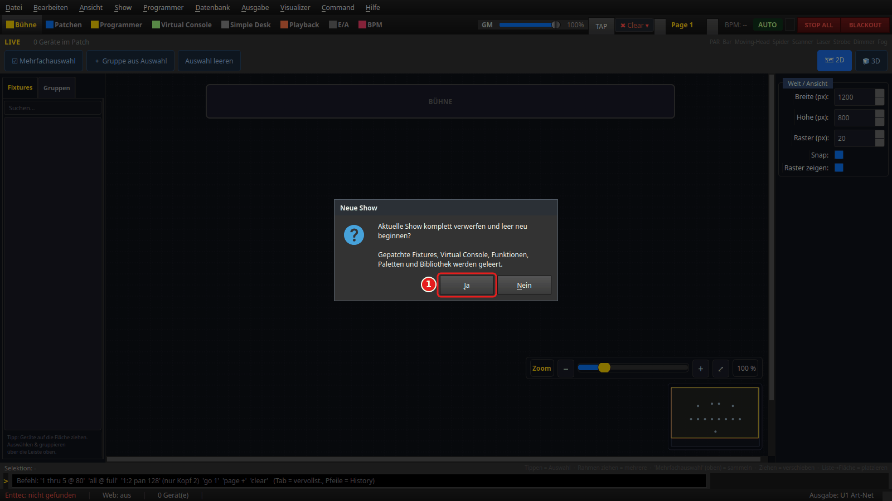

**Ja** (yes) (1) empties patched fixtures, Virtual Console, functions, palettes and
library, and you start with an empty show. **Nein** (no) leaves everything as it is.

If the current show has unsaved changes, you get the save question instead, with
**Speichern** (save), **Verwerfen** (discard) and **Abbrechen** (cancel) — the same one as
when quitting (step 7). **Verwerfen** then empties the show, **Abbrechen** leaves
everything as it is. The same applies to **Datei → Öffnen...** (open) and
**Zuletzt verwendet** (recently used).

> The empty show has no file name yet. It only gets one the first time you save it
> (step 7).

## 5. Patch a fixture

Switch to the **Patchen** section, tab **Patch**. The table is empty. Click
**+ Gerät hinzufügen** (add fixture) (1).

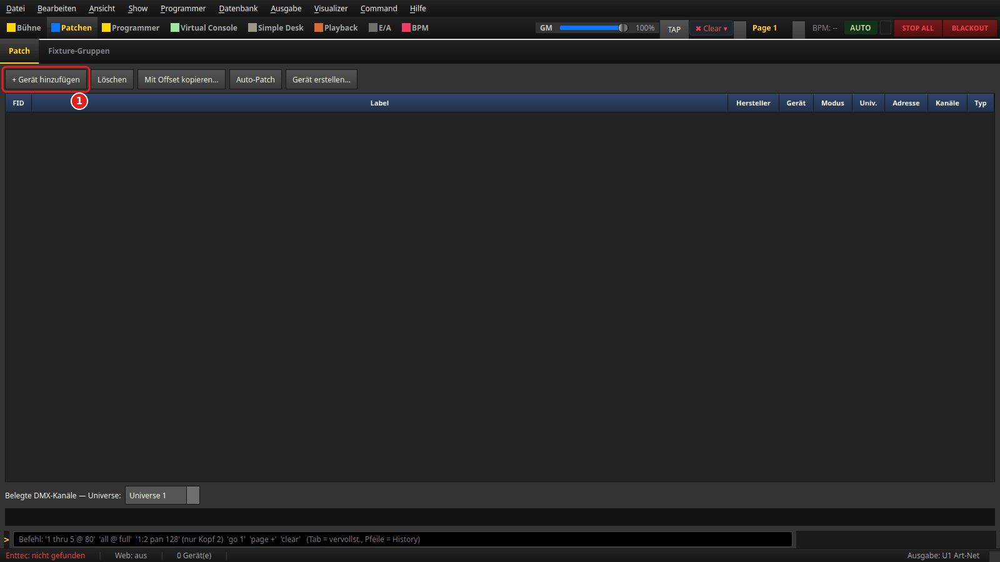

The dialog **Gerät hinzufügen** opens:

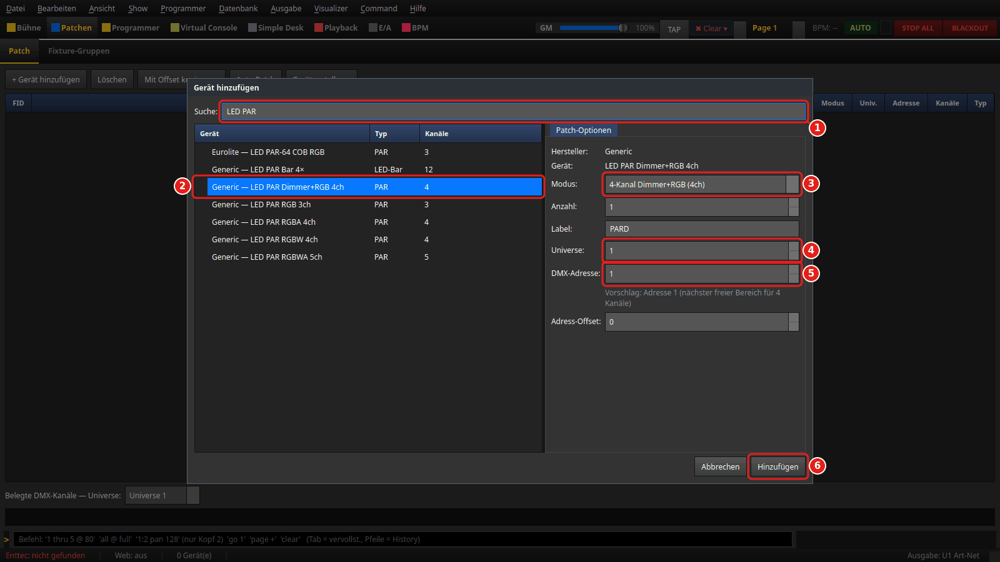

1. **Suche:** (search) — type part of the name, here `LED PAR`. The list then shows all
   matching profiles as `Manufacturer — Fixture`.
2. Choose the profile **Generic — LED PAR Dimmer+RGB 4ch**. Manufacturer and fixture
   appear on the right, and **Hinzufügen** (add) becomes clickable.
3. **Modus:** (mode) — the channel layout. This profile only knows
   `4-Kanal Dimmer+RGB (4ch)`. For other fixtures the mode must match the setting on the
   fixture itself.
4. **Universe:** — which DMX universe the fixture is on. `1` to begin with.
5. **DMX-Adresse:** (DMX address) — the start address. LightOS suggests the next free
   range below it (`Vorschlag: Adresse 1 …` = suggestion: address 1) and fills it in
   right away. Set the same address on the real fixture.
6. **Hinzufügen** — creates the fixture and closes the dialog.

More fields: **Anzahl:** (count) creates several identical fixtures at once, **Label:** is
the name in LightOS (pre-filled with the short name of the profile, here `PARD`),
**Adress-Offset:** (address offset) is the gap between several fixtures (`0` = directly
one after another).

Afterwards the fixture is in the table:

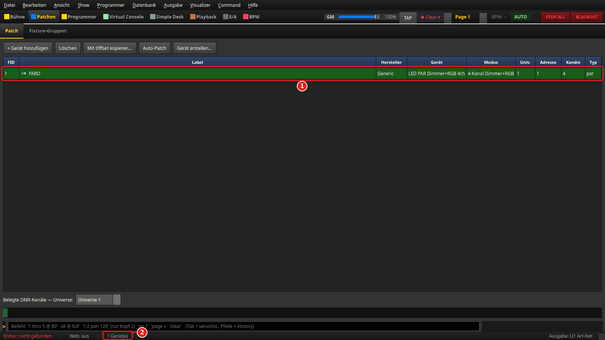

1. The new row: FID `1`, label `PARD`, manufacturer `Generic`, mode, universe (`Univ.`)
   `1`, address `1`, `4` channels. The row colour stands for the fixture type. A **red**
   row with **⚠** in front of the FID would indicate an address conflict.
2. The status bar now counts `1 Gerät(e)`.

To rename it or change the address, **double-click** the row; this opens
*Gerät bearbeiten* (edit fixture). More:
[Patchen & Gruppen](../anleitung_patch_gruppen/ANLEITUNG_PATCH_GRUPPEN.md) (German).

## 6. Set the first value in the Programmer

Switch to the **Programmer** section, tab **Attribute** (attributes).

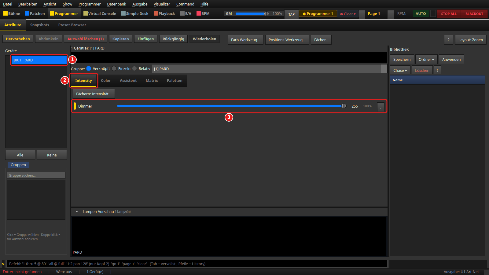

1. Click the fixture in the **Geräte** (fixtures) list (`[001] PARD`). Only then do the
   faders appear in the middle. (**Alle** below it selects all fixtures, **Keine**
   clears the selection.)
2. Tab **Intensity**.
3. Drag the **Dimmer** fader all the way to the right, to `255` (100 %).

At the top of the section bar **● Programmer 1** now appears: one value is active in the
Programmer.

> **Why does the PAR stay dark?** An RGB fixture only lights up if a colour is set as
> well — with red, green and blue at 0 it is black despite a full dimmer. The
> **Lampen-Vorschau** (lamp preview) at the bottom shows exactly that: the tile stays
> dark. So add a colour:

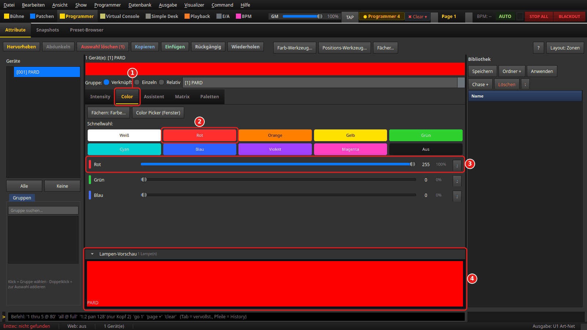

1. Tab **Color**.
2. Under **Schnellwahl:** (quick select) the tile **Rot** (red) — it sets red to 255 and
   green and blue to 0.
3. Alternatively drag the faders **Rot**, **Grün** and **Blau** (red, green, blue) one by
   one.
4. The **Lampen-Vorschau** shows the mix. At the top it now says **● Programmer** with a
   number — it counts the values that are in the Programmer.

If a fixture is connected to a configured output, it now lights up red. You can also
check this without a fixture in the DMX monitor of the **E/A** section: channel 1
(dimmer) and channel 2 (red) are at 255 — see
[Ausgabe einrichten, step 7](../anleitung_ausgabe_einrichten/ANLEITUNG.md#7-kontrolle-der-dmx-monitor).

You reset the Programmer values with **✖ Clear ▾** at the top of the section bar.

## 7. Save and open again

Everything goes through the **Datei** (File) menu:

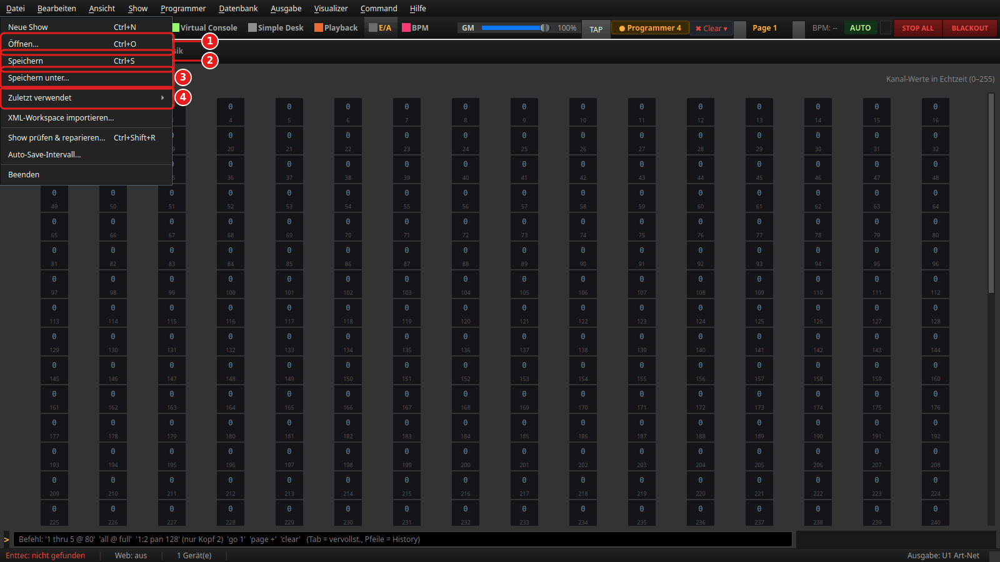

1. **Öffnen...** (open, Strg+O) — load a saved show (`*.lshow`).
2. **Speichern** (save, Strg+S) — saves under the current name. If the show does not
   have one yet, LightOS asks for one as with *Speichern unter...*.
3. **Speichern unter...** (save as) — new name or another location. LightOS adds the
   extension `.lshow` itself.
4. **Zuletzt verwendet** (recently used) — the ten shows opened or saved last.

The file dialogs start in the folder of the current show, otherwise in the `shows`
folder inside the LightOS data folder (Linux: `~/.local/share/LightOS/shows`, Windows:
`%APPDATA%\LightOS\shows`). After saving, the path is shown in the window title and
briefly in the status bar (`Gespeichert: …` = saved).

**Automatic backup:** in addition, LightOS saves every 5 minutes to the file
`auto_save.lshow` in the LightOS data folder. Set the interval under
**Datei → Auto-Save-Intervall...** (1–60 minutes). If on the next start this backup is
newer than the show you saved last — for example after a crash — LightOS offers to
restore it.

**Older versions.** In addition, LightOS keeps several states of every show in the
`sicherungen` (backups) folder inside the LightOS data folder: on every auto-save, before
every save that overwrites an existing file, and before you discard unsaved changes (new
show, opening another show, quitting). **Datei → Ältere Version öffnen…** (open older
version) lists the backups of the current show with date, time, reason, size and the
number of fixtures and functions; tick **Sicherungen aller Shows anzeigen** (show backups
of all shows) to see the others as well. **Öffnen** (open) loads the selected version as
a new, unsaved show — the window title then reads `Name (Sicherung vom …)`. Your show
file and the backup stay untouched; the old version is only kept once you store it with
*Speichern unter...*.

Per show LightOS keeps the last 10 backups, plus one per hour of the last 24 hours and
one per day of the last 14 days — auto-saves and the backups taken before overwriting or
discarding are counted separately, so auto-saves never push such a version out. If the folder grows beyond 500 MB, the oldest are
deleted first.

**Quitting with unsaved changes.** If you changed anything in the content of the show
since the last save or open — patch, cue lists, functions, VC layout and so on — LightOS
asks when you quit. In the picture a cue list was created:

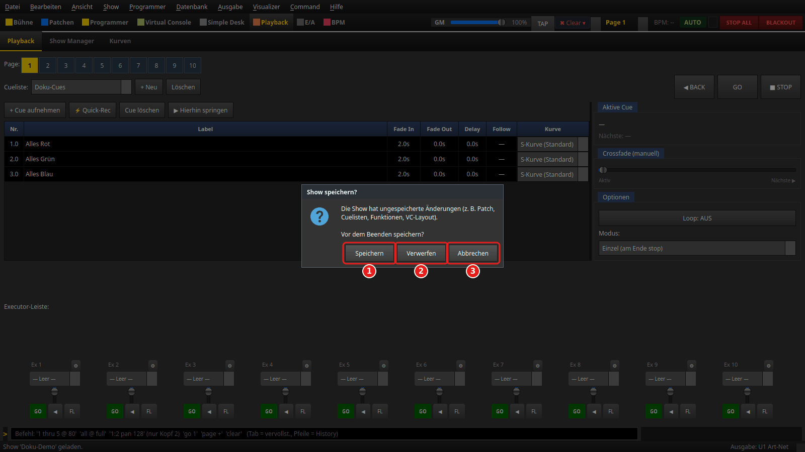

1. **Speichern** (save) — saves under the current name and then quits. If the show has
   no name yet, *Speichern unter...* opens; if you cancel there or saving fails, LightOS
   stays open.
2. **Verwerfen** (discard) — quits without saving.
3. **Abbrechen** (cancel) — LightOS stays open, nothing is lost.

What you merely operate does not count as a change: Programmer values, **GO** on a cue
list, faders and the tempo do not trigger the question. A show with content that was
never saved always asks ("Die Show wurde noch nie gespeichert." = the show has never been
saved), and so does a show restored from the auto-save.

---

## What next?

All further guides are in German so far:

- **Really output light:** [Ausgabe einrichten (ENTTEC, Art-Net, sACN)](../anleitung_ausgabe_einrichten/ANLEITUNG.md)
- **More fixtures and groups:** [Patchen & Gruppen](../anleitung_patch_gruppen/ANLEITUNG_PATCH_GRUPPEN.md)
- **Your own control surface:** [Virtuelle Konsole bauen](../anleitung_vc/ANLEITUNG_VC.md)
- **All guides:** [Übersicht](../ANLEITUNGEN.md)

<!-- Pictures: the same as the German guide — venv/bin/python tools/anleitungsbilder.py erste_schritte (docs/ANLEITUNGSBILDER.md) -->
