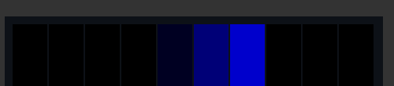
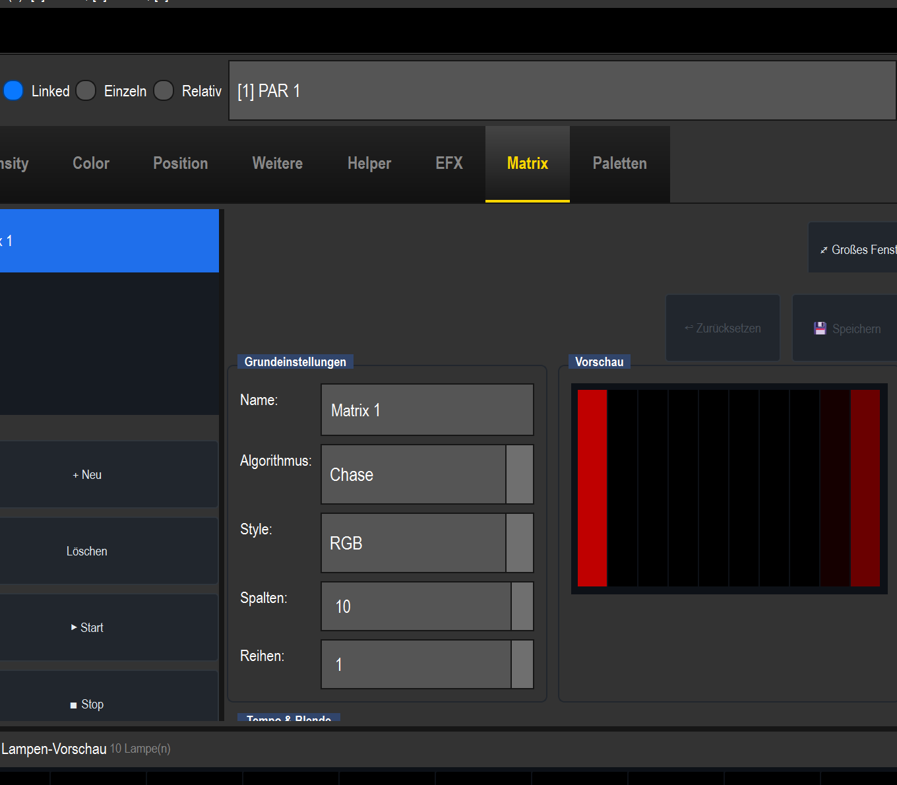
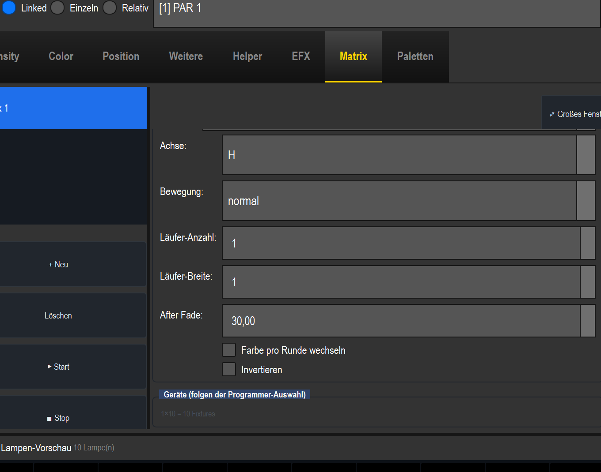
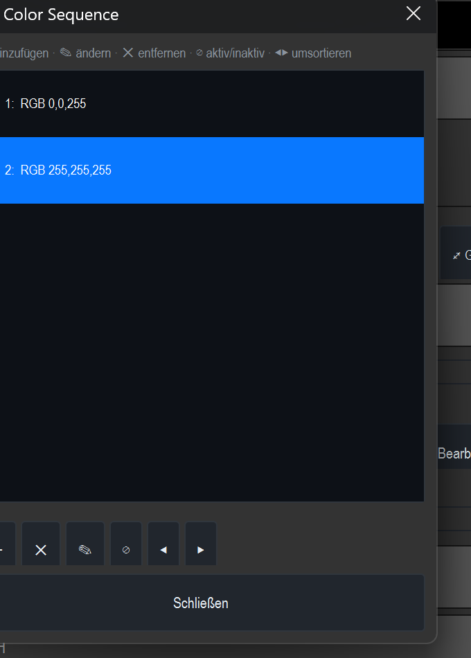
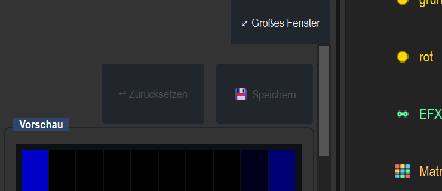

# Anleitung: Farbchase frei zusammenstellen (z. B. Blau-Weiß)

> Teil der Hardstyle-Show. Ziel: ein **Farb-Chase**, dessen **Farbfolge du frei wählst** —
> z. B. *Blau-Weiß*, *Grün-Rot-Blau* oder *Grün-Weiß-Blau* — der über deine Geräte läuft.
> Gebaut **ohne Generator**, komplett in der Oberfläche. Genutzt wird die vorhandene
> **RGB-Matrix** mit dem Algorithmus **Chase**.

So sieht das Ergebnis aus (Blau-Weiß, läuft über die 10 Farb-Geräte):

---

## 1. Geräte auswählen

Wechsle in die Sektion **Programmer** und wähle links unter **Gruppen** die Gruppe, über die
der Chase laufen soll — hier **„Farb-Matrix (10)"** (alle PAR + beide Spider).
Oben erscheint „**10 Gerät(e): …**".

> **Tipp:** Ein Klick auf die Gruppe springt automatisch in den Tab **Matrix** und
> übernimmt die Geräte. Du musst den Tab also nicht von Hand öffnen.

## 2. Matrix mit Algorithmus „Chase"

Du bist nach dem Gruppen-Klick bereits im Tab **Matrix**. Wähle eine Matrix (oder lege mit
**+ Neu** eine an) und stelle in **Grundeinstellungen** ein:

- **Algorithmus: Chase**
- **Style: RGB** (bei Spider/RGBW-PAR auch RGBW)

Die eingebettete Matrix **folgt automatisch der Programmer-Auswahl** (Überschrift „Geräte
(folgen der Programmer-Auswahl)") und setzt **Spalten** und **Reihen** aus der Gruppen-Definition
selbst — du siehst z. B. „**1×10 = 10 Fixtures, 0 Lücken (Gruppe »Farb-Matrix«)**". Ein manuelles Setzen
von **Spalten/Reihen** ist daher meist unnötig und wird beim nächsten Auswahl-Sync ohnehin wieder
überschrieben.

## 3. „Farbe pro Runde wechseln" aktivieren

Scrolle zur Gruppe **Bewegung & Parameter** und setze den Haken bei
**„Farbe pro Runde wechseln"**. Erst dadurch nutzt der Chase eine **ganze Farbfolge**
(statt nur einer Einzelfarbe) — und der Farbfolgen-Editor wird sichtbar.

## 4. Farbfolge zusammenstellen

In der Gruppe **Farben** steht jetzt **„Color Sequence"**. Klick auf **🎨 Bearbeiten…** — der
Farbfolgen-Editor öffnet sich in einem eigenen Fenster. Oben steht die Kurz-Legende
„**＋ hinzufügen · ✎ ändern · ✕ entfernen · ⊘ aktiv/inaktiv · ◀▶ umsortieren**". Die Aktionen sind
kleine Icon-Buttons unter der Farbliste — von links nach rechts in dieser Reihenfolge
(die Legende oben listet sie nicht in der Anordnungs-Reihenfolge):

- **＋** — Farbe **hinzufügen**,
- **✕** — ausgewählte Farbe **entfernen**,
- **✎** — ausgewählte Farbe **ändern**; öffnet den Farbwähler (exakte Farbe per HTML-Feld, z. B. `#0000ff` = Blau, `#ffffff` = Weiß),
- **⊘** — ausgewählte Farbe **aktiv/inaktiv** schalten (inaktive Einträge zeigt die Liste mit „**(aus)**" und werden im Chase übersprungen),
- **◀ / ▶** — ausgewählte Farbe **umsortieren** (nach links/rechts).

Für *Blau-Weiß* genügen zwei Einträge: **RGB 0,0,255** und **RGB 255,255,255**. Für andere Looks
einfach mehr Farben (z. B. Grün-Rot-Blau).

## 5. Speichern & starten

Klick oben rechts im Editor auf **💾 Speichern** (committet die Matrix — „Zurücksetzen"/„Speichern"
werden ausgegraut = gesichert). Mit **▶ Start** läuft der Chase; die **Vorschau** zeigt ihn live.

## 6. Tempo & Musik

- **Geschwindigkeit** (Tempo & Blende) stellt die Chase-Rate ein.
- Für **musiksynchron / relative Geschwindigkeit** kann die Matrix an einen **Tempo-Bus** gekoppelt
  werden (so läuft z. B. ein Dimmer-Effekt doppelt so schnell wie der Farb-Chase, phasen-gekoppelt) —
  siehe Anleitung *Tempo-Sync / relative Geschwindigkeit*.

---

**Kurz:** Gruppe wählen → Matrix-Tab → Chase/RGB → „Farbe pro Runde wechseln" → Color Sequence
zusammenstellen → Speichern → Start. Die Farbkombination ist damit völlig frei wählbar.
