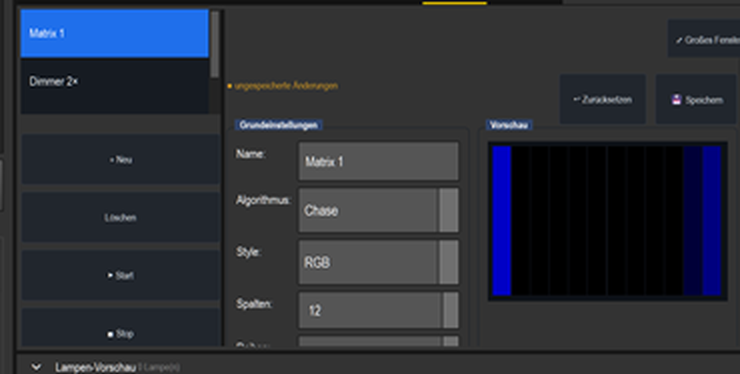
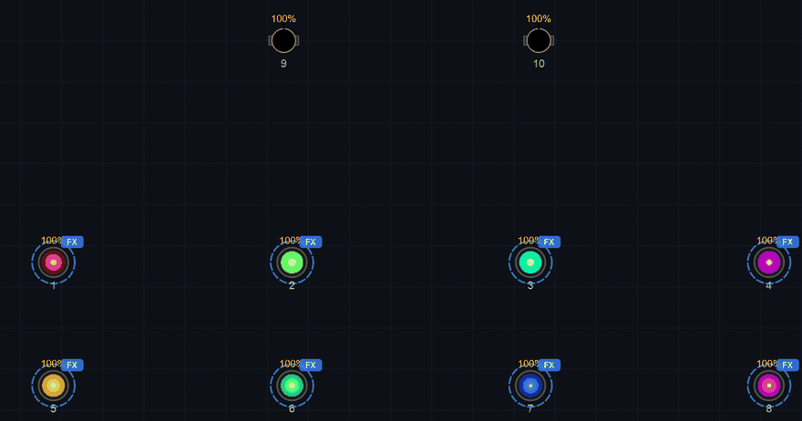

# Anleitung: Farb-Matrix (RGB/RGBW-Effekte über eine Gerätegruppe)

> Die **Farb-Matrix** legt einen **Farbeffekt** über eine ganze Gerätegruppe — Lauflicht,
> Verlauf, Atmen, Feuer u. v. m. Das **Raster folgt der Gruppe** (jedes Gerät ist eine
> Zelle). Sie schreibt nur **Farbe** (kombinierbar mit einer Dimmer-Matrix als Helligkeits-Ebene).
> Für den konkreten *Blau-Weiß-Chase* siehe die Anleitung **Farbchase** — hier das allgemeine Prinzip.

> **Wichtig – Helligkeit:** Eine Farb-Matrix schreibt nur R/G/B(/W) und lässt den
> **Dimmer-Kanal** in Ruhe. Geräte mit eigenem Dimmer, der standardmäßig auf 0 steht (z. B.
> Generic „LED PAR Dimmer+RGB 4ch"), bleiben deshalb **dunkel**, bis etwas den Dimmer öffnet:
> der Menüschalter **Programmer → „Farbe macht automatisch hell"** (bei neuen Shows aus), eine
> **Dimmer-Matrix** (Stil *Dimmer*) oder ein Wert im Programmer-Reiter **Intensity**. Geräte
> ohne Dimmer-Kanal leuchten sofort.

---

## 1. Anlegen

Erst die **Gruppe** in der Gruppen-Liste wählen (z. B. *Farb-Matrix (10)* = alle PAR + Spider),
dann Programmer → Tab **Matrix** → **+ Neu** → in **Grundeinstellungen**:

- **Stil: RGB** (reine Farbe) oder **RGBW** (mit Weiß-Kanal — z. B. Spider/RGBW-PAR).
- **Algorithmus** wählen (siehe unten).
- **💾 Speichern**, dann in der Liste links **▶ Start**. Gestartet wird immer die
  **gespeicherte** Fassung — ungespeicherte Änderungen (Hinweis „● ungespeicherte Änderungen")
  wirken nicht auf den laufenden Effekt.

**Spalten/Zeilen** stellst du nicht von Hand ein: das **Raster folgt der Programmer-Auswahl** —
bei einer Gruppe deren Raster (auch 2D), bei loser Auswahl eine Zeile mit allen Geräten. Die
neue Matrix gehört zu der Gruppe, die beim **+ Neu** aktiv war, und erscheint nur unter ihr in der
Liste. Steht „0 Fixtures", die Gruppe in der Gruppen-Liste **neu anklicken**.

## 2. Algorithmen (Auswahl)

Im Auswahlfeld (Klappliste) **Algorithmus** stehen u. a.: **Plain** (volle Fläche), **Chase** (Lauflicht),
**Wipe** (Wisch), **Wave** (Welle), **Gradient** (Farbverlauf), **Rainbow** (Regenbogen),
**Fill** (Schritt-für-Schritt-Füllen), **Random** (Zufall), **Color Fade** (Crossfade),
**Strobe**, **Schachbrett**, **Radar**, **Spirale**, **Sine Plasma**, **Windrad**,
**Atmen (Puls)**, **Feuer** und **Regen**. Die meisten Algorithmen nutzen 1–3 Farben (C1/C2/C3)
bzw. eine **Color Sequence**; manche (z. B. **Rainbow**) nutzen **keine** Farbfelder und erzeugen
ihre Farben selbst — dort blendet der Editor die Farbauswahl aus.

> **Hinweis:** „Komet" und „Ripple" sind **keine eigenen Algorithmen mehr** — ein Komet ist
> jetzt ein **Chase** mit Schweif (Regler „Schweif (%)"), ein Ripple ist eine **Wave** mit
> Ursprung *radial*. Alte Shows mit diesen Namen laden weiterhin (Legacy-Migration).

- **„Farbe pro Runde wechseln" (color_cycle)** — nur bei Algorithmus **Chase**, in der Gruppe
  **Farben**: schaltet von Einzelfarbe auf eine ganze **Farbfolge** (Color Sequence) um — dann
  läuft der Chase z. B. Blau→Weiß→Grün.
- **Läufer-Anzahl / Schweif (%):** mehr/dichtere Läufer bzw. weicher Übergang hinter dem
  Läufer (0 % = harter Wechsel, 100 % = langer weicher Übergang). Beides nur bei Chase mit
  Bewegung *normal*.

## 3. Stil RGBW (Weiß-Kanal)

Mit **Stil RGBW** legt die Matrix den **gemeinsamen Weißanteil** einer Farbe auf die weiße LED
(Spider/RGBW-PAR): Reines Weiß kommt nur aus dem W-Kanal, Pastelltöne werden sauberer, reine
Farben (Rot, Grün, Blau …) bleiben unverändert. Ein eigener Weißanteil ist **nicht**
einstellbar.

**Ausnahme — eigene Weiß-Achse:** Gehören die Weiß-Emitter eines Geräts nicht 1:1 zu den
Farbzellen (z. B. die Warmweiß-Leiste des ZQ06121), lässt die Matrix diesen Weiß-Kanal in Ruhe
und gibt Weiß über RGB aus. Diese Weiß-Segmente fährst du über eigene Weiß-Zellen im Raster
(Gruppen-Editor: „Weiß-Segmente einzeln → Raster ▾“), eine Dimmer-Matrix oder eine Szene.

## 4. Kombinieren

Farbe (diese Matrix) + Helligkeit (Dimmer-Matrix) + Bewegung (EFX) sind **getrennte Ebenen** über
denselben Geräten — siehe *Dimmer-Matrix* (relative Geschwindigkeit) und *EFX*. Stehen im
Programmer noch Farbwerte für diese Geräte, überdecken sie die Matrix — vorher **Programmer
leeren**. So sieht eine laufende Farb-Matrix aus:

→ **Schritt-für-Schritt-Beispiel** (Blau-Weiß-Chase mit Color Sequence): [Farbchase](../anleitung_farbchase/ANLEITUNG_FARBCHASE.md).

---

**Kurz:** Gruppe wählen → Matrix-Tab → **+ Neu** → **Stil RGB/RGBW** + Algorithmus (Raster folgt
der Gruppe) → optional „Farbe pro Runde wechseln" + Color Sequence → **💾 Speichern** →
**▶ Start**. Bleiben Geräte dunkel: Dimmer öffnen (siehe Kasten oben). Kombinierbar mit
Dimmer-Matrix (Helligkeit) und EFX (Bewegung).
