# Eigenes Gerät mit dem Fixture Generator anlegen — am Beispiel eines Show-Lasers

Diese Anleitung zeigt Schritt für Schritt, wie du ein Gerät in LightOS anlegst,
das noch nicht in der Bibliothek steht. Beispiel ist der Show-Laser
**Laserworld EL-400RGB MK2** (Klasse 3B, RGB 320–400 mW, 9 DMX-Kanäle).
Er steht inzwischen fertig in der LightOS-Bibliothek
(`fixtures/bibliothek/laserworld/el-400rgb-mk2.json`) — wir tun hier so, als
gäbe es ihn noch nicht. Für jedes andere Gerät gehst du genauso vor.

> **Laser sind gefährlich.** Ein Klasse-3B-Laser kann bei direktem Blick in den
> Strahl das Auge sofort schädigen. Profil anlegen und am Bildschirm testen ist
> ungefährlich; sobald das echte Gerät am DMX hängt, gilt: Strahl nie auf
> Menschen, eine Person schaut zu und hält den Schlüsselschalter bzw. das
> Interlock in Reichweite. Mehr dazu unten unter
> [Abgleich mit dem echten Gerät](#8-abgleich-mit-dem-echten-gerät).

Die Bilder stammen aus einem echten Durchlauf am Bildschirm: das Bild-Werkzeug
(`tools/anleitungsbilder.py fixture_generator --bildschirm`) klickt und tippt
in einer Sandbox mit der Doku-Demo-Show genau die Schritte dieser Anleitung —
Generator öffnen, Felder, Kanäle und Bereiche eintippen, speichern, patchen,
im Programmer bedienen. Das dabei gespeicherte Profil stimmt Feld für Feld mit
dem Bibliotheksprofil überein.

---

## 1. Woher kommen die Angaben?

Zwei Quellen, in dieser Reihenfolge:

1. **Das Gerät selbst** — Typenschild und Schalter auf der Rückseite.
2. **Das Herstellerhandbuch** — dort steht die DMX-Tabelle. Laserworld bietet
   es auf laserworld.com unter *Support → Downloads → Bedienungsanleitungen*
   an. Für den EL-400RGB MK2 gibt es zwei Ausgaben (2022 und 2024); ihre
   DMX-Tabellen sind gleich.

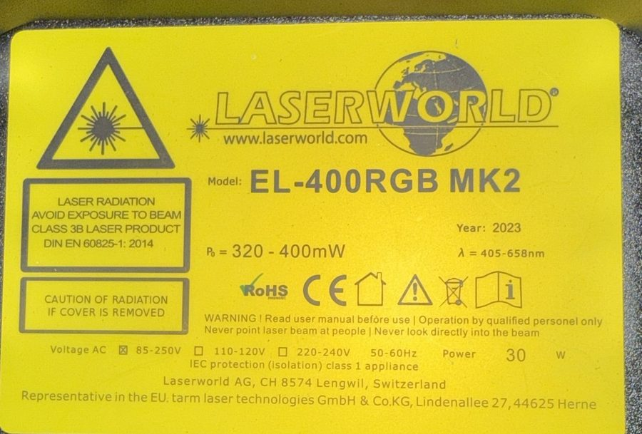

Vom Typenschild nimmst du: **Hersteller** (Laserworld), **Modell**
(EL-400RGB MK2), **Leistungsaufnahme** (30 W) und die **Laserklasse** (3B —
für dich, nicht für LightOS). Das Datenblatt im Handbuch nennt 15 W; wenn sich
Quellen widersprechen, gilt das Gerät.

### Die DMX-Tabelle aus dem Handbuch (Abschnitt 8.4)

| Kanal | Wert | Funktion |
|---|---|---|
| 1 | 0–49 | Laser aus |
|   | 50–99 | Musik-Modus |
|   | 100–149 | Auto-Modus |
|   | 150–199 | Statische Muster (DMX) |
|   | 200–255 | Dynamische Muster (DMX) |
| 2 | 0–255 | Musterauswahl |
| 3 | 0–10 / 11–255 | Mitte der X-Achse / Position X |
| 4 | 0–10 / 11–255 | Mitte der Y-Achse / Position Y |
| 5 | 0–255 | Scangeschwindigkeit |
| 6 | 0–255 | Geschwindigkeit der dynamischen Muster |
| 7 | 0–255 | Zoom / Größe |
| 8 | 0–255 | Farbe |
| 9 | 0–255 | Farbsegmente |

Es gibt nur **einen** DMX-Modus mit 9 Kanälen.

### DIP-Schalter: Betriebsart und Startadresse

Der EL-400RGB MK2 hat kein Display. Adresse und Betriebsart stellst du mit den
zehn DIP-Schaltern auf der Rückseite ein (oben = ON):

| Schalter | 1 | 2 | 3 | 4 | 5 | 6 | 7 | 8 | 9 | 10 |
|---|---|---|---|---|---|---|---|---|---|---|
| Wert | 1 | 2 | 4 | 8 | 16 | 32 | 64 | 128 | 256 | Betriebsart |

* **Schalter 10 AUS = DMX-Betrieb.** Schalter 1–9 ergeben die Startadresse:
  die Werte der eingeschalteten Schalter zusammenzählen. Adresse 1 = nur
  Schalter 1 ON; Adresse 10 = Schalter 2 und 4 ON (2 + 8).
* **Schalter 10 AN = eigenständig.** Dann spielt der Laser ohne DMX selbst
  Muster (Auto- bzw. Musik-Modus, laut Handbuch-Abbildungen: Auto = 1 + 10 ON,
  Musik = nur 10 ON) und **reagiert nicht auf DMX** — auch nicht auf Blackout
  oder NOT-AUS aus LightOS.

Am Gerät nachgeprüft: mit Schalter 10 AN lief der Laser ohne DMX los; mit
Schalter 1 AN, 2–9 AUS und 10 AUS blieb er dunkel und wartete auf DMX ab
Adresse 1.

> Das Handbuch nennt die Schalterwerte, aber nicht, was alle Schalter auf AUS
> bedeutet. Adresse 0 gibt es in DMX nicht — stell immer mindestens Adresse 1
> ein.

---

## 2. Den Fixture Generator öffnen

Im Bereich **Patchen**, Reiter **Patch**, auf **Gerät erstellen…** klicken (1).

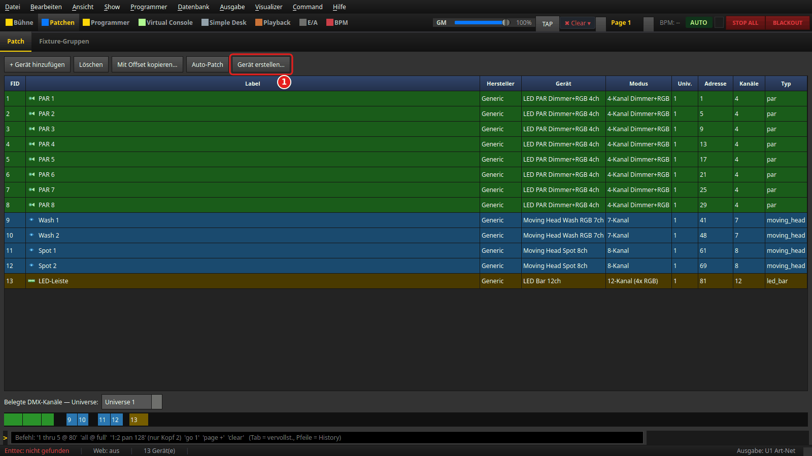

## 3. Kopf: Hersteller, Modell, Typ

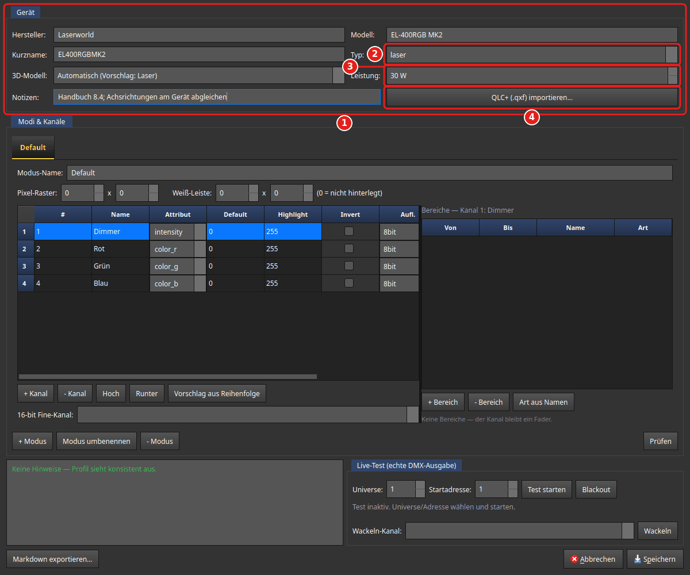

1. **Hersteller**, **Modell** und einen **Kurznamen** eintragen (hier
   `EL400RGBMK2`; der Kurzname erscheint in Listen und Befehlen).
2. **Typ: `laser`.** Das ist wichtig: daran erkennt LightOS das Gerät als
   Laser — Reiter **Laser** im Programmer, Laser-NOT-AUS, „Alles Weiß“ lässt
   ihn aus, der Blackout schaltet ihn ganz ab, die 3D-Ansicht zeichnet Strahlen.
3. **Leistung** vom Typenschild (30 W).
4. Gibt es für dein Gerät eine QLC+-Datei (`.qxf`), kannst du sie hier als
   Startpunkt laden und danach gegen das Handbuch prüfen.

## 4. Modus und Kanäle

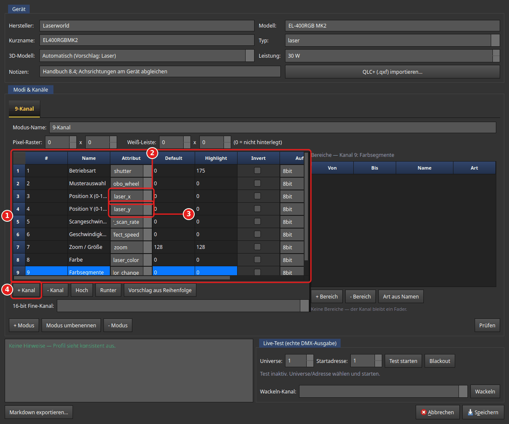

Ein neuer Generator startet mit einem Beispielmodus „Default“ (Dimmer, Rot,
Grün, Blau). Ins Feld **Modus-Name** „9-Kanal“ tippen (der Reiter übernimmt den
Namen mit Enter), mit **+ Kanal** (4) auf neun Kanäle aufstocken und die Zeilen
in der Reihenfolge des Handbuchs überschreiben (1) — Kanal 1 zuerst. Name,
Default und Highlight per Doppelklick in die Zelle, das Attribut im Auswahlfeld
der Zeile (man kann es auch eintippen). Für jeden Kanal einen
**Namen** und ein **Attribut** wählen. Das Attribut entscheidet, was LightOS
mit dem Kanal macht:

| Kanal | Name | Attribut | Warum |
|---|---|---|---|
| 1 | Betriebsart | `shutter` | Ein- und Ausschalter des Lasers (siehe Schritt 5) |
| 2 | Musterauswahl | `gobo_wheel` | Musterauswahl der Laser-Seite, Werksmuster-Kacheln |
| 3 | Position X (0-10 = Mitte) | `laser_x` | X-Achse — darauf kann ein EFX laufen (2) |
| 4 | Position Y (0-10 = Mitte) | `laser_y` | Y-Achse (3) |
| 5 | Scangeschwindigkeit | `laser_scan_rate` | |
| 6 | Geschwindigkeit dynamische Muster | `effect_speed` | Tempo der Muster-Animation |
| 7 | Zoom / Größe | `zoom` | |
| 8 | Farbe | `laser_color` | Laser-Farbe (bleibt bei Farb-Paletten außen vor) |
| 9 | Farbsegmente | `laser_color_change` | |

Kein Attribut darf in einem Modus doppelt vorkommen — LightOS liest ein
wiederholtes Attribut als zweiten Kopf.

**Default** ist der Wert, mit dem das Gerät nach dem Patchen startet. Für X/Y
ist das 0 (laut Handbuch die Mitte), für die Größe 128. Die X/Y-Kanäle bekommen
**keine Bereiche**: die 3D-Ansicht liest den ersten Bereich eines Kanals als
„feste Position“ — ein Bereich „0–10 Mitte“ würde alles darüber als
Eigenbewegung zeigen. Die Mitte steht deshalb im Kanalnamen.

## 5. Laser-Sicherheit: der Aus-Wert

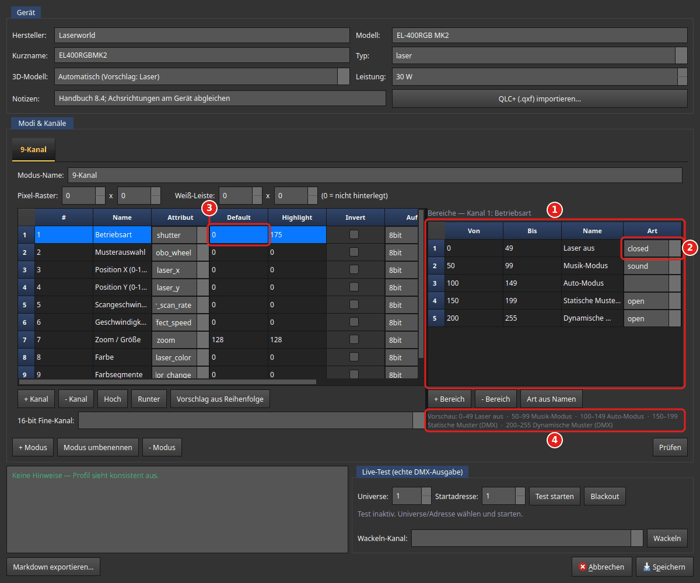

Den Kanal **Betriebsart** wählen und rechts mit **+ Bereich** die fünf Bereiche
aus dem Handbuch eintragen (1). Die **Art** sagt LightOS, was ein Bereich
bedeutet:

| Bereich | Art |
|---|---|
| 0–49 Laser aus | **`closed`** (2) |
| 50–99 Musik-Modus | `sound` |
| 100–149 Auto-Modus | (leer) |
| 150–199 Statische Muster (DMX) | `open` |
| 200–255 Dynamische Muster (DMX) | `open` |

Der Bereich der Art **`closed`** ist der **Aus-Wert** des Lasers. Über ihn
schalten **Blackout**, **Grand Master 0**, ein **gezielter Blackout** einer
VC-Taste und der **Laser-NOT-AUS** den Laser dunkel — ein Laser hat keinen
Dimmer, den man herunterziehen könnte. Fehlt der Aus-Wert, strahlt der Laser
bei Grand Master 0 weiter.

Der **Default** der Betriebsart (3) muss im Aus-Bereich liegen — hier 0. Sonst
geht der Laser beim Patchen sofort an. Die Zeile darunter (4) zeigt, welche
Kacheln die Bereiche später im Programmer ergeben.

## 6. Prüfen, Live-Test, Speichern

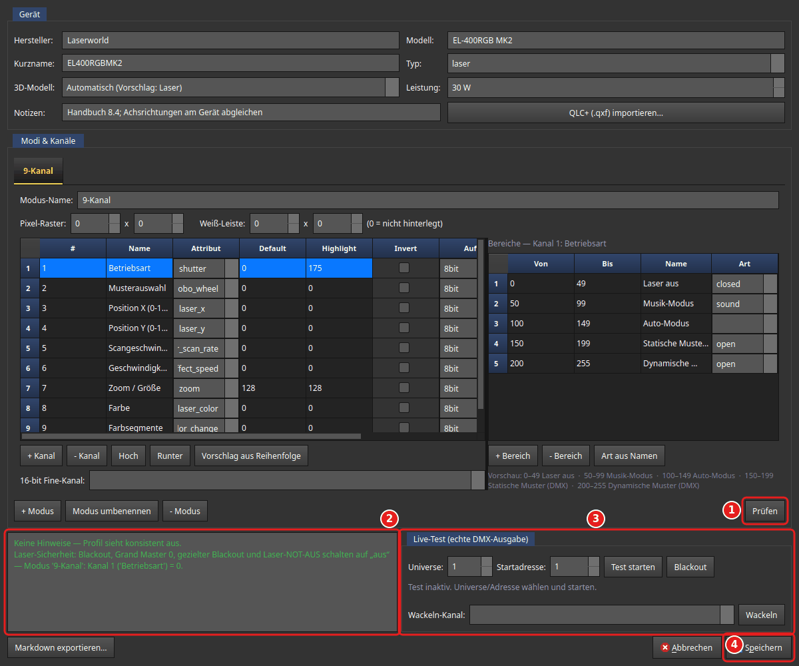

**Prüfen** (1) meldet Lücken, Überlappungen und vertauschte Kanäle (2). Bei
einem Laser steht dort zusätzlich, über welchen Kanal und Wert LightOS ihn
dunkel schaltet — hier „Kanal 1 (Betriebsart) = 0“. Fehlt der Aus-Wert oder
startet der Laser mit seinem Default eingeschaltet, kommt ein Hinweis.

Der **Live-Test** (3) schreibt Werte direkt an das echte Gerät — beim Laser
nur unter den Sicherheitsregeln aus Abschnitt 8. **Speichern** (4) legt das
Profil in deiner Bibliothek an und bestätigt das mit einer kurzen Meldung.

## 7. Patchen und bedienen

### Patchen

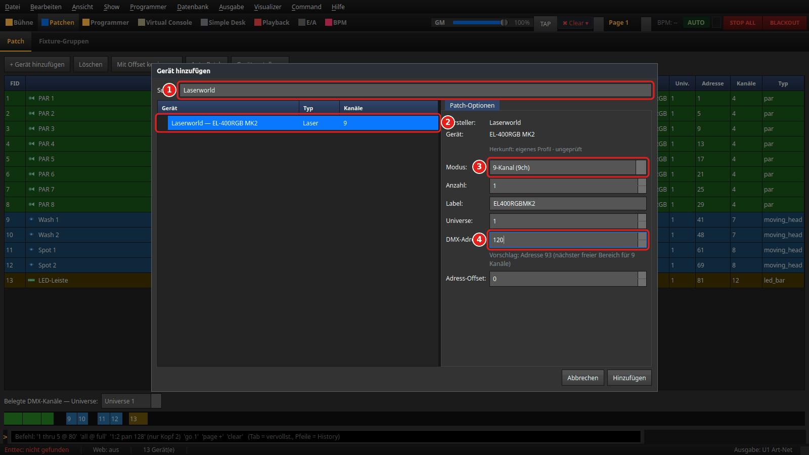

Im Bereich **Patchen** auf **+ Gerät hinzufügen**, nach dem Hersteller
suchen (1), das Gerät wählen (2) — „Herkunft: eigenes Profil“ —, Modus
**9-Kanal** (3), Universum und **dieselbe Startadresse wie an den
DIP-Schaltern** eintippen (4; im Bild 120), **Hinzufügen**. Das Label ist der
Kurzname; umbenennen kannst du es im Patch.

### Programmer, Reiter Laser

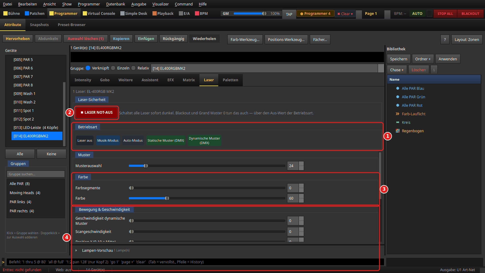

Den Laser in der Geräteliste wählen; der Reiter **Laser** erscheint.

1. **Betriebsart** — die Bereiche aus Schritt 5 als Kacheln. „Statische
   Muster (DMX)“ schaltet den Laser ein, „Laser aus“ aus.
2. **LASER NOT-AUS** — schaltet sofort alle Laser dunkel.
3. **Farbe** — Farbe und Farbsegmente.
4. **Bewegung & Geschwindigkeit** — Position X/Y, Größe, Scan- und
   Mustergeschwindigkeit. Darunter folgen Muster-Paletten und Werksmuster.

### Laser-NOT-AUS

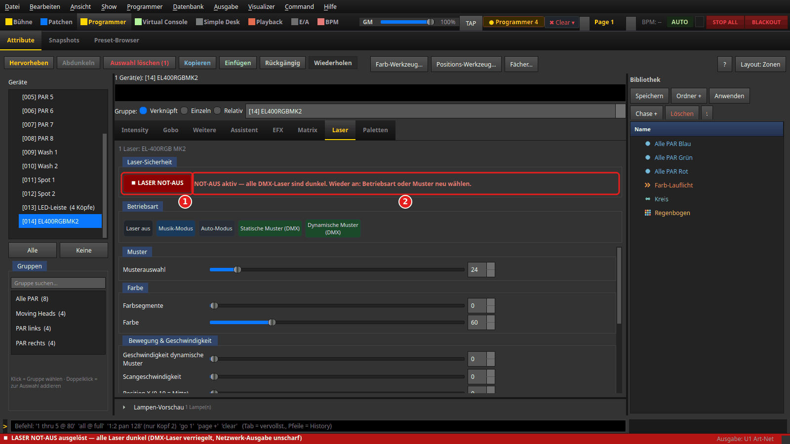

Nach dem NOT-AUS (1) zeigt die Laser-Seite rot an, dass er greift (2), die
Statuszeile bestätigt ihn. Position, Farbe oder Größe zu verändern schaltet
den Laser **nicht** wieder ein — erst ein neuer Klick auf eine Betriebsart oder
ein neues Muster. Den NOT-AUS gibt es auch als VC-Taste (Aktion
„Laser NOT-AUS“).

### Bewegung mit EFX

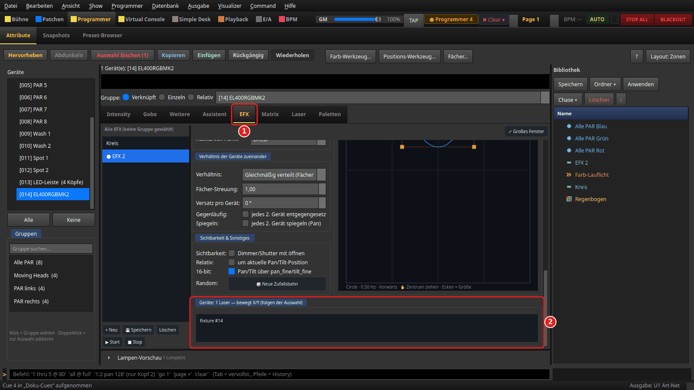

Im Reiter **EFX** (1) bewegt ein Kreis, eine Acht oder eine Linie den Laser
über seine Achsen X/Y. Die Geräteliste (2) sagt „Laser — bewegt X/Y“. Laser
werden nur bewegt, wenn sie ausgewählt sind: eine Bewegung ohne Auswahl (oder
von einer VC-Taste) nimmt nur Moving Heads.

### 3D-Ansicht

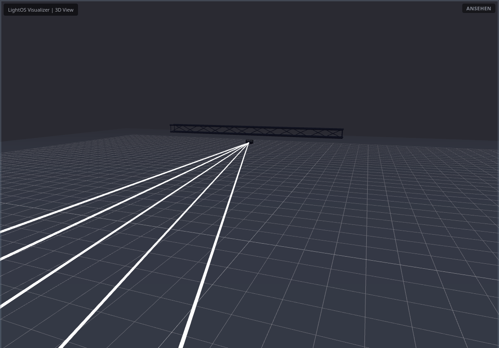

Die 3D-Ansicht zeichnet die Strahlen nach Position, Größe und Betriebsart. Die
echten Muster des Geräts kennt sie nicht, und weil das Handbuch für Kanal 8 nur
„0–255 Farbe“ nennt, erscheinen die Strahlen weiß.

---

## 8. Abgleich mit dem echten Gerät

Ein Profil aus dem Handbuch ist eine Behauptung über das Gerät — am Gerät
prüfen, was das Handbuch offenlässt. Beim EL-400RGB MK2 sind das:

* Richtung von X und Y (links/rechts, oben/unten),
* Richtung von Scan- und Mustergeschwindigkeit (langsam → schnell oder
  umgekehrt),
* ob Größe 0 klein oder groß ist,
* die Farbstufen von Kanal 8 im Feinen (siehe die gemessenen Stützpunkte
  unten),
* was „Farbsegmente“ genau tut.

**So testest du sicher** (zwei Personen, eine schaut nur auf den Strahl):

1. Strahl in einen leeren Raumbereich oder auf eine Wand richten, niemand im
   Strahlengang; Schlüsselschalter und Interlock in Reichweite.
2. DIP-Schalter: 10 AUS, Adresse eingestellt. Gerät einschalten — es muss
   **dunkel** bleiben.
3. In LightOS gepatcht, alle Kanäle auf Default (Betriebsart 0 = aus).
   Prüfen: dunkel.
4. Betriebsart auf „Statische Muster (DMX)“ — der Laser geht an. Sofort
   **Blackout** drücken → aus. Lösen, wieder an.
5. **Laser-NOT-AUS** → aus. Grand Master auf 0 → aus.
6. Erst dann einzeln: Musterauswahl, X, Y, Größe, Farbe, Farbsegmente,
   Geschwindigkeiten — jeweils langsam und notieren, was passiert.
7. Was abweicht, im Profil korrigieren (Bereiche, Namen, Defaults) und neu
   speichern.

### Was am echten Gerät schon bestätigt ist (08.10.2026)

Am EL-400RGB MK2 (DIP-Schalter 1 AN, 2–9 AUS, 10 AUS = Adresse 1, über einen
Enttec DMX USB Pro):

* Betriebsart 175 („Statische Muster“), Musterauswahl 0, Größe 128 → ein Kreis.
  Betriebsart 0 → aus.
* **Blackout, Grand Master 0, Laser-NOT-AUS und gezielter Blackout** einer
  VC-Taste schalten den Laser jeweils sofort dunkel; danach geht er wieder an.
  LightOS schreibt dafür auf Kanal 1 den Aus-Wert 0.
* **Farbe (Kanal 8)**, gemessene Stützpunkte: 0 = bunt/Farbwechsel, 20 = weiß,
  40 = blau, 60 = weiß, 80 = hellblau (Cyan), 120 = grün, 160 = gelb,
  200 = weiß, 240 = weiß. Rot und Magenta lagen zwischen diesen Punkten —
  die Stufen sind schmaler und noch feiner abzugleichen. Bis dahin hat
  Kanal 8 im Profil keine Bereiche; die Punkte stehen in den Profil-Notizen.

Siehe auch: [Laser-Anleitung](../anleitung_laser/ANLEITUNG_LASER.md),
[Geräte-Bibliothek & eigene Profile](../anleitung_geraete_bibliothek/ANLEITUNG.md).
