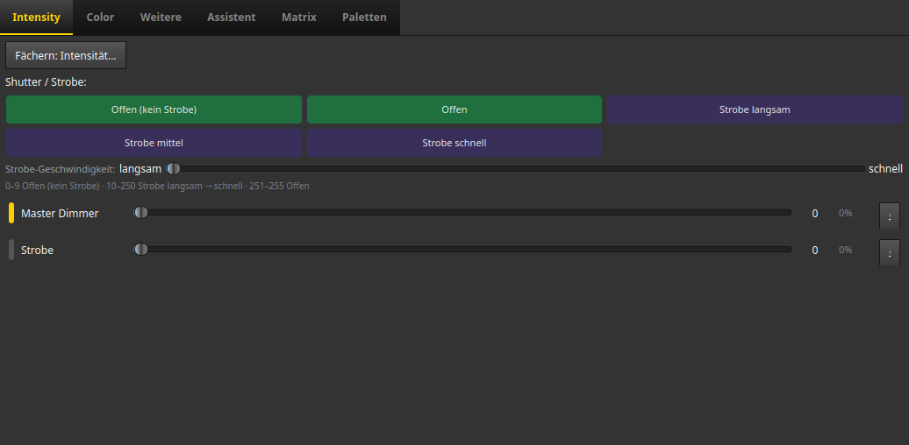
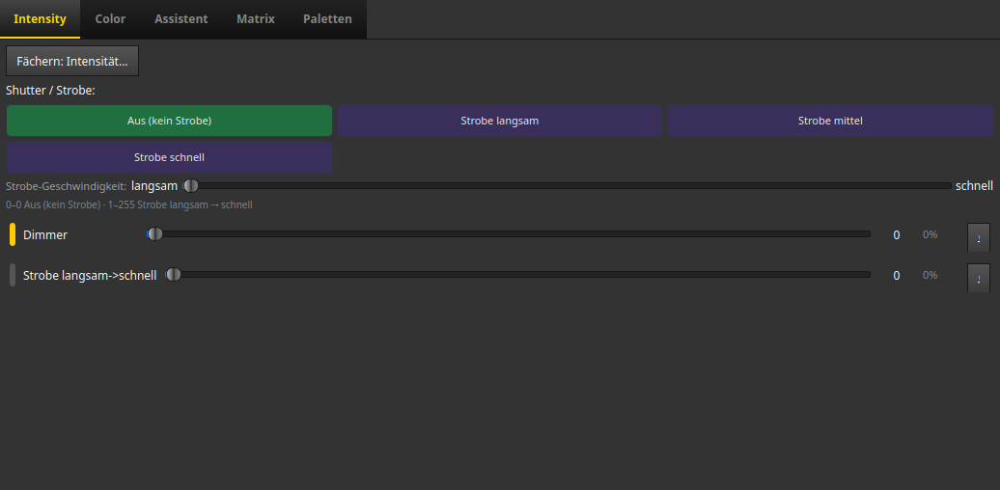
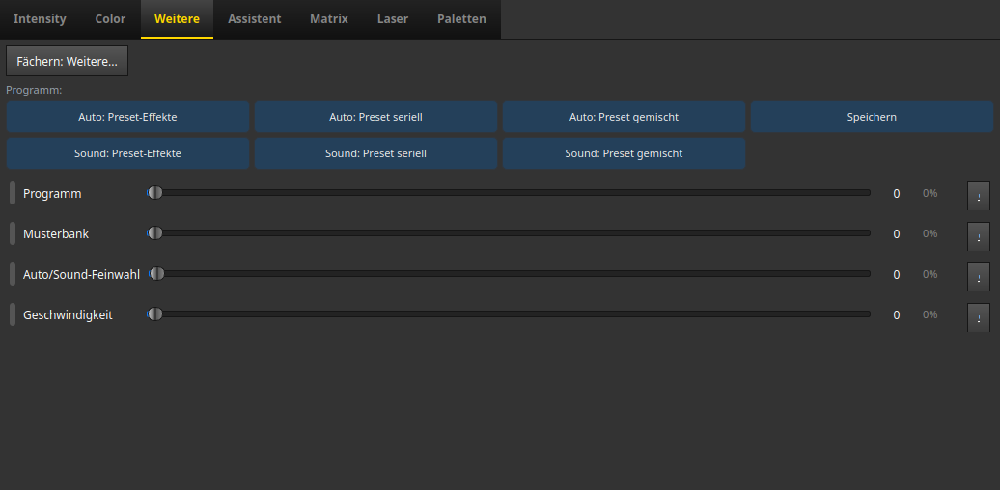
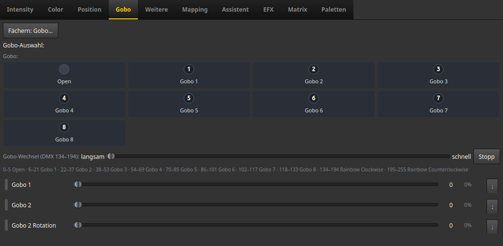
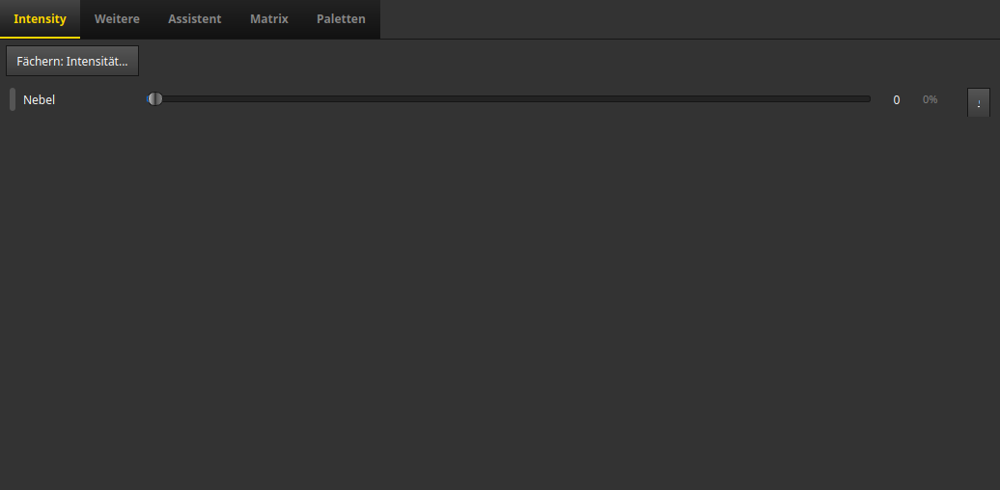

# Programmer: jedes Gerät richtig bedienen

> **Worum geht's:** In der App-Sektion **Programmer** baut LightOS die Bedienelemente
> aus dem Geräteprofil: Knöpfe für Strobe, Kacheln für Programme, Regler für jeden Kanal.
> Diese Seite zeigt, was du bei welchem Gerät siehst und wie du es liest. Alle Bilder
> stammen aus der echten App mit echten Geräteprofilen (PAR, Moving Heads, Mehrkopf-Mover,
> Laser, Nebelmaschine, Pixel-Balken).

> Neu im Programmer? Die Grundbedienung (Geräte wählen, Reiter, Werkzeuge, Löschen)
> steht in den [Programmer-Grundlagen](../anleitung_programmer_grundlagen/ANLEITUNG.md).

**Grundsatz:** Du siehst nur, was das Gerät kann. Reiter ohne passende Kanäle
(z. B. **Color** bei einer Nebelmaschine, **Position** bei einem PAR) werden ausgeblendet.
Wählst du mehrere verschiedene Geräte, siehst du die **Summe** ihrer Fähigkeiten.

---

## 1. Shutter / Strobe — „Offen" heißt wirklich offen

Hat das Gerät einen Shutter- oder Strobe-Kanal, steht oben im Reiter **Intensity** die
Zeile **Shutter / Strobe** mit einem Knopf je Bereich aus dem Datenblatt:

- **grün** = Licht an, kein Blitzen (z. B. „Offen (kein Strobe)", „Offen", „An")
- **violett** = Strobe (langsam / mittel / schnell)
- **rot** = zu / aus

Darunter der Regler **Strobe-Geschwindigkeit** (langsam → schnell) und in grauer Schrift
die genauen DMX-Bereiche. Gleich benannte Bereiche erscheinen nur einmal.

**Gut zu wissen:**

- Viele Billig-PARs haben einen Kanal „Strobe" **ohne** Bereichsangabe (0 = aus,
  1–255 = langsam → schnell). Dort heißt der grüne Knopf **„Kein Strobe"** und schreibt 0.
  Früher schrieb „Auf" hier 255, das Gerät blitzte dann auf voller Geschwindigkeit.
- Beim **Laser** heißt derselbe Kanal „Laser An/Aus" und zeigt die Knöpfe **Aus** und **An**.
- Die 2D-Ansicht (Live) lässt nur Geräte blinken, deren Shutter wirklich im Strobe-Bereich
  steht. Ein offener Moving Head bei z. B. Wert 253 blinkt dort nicht mehr.

## 2. Programm-Kacheln — Auto-, Sound- und Makro-Programme

Hat ein Kanal benannte Programme (Makros, Gobo-Effekte, Effekt-/Animationsprogramme),
erscheinen im Reiter **Weitere** Kacheln mit den Namen aus dem Datenblatt, z. B.
„Auto: Preset-Effekte" oder „Sound: Preset seriell". Ein Klick setzt den Kanal auf den
passenden Wert, für alle ausgewählten Geräte, die diesen Kanal haben. Hat das Gerät einen
Bereich „Aus"/„Kein Programm", steht die Kachel **Aus** immer vorn.

Der Regler darunter bleibt für Feinwerte (z. B. Programm-Geschwindigkeit).

## 3. Zwei gleiche Kanäle an einem Gerät

Manche Geräte haben dieselbe Funktion zweimal: zwei Goboräder, zwei Programmkanäle,
Dimmer-Packs mit vier Dimmern. Jeder dieser Kanäle bekommt einen **eigenen Regler** mit dem
Namen aus dem Profil („Gobo 1", „Gobo 2", „Gobo 2 Rotation"). Die Kacheln oben beziehen
sich auf den ersten Kanal; den zweiten stellst du am Regler ein.

**Unerkannte Kanäle.** Kanäle, denen das Profil keine Funktion zuordnet (etwa „Grundfarbe
Shutter" oder „Zoom Fein" am Spiider), stehen im Reiter **Weitere**:

- Ist **genau ein Gerät** gewählt, hat jeder dieser Kanäle einen eigenen Regler mit seinem
  Namen aus dem Profil. Sind es mehr als 8, liegen sie in der eingeklappten Sektion
  **Einzelne Kanäle (N)** — ein Klick klappt sie auf.
- Darüber steht der Regler **Unerkannte Kanäle (N)**: er setzt alle diese Kanäle auf
  denselben Wert, auch die vorher einzeln eingestellten.
- Sind **mehrere Geräte** gewählt, gibt es nur diesen Sammelregler. Derselbe Platz in der
  Kanalliste ist dort je Gerät eine andere Funktion — ein Einzelregler mit dem Namen des
  einen Geräts würde am anderen etwas Fremdes verstellen.
- Hat ein Gerät nur einen unerkannten Kanal, steht dort genau ein Regler mit dessen Namen.

## 4. Mehrkopf-Geräte und Pixel-Balken

Geräte mit mehreren Köpfen oder Farbzonen (Spider, Mover-Bars, LED-Balken) zeigen im
Reiter **Color** den Umschalter **Köpfe**:

- **Synchron (alle gleich)**: ein Regler je Farbe steuert alle Köpfe/Zonen gemeinsam.
  Bei genau zwei Köpfen steht dort „beide gleich".
- **Getrennt (pro Kopf)**: jeder Kopf bekommt eigene Farbregler.

Für einzelne Zonen eines großen Balkens (z. B. 48 Zonen) ist der Reiter **Matrix**
bequemer als 144 Einzelregler: dort laufen Farbverläufe und Lauflichter über alle Zonen.
Ist ein Gerät im Patch-Dialog fest auf „Köpfe einzeln" oder „Als eine Lampe" gestellt,
ist der Umschalter grau und daneben steht der Grund.

Geräte **ohne eigenen Dimmer** (z. B. eine LED-Bar mit nur RGB-Kanälen) zeigen im Reiter
Intensity den Hinweis, dass die Helligkeit über die Farbe läuft.

## 5. Nebel, Laser & Co. — Geräte ohne Licht

- **Nebelmaschine:** Die Nebelmenge liegt im Reiter **Intensity** („Nebel"), der Lüfter
  unter **Weitere**. Ein Color-Reiter erscheint nicht.
- **Laser:** Farbrad-Kacheln unter **Color**, Programme unter **Weitere**, Muster und
  Sicherheit im eigenen Reiter **Laser** (siehe [Laser bedienen](../anleitung_laser/ANLEITUNG_LASER.md)).
- **Sicherheit:** **Highlight** setzt nur die Intensität, **„Alles Weiß"** lässt Laser,
  Nebel-, Flammen- und Funkenmaschinen ganz in Ruhe. Beides zündet also nie
  versehentlich Nebel oder Laser.
- **Shutter nur mit Beleg:** „Alles Weiß" und eine Bewegung mit geöffnetem Strahl
  (EFX-Häkchen „Dimmer/Shutter mit öffnen") öffnen den Shutter nur, wenn das Gerät einen
  offenen Zustand hinterlegt hat. Liegt der hinterlegte Wert im Strobe- oder
  Zu-Bereich, bleibt der Shutter, wie er ist — lieber ein dunkles Gerät als ein
  unerwartet blitzendes. Mitgelieferte Geräte sind davon nicht betroffen; es kann
  importierte Profile treffen.

---

## Wenn etwas nicht passt

| Beobachtung | Wahrscheinliche Ursache | Was tun |
|---|---|---|
| Ein Knopf macht etwas anderes als beschriftet | Profil weicht vom Datenblatt ab | Profil im Fixture-Editor prüfen (Kanal → Bereiche) |
| Eine Funktion des Geräts fehlt ganz | Kanal im Profil mit falschem Attribut (z. B. „raw" statt „gobo") | Attribut des Kanals im Fixture-Editor setzen |
| Mitgelieferte Profile wirken veraltet | Bibliothek aus einer älteren Version | Seit FM-50 gleicht LightOS mitgelieferte Profile beim ersten Start nach einem Update automatisch an |
| Eigenes/importiertes Profil ändert sich nach Update nicht | gewollt, eigene Profile werden nie überschrieben | — |
