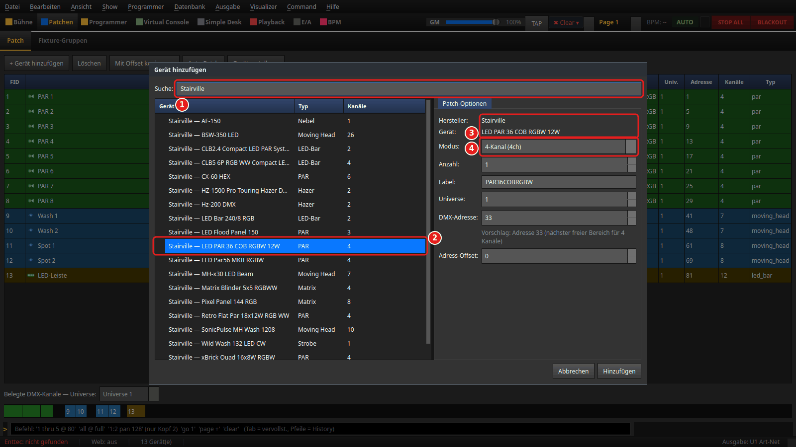
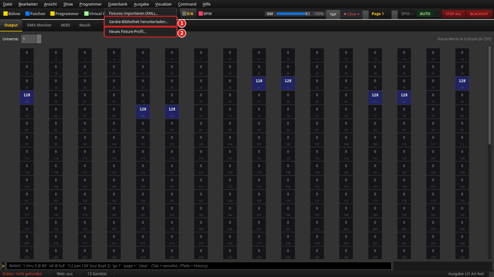
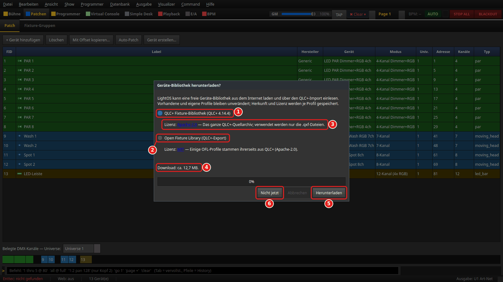
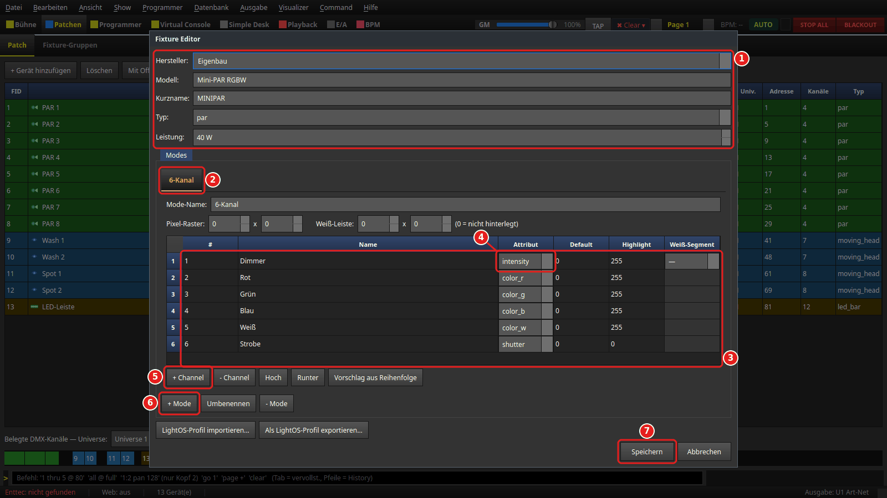
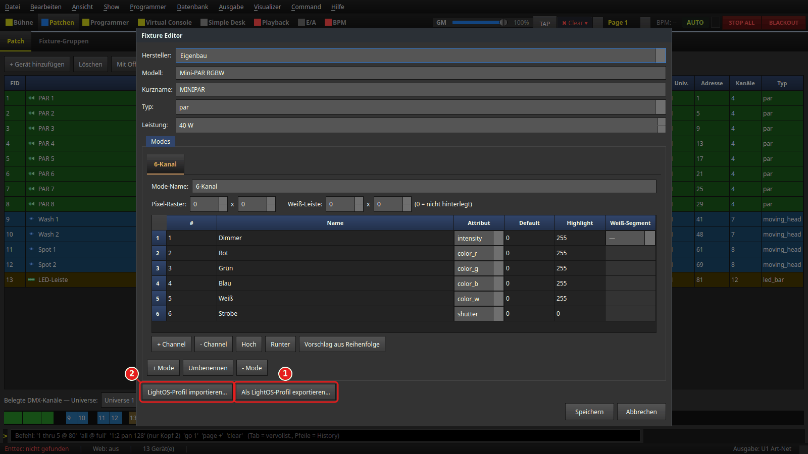
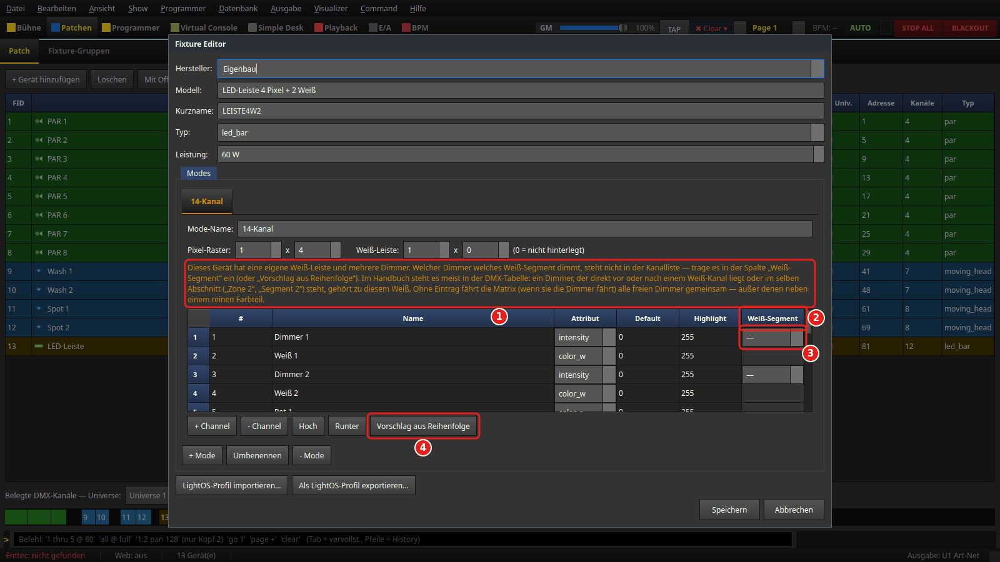
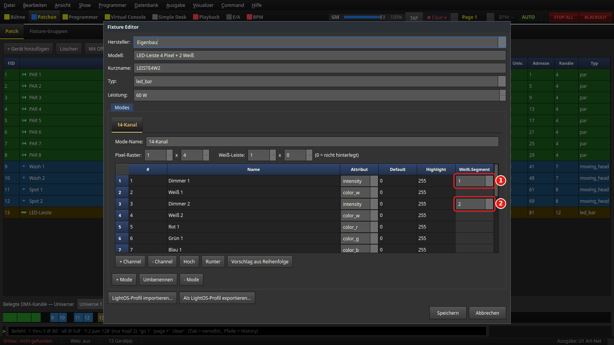
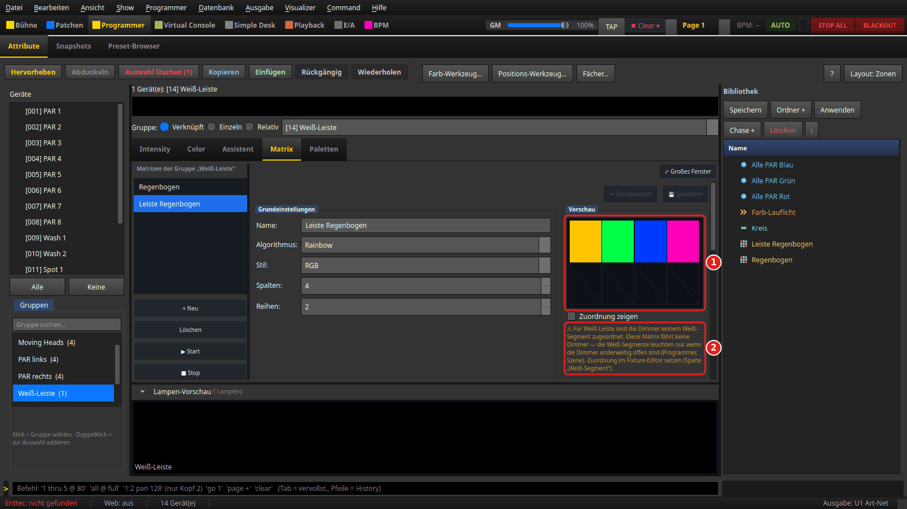
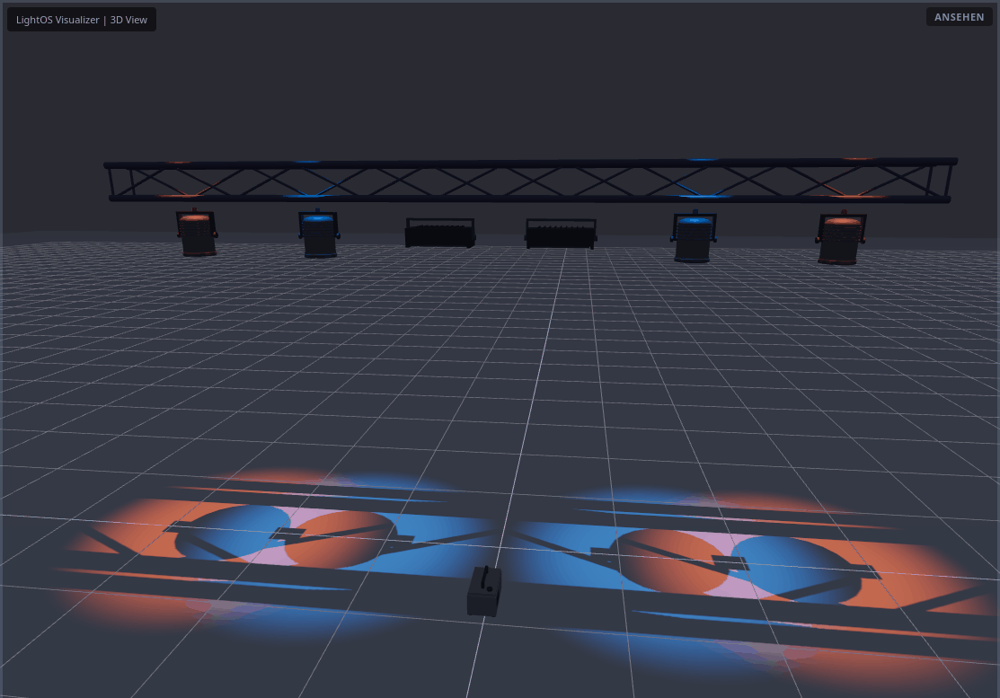

# Geräte-Bibliothek & eigene Profile

> Woher kennt LightOS deine Geräte? Diese Anleitung zeigt, welche Profile LightOS schon
> mitbringt und wie du ein Gerät aus der Bibliothek patchst. Außerdem lädst du eine
> größere freie Bibliothek nach, legst ein eigenes Profil an und tauschst es als Datei
> aus. Für Leisten und Panels mit eigener Weiß-Leiste trägst du ein, welcher Dimmer
> welches Weiß-Segment dimmt. Zum Schluss siehst du die neuen 3D-Modelle. Die roten
> Zahlen in den Bildern gehören zu den gleich nummerierten Punkten im Text.

## Was du brauchst

- **LightOS, installiert und startbar** — siehe [INSTALL.md](../../INSTALL.md).
- **Keine Hardware und keine bestimmte Show.** Die Bilder zeigen eine kleine Übungsshow
  aus Generic-Geräten (acht PARs, zwei Wash-, zwei Spot-Mover, eine LED-Leiste).
- Für Schritt 2 eine **Internetverbindung** — nur, wenn du die freie Bibliothek wirklich
  herunterladen willst. Alles andere geht offline.
- Wie man ein Gerät grundsätzlich patcht, steht in
  [Erste Schritte, Schritt 5](../anleitung_erste_schritte/ANLEITUNG.md#5-ein-gerät-patchen).

---

## 1. Was LightOS schon mitbringt

Jede Installation bringt zwei Sorten Geräteprofile mit:

- **Eingebaute Profile** — die Generic-Grundgeräte (Dimmer, LED-PARs mit RGB/RGBW/
  RGBWA, Moving Heads, Strobe, LED-Leisten, Matrix-Panel) und eine Reihe
  Markengeräte, die fest im Programm stehen.
- **Die eigene LightOS-Bibliothek** — eine Datei je Gerät im Ordner
  `fixtures/bibliothek/`. Mitgeliefert sind derzeit 117 Geräte von **American DJ**,
  **BeamZ**, **Cameo**, **Chauvet**, **Eurolite**, **Showtec**, **Stairville** und
  **Varytec**: PARs, Washes, Moving Heads, Strobes, Leisten, Hazer und Nebelmaschinen.
  LightOS spielt sie beim Start in die Geräte-Datenbank ein. Du musst dafür nichts tun.

**Herkunft und „geprüft“.** Jede Bibliotheksdatei sagt, woher sie stammt und wie gut sie
geprüft ist:

- `herkunft` nennt die Quelle und die Lizenz. Die mitgelieferten Geräte sind aus
  QLC+-Gerätedefinitionen (Apache-2.0) ins LightOS-Format umgebaut. Was dabei geändert
  wurde, steht in `herkunft.geaendert`.
- `quelle` nennt das Handbuch des Herstellers (Titel, Link).
- `geprueft` sagt, ob jemand das Profil **Kanal für Kanal** gegen das Handbuch oder das
  echte Gerät geprüft hat (`"ok": true`) und wie. Bei 74 der 117 Geräte ist das der Fall.
  Bei den übrigen steht `"ok": false` — die Kanalbelegung stammt dann ungeprüft aus
  der Vorlage. Vergleiche sie vor der ersten Show kurz mit dem Handbuch deines Geräts.

Im Patch-Dialog steht unter dem gewählten Gerät eine kurze Zeile **Herkunft**, z. B.
„LightOS-Bibliothek (aus QLC+, überarbeitet) · ungeprüft“. Alle Angaben stehen in der
Datei (`fixtures/bibliothek/<hersteller>/<modell>.json`); das Format beschreibt
[fixtures/bibliothek/SCHEMA.md](../../fixtures/bibliothek/SCHEMA.md).

### Ein Bibliotheksgerät patchen

Wechsle in **Patchen → Patch** und klicke auf **+ Gerät hinzufügen**.

1. **Suche:** — tippe den Hersteller oder einen Teil des Modellnamens, hier
   `Stairville`. Die Liste zeigt dann alle Treffer als `Hersteller — Gerät`, mit
   **Typ** und der Kanalzahl des ersten Modus.
2. Wähle das Gerät, hier **Stairville — LED PAR 36 COB RGBW 12W**.
3. **Hersteller:** und **Gerät:** bestätigen, was du gewählt hast.
4. **Modus:** — das Kanal-Layout. Dieses Gerät kennt 4, 6 und 8 Kanäle. Der Modus muss
   zu der Einstellung am Gerät passen (im Gerätemenü meist „4CH“, „6CH“ …).

Danach geht es weiter wie bei jedem Gerät: Universe, DMX-Adresse, **Hinzufügen**.

**Ältere QLC+-Importe.** Hast du früher die QLC+-Bibliothek geladen und gibt es dasselbe
Gerät (gleicher Hersteller, gleiches Modell) inzwischen als LightOS-Profil, bietet die
Suche nur noch das LightOS-Profil an. Der alte Import steht ganz unten im eingeklappten
Knoten **Ältere QLC+-Importe (abgelöst durch LightOS-Profil)** und bleibt wählbar;
bestehende Shows nutzen ihn unverändert weiter.

---

## 2. Eine größere freie Bibliothek herunterladen

Fehlt dein Gerät, kann LightOS eine freie Bibliothek aus dem Internet laden. Beim
**ersten Start** fragt LightOS von sich aus. Startest du LightOS direkt mit einer Show
(`--show`, etwa per Autostart), kommt statt der Frage unten in der Statuszeile der Knopf
**Geräte-Bibliothek laden…** — die Show ist sofort bedienbar. Später erreichst du den
Download jederzeit über das Menü **Datenbank**:

1. **Geräte-Bibliothek herunterladen...** — öffnet den Dialog unten.
2. **Neues Fixture-Profil...** — öffnet den Fixture-Editor (Schritt 3).

Darunter steht (im Bild noch nicht zu sehen) **Fixture-Profil bearbeiten...** — öffnet
ein schon gespeichertes Profil wieder (Schritt 3, „Ein gespeichertes Profil ändern“).

1. **QLC+ Fixture-Bibliothek** — die Gerätedefinitionen einer festen QLC+-Version.
   LightOS lädt das ganze QLC+-Quellarchiv, verwendet daraus aber nur die
   Gerätedateien. Die Datei wird nach dem Laden gegen eine Prüfsumme geprüft;
   stimmt sie nicht, wird nichts eingelesen.
2. **Open Fixture Library (QLC+-Export)** — die Geräte der Open Fixture Library.
3. **Lizenz** — je Quelle die Lizenz mit Link (QLC+: Apache-2.0, Open Fixture Library:
   MIT) und ein kurzer Hinweis.
4. **Download: ca. …** — die ungefähre Größe. Sie steht fest je Quelle; bis zum Klick
   auf **Herunterladen** geht keine Anfrage ins Netz.
5. **Herunterladen** — lädt und liest die Geräte ein. Ein Balken zeigt den Fortschritt;
   **Abbrechen** hält an.
6. **Nicht jetzt** (beim ersten Start) bzw. **Schließen** (aus dem Menü) — schließt,
   ohne etwas zu laden.

Was der Download **nicht** tut:

- **Er ändert nichts Vorhandenes.** Eingebaute Profile, die LightOS-Bibliothek und deine
  eigenen Profile bleiben, wie sie sind. Gibt es ein Gerät (gleicher Hersteller, gleiches
  Modell) schon, wird es übersprungen.
- **Er vergisst die Herkunft nicht.** Zu jedem geladenen Profil speichert LightOS
  Quelle, Lizenz und Prüfsumme.
- **Er fragt nicht ständig.** „Nicht jetzt“ beim ersten Start ist eine Antwort, die
  Frage kommt nicht wieder. Ohne Netz (Meldung `Keine Verbindung: …`) oder nach einem
  Abbruch fragt LightOS beim nächsten Start erneut — aber nur, solange noch kein
  heruntergeladenes Gerät eingelesen wurde. Hat ein abgebrochener Download schon Geräte
  eingelesen, kommt die Frage nicht wieder; den Rest holst du über **Datenbank →
  Geräte-Bibliothek herunterladen...**

Die geladenen Geräte findest du danach wie jedes andere im Patch-Dialog (Schritt 1).

---

## 3. Ein eigenes Profil anlegen

Steht dein Gerät nirgends, baust du sein Profil selbst. Öffne **Datenbank → Neues
Fixture-Profil...**. Die Kanalbelegung findest du im Handbuch des Geräts, meist als
Tabelle „DMX-Kanäle“ oder „DMX chart“.

1. **Kopf** — **Hersteller:** (wählen oder neu eintippen), **Modell:**, **Kurzname:**
   (wird beim Patchen das Label), **Typ:** (`par`, `led_bar`, `moving_head`, `strobe`,
   `smoke` …) und **Leistung:**. Der Typ entscheidet unter anderem, welches 3D-Modell
   das Gerät bekommt (Schritt 5).
2. **Modus-Reiter** — je DMX-Modus ein Reiter. Den Namen änderst du im Feld
   **Mode-Name:** darüber oder mit **Umbenennen**.
3. **Kanaltabelle** — eine Zeile je DMX-Kanal, in DMX-Reihenfolge. **Name** frei;
   **Default** ist der Grundwert, **Highlight** der Wert beim Hervorheben.
4. **Attribut** — was der Kanal tut: `intensity` (Dimmer), `color_r/g/b/w`, `pan`,
   `tilt`, `shutter` (Strobe/Shutter) … Erst das Attribut macht aus dem Kanal einen
   Regler im Programmer. Gibt es kein passendes, nimm `raw`.
5. **+ Channel** — hängt einen Kanal an. **- Channel** löscht die markierte Zeile,
   **Hoch**/**Runter** verschieben sie.
6. **+ Mode** — legt einen weiteren Modus an (**- Mode** löscht den aktuellen).
7. **Speichern** — legt das Profil in der Geräte-Datenbank an. `Return` in einem Feld
   speichert bewusst **nicht**; nur dieser Knopf tut es.

> Dasselbe — mit mehr Komfort, Bereichen (Farbrad, Gobos, Strobe) und Live-Test am
> echten Gerät — kann der **Fixture-Generator**: **Patchen → Patch → Gerät erstellen…**.

### Ein gespeichertes Profil ändern

Öffne **Datenbank → Fixture-Profil bearbeiten...** und suche nach Hersteller oder
Modell — oder klicke im Patch mit der rechten Maustaste auf ein Gerät und wähle
**Profil bearbeiten…**. Die Spalte **Herkunft** sagt, was mit dem Profil geht:

- **eigenes Profil** und **QLC+-Import** — **Bearbeiten…** öffnet den Fixture-Editor,
  **Speichern** ändert das Profil an Ort und Stelle. Ein QLC+-Import, den du geändert
  speicherst, gilt danach als dein eigenes Profil: ein LightOS-Profil gleichen Namens
  löst ihn nie ab.
- **QLC+-Import · abgelöst durch LightOS-Profil** — ein älterer Import (Schritt 1). Er
  bleibt hier wählbar, damit du ihn für bestehende Shows noch korrigieren kannst.
- **LightOS-Bibliothek** und **eingebaut** — nur **Ansehen…** oder **Als eigenes Profil
  kopieren…**. Die Kopie heißt „… (eigen)“ und gehört dir; das Original würde die
  nächste Aktualisierung der Bibliothek wieder zurücksetzen. Kopierst du aus dem Patch
  heraus, fragt LightOS, ob die gepatchten Geräte auf die Kopie umgehängt werden sollen.

Ist das Profil in der geladenen Show gepatcht und würde das Speichern einen gepatchten
Modus umbenennen, entfernen oder seine Kanalzahl ändern, nennt der Editor die
betroffenen Geräte und fragt vorher nach.

### Als LightOS-Profil exportieren und importieren

1. **Als LightOS-Profil exportieren…** — speichert den Inhalt des Editors als
   `.json`-Datei im selben Format wie die mitgelieferte Bibliothek. Das geht auch, ohne
   vorher zu speichern. Hersteller und Modell müssen ausgefüllt sein; ein ungültiges
   Profil meldet der Export mit dem genauen Feld.
2. **LightOS-Profil importieren…** — legt das Profil aus einer solchen Datei als
   **eigenes** Profil an und schließt den Editor. Steht dasselbe Gerät (Hersteller +
   Modell) schon in der Datenbank, legt der Import nichts an — ändere dann in der Datei
   den Modellnamen.

So nimmst du ein Profil auf einen anderen Rechner mit oder gibst es weiter. Ein
exportiertes Profil trägt als Herkunft „eigenes Profil“ und `geprueft: false`.

---

## 4. Mehrere Dimmer und Weiß-Segmente

Manche Leisten und Panels haben neben den Farb-Pixeln eine **eigene Weiß-Leiste** in
mehreren Segmenten — und mehrere Dimmer. In der Kanalliste steht nicht, welcher Dimmer
welches Weiß-Segment dimmt. LightOS rät das nicht, denn ein falsch geratener Dimmer
ließe ein Segment dunkel. Du trägst es einmal im Profil ein.

Das Beispiel ist eine Leiste mit 14 Kanälen: `Dimmer 1, Weiß 1, Dimmer 2, Weiß 2`, danach
vier RGB-Pixel. Im Editor stehen **Pixel-Raster:** `1 x 4` und **Weiß-Leiste:** `1 x 0`
(eine Reihe quer; die Zahl der Segmente zählt LightOS aus den `color_w`-Kanälen).

1. **Hinweis** — erscheint, solange das Gerät eine eigene Weiß-Leiste und mehrere
   Dimmer hat, aber keine Zuordnung. Er blockiert nichts; du kannst trotzdem speichern.
2. **Weiß-Segment** — die Spalte der Zuordnung. Wählbar ist sie nur an Dimmer-Kanälen,
   an allen anderen bleibt sie leer und grau.
3. **„—“** heißt *keine Zuordnung*; **1 … n** ist das n-te Weiß-Segment in
   Kanalreihenfolge.
4. **Vorschlag aus Reihenfolge** — füllt die Spalte, wenn die Kanalreihenfolge es
   eindeutig hergibt: jeder Dimmer steht direkt vor oder direkt nach seinem Weiß, oder
   die Kanäle bilden gleich große Blöcke (`Dimmer, R, G, B, Weiß` je Segment). Sonst
   sagt der Knopf, dass es keinen eindeutigen Vorschlag gibt, und ändert nichts. Hast
   du schon etwas anderes eingetragen, fragt er nach (**Ja** = überall übernehmen,
   **Nein** = nur leere Zellen füllen).

Nach dem Vorschlag ist der Hinweis weg:

1. **Dimmer 1** dimmt Weiß-Segment **1**.
2. **Dimmer 2** dimmt Weiß-Segment **2**.

**So erkennst du es im Handbuch:** In der DMX-Tabelle gehört ein Dimmer zu dem Weiß,
das im selben Abschnitt steht („Zone 2“, „Segment 2“, „Teil B“) oder direkt davor bzw.
danach aufgeführt ist. Steht dort nur „Dimmer 1“, „Dimmer 2“ ohne Bezug, hilft der Test
am Gerät: alle Weiß-Kanäle auf voll, dann einen Dimmer nach dem anderen hochziehen und
schauen, welches Segment hell wird.

Ein Gerät mit nur **einem** Dimmer braucht keine Angabe — der gilt als gemeinsamer
Master. Dieselbe Spalte und denselben Knopf hat der Fixture-Generator.

### Der Hinweis im RGB-Matrix-Editor

Fehlt die Zuordnung bei einem Gerät, das in einer RGB-Matrix auf der Weiß-Achse liegt,
sagt es dir auch der Matrix-Editor. Im Bild ist die Leiste aus diesem Schritt ohne
Zuordnung gepatcht. Eine Gruppe **Weiß-Leiste** hat die vier Pixel in der oberen und
die zwei Weiß-Segmente in der unteren Reihe (wie man so eine Gruppe baut, zeigt
[Gruppen und Matrizen anlegen](../anleitung_gruppen_matrizen/ANLEITUNG_GRUPPEN_MATRIZEN.md)).
Nach einem Klick auf die Gruppe im Programmer zeigt der Reiter **Matrix** die Matrix
dieser Gruppe:

1. **Vorschau** — oben die vier Farb-Pixel, unten die Weiß-Zellen.
2. **Hinweis** — nennt das Gerät und sagt, was die Matrix gerade tut. Eine neue Matrix
   fährt keine Dimmer; die Weiß-Segmente leuchten dann nur, wenn die Dimmer anderweitig
   offen sind (Programmer, Szene). Fährt eine Matrix die Dimmer mit (Matrizen aus älteren
   Shows), zieht sie ohne Zuordnung alle *freien* Dimmer gemeinsam auf. Frei ist ein
   Dimmer, der keinem anderen Segment und keinem reinen Farbteil zugeordnet ist.

Die Abhilfe ist in beiden Fällen dieselbe: die Zuordnung im Profil eintragen. Danach
verschwindet der Hinweis. Mehr dazu, wie die Matrix die Weiß-Achse fährt, steht in
[FIXTURE_LIBRARY.md](../FIXTURE_LIBRARY.md#mehrere-dimmer-und-weiß-segmente-fm-46).

---

## 5. Die neuen 3D-Modelle

Welches 3D-Modell ein Gerät im Visualizer bekommt, richtet sich nach seinem **Typ** im
Profil. PAR, Strobe, Nebelmaschine, Hazer und die Traversen sind eigene, im Code gebaute
Körper — LightOS liefert keine fremden 3D-Modelldateien mehr mit.

Im Bild hängen vier PARs (Typ `par`, mit Kühlrippen, Frontring und Bügel) und zwei
Strobes (Typ `strobe`, Reflektorwanne mit Blitzröhre) an einer 6-m-Traverse. Vorne auf
dem Boden steht eine Nebelmaschine (Typ `smoke`, mit Tragegriff und Düse), hier die
**Stairville AF-150** aus der Bibliothek. Die Traverse hat genau die eingestellte
Länge. Öffnen kannst du den Visualizer über **Visualizer → 3D Visualizer öffnen**.
Alle Modelle zeigt die [3D-Modell-Galerie](../FIXTURE_3D_GALLERY.md).

> Das Bild zeigt den Visualizer ohne Lichtkegel und ohne Namensschilder, damit die
> Körper zu sehen sind. Beides schaltest du in den Einstellungen des Visualizers ein und
> aus („Lichtkegel anzeigen“, „Fixture-Namen (Labels) anzeigen“).

---

## Wie geht es weiter?

- **Geräte im Programmer bedienen:** [Programmer: jedes Gerät richtig bedienen](../anleitung_geraete_bedienen/ANLEITUNG_GERAETE_BEDIENEN.md)
- **Gruppen und Raster für Leisten und Panels:** [Gruppen und Matrizen anlegen](../anleitung_gruppen_matrizen/ANLEITUNG_GRUPPEN_MATRIZEN.md)
- **Technischer Hintergrund zur Bibliothek:** [Fixture Library — Aufbau & Pflege](../FIXTURE_LIBRARY.md)
- **Alle Anleitungen:** [Übersicht](../ANLEITUNGEN.md)

<!-- Bilder: venv/bin/python tools/anleitungsbilder.py geraete_bibliothek
     3D-Bild: DISPLAY=:0 venv/bin/python tools/anleitungsbilder.py geraete_bibliothek --bildschirm
     (docs/ANLEITUNGSBILDER.md) -->
