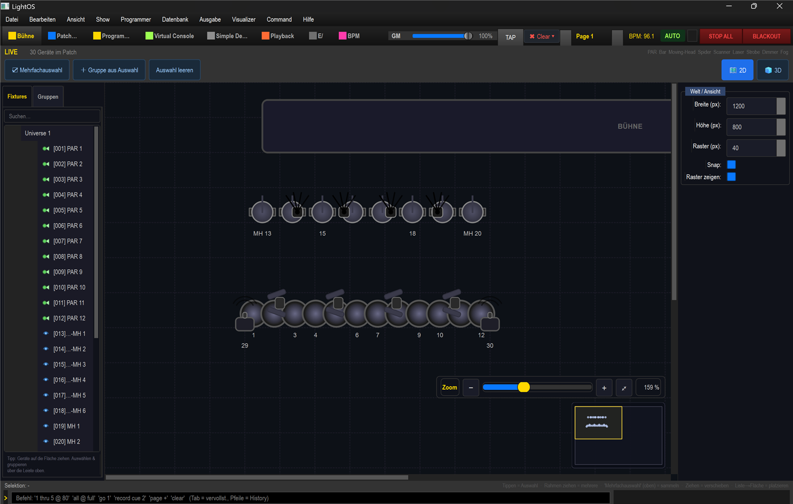
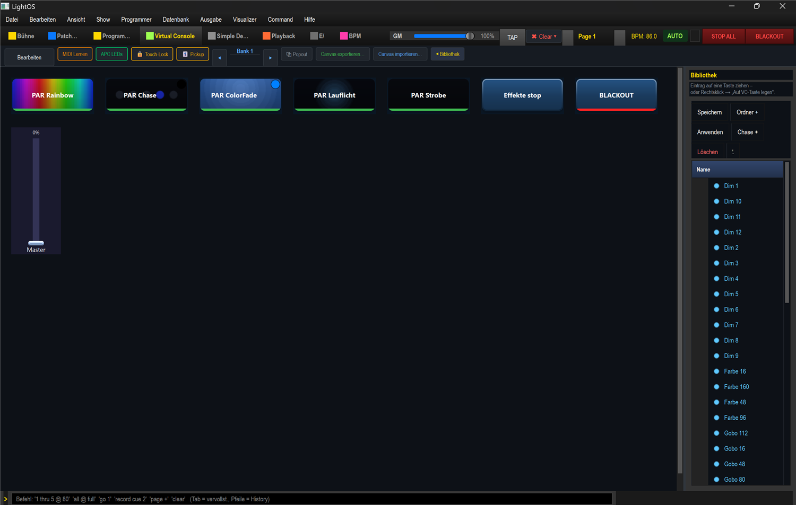
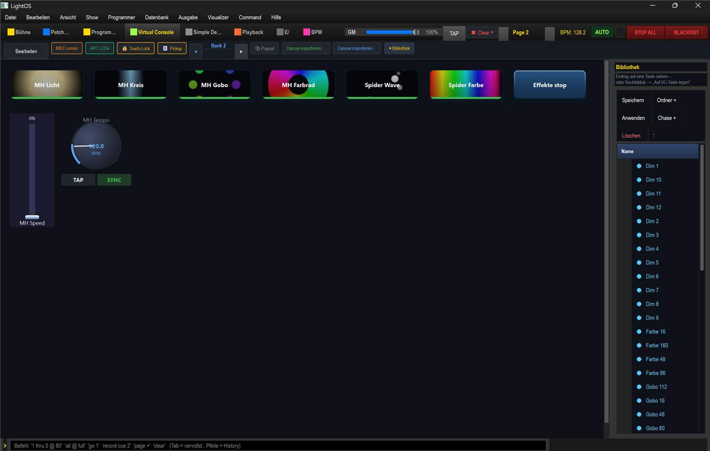
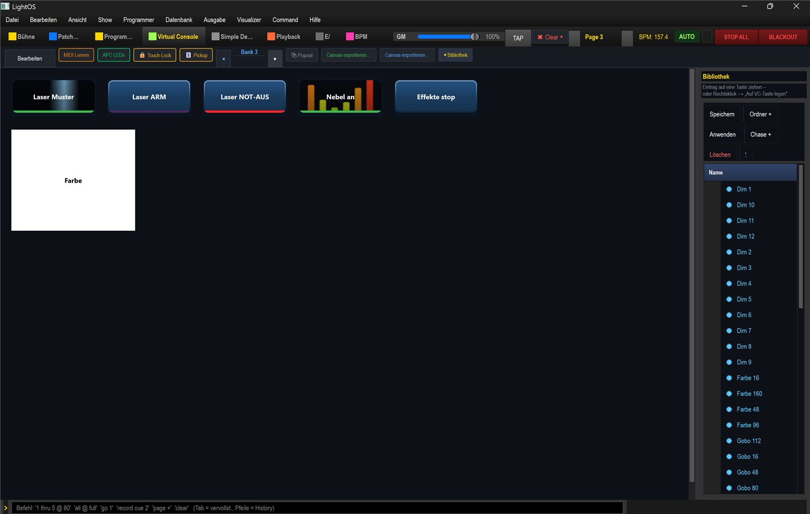
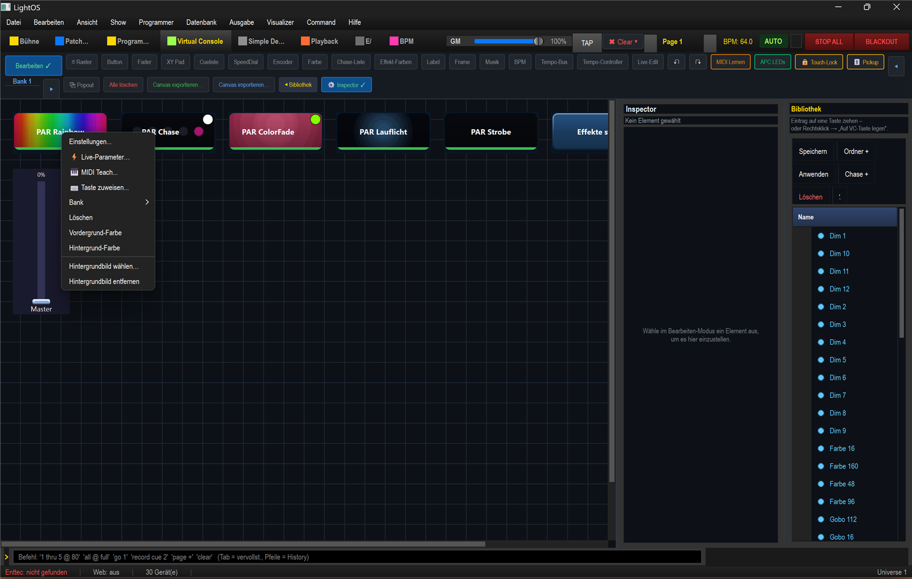
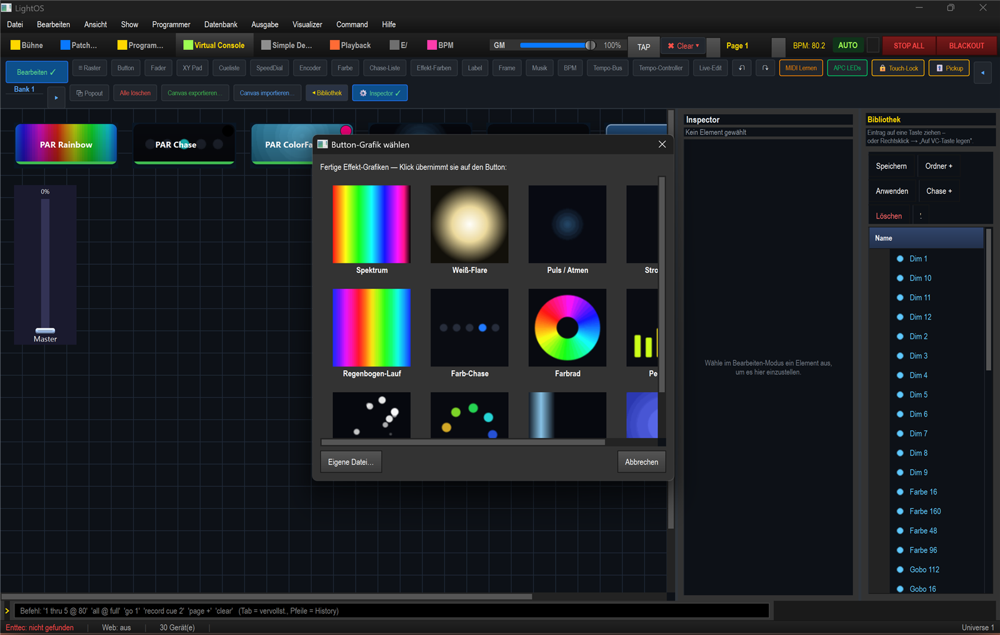
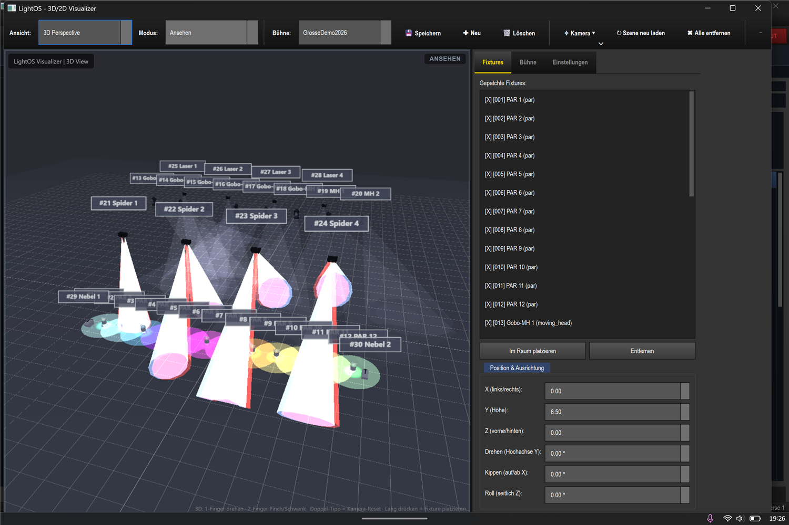

# Grosse Demo Show 2026 — Rundgang & Button-Bilder

Diese Anleitung zeigt die Demo-/Testshow **`shows/Grosse Demo Show 2026.lshow`** und
erklärt Schritt für Schritt, wie du **Bilder/GIFs auf Virtual-Console-Buttons** legst
(die Funktion steckt im Rechtsklick-Kontextmenü — deshalb ist sie leicht zu übersehen).

Die Show wird reproduzierbar per Generator gebaut:
`./venv/Scripts/python.exe tools/build_grosse_demo_show_2026.py`
(validiert + `tools/lint_show.py --strict` = 0 Fehler / 0 Warnungen).

---

## 1. Was drin ist — 30 Fixtures

30 Geräte, damit alle Gerätetypen und der 3D-Visualizer geprüft werden können:

| Anzahl | Gerät | Builtin | Kanäle | Rolle |
|---|---|---|---|---|
| 12 | PAR (RGBW) | `ZQ01424` | 8 | Matrix/Chase/ColorFade/Strobe |
| 6 | Moving Head | `MH16` | 16 | Pan/Tilt-Kreis, Gobo-/Farbrad |
| 2 | Moving Head | `ZQ02001` | 11 | Davids reale MHs |
| 4 | Spider (Multi-Head) | `SPIDER14` | 14 | gespiegelte Tilt-Wave, Farbe pro Kopf (**kein Pan!**) |
| 4 | Laser | `L2600LASER` | 6 | Muster-Scene + Arm/NOT-AUS |
| 2 | Nebel/Hazer | `EURON10` | 1 | Nebel-Scene |

Nach dem Laden zeigt die **Bühne**-Sektion alle 30 Geräte („30 Geräte im Patch"):

> **Hinweis Ausgang:** Der Live-Test lief mit **leerer Output-Config** (Statuszeile
> „Enttec: nicht gefunden") — reiner Visualizer-/UI-Test, es ging **kein DMX** ans
> echte Rig. Die Show ist eine 2-Universen-Visualizer-Demo und passt adress-technisch
> nicht 1:1 auf ein reales 12-Fixture/1-Universum-Rig.

---

## 2. Virtual Console — 3 Bank-Seiten

Die Effekte sind über **drei Bank-Seiten** verteilt (Umschalten mit den Pfeilen
`◄ Bank X ►` oben links). Jeder Effekt-Button trägt eine passende **Galerie-Grafik/GIF**
als Hintergrund (VC-IMG).

**Bank 1 — PARs & Farbe:** Rainbow, Chase, ColorFade, Lauflicht, Strobe, Effekte-Stop, Blackout + Master-Fader.

**Bank 2 — Moving Heads & Spider:** MH Licht, MH Kreis, MH Gobo, MH Farbrad, Spider Wave, Spider Farbe + MH-Speed-Fader & MH-Tempo-Dial.

**Bank 3 — Laser & Nebel:** Laser Muster, **Laser ARM**, **Laser NOT-AUS** (rot), Nebel an, Effekte-Stop + Farb-Picker.

---

## 3. Bilder/GIFs auf einen Button legen  ⭐

Genau **hier** sitzt die Funktion (nicht in einem sichtbaren Feld, sondern im
Kontextmenü):

1. Oben links **Bearbeiten** einschalten (Bearbeiten-Modus).
2. **Rechtsklick** auf den gewünschten VC-Button.
3. Im Kontextmenü unten **„Hintergrundbild wählen…"** wählen (darunter „Hintergrundbild entfernen" zum Löschen).

4. Es öffnet sich die Galerie **„Button-Grafik wählen"** mit fertigen Effekt-Grafiken/GIFs
   (Spektrum, Weiß-Flare, Puls/Atmen, Regenbogen-Lauf, Farb-Chase, Farbrad, Pegel …).
   Ein Klick auf eine Grafik übernimmt sie sofort auf den Button.
5. Für ein **eigenes Bild** unten links **„Eigene Datei…"** wählen (PNG/JPG/**GIF**).

> **Gut zu wissen:**
> - Es gehen **statische Bilder UND animierte GIFs** (rein kosmetisch, kein DMX; der Text bleibt sichtbar).
> - Das Bild wird **portabel in die `.lshow` eingebettet** (content-hash-basiert) — die Show bleibt austauschbar.
> - Im Generator-Skript geht dasselbe direkt: `b.button(..., bg_image="rainbow_scroll")`
>   (gültige Namen u. a.: `spectrum`, `hot_white`, `pulse`, `strobe`, `rainbow_scroll`,
>   `color_chase`, `color_wheel`, `vu_meter`, `sparkle`, `gobo_spin`, `beam_sweep`, `breathe_rgb`).

---

## 4. Effekte im 3D-Visualizer

Effekt-Button antippen (Bearbeiten-Modus **aus**), Master hochziehen — der laufende
Effekt steht in der Statuszeile („Aktiver Effekt: …"). Über **Visualizer → 3D Visualizer öffnen**
zeigt der 3D-Raum das ganze Rig live: weiße MH-Beams, regenbogenfarbene PAR-Bodenpools
(PAR Rainbow), Spider, Laser & Nebel:

---

## Fallen / Merkzettel

- **Modale Dialoge** (z. B. die Bild-Galerie) mit **„Abbrechen"/„X" im Dialog** schließen — nicht per Escape ans Hauptfenster.
- **Spider = nur Tilt, kein Pan:** keine Circle-EFX; die Demo nutzt eine gespiegelte Tilt-Wave und färbt beide Köpfe über beide RGBW-Sätze.
- **Ausgang:** Für einen echten Rig-Test braucht es eine **adress-genaue** Show (Enttec, ein Universum) — die 30-Fixture-Demo ist bewusst eine Visualizer-/Feature-Show.
