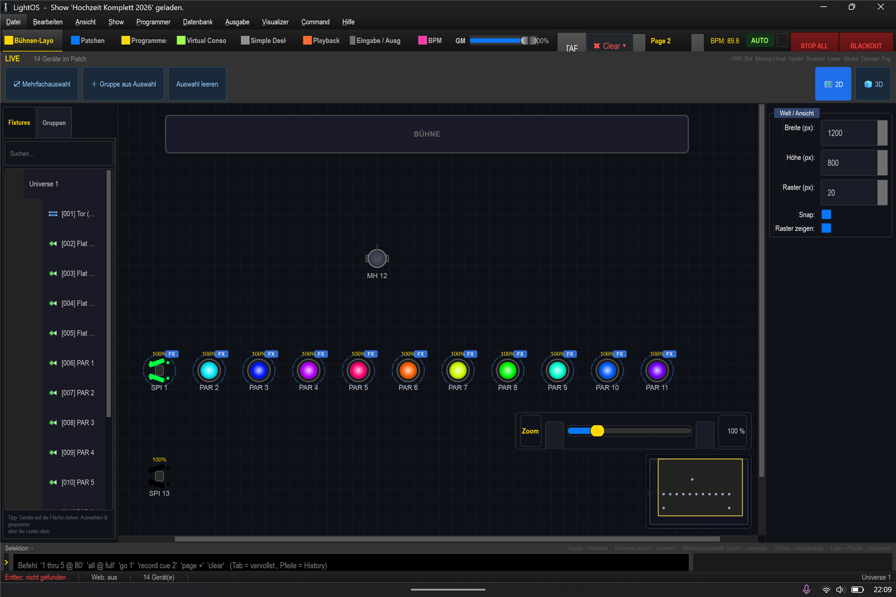

# Hochzeit Komplett 2026 — Anleitungs-Sammlung 💍🎛️

> **Dach-Index.** Diese Show ist eine **Feature-Demo** auf der Fixture-Dichte deiner Hochzeitsshow.
> Sie zeigt **alles**: alle 18 Matrix-Algorithmen, alle 4 Styles (RGB/RGBW/Dimmer/Shutter), alle 10
> Bewegungsfiguren (EFX), alle 19 VC-Widget-Typen — geordnet nach **Effekt-Typ** und **Gerätegruppe**.
>
> **Kern-Idee:** **Farbe = nur Farbe** (Bank 1) · **Dimmer = die Bewegung** (Bank 2) · sie kombinieren
> sich (z. B. grünes Lauflicht) · **pro Gruppe getrennt** (Paarlichter/Spider/Moving Head) · alles **auf den Beat**.

---

## Laden & loslegen
- **Datei → Öffnen** (`Strg+O`) → `shows/Hochzeit_Komplett_2026.lshow`.
  (Fehlt sie: `venv\Scripts\python.exe tools\build_hochzeit_komplett.py` baut sie selbstprüfend neu.)
- Die **6 Bänke** liegen auf der **Virtual Console** (`Strg+4`). Blättern: **`Strg+Bild↓` / `Strg+Bild↑`**.
  Mit **APC mini**: **SCENE-Tasten = Bank 1–6**.

## Das Rig (14 Fixtures, 137 DMX-Kanäle, Universe 1)

| # | Fixture | Mode | Adresse | Gruppe |
|---|---|---|---|---|
| fid 1 | **ADJ Dotz TPar System** „Tor" | 18ch, 4×RGB | 1 | Paarlichter |
| fid 2–5 | **ADJ Flat Par QWH12X** | 8ch RGBW | 19/27/35/43 | Paarlichter |
| fid 6–11 | **Generic ZQ01424** | 8ch RGBW | 51/59/67/75/83/91 | Paarlichter |
| fid 12 | **U-King ZQ02001** Moving Head | 11ch | 99 | Moving Head |
| fid 13–14 | **U-King Spider** | 14ch, Dual-Tilt | 113/127 | Spider |

## Die 6 Bänke

| Bank | Titel | Zeigt | Bild |
|---|---|---|---|
| **1** | Farbeffekte | Farbe je Gruppe (feste Farbe/Farbwechsel/Regenbogen/bunte Looks) + Farb-Kacheln | [Bild](img/bank1_farbe.png) |
| **2** | Dimmereffekte | Bewegung über den Dimmer (Lauflicht/innen→außen/Puls/Welle/…) je Gruppe | [Bild](img/bank2_dimmer.png) |
| **3** | Bewegungen | echte Pan/Tilt-Figuren (Kreis…Custom-Pfad) auf MH + Spider, Gobos, Zielen | [Bild](img/bank3_bewegung.png) |
| **4** | Strobe & Tempo | Stroboskop + BPM + Tempo-Buses (Farbe ×1 / Dimmer ×2, „Sync jetzt") | [Bild](img/bank4_strobe_tempo.png) |
| **5** | Live-Editor | Effekte im Nachhinein regeln (Tempo/Lauflichter/Dichte/Farben) | [Bild](img/bank5_editor.png) |
| **6** | Abläufe & Musik | Chaser, Cuelisten, Collections, Playlist, Auto-Show | [Bild](img/bank6_ablaeufe.png) |

Die **universelle Leiste** (unten, immer sichtbar): Clear · Stop All · Blackout · Tap · ◀ Lied · ▶/⏸ · Lied ▶ · Musik-BPM,
dazu die Fader **Dimmer (F6)** · **Speed (F7)** · **Master (F9)**.

## 📖 Minianleitungen (kinderleicht, Schritt für Schritt)

| Thema | Anleitung |
|---|---|
| 💚 **Grünes Lauflicht** (Farbe + Dimmer kombinieren) — *mit GIF* | [öffnen](mini_gruenes_lauflicht/ANLEITUNG.md) |
| 🔴🔵🟢 Farbe **pro Gruppe** (PARs rot · Spider blau · MH grün) | [öffnen](mini_farbe_pro_gruppe/ANLEITUNG.md) |
| 🌈 Alle **Farb-Muster** | [öffnen](mini_farb_muster/ANLEITUNG.md) |
| 🌊 Alle **Dimmer-Bewegungen** | [öffnen](mini_dimmer_bewegungen/ANLEITUNG.md) |
| 🔄 **Bewegung** (Moving Head & Spider, EFX) | [öffnen](mini_bewegung_efx/ANLEITUNG.md) |
| ⚡🥁 **Strobe & Tempo/BPM** (auf den Beat) | [öffnen](mini_strobe_tempo/ANLEITUNG.md) |
| 🎚️ **Live-Editor** (Effekt im Nachhinein regeln) | [öffnen](mini_live_editor/ANLEITUNG.md) |
| ▶️ **Abläufe** (Chaser · Cuelisten · Collections) | [öffnen](mini_ablaeufe/ANLEITUNG.md) |
| 🎵 **Musik & Auto-Show** | [öffnen](mini_musik_autoshow/ANLEITUNG.md) |

## Empfohlener Lernpfad
1. **[Grünes Lauflicht](mini_gruenes_lauflicht/ANLEITUNG.md)** — das Grundprinzip (Farbe + Dimmer).
2. **[Farb-Muster](mini_farb_muster/ANLEITUNG.md)** + **[Farbe pro Gruppe](mini_farbe_pro_gruppe/ANLEITUNG.md)** — die Farb-Seite.
3. **[Dimmer-Bewegungen](mini_dimmer_bewegungen/ANLEITUNG.md)** — die Bewegungs-Seite.
4. **[Bewegung MH/Spider](mini_bewegung_efx/ANLEITUNG.md)** + **[Strobe & Tempo](mini_strobe_tempo/ANLEITUNG.md)**.
5. **[Live-Editor](mini_live_editor/ANLEITUNG.md)** + **[Abläufe](mini_ablaeufe/ANLEITUNG.md)** + **[Musik](mini_musik_autoshow/ANLEITUNG.md)**.

---

*Die Show ist selbstprüfend: ein Assert-Gate im Generator + `tests/test_hochzeit_komplett_show.py`
(15 Tests) erzwingen die volle Abdeckung und das Kompositions-Modell (Farbe/Dimmer getrennt, pro Gruppe, Tempo-gekoppelt).*
