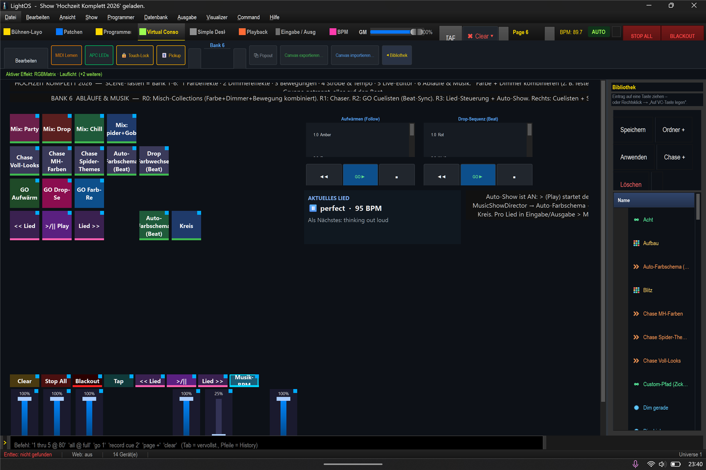

# Mini-Anleitung: Abläufe (Chaser · Cuelisten · Collections) ▶️

> **Lernziel:** Mehrere Szenen/Effekte **nacheinander** oder **zusammen** abspielen — für ganze Show-Teile.
> Show: `Hochzeit_Komplett_2026.lshow`, **Bank 6 (Abläufe & Musik)** (`Strg+4` → Bank 6).

---

### Reihe 1 — Misch-Collections (alles auf einen Tipp)
**Mix: Party / Drop / Chill / Spider+Gobo** — jede Kachel startet **mehrere** Effekte gleichzeitig
(Farbe + Dimmer + Bewegung) als fertigen Moment. Eine Kachel = ein kompletter Look.

### Reihe 2 — Chaser (Schritt für Schritt)
**Chase Voll-Looks / MH-Farben / Spider-Themes / Auto-Farbschema / Drop** — spielen eine **Liste von
Szenen** nacheinander ab (mit Überblendung). „Auto-Farbschema" und „Drop" laufen **auf den Beat**.

### Reihe 3 — GO Cuelisten (geplante Abfolge)
**GO Aufwärmen / Drop-Sequenz / Farb-Reise** — starten eine **Cueliste**: definierte Schritte (Cues)
mit Fade-Zeiten. „Aufwärmen" läuft mit **Auto-Follow** weiter, „Drop"/„Farb-Reise" springen **auf den Beat**.
Rechts siehst du die Cueliste mit ihren Schritten.

---

### Schritt-für-Schritt (Beispiel: Party-Moment)
1. **Bank 6** → **„Mix: Party"** → Regenbogen-Farbe + Lauflicht + Kreis-Bewegung starten gemeinsam.
2. Reicht das nicht? **„GO Drop-Sequenz"** dazu → harte Farbwechsel auf den Beat.
3. Beenden: oben **„Stop All"** (universelle Leiste) oder die Kachel erneut tippen.

### Begriffe kurz
- **Szene** = ein fester Licht-Zustand. **Chaser** = Szenen nacheinander. **Collection** = mehrere Effekte zusammen.
- **Cueliste** = geplante Abfolge mit Fades (GO = nächster Schritt). **Beat-Sync** = springt auf den Musik-Takt.
