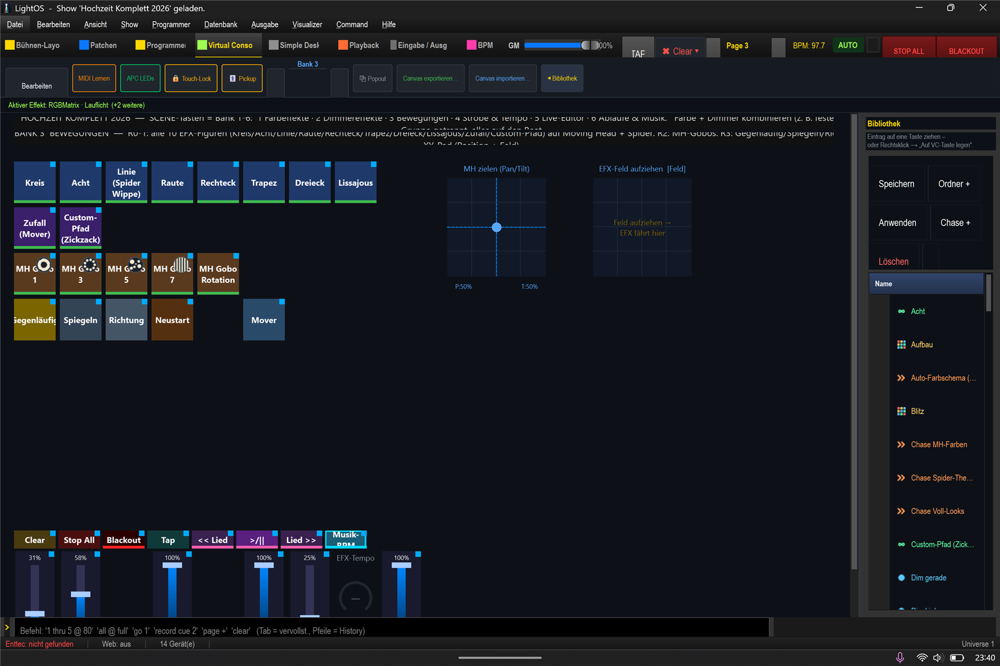

# Mini-Anleitung: Bewegung (Moving Head & Spider) 🔄

> **Lernziel:** Echte **Pan/Tilt-Bewegung** auf Moving Head + Spider — Figuren wie Kreis, Acht, Linie.
> (Das ist die *physische* Bewegung der Köpfe — **nicht** das Dimmer-Lauflicht aus Bank 2.)
> Show: `Hochzeit_Komplett_2026.lshow`, **Bank 3 (Bewegungen)** (`Strg+4` → `Strg+Bild↓` bis Bank 3).

---

### Die 10 Figuren (Reihe 1–2)
Tippe eine an — Moving Head + Spider fahren die Figur (Strahl geht automatisch auf):

**Kreis · Acht · Linie · Raute · Rechteck · Trapez · Dreieck · Lissajous · Zufall · Custom-Pfad**

> Die **Spider** haben nur Tilt (kein Pan) → bei ihnen wirken die Figuren als Auf/Ab-Wippen.
> Der **Custom-Pfad** („Zickzack") ist eine selbst gezeichnete Bahn.

### Form anpassen (Reihe 4)
- **Gegenläufig** — die Köpfe laufen in entgegengesetzte Richtung.
- **Spiegeln** — gespiegelte Figur.
- **Richtung** — vorwärts/rückwärts.
- **Neustart** — Figur neu auf die Eins setzen.

### Gobos (Reihe 3)
**MH Gobo 1/3/5/7 + Gobo-Rotation** — Muster im Moving-Head-Strahl (mit Farbe kombinierbar).

### Rechts: XY-Pad
- **„MH zielen (Pan/Tilt)"** — den Moving Head **per Hand** irgendwohin richten (Punkt ziehen).
- **„EFX-Feld aufziehen"** — ein Rechteck ziehen = Bereich/Zentrum der Figur setzen.

---

### Schritt-für-Schritt (Beispiel: fächernder Kreis)
1. **Bank 3** → **„Kreis"** antippen. → MH + Spider fahren einen Kreis.
2. **„Gegenläufig"** antippen → sie laufen auseinander (Fächer-Effekt).
3. Tempo: Fader **„Mover-Speed"**, Größe: Fader **„Mover-Größe"** (oder Encoder „EFX-Tempo").
4. Dazu Farbe: **„MH Grün"** (Bank 1) bzw. Spider-Farbe → bunte Bewegung.

### Sofort weiterprobieren
- **Zielen:** XY-Pad „MH zielen" → den Kopf gezielt auf einen Punkt (z. B. Brautpaar) richten.
- **Eigene Bahn:** „Custom-Pfad" zeigt, wie eine gezeichnete Bahn aussieht (im EFX-Editor zeichenbar).
- **Auf den Beat:** Bewegungen lassen sich (wie Farbe/Dimmer) an den Tempo-Bus koppeln (Bank 4).
