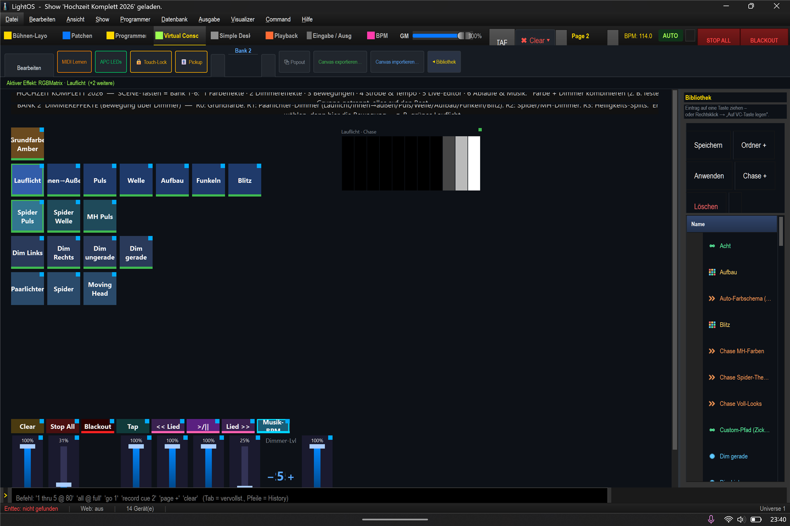

# Mini-Anleitung: Dimmer-Bewegungen 🌊💡

> **Lernziel:** Über den **Dimmer** Bewegung ins Licht bringen — **ohne die Farbe zu ändern**.
> Der Dimmer bestimmt, **welche Lampen wann hell sind**; die Farbe kommt aus **Bank 1**.
> Show: `Hochzeit_Komplett_2026.lshow`, **Bank 2 (Dimmereffekte)** (`Strg+4` → `Strg+Bild↓` bis Bank 2).

> **Wichtig:** Ein Dimmer-Effekt allein zeigt nur dann etwas, wenn die Lampen **Farbe** haben.
> Also **erst in Bank 1 eine Farbe** wählen (oder die Kachel **„Grundfarbe"** oben links in Bank 2), **dann** hier eine Bewegung.

---

### Die 7 Paarlichter-Bewegungen (Reihe 1)
Tippe eine an — sie läuft sofort über die gewählte Farbe:

| Kachel | Was passiert |
|---|---|
| **Lauflicht** | Eine Lampe nach der anderen geht an (Läufer wandert durch). |
| **Innen→Außen** | Von der Mitte nach außen aufgehen. |
| **Puls** | Alle Lampen atmen gemeinsam heller/dunkler. |
| **Welle** | Eine Helligkeitswelle wandert durch die Reihe. |
| **Aufbau** | Reihe füllt sich nacheinander auf, dann zurück. |
| **Funkeln** | Zufällige Lampen blitzen kurz auf (Sparkle). |
| **Blitz** | Alle zusammen schnell an/aus (Stroboskop über den Dimmer). |

### Spider & Moving Head (Reihe 2)
**Spider Puls**, **Spider Welle**, **MH Puls** — dieselben Bewegungen getrennt für die anderen Gruppen.

### Helligkeits-Splits (Reihe 3)
**Dim Links / Dim Rechts / Dim ungerade / Dim gerade** — feste Hälften/Muster zum schnellen Aufteilen.

---

### Schritt-für-Schritt (Beispiel: pulsierendes Warmweiß)
1. **Bank 1** → **„Feste Farbe"** → eine Farb-Kachel (z. B. **Orange**). Alle Paarlichter orange.
2. **Bank 2** → **„Puls"**. → Das Orange atmet jetzt.
3. Tempo: rechts der Fader **„Dimmer-Tempo"** oder global auf den Beat (Bank 4).

### Warum das funktioniert
Dimmer-Effekte schreiben **nur den Dimmerkanal** — die Farbkanäle (aus Bank 1) bleiben unberührt.
Beide Schichten kombinieren sich automatisch. Darum kannst du jede Farbe mit jeder Bewegung mischen.

### Sofort weiterprobieren
- **Pro Gruppe verschieden:** Paarlichter „Lauflicht" + Spider „Puls" gleichzeitig (eigene Kacheln).
- **Tempo koppeln:** in **Bank 4** läuft der Dimmer **doppelt so schnell** wie der Farbwechsel, beide auf demselben Taktschlag (Bus A, „Sync jetzt").
- **Regler:** **„Dimmer-Master"** (Gesamthelligkeit der Bewegung), **„Dimmer-Lvl"** (Stepper, Mindesthelligkeit).
