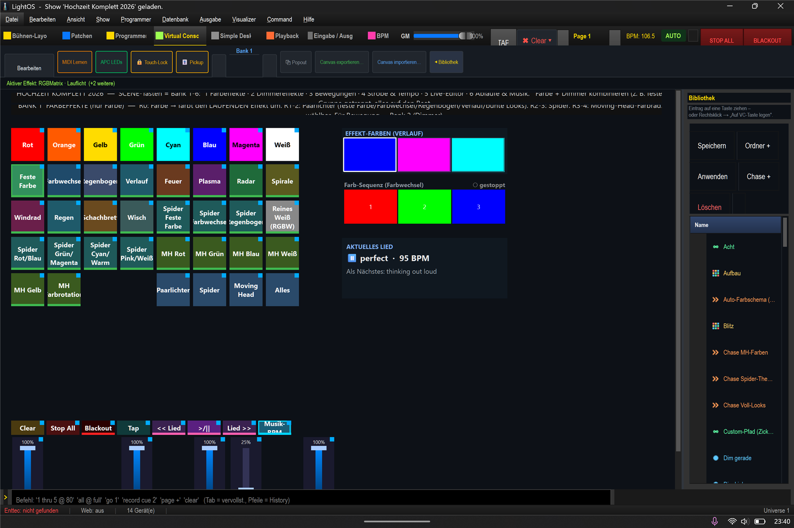

# Mini-Anleitung: Alle Farb-Muster 🌈

> **Lernziel:** Die Farb-Muster der Paarlichter kennenlernen — von „eine Farbe" bis „bunte Looks".
> Show: `Hochzeit_Komplett_2026.lshow`, **Bank 1 (Farbeffekte)** (`Strg+4` → Bank 1).
> Alle Muster schreiben **nur Farbe** (Bewegung kommt aus Bank 2).

---

### Die Grund-Muster (recolorbar)
Erst das Muster antippen, dann oben eine **Farb-Kachel** → das Muster nimmt die Farbe an.

| Muster | Was es macht |
|---|---|
| **Feste Farbe** | Alle Paarlichter in **einer** Farbe (die du oben tippst). |
| **Farbwechsel** | Alle wechseln gemeinsam die Farbe (auf den Beat). |
| **Regenbogen** | Regenbogen läuft über die Reihe (jede Lampe ein anderer Farbton). *Erzeugt eigene Farbtöne — nicht per Farb-Kachel umfärbbar.* |
| **Verlauf** | Sanfter Farbverlauf über die Reihe. |

### Die bunten Looks (eigene Optik)
**Feuer · Plasma · Radar · Spirale · Windrad · Regen · Schachbrett · Wisch** —
fertige bewegte Farbtexturen. Auch sie lassen sich mit einer Farb-Kachel umfärben (soweit sinnvoll).

### Die Farb-Kacheln (oberste Reihe)
**Rot · Orange · Gelb · Grün · Cyan · Blau · Magenta · Weiß** — färben immer den **gerade laufenden**
Effekt um. (Tipp: läuft kein Effekt, passiert nichts — erst ein Muster starten.)

### Rechts
- **Effekt-Farben (Verlauf)** — die Farben des Verlaufs direkt bearbeiten.
- **Farb-Sequenz (Farbwechsel)** — die Liste der Wechsel-Farben anpassen.
- **Reines Weiß (RGBW)** — echtes Weiß über den **Weiß-Chip** (Flat-Par/PAR/Spider), nicht aus R+G+B gemischt.

---

### Schritt-für-Schritt (Beispiel: blauer Regenbogen-Look)
1. **Bank 1** → **„Regenbogen"** antippen → Regenbogen läuft über die Paarlichter.
2. Gefällt der Look? Dann mit **Bank 2 → „Lauflicht"** kombinieren → die Lampen gehen nacheinander an, jede in ihrer Regenbogenfarbe.

### Sofort weiterprobieren
- **Pro Gruppe:** dieselben Muster gibt es für **Spider** (RGBW) und als **Farbrad** für den **Moving Head**.
- **Auf den Beat:** „Farbwechsel" + „Sync jetzt" (Bank 4) → die Farbe springt sauber auf den Takt.
