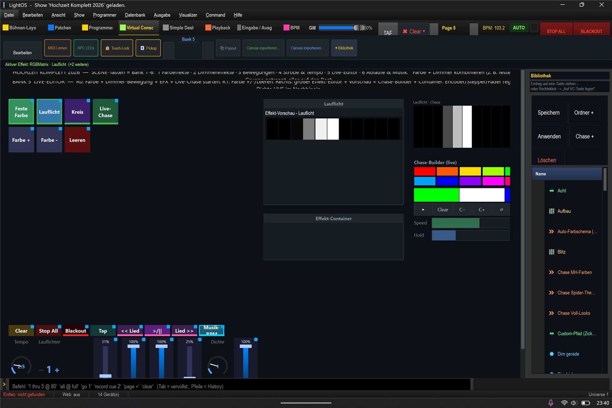

# Mini-Anleitung: Live-Editor 🎚️

> **Lernziel:** Einen laufenden Effekt **im Nachhinein** anpassen — Tempo, Lauflicht-Anzahl, Dichte,
> Farben — ohne ihn neu zu bauen. Show: `Hochzeit_Komplett_2026.lshow`, **Bank 5 (Live-Editor)**.

---

### Schritt-für-Schritt
1. **Bank 5** → in Reihe 1 einen Effekt starten: **„Feste Farbe"**, **„Lauflicht"**, **„Kreis"** oder **„Live-Chase"**.
2. Rechts erscheint der **große Effekt-Editor** mit **Live-Vorschau** — hier siehst du den Effekt klein laufen.
3. Unten die Regler ändern den Effekt **sofort**:
   - **Encoder „Tempo"** — schneller/langsamer.
   - **Stepper „Lauflichter"** — wie viele Läufer gleichzeitig (1 → mehrere).
   - **Encoder „Dichte"** — z. B. wie dicht die Welle ist.
   - **Fader „Effekt-Tempo" / „Effekt-Helligkeit"** — Gesamttempo/-helligkeit.
4. **Chase-Builder** (rechts): beim **Live-Chase** Farben hinzufügen/entfernen — **Farbe +/- / Leeren** (Reihe 2).

### Warum das praktisch ist
Du musst einen Effekt nicht löschen und neu anlegen — du **drehst live** an seinen Parametern, während er
läuft (auch während der Show). Der **Effekt-Container** (Frame) rechts unten bündelt einen Effekt optisch.

### Sofort weiterprobieren
- **Live-Chase bauen:** „Live-Chase" starten → mit **Farbe +** mehrere Farben sammeln → fertig ist ein eigener Farb-Chase.
- **Lauflicht verdichten:** „Lauflicht" starten → Stepper **„Lauflichter"** auf 3 → drei Läufer gleichzeitig.
