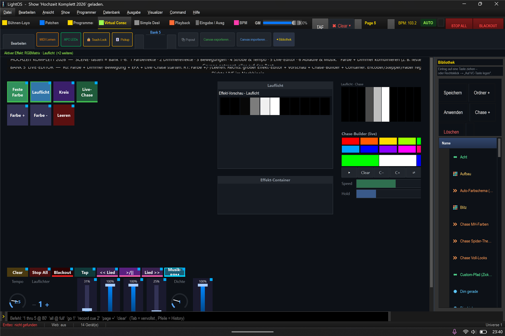

# Mini-Anleitung: Live-Editor 🎚️

> **Lernziel:** Einen laufenden Effekt **im Nachhinein** anpassen — Tempo, Lauflicht-Anzahl, Dichte,
> Farben — ohne ihn neu zu bauen. Show: `Hochzeit_Komplett_2026.lshow`, **Bank 5 (Live-Editor)**.

---

### Schritt-für-Schritt
1. **Bank 5** → in Reihe 1 einen Effekt starten: **„Feste Farbe"**, **„Lauflicht"**, **„Kreis"** oder **„Live-Chase"**.
2. Rechts stehen der **große Effekt-Editor** und die **Live-Vorschau** — beide fest für das **„Lauflicht“**.
3. Unten die Regler ändern den Effekt **sofort**:
   - **Encoder „Tempo“** — Eigengeschwindigkeit; wirkt nicht, solange das Lauflicht am laufenden Bus A hängt.
   - **Stepper „Lauflichter"** — wie viele Läufer gleichzeitig (1 → mehrere).
   - **Encoder „Dichte"** — z. B. wie dicht die Welle ist.
   - **Fader „Effekt-Tempo“ / „Effekt-Helligk.“** — Tempo (gleiche Einschränkung wie oben) bzw. Helligkeit.
4. **Live-Chase:** **„Farbe +“/„Farbe -“** (Reihe 2) springen zur nächsten/vorigen Farbe der Folge,
   **„Leeren“** leert sie. Eine Farbliste zeigt Bank 5 nicht (die einzige steht in Bank 1); Farben
   hinzufügen geht über Bank 5 derzeit nicht — der frühere Chase-Builder ist seit dem 2026-06-30 nicht
   mehr Teil der Oberfläche.

### Warum das praktisch ist
Du musst einen Effekt nicht löschen und neu anlegen — du **drehst live** an seinen Parametern, während er
läuft (auch während der Show). Der **Effekt-Container** (Frame) rechts unten bündelt einen Effekt optisch.

### Sofort weiterprobieren
- **Live-Chase:** „Live-Chase“ starten → mit **Farbe +/-** durch die Folge blättern.
- **Lauflicht verdichten:** „Lauflicht" starten → Stepper **„Lauflichter"** auf 3 → drei Läufer gleichzeitig.
