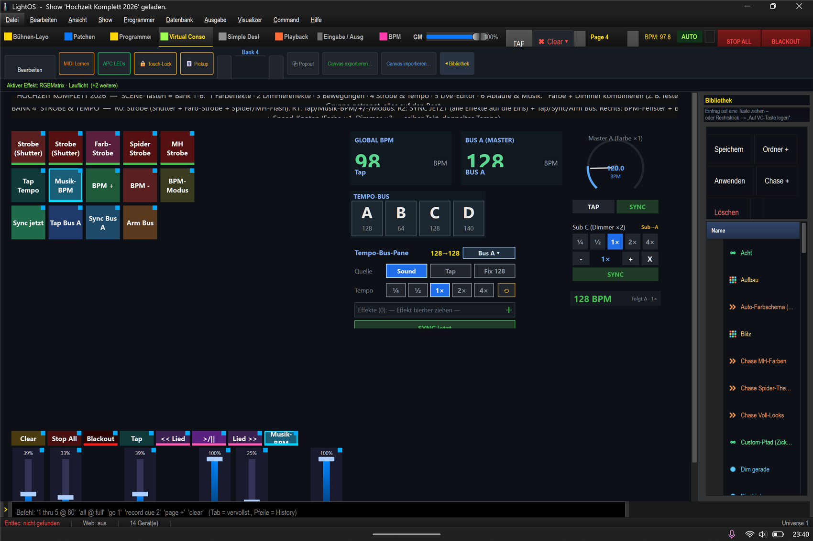

# Mini-Anleitung: Strobe & Tempo/BPM ⚡🥁

> **Lernziel:** Stroboskop auslösen **und** alle Effekte **auf den Beat** bringen — sogar mit
> verschiedenen Tempi (Farbe ×1, Dimmer ×2), die trotzdem **auf demselben Taktschlag** beginnen.
> Show: `Hochzeit_Komplett_2026.lshow`, **Bank 4 (Strobe & Tempo)** (`Strg+4` → `Strg+Bild↓` bis Bank 4).

---

### Strobe (Reihe 1)
- **Strobe (Shutter)** — echtes Stroboskop über den Shutter-Kanal (an/aus toggeln).
- **Strobe-Flash** (daneben) — **gehalten = an**, loslassen = aus (für kurze Bursts).
- **Farb-Strobe** — Blitzen über die Farbkanäle.
- **Spider-Flash / MH-Flash** — Stroboskop nur für Spider bzw. Moving Head (gehalten).

### BPM einstellen (Reihe 2)
- **Tap Tempo** — mehrfach im Takt tippen → BPM wird gemessen.
- **Musik-BPM** — übernimmt die BPM aus der laufenden Musik (PC-Audio).
- **BPM +/-** — fein nachregeln. **BPM-Modus** — Auto/Manuell umschalten.

### Auf den Beat bringen (Reihe 3)
- **„Sync jetzt"** — setzt **alle** laufenden Effekte gemeinsam auf die nächste Eins (phasengleich).
- **Tap/Sync/Arm Bus A** — den Tempo-Bus A tippen/synchronisieren/scharf schalten.

### Rechts: die Tempo-Fenster
- **GLOBAL BPM** + **BUS A** — die aktuelle BPM groß ablesen (Beat-Blink).
- **Tempo-Bus** (Auswahl A/B/C/D) + **Tempo-Bus-Panel A** — der Bus, an dem die Effekte hängen.
- **Master A (Farbe ×1)** und **Sub C (Dimmer ×2)** — die Speed-Knoten: die Farbe läuft im Grundtakt,
  der Dimmer **doppelt so schnell** — beide bleiben **phasengleich** (gleicher Taktschlag).

---

### Warum „verschiedene Tempi, gleicher Takt"?
Alle Farb- und Dimmer-Effekte hängen an **Bus A** und teilen eine **sync_group**. Der Bus gibt den
Beat vor; jeder Effekt hat einen **Multiplikator** (Farbe ×1, Dimmer ×2). Dadurch starten sie zusammen
auf der Eins und bleiben gekoppelt — der Dimmer macht nur doppelt so viele Schritte pro Takt.

### Sofort weiterprobieren
1. **Musik-BPM** tippen (oder **Tap Tempo** im Takt) → die BPM oben rechts springt auf den Wert.
2. Ein paar Effekte starten (Bank 1 Farbwechsel + Bank 2 Lauflicht).
3. **„Sync jetzt"** → alles schnappt auf die Eins. Der Dimmer läuft sichtbar doppelt so schnell wie der Farbwechsel.
4. **Fader „BPM global"** schieben → das ganze Set wird schneller/langsamer, bleibt aber synchron.
