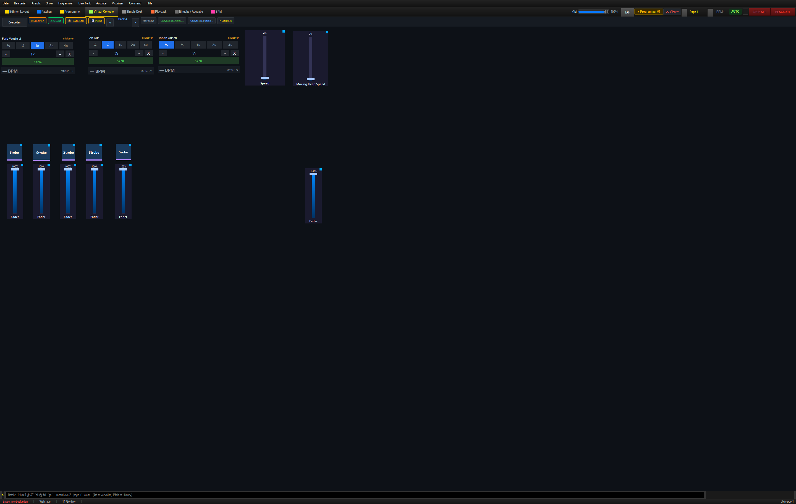
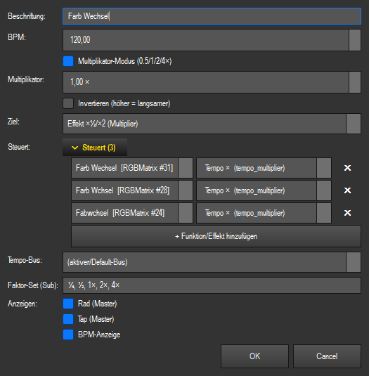
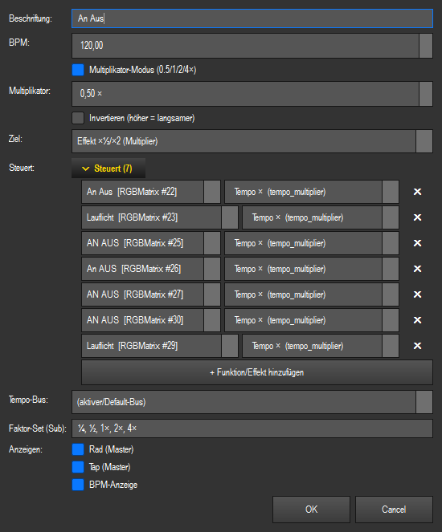
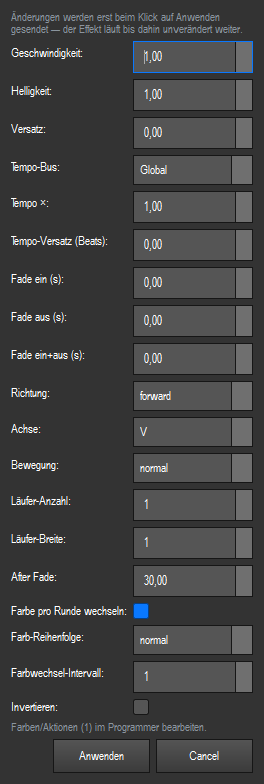
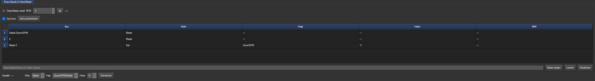
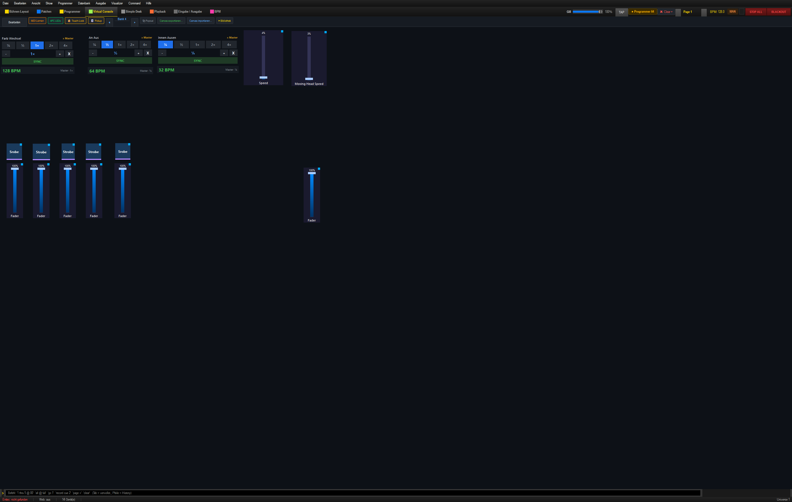

# Hochzeit-Show: Farbwechsel und Dimmer taktgleich starten

Diese Anleitung gilt für `shows/hochzeit.lshow`. Auf **Bank 4** bleiben Farbwechsel und
Dimmer unterschiedlich schnell einstellbar, beginnen ihre Zyklen aber auf demselben
Taktschlag.

## Was bereits eingerichtet ist

Die beiden wichtigen Multiplikator-Fenster sind:

| Fenster | Gekoppelte Effekte |
|---|---|
| **Farb Wechsel** | `Back Ground/Faben – Farb Wechsel`, `Led Bar/Farbe – Farb Wchsel`, `Strahler/Faben – Fabwchsel` |
| **An Aus** | sieben Dimmer-Effekte: An/Aus und Lauflicht von Strahlern, Spider, Moving Heads, LED-Bar und Hintergrund |

Alle zehn Effekte sind bereits auf denselben **Tempo-Bus Global** gelegt. Ihr
**Tempo-Versatz** steht auf `0`, und **Auto-Sync** ist in der Show eingeschaltet.

## 1. Zielgruppen auf Bank 4 kontrollieren

1. **Virtuelle Konsole → Bank 4** öffnen.
2. **Bearbeiten** einschalten.
3. Rechtsklick auf **Farb Wechsel** → **Einstellungen…**.
4. Unter **Steuert (3)** müssen die drei Farbeffekte stehen.

Danach Rechtsklick auf **An Aus** → **Einstellungen…**. Unter **Steuert (7)** müssen
die sieben Dimmer-Effekte stehen.

Bei beiden Fenstern muss **Ziel: Effekt ×½/×2 (Multiplier)** eingestellt sein.

## 2. Gemeinsamen Takt eines Effekts kontrollieren

Für eine neue oder nachträglich ergänzte Funktion:

1. Im **Programmer** den Matrix- oder Bewegungseffekt öffnen.
2. In **Tempo & Blende** bzw. **Tempo & Richtung** folgende Werte setzen:
   - **Tempo-Bus:** `Global`
   - **Tempo-Versatz (Beats):** `0,00`
   - **Tempo ×:** gewünschter Startfaktor, normalerweise `1,00`
3. Den Effekt mit **Speichern** dauerhaft übernehmen.

Neue Effekte beginnen bereits mit diesen sicheren Standardwerten. Nur für einen
bewusst unabhängigen Effekt wählst du **Frei (nicht taktgebunden)**.

Alternativ kann der Bus weiterhin über **⚡ Live-Parameter…** kontrolliert werden.
Entscheidend ist der Bus am Effekt selbst. Das Tempo-Bus-Feld im SpeedDial-Dialog
weist den Ziel-Effekten nicht automatisch einen Bus zu.

## 3. Gemeinsame Phase aktivieren

1. Den **BPM-Tab** öffnen, am schnellsten mit **Strg+8**.
2. Im Panel **Tempo-Speeds & Grand-Master** **Auto-Sync** eingeschaltet lassen.
3. Wenn Effekte bereits laufen oder verrutscht wirken, einmal
   **Jetzt synchronisieren** drücken.

`Auto-Sync` sorgt dafür, dass später eingeschaltete Effekte in das gemeinsame Raster
einsteigen. `Jetzt synchronisieren` setzt alle bereits laufenden busgekoppelten Effekte
gemeinsam auf eine neue Eins.

## 4. Unterschiedliche Geschwindigkeiten wählen

Auf Bank 4 wählst du anschließend unabhängig voneinander:

- **Farb Wechsel:** beispielsweise `1×`
- **An Aus:** beispielsweise `½`

Bei einer Master-BPM von 128 läuft der Farbwechsel dann mit 128 BPM und der Dimmer mit
64 BPM. Beide beginnen trotzdem auf derselben Eins.

Die Faktoren `¼`, `½`, `1×`, `2×` und `4×` dürfen jederzeit geändert werden. Sie ändern
nur das Geschwindigkeitsverhältnis, nicht den gemeinsamen Taktursprung.

## Wenn etwas nicht synchron läuft

1. Beim betroffenen Effekt **Tempo-Bus = Global** prüfen.
2. **Tempo-Versatz = 0,00** prüfen.
3. **Auto-Sync** einschalten.
4. **Jetzt synchronisieren** drücken.
5. Im Bank-4-SpeedDial prüfen, ob der Effekt wirklich unter **Steuert** aufgeführt ist.
