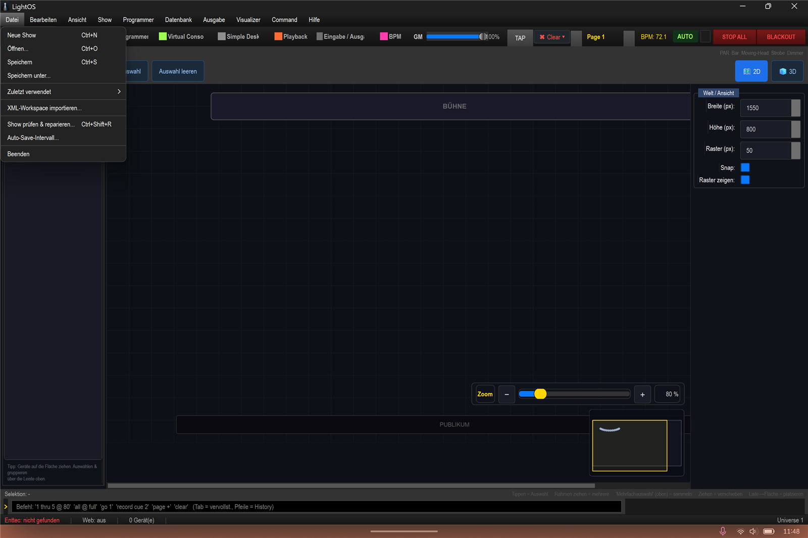
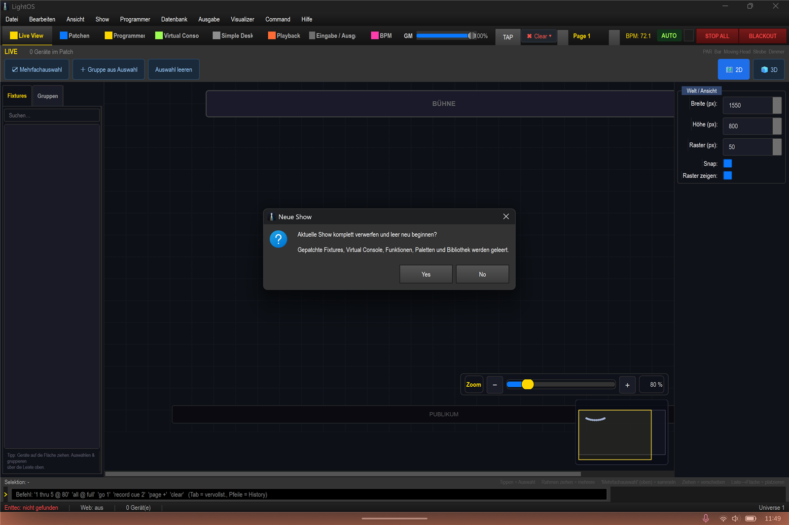
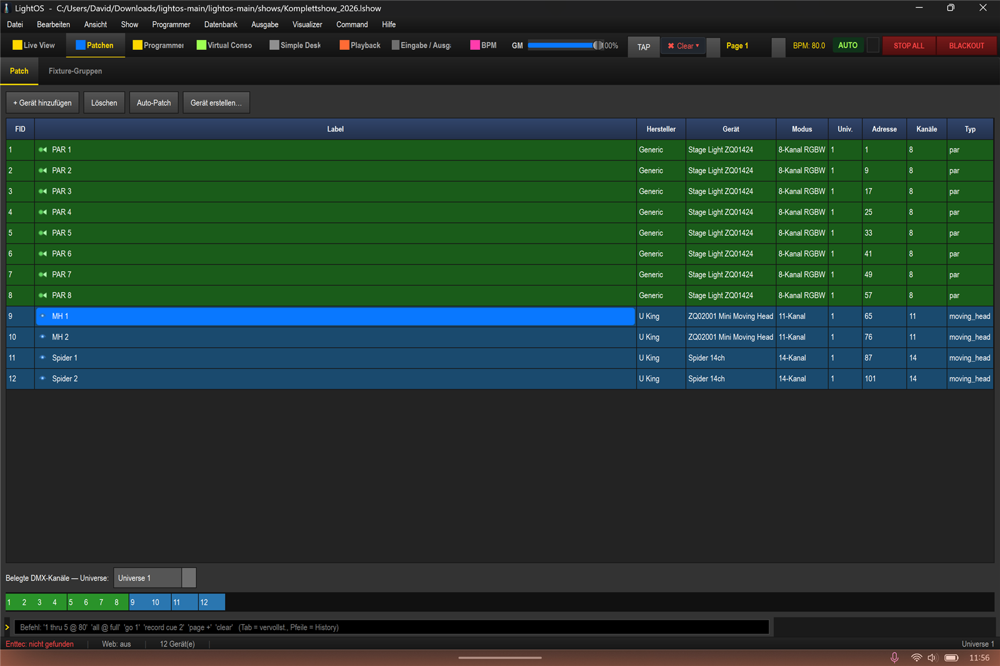

# Neue Show anlegen & benennen

In dieser Anleitung lernst du, wie du in LightOS eine leere Show anlegst und sie unter dem Namen `Komplettshow_2026` im Ordner `shows` speicherst (`shows/Komplettshow_2026.lshow`).

1. Öffne das Menü **Datei** und wähle den Eintrag **Neue Show** (Tastenkürzel: `Ctrl+N`).

2. Bestätige den Dialog **„Aktuelle Show komplett verwerfen und leer neu beginnen?"** mit **Yes**. Dadurch werden gepatchte Fixtures, Virtual Console, Funktionen, Paletten und Bibliothek geleert.

3. Nach dem Aufbau deiner Show öffnest du **Datei** → **Speichern unter…**, wechselst in den Ordner **shows**, gibst als Dateiname **Komplettshow_2026** ein und klickst auf **Speichern**.

4. Kontrolliere die **Titelleiste**: Dort erscheint nun der vollständige Pfad zur gespeicherten Datei (mit Präfix `LightOS  -  `).

## Tipps / Fallen

- Speichere zwischendurch oft mit `Strg+S`, damit keine Arbeit verloren geht.
