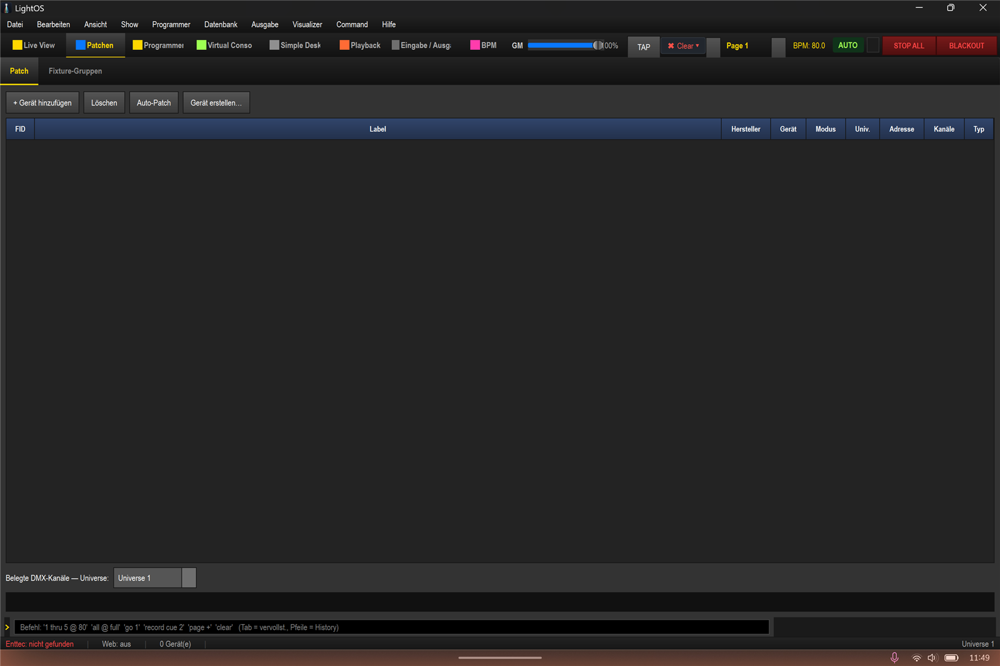
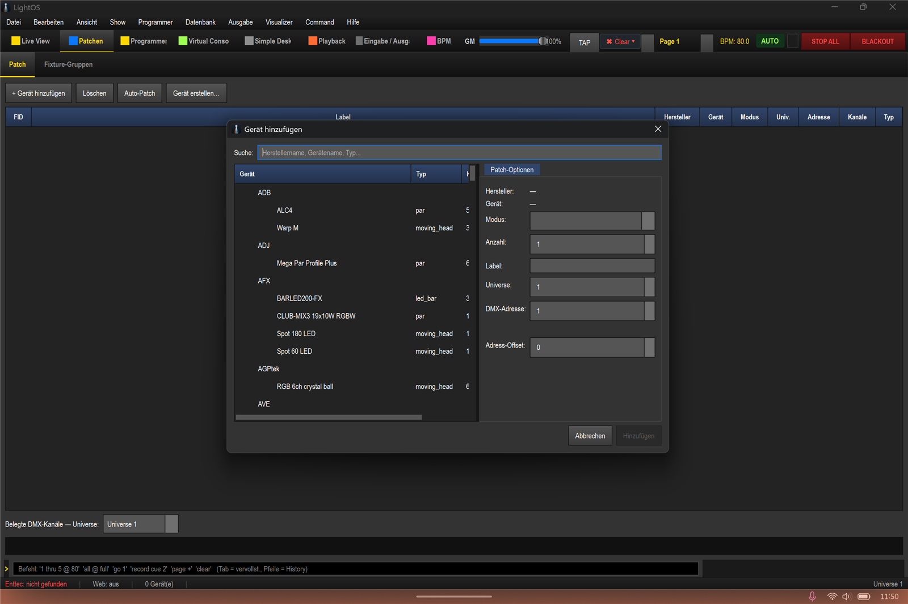
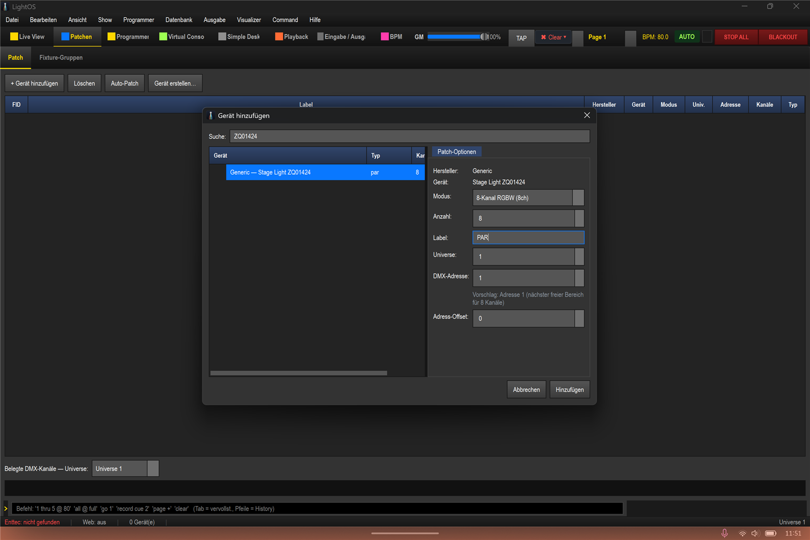
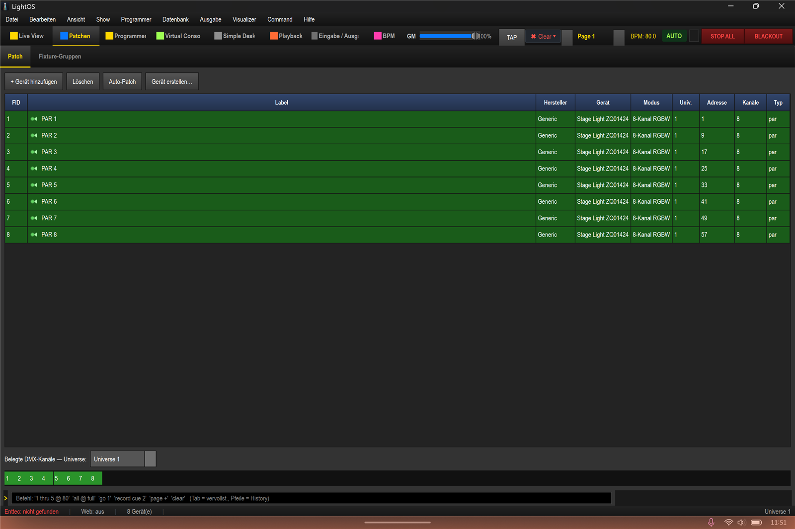
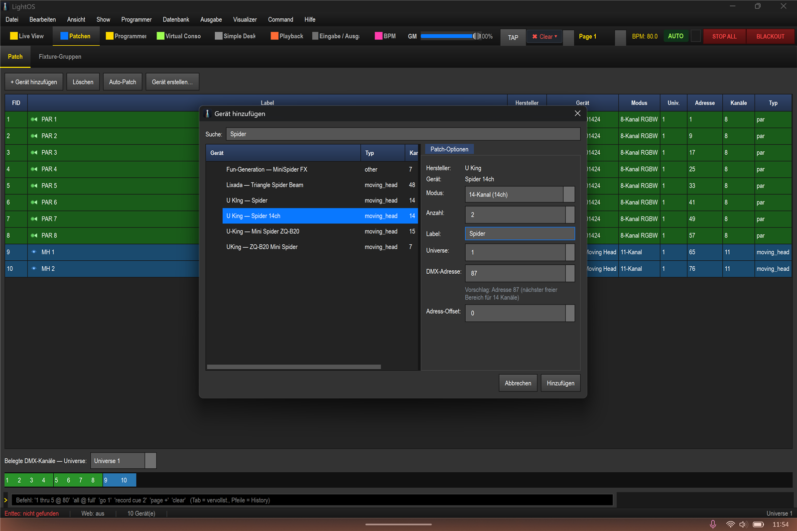
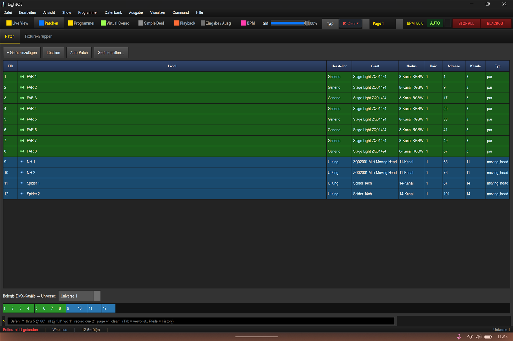

# Fixtures anlegen (Patchen)

In dieser Anleitung lernst du, wie du für die Show `shows/Komplettshow_2026.lshow` alle Geräte patchst: 8 PAR, 2 Moving Heads und 2 Spider. Am Ende liegen 12 Geräte auf Universe 1 in den Kanälen 1–114.

## Schritte

1. Öffne die Sektion **Patchen** und wechsle dort in den Sub-Tab **Patch**. Der Patch-Tab ist zu Beginn leer; die Toolbar bietet die Aktionen **+ Gerät hinzufügen**, **Löschen**, **Auto-Patch** und **Gerät erstellen**.

2. Klicke auf **+ Gerät hinzufügen**. Es öffnet sich der Dialog **Gerät hinzufügen** mit einer Suche, der Geräteliste und rechts den Patch-Optionen (Modus, Anzahl, Label, Universe, DMX-Adresse).

3. Gib in die Suche `ZQ01424` ein und wähle **Generic – Stage Light ZQ01424** (par, 8ch). Stelle rechts ein: **Anzahl = 8**, **Label = "PAR"**, **Universe = 1**, **DMX-Adresse = 1** (Vorschlag). Klicke auf **Hinzufügen**. Damit werden PAR 1–8 auf die Adressen 1, 9, 17, 25, 33, 41, 49 und 57 gepatcht.

4. Klicke erneut auf **+ Gerät hinzufügen**. Suche nach `ZQ02001` und wähle **U King – ZQ02001 Mini Moving Head** (11ch). Stelle ein: **Anzahl = 2**, **Label = "MH"**, **DMX-Adresse = 65**. Klicke auf **Hinzufügen**. Damit liegt MH 1 auf Adresse 65 und MH 2 auf Adresse 76.

5. Klicke noch einmal auf **+ Gerät hinzufügen**. Suche nach `Spider` und wähle **U King – Spider 14ch** (Default-Label SPIDER14, 14ch). Stelle ein: **Anzahl = 2**, **Label = "Spider"**, **DMX-Adresse = 87**. Klicke auf **Hinzufügen**. Damit liegt Spider 1 auf Adresse 87 und Spider 2 auf Adresse 101.

Ergebnis: 12 Geräte auf Universe 1, belegt sind die Kanäle 1–114.

## Tipps / Fallen

- Über das Feld **Anzahl** patchst du mehrere gleiche Geräte auf einmal; die Adressen werden dabei automatisch fortgeschrieben.
- Der **Adress-Vorschlag** im Dialog zeigt jeweils den nächsten freien Adressbereich an – so vermeidest du Überschneidungen.
