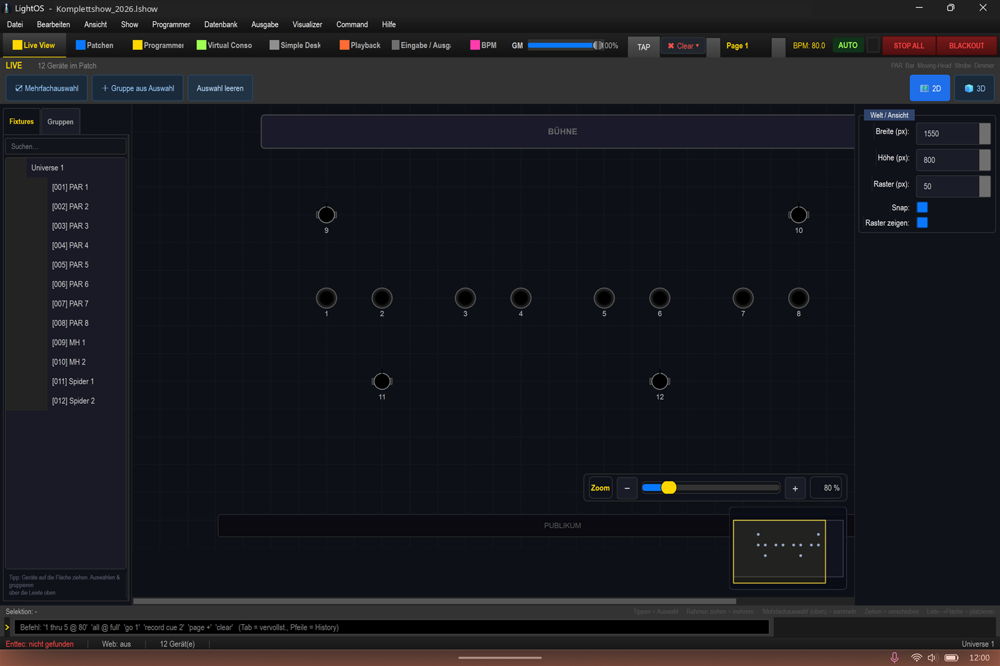

# Positionen auf der 2D-Bühne und im 3D-Visualizer

In dieser Anleitung lernst du, wie du deine Geräte in der Sektion **Bühne** (2D-Ansicht) auf der Bühnenfläche platzierst und die Positionen anschließend im 3D-Visualizer ansiehst. Grundlage ist die Show `shows/Komplettshow_2026.lshow`.

1. Öffne die Sektion **„Bühne"**.

2. Hast du die Show wie in Anleitung 0–1 gebaut und mit dem Layout gespeichert, sind beim Öffnen der Bühne bereits **alle 12 Geräte** an ihren 2D-Positionen platziert. Sonst ziehst du sie jetzt per Drag & Drop an ihre Position. (Die Show `Komplettshow_2026.lshow` liegt nicht im Repository und wird von keinem Generator erzeugt — du baust sie mit dieser Anleitungsreihe selbst.)

3. Das gespeicherte Layout sieht so aus:
   - Die **8 PAR** stehen nebeneinander in einer Reihe mittig auf der Bühne.
   - **MH 1** hinter **PAR 1** und **MH 2** hinter **PAR 8** (oben = Bühnen-Rückseite / upstage).
   - **Spider 1** vor **PAR 2** und **Spider 2** vor **PAR 6** (unten = zum Publikum / downstage).

   Der Auto-Bogen (Halbkreis vor der Bühne) erscheint nur für **neu gepatchte** Geräte, die noch keine gespeicherte Position haben — bei dieser Show gibt es ihn daher nicht.

   

   *Bild zeigt eine ältere Oberfläche: die Sektion links oben hieß damals „Live View“, heute **Bühne**; „Eingabe / Ausgabe“ heißt heute **E/A**.*

4. Schalte oben rechts auf **„3D"** um. Die in der 2D-View platzierten Geräte erscheinen automatisch im 3D-Visualizer. Kamera-Steuerung im 3D:
   - **1-Finger- / Maus-Drag** = drehen
   - **Doppel-Tipp auf eine leere Fläche** = Kamera-Reset

## Hinweis (offen)

Die genauen 3D-Höhen werden interaktiv eingestellt: die MH hängen an der Trasse in der Luft, die Spider sitzen leicht unter den PARs. Die 2D-Position liefert dabei nur die Grundfläche (X/Z).

## Tipps / Fallen

- **Snap:** / **Raster (px):** im rechten Panel („Welt / Ansicht") hält die PAR-Reihe sauber ausgerichtet.
