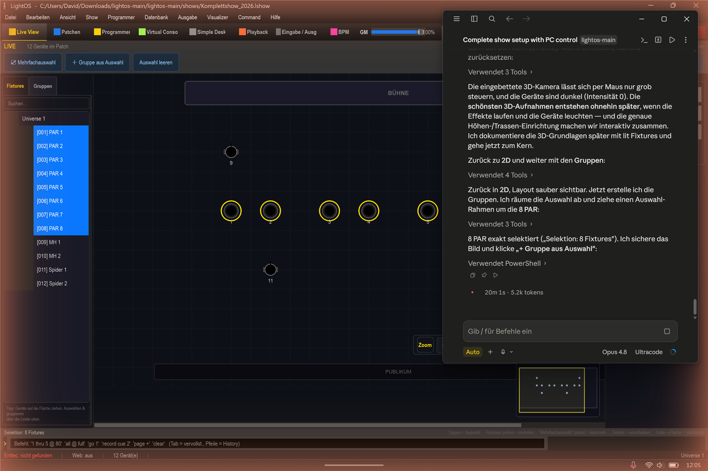
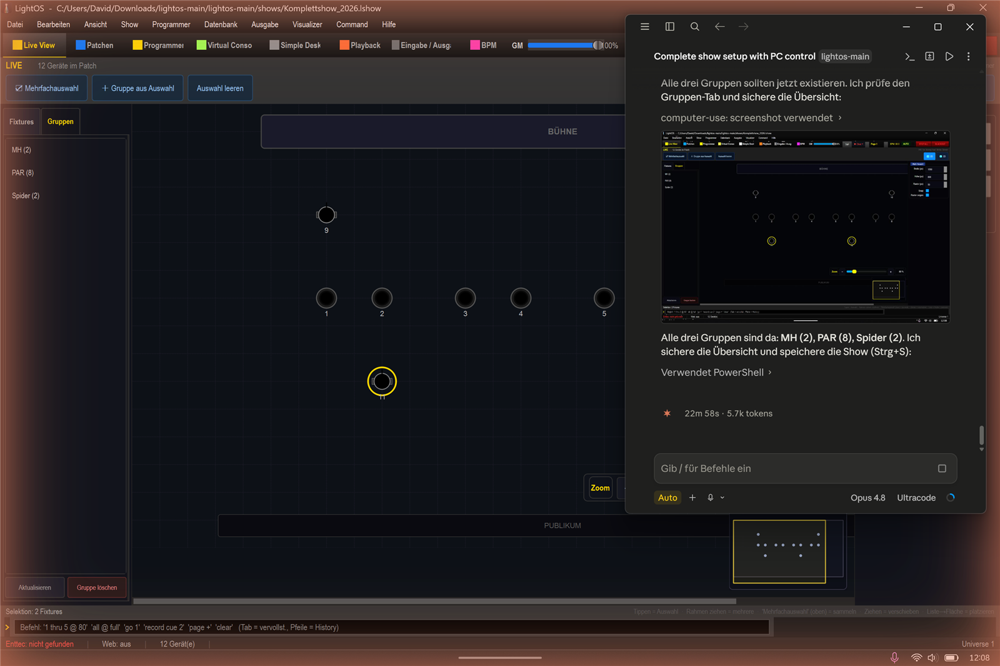

# Fixture-Gruppen anlegen (PAR / MH / Spider)

In dieser Anleitung lernst du, wie du in LightOS aus deinen Fixtures drei Gruppen (PAR, MH und Spider) erstellst, um sie später schnell gemeinsam auswählen zu können. Wir arbeiten dabei mit der Show `shows/Komplettshow_2026.lshow`.

## Schritte

1. Öffne die **Live View**.

2. Ziehe auf einer leeren Bühnenfläche einen Rahmen um die 8 PAR. Das Aufziehen eines Rahmens ist eine Mehrfachauswahl. Oben erscheint die Meldung **"Selektion: 8 Fixtures"**.

3. Klicke auf den Button **"＋ Gruppe aus Auswahl"**, vergib den Namen **"PAR"** und bestätige mit **OK**.

4. Leere die Auswahl. Für die Moving Heads wechselst du in den **Fixtures-Tab**, klickst **MH 1** an und fügst **MH 2** mit **Strg-Klick** hinzu. Klicke dann auf **"＋ Gruppe aus Auswahl"** und vergib den Namen **"MH"**.

5. Gehe genauso für **Spider 1** und **Spider 2** vor und erstelle daraus die Gruppe **"Spider"**.

## Ergebnis

Du hast nun drei Gruppen angelegt: **PAR** (8 Fixtures), **MH** (2 Fixtures) und **Spider** (2 Fixtures). Alle drei sind im **"Gruppen"-Tab** sichtbar.

## Tipps / Fallen

- Die angelegten Gruppen erscheinen auch im **Programmer** (in der Gruppen-Liste) und stehen dort zum schnellen Auswählen bereit.
