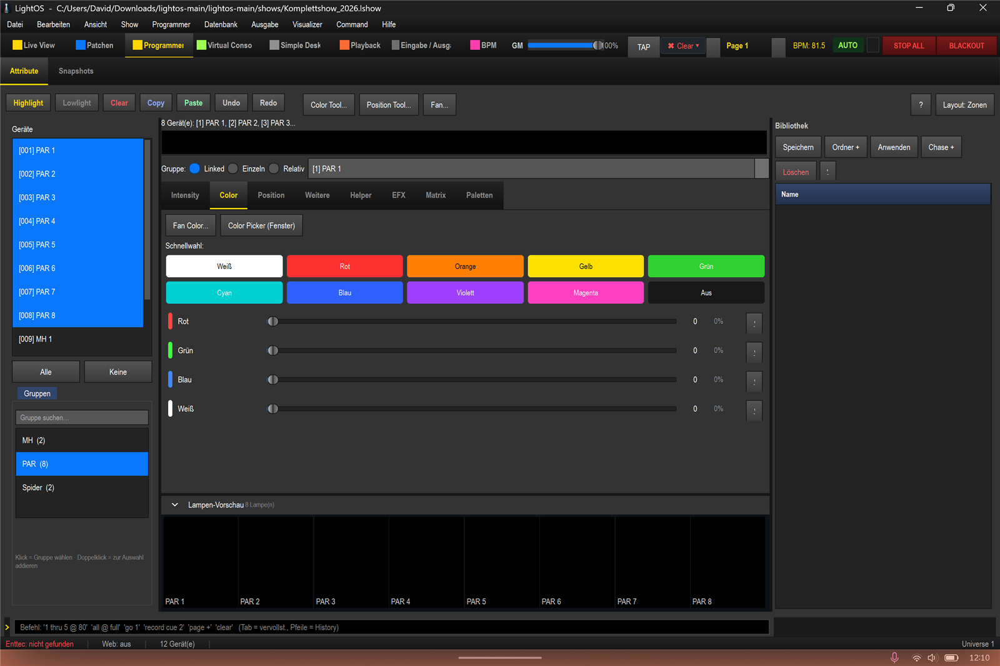
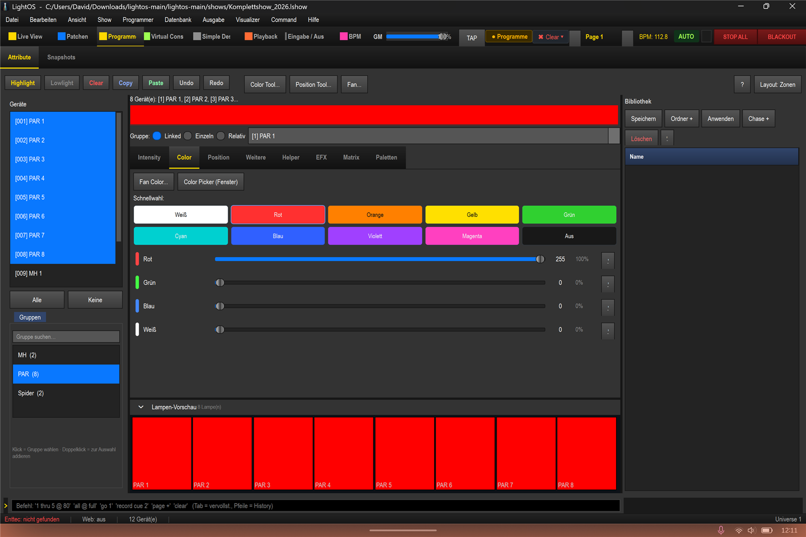
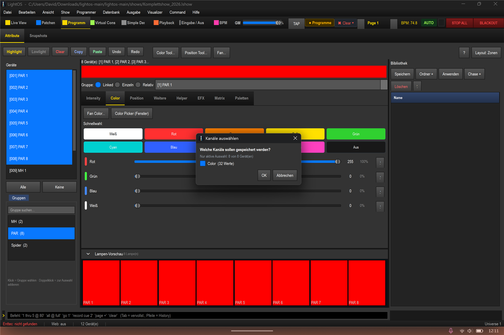
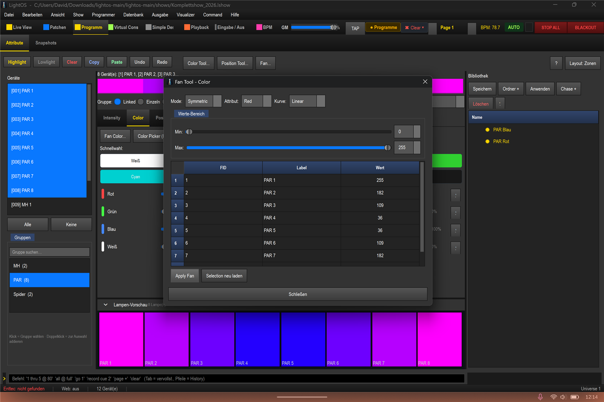
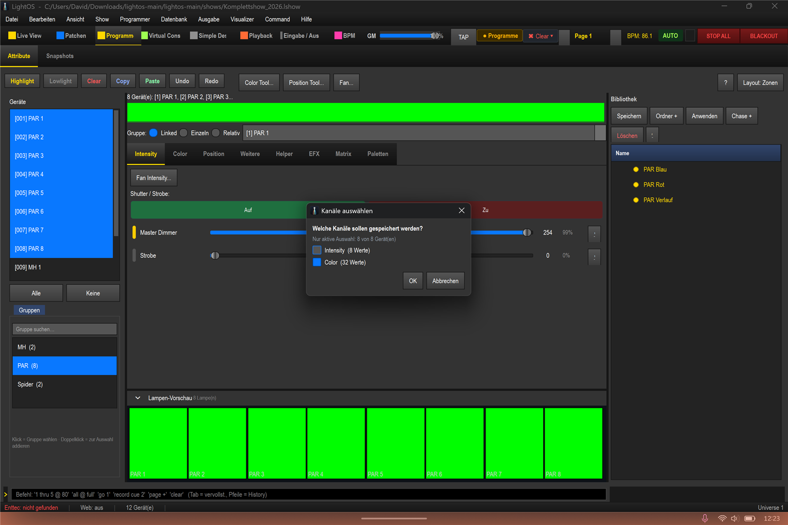

# Coloreffekte über den Color-Tab – nur die Farbe speichern

In dieser Anleitung lernst du, wie du im Programmer über den Color-Tab Farben für die PAR-Gruppe setzt und – das Wichtigste – wie du **ausschließlich die Farbe** als Palette speicherst, ohne dass dabei Dimmer-Schnitte mitgespeichert werden. Wir arbeiten in der Show `shows/Komplettshow_2026.lshow`.

## Schritte

1. Öffne die Sektion **„Programmer"**, wähle die Gruppe **„PAR"** und wechsle auf den Tab **„Color"**. Du siehst die Schnellwahl („Schnellwahl:"), die RGBW-Slider und die Lampen-Vorschau.

2. Klicke auf die Schnellfarbe **„Rot"**. Alle 8 PAR werden rot, der Rot-Slider steht auf 255.

3. Klicke rechts in der Bibliothek auf **„Speichern"**. Es öffnet sich der Dialog **„Kanäle auswählen"**. Weil nur im Color-Tab gearbeitet wurde, steht hier **nur „Color (32 Werte)"**. Bestätige mit **OK** und vergib den Namen **„PAR Rot"**.

4. Nutze das **Fächer-Tool** (Programmer-Toolbar-Button **„Fächer…"** bzw. **„Fächern: PAR…"**), um **ein einzelnes Attribut** über die Geräte zu fächern. Wähle im Dialog unter **„Attribut:"** den Farbkanal (z. B. **„Blau"**) und lass ihn über die PARs ansteigen – ein **„Fächer anwenden"** wirkt immer nur auf **ein** Attribut. (Ein echter Magenta→Blau-Übergang bräuchte mehrere gefächerte Kanäle und ist mit einem einzigen Fächer nicht herstellbar.) Klicke auf **„Fächer anwenden"** und speichere das Ergebnis als **„PAR Verlauf"**.

## Kern & Falle: Der Programmer speichert alles Scharfe

Der Programmer merkt sich **jeden angefassten Kanal** (er wird „scharf") und speichert beim Snap **alles Scharfe**. Wenn du – auch versehentlich, etwa über den Master Dimmer oder den Intensity-Tab – den Dimmer angefasst hast, zeigt der Speichern-Dialog **zusätzlich „Intensity (…)"**. Speicherst du so, landen Dimmer-Schnitte in deiner Farb-Palette.

**Lösung:** Hake im Dialog „Kanäle auswählen" die Gruppe **„Intensity"/Dimmer ab**. Dann wird nur **„Color"** gespeichert – eine reine Farb-Palette ohne Dimmer-Schnitte.

Das Ergebnis: saubere Farb-Looks in der Bibliothek, die sich frei mit beliebigen Dimmer-Werten kombinieren lassen.

## Tipps / Fallen

- Drücke vor jedem neuen Farb-Look **„Clear"** in der Programmer-Toolbar. Dann ist nichts Altes mehr scharf.
- Ein Slider kann **scharf sein und trotzdem 0 % anzeigen**. Verlass dich nicht auf die Optik – prüfe im Zweifel den Speichern-Dialog, welche Kanal-Gruppen wirklich gespeichert werden.
- Kontrolliere im Dialog „Kanäle auswählen" immer, ob neben „Color" eine **„Intensity"**-Gruppe auftaucht. Wenn ja: abhaken, bevor du speicherst.
