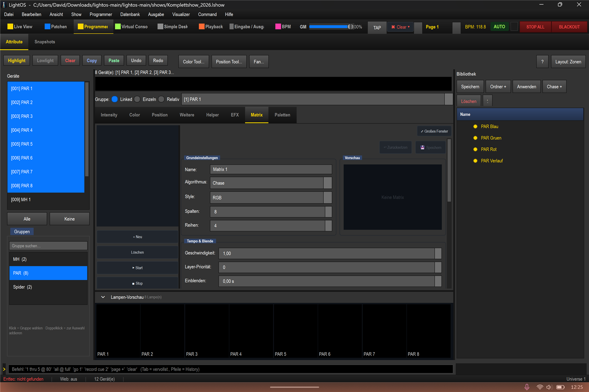
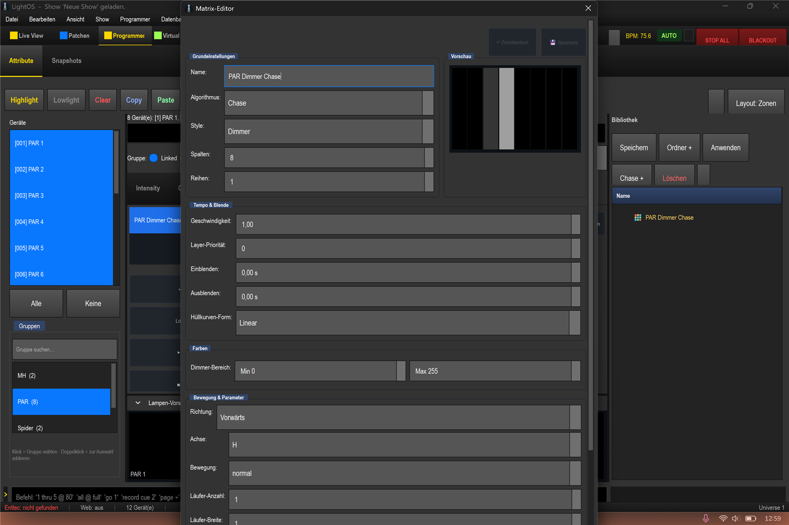
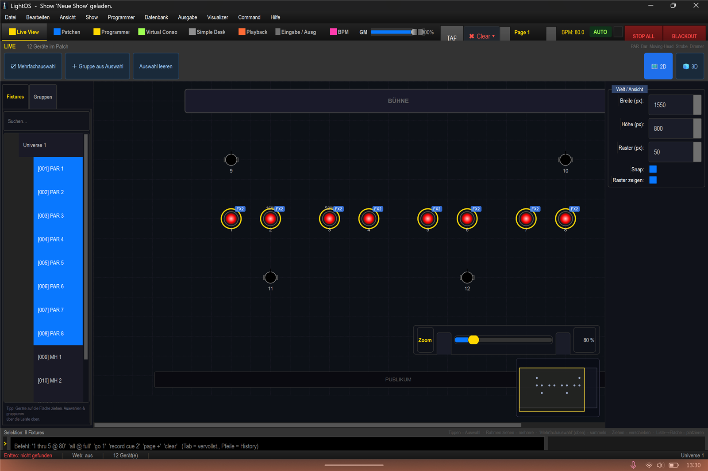
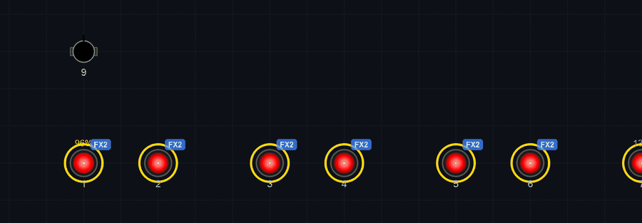

# Matrix- und Dimmereffekte: Farbe und Dimmer sauber mischen

In dieser Anleitung lernst du, wie du in der Show `shows/Komplettshow_2026.lshow` einen Dimmer-Effekt und einen Farb-Effekt als zwei getrennte Matrix-Ebenen kombinierst – das Ergebnis ist ein rotes Lauflicht (alle PAR rot, wandernde Helligkeit). Der Trick: Farbe und Dimmer werden als zwei separate Matrizen über die gleichen Geräte gelegt.

## Schritte

1. Öffne den **Programmer** und wähle die Gruppe **"PAR"** aus. Wechsle in den Tab **"Matrix"**. Im eingebetteten Programmer ist meist schon eine Standard-Matrix (**"Matrix 1"**) vorhanden, die du direkt verwenden kannst – mit **"+ Neu"** legst du eine weitere Matrix an.

2. Lege zuerst den **Dimmer-Effekt** an. Stelle ein:
   - **Style** = `Dimmer`
   - **Algorithmus** = `Chase`
   - **Spalten** = `8`
   - **Reihen** = `1`
   - **Name** = `PAR Dimmer Chase`

   Diese Matrix moduliert nur die Helligkeit der 8 PARs in einer Reihe.

3. Lege nun die **Farbe als eigene Ebene** an. Klicke erneut auf **"+ Neu"** und stelle ein:
   - **Style** = `RGB`
   - **Algorithmus** = `Plain` (Vollfläche)
   - **Farbe** = `Rot`
   - **Spalten** = `8`
   - **Reihen** = `1`
   - **Name** = `PAR Farbe Rot`

   Diese Matrix schreibt nur die Farbkanäle und liefert die durchgehend rote Vollfläche.

4. Starte **beide** Matrizen mit **"▶ Start"**. Die rote Farb-Matrix liefert die Farbe, die Dimmer-Matrix moduliert die Helligkeit darüber – das Ergebnis ist ein rotes Lauflicht. Das Badge **"FX2"** in der Live View zeigt an, dass je Gerät zwei Effekte aktiv sind.

## So funktioniert das Mischen (Kern-Architektur)

- Die **Farb-Matrix** (Style `RGB`) schreibt **nur die Farbkanäle**, die **Dimmer-Matrix** (Style `Dimmer`) schreibt **nur den Dimmer-Kanal**. Weil beide unterschiedliche Kanäle ansteuern, überlagern sie sich sauber und stören sich nicht.
- Das ist **besser, als die Farbe live im Programmer** zu setzen: Der Programmer setzt eine **implizite Grundhelligkeit** und zwingt den Dimmer auf voll. Dadurch würde er die Dimmer-Matrix überschreiben, und das Lauflicht ginge verloren.

## Tipps und Fallen

- **Fixture-Bindung – richtige Gruppe wählen:** Eine Matrix **folgt der Programmer-Auswahl** und übernimmt die aktuell gewählte Gruppe als ihre Geräte. Lass beim Bauen also die richtige Gruppe (hier "PAR") ausgewählt. Das gespeicherte Geräte-Raster bleibt erhalten und wird auch beim Auslösen über die Virtuelle Konsole genutzt.
- **Farbe nicht im Programmer setzen:** Setze Farbe immer über eine eigene RGB-Matrix, nicht live im Programmer – sonst überschreibt die implizite Grundhelligkeit den Dimmer-Effekt.
- **Style "Dimmer" – früherer Absturz-Bug:** Beim Umstellen auf Style `Dimmer` gab es einen Absturz wegen eines fehlenden UI-Labels. Dieser Fehler wurde behoben.
