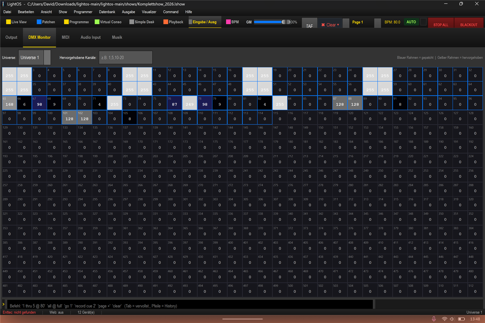

# EFX-Bewegung für Moving Heads – und warum die Spider anders sind

In dieser Anleitung lernst du, wie du eine EFX-Bewegungsfigur (Kreis) für die Moving Heads anlegst und prüfst – und warum die Spider von EFX-Figuren ausgenommen sind. Bezug: `shows/Komplettshow_2026.lshow`.

## Moving Heads: EFX "Circle" anlegen

1. Öffne den **Programmer**, wähle die Gruppe **"MH"**, wechsle auf den Tab **"EFX"** und klicke auf **"+ Neu"**.
2. Wähle als Algorithmus **"Circle"** (Kreis) und vergib den Namen **"MH Circle"**.
3. Öffne das **"Große Fenster"** und stelle im Abschnitt **"Sichtbarkeit & Sonstiges"** ein:
   - **"Dimmer/Shutter mit öffnen"** anhaken (`open_beam`) – sonst bleiben die Moving Heads dunkel.
   - Unter **"Verhältnis der Geräte"**: **"Gegenläufig: jedes 2. Gerät entgegengesetzt"** aktivieren, damit das Bild symmetrisch wirkt.
4. Klicke auf **Start**.

## Bewegung verifizieren

5. Beachte: Die **2D-Live-View** zeigt die **Pan-Drehung** an – die Beam-Linie des Movers dreht sich mit der EFX. Der **Tilt** wird im Beam **nicht** dargestellt.
6. Prüfe die Bewegung über die Sektion **"Eingabe / Ausgabe" → "DMX Monitor"**: Die Pan-Kanäle **65** und **76** verlassen die Mitte **128** (z. B. **151** bzw. **104**) und laufen gegenläufig. Alternativ kannst du die Bewegung im **3D-Visualizer** kontrollieren.

## Spider: warum hier keine EFX-Figur greift

7. Die **Spider** sind Flower-Lichter mit **zwei separaten Tilt-Bars** und **ohne Pan**. EFX-Figuren wie der Kreis brauchen **Pan UND Tilt** und gelten deshalb **nicht** für die Spider (Meldung: "keine Moving Heads in der Auswahl").
8. Spider-"Bewegung" bedeutet, die **Tilt-Bars auf/zu** zu fahren – steuerbar über den **Position-Tab (Tilt)** bzw. auf der **Virtuellen Konsole**. Die Spider-Farbe ist **RGBW**.

## Tipps / Fallen

- **MH bleiben dunkel?** "Dimmer/Shutter mit öffnen" (`open_beam`) im Abschnitt "Sichtbarkeit & Sonstiges" muss aktiviert sein.
- **Keine Bewegung sichtbar?** Die 2D-Live-View zeigt die Pan-Drehung (Beam-Linie), aber keinen Tilt – zur genauen Kontrolle nutze den DMX Monitor (Kanäle 65/76 verlassen die Mitte 128) oder den 3D-Visualizer.
- **Spider lassen sich nicht auswählen?** Das ist korrekt: Spider haben keinen Pan und sind daher von EFX-Figuren ausgenommen.
- Die **EFX-Geschwindigkeit** stellst du im Editor unter **"Tempo & Richtung"** (in Hz) ein.
