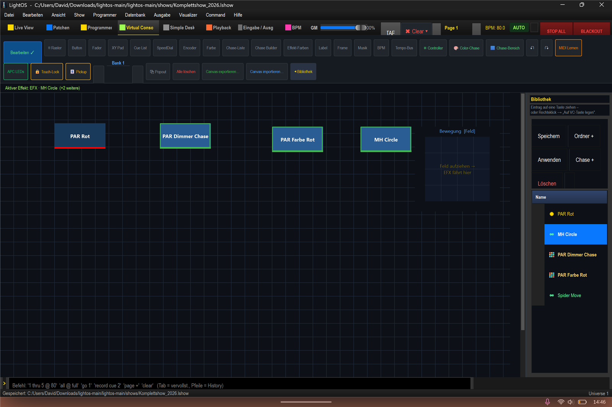
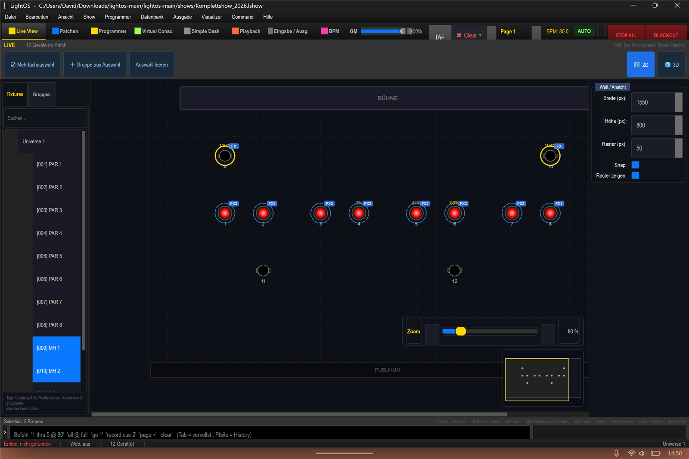

# Virtuelle Konsole bauen: Effekte & Moving Heads steuern (mit APC Mini)

In dieser Anleitung baust du eine Virtuelle Konsole (VC) mit Tasten und einem XY-Feld, löst damit Effekte sowie Moving-Head-Bewegungen live aus und bindest optional einen APC Mini als Hardware-Controller an. Verwendete Show: `shows/Komplettshow_2026.lshow`.

## Schritt-für-Schritt

1. Öffne die Sektion **„Virtual Console"** und schalte oben den Button **„Bearbeiten"** ein (aktiv).

2. Ziehe einen Eintrag aus der Bibliothek rechts auf den **leeren Canvas**. Alternativ: Rechtsklick auf den Eintrag → **„Auf VC-Taste legen"** aktiviert einen Zuweis-Modus (Fadenkreuz-Cursor) – der nächste Klick auf eine **bereits vorhandene Taste** bindet sie direkt als An/Aus-Toggle, **ohne** den Dialog.

3. Nur beim **Ziehen auf den leeren Canvas** öffnet sich bei **Effekten** der geführte Dialog **„Effekt einrichten"**. Wähle hier, welche Bedienelemente entstehen:
   - **„An/Aus (Toggle)"** → erzeugt eine Taste.
   - Bei **Movern** zusätzlich **„Bewegung (XY-Feld)"** → erzeugt ein Pan/Tilt-XY-Pad, mit dem du die Moving Heads live steuerst.
   - Optional **„Tempo (Geschwindigkeit)"** und/oder **„Helligkeit"** → erzeugen Regler.
   - Bei **Snaps** (z. B. „PAR Rot") entsteht direkt eine Taste, ohne Dialog.

4. Lege auf diese Weise die folgenden Bedienelemente an: **PAR Rot**, **PAR Dimmer Chase**, **PAR Farbe Rot** und **MH Circle** (inklusive **XY-Feld** für die Bewegung der Moving Heads).

5. Schalte **„Bearbeiten"** wieder aus und drücke die Tasten: Die Effekte laufen jetzt live (verifiziert: PAR als rotes Lauflicht, Moving Heads leuchten und bewegen sich).

6. **APC Mini anbinden (MIDI Lernen):**
   1. Schalte in der Toolbar **„MIDI Lernen"** ein.
   2. Klicke die gewünschte VC-Taste an.
   3. Drücke am APC den zugehörigen Pad bzw. Fader (das Drücken am Gerät machst du an der Hardware). Die Bindung steht.
   4. Schalte **„APC LEDs"** ein, um LED-Feedback am Gerät zu erhalten.
   - Ein **mk2** wird am Port automatisch erkannt. **VC-Bank N** entspricht **Playback-Seite N**.

## Tipps / Fallen

- **Bänke wechseln:** oben über **◀ Bank ▶** bzw. mit **Strg+Bild↑ / Strg+Bild↓**.
- VC-Bank N entspricht Playback-Seite N – beim Anbinden des APC Mini auf die passende Bank/Seite achten.
- „APC LEDs" nur einschalten, wenn du LED-Feedback am Gerät willst.
